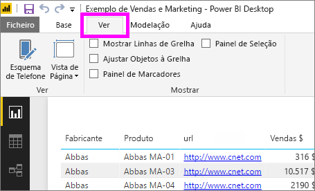
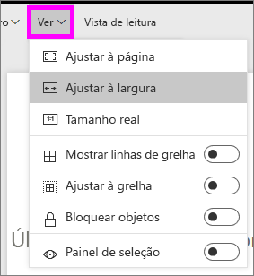
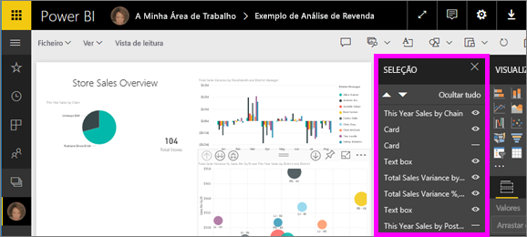
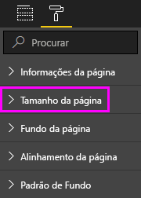

# Aplicar definições de apresentação de página num relatório do Power BI
Compreendemos que é essencial manter o esquema do seu relatório perfeito. Por vezes, isso representa um desafio, uma vez que você e os seus colegas poderão ver esses relatórios em ecrãs de diferentes proporções e tamanhos. 

O modo de exibição padrão é **Ajustar à página** e o tamanho de exibição padrão é **16:9**. Se quiser bloquear uma proporção diferente ou ajustar o relatório de outra forma, existem duas ferramentas para o ajudar: as definições **_Vista de página_* _ e _*_Tamanho da página_*_.

<iframe width="560" height="315" src="https://www.youtube.com/embed/5tg-OXzxe2g" frameborder="0" allowfullscreen></iframe>

## Onde encontrar as definições Vista de página no serviço Power BI e no Power BI Desktop
As definições Vista de página estão disponíveis no serviço Power BI e no Power BI Desktop, mas a interface é ligeiramente diferente. As seguintes secções explicam onde pode encontrar as definições de vista em cada ferramenta do Power BI.

### No Power BI Desktop
Na Vista de relatório, selecione o separador _ *Vista** para abrir as definições Vista de página, bem como as definições de esquema de telemóvel.

  

### No serviço Power BI (app.powerbi.com)
No serviço Power BI, abra um relatório e selecione **Vista** na barra de menus superior esquerda.

As definições Vista de página estão disponíveis na [Vista de leitura e na Vista de edição](../consumer/end-user-reading-view.md). Na Vista de edição, o proprietário de um relatório pode atribuir definições de visualização de páginas a páginas de relatório individuais. Essas definições são guardadas com o relatório. Quando os colegas abrem o relatório na Vista de leitura, verão as páginas do relatório com as definições do proprietário. Na Vista de leitura, os colegas podem alterar *algumas* das definições **Vista de página**, mas as alterações não serão guardadas quando fecharem o relatório.

## Definições Vista de página
O primeiro conjunto de definições Vista de página controla a apresentação da página do relatório relativa à janela do browser. Escolha entre:

* **Ajustar à página** (predefinição): os conteúdos são dimensionados para um melhor ajuste à página
* **Ajustar à largura**: os conteúdos são dimensionados para serem ajustados à largura da página
* **Tamanho real**: os conteúdos são apresentados em tamanho normal

O segundo conjunto de definições Vista de página controla o posicionamento dos objetos na tela do relatório. Escolha entre:

* **Mostrar linhas de grelha**: ative as linhas de grelha para ajudar a posicionar objetos na tela do relatório.
* **Ajustar à grelha**: utilize com a opção **Mostrar linhas de grelha** para posicionar e alinhar os objetos na tela do relatório com precisão. 
* **Bloquear objetos**: bloqueie todos os objetos na tela, para que não seja possível movê-los ou redimensioná-los.
* **Painel de seleção**: o painel **Seleção** lista todos os objetos na tela. Pode decidir que objetos apresentar e ocultar.

    

## Definições Tamanho da página

As definições **Tamanho da página** só estão disponíveis para os proprietários do relatório. No serviço Power BI (app.powerbi.com), significa que pode abrir o relatório na [Vista de edição](../consumer/end-user-reading-view.md). As definições **Tamanho da página** estão no painel **Visualizações** e controlam a proporção de visualização e o tamanho real (em pixéis) da tela do relatório:   

* proporção de 4:3
* proporção de 16:9 (predefinição)
* Letter
* Personalizado (altura e largura em pixels)

## Próximos passos
[Vista de relatório no Power BI Desktop](desktop-report-view.md)

[Alterar as definições Vista de página e Tamanho da página nos seus próprios relatórios do Power BI](../consumer/end-user-report-view.md)

Leia mais sobre os [relatórios no Power BI](../consumer/end-user-reports.md)

[Conceitos básicos para designers no serviço Power BI](../fundamentals/service-basic-concepts.md)

Mais perguntas? [Pergunte à Comunidade do Power BI](https://community.powerbi.com/)
