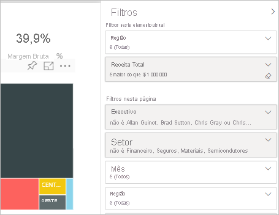
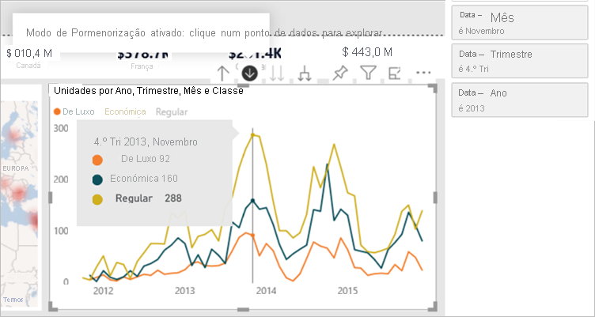
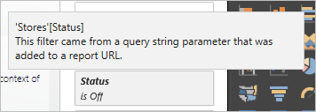
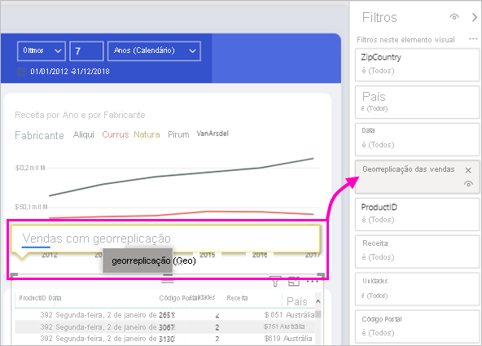

# Tipos de filtros nos relatórios do Power BI

Os filtros não se comportam todos da mesma forma porque não foram criados da mesma forma. A forma como as cria influencia a forma como se comportam no painel de filtros no modo de edição. Neste artigo, descrevemos os diferentes tipos de filtros: as diferentes formas de os criar e os diferentes fins a que se destinam. Saiba mais sobre como [adicionar filtros para relatórios](power-bi-report-add-filter.md). 

Comecemos pelos dois tipos de filtro mais comuns: automático e manual.

## Filtros automáticos 

Os filtros automáticos são adicionados automaticamente ao nível do elemento visual do painel de filtro quando cria um elemento visual. Estes filtros baseiam-se nos campos que constituem o elemento visual. Os utilizadores com permissão de edição para o relatório podem editar, limpar, esconder, bloquear, renomear ou classificar este filtro no painel. Não podem eliminar os filtros automáticos, porque o elemento visual refere-se a esses campos.

## Filtros manuais 

Os filtros manuais são os filtros que arrasta e deixa cair em qualquer secção do painel de filtros quando está a editar um relatório. Se tiver permissão de edição para o relatório, pode editar, eliminar, limpar, esconder, bloquear, renomear ou classificar este filtro no painel.

Leia sobre como [adicionar filtros a um relatório](power-bi-report-add-filter.md).

## Filtros mais avançados

Os tipos de filtro descritos em seguida são menos comuns, mas também é importante compreendê-los para o caso de serem apresentados no relatório. Além disso, poderá achar que são úteis quando for necessário criar um filtro mais adequado para o relatório.

## Filtros de inclusão e exclusão

Os filtros de inclusão e exclusão são automaticamente adicionados ao painel de filtro quando quer incluir ou excluir um elemento visual. Se conseguir editar um relatório, pode apagar, bloquear, esconder ou classificar este filtro no painel. Não é possível editar, limpar ou renomear um filtro de incluir ou excluir, porque está associado à funcionalidade de incluir e excluir os visuais.

## Filtros de desagregação

Os filtros de desagregação são automaticamente adicionados ao painel de filtro para desagregar um elemento visual no relatório. Se puder editar um relatório, pode editar ou limpar o filtro no painel. Não é possível eliminar, esconder, bloquear, renomear ou classificar este filtro porque está associado à funcionalidade de perfuração de visuais. Para remover o filtro de perfuração, selecione o botão de perfuração para obter o visual.

## Filtros de desagregação cruzada

Os filtros de perfuração cruzada são automaticamente adicionados ao painel quando um filtro de perfuração é passado para outro visual na página do relatório através do filtro cruzado ou da função de cruzamento. Mesmo que possa editar um relatório, não pode eliminar, limpar, esconder, bloquear, mudar de nome ou classificar este filtro porque está associado à funcionalidade de perfuração de visuais. Também não pode editar este filtro porque vem de perfurar em outro visual. Para remover o filtro de perfuração, selecione o botão de perfuração para o visual que está a passar no filtro.

## Filtros de perfuração

Os filtros de perfuração são passados de uma página para outra através da função de perfuração. Aparecem na Broca através do painel. Existem dois tipos de filtros de perfuração. O primeiro tipo é o que invoca a broca. Se puder editar um relatório, pode editar, eliminar, limpar, esconder ou bloquear este tipo de filtro. O segundo tipo é o filtro de perfuração que é passado para o alvo, com base nos filtros de nível de página da página de origem. Pode editar, eliminar ou limpar este tipo transitório de filtro de perfuração. Não é possível bloquear ou esconder este filtro para os utilizadores finais.

Leia sobre [a criação de filtros de perfuração.](desktop-drillthrough.md)

## Filtros de URL

Os filtros URL são adicionados ao painel adicionando um parâmetro de consulta DE URL. Se puder editar um relatório, pode editar, eliminar ou limpar o filtro no painel. Não pode esconder, bloquear, renomear ou classificar este filtro porque está associado ao parâmetro URL. Para remover o filtro, remova o parâmetro de URL. Este é um URL de exemplo com um parâmetro:

app.powerbi.com/groups/me/apps/*app-id*/reports/*report-id*/ReportSection?filter=Stores~2FStatus%20eq%20'Off'

Leia sobre [a configuração de filtros URL](../collaborate-share/service-url-filters.md).

## Filtros de pass-through

Os filtros de pass-through são filtros ao nível dos elementos visuais e foram criados através das Perguntas e Respostas. Se conseguir editar um relatório, pode eliminar, esconder ou classificar estes filtros no painel. No entanto, não é possível renomear, editar, limpar ou bloquear estes filtros.

## Comparar os tipos de filtro

Esta tabela compara o que os autores podem fazer com os diferentes tipos de filtros.

| Tipo de filtro | Edit | Limpar | Delete | Ocultar | Bloquear | Ordenar | Mudar o Nome |
|----|----|----|----|----|----|----|----|
| Filtros manuais | Y | Y | Y | Y | Y | Y | Y |
| Filtros automáticos | Y | Y | N | Y | Y | Y | Y |
| Filtros de Inclusão/Exclusão | N | N | Y | Y | Y | Y | N |
| Filtros de desagregação | Y | Y | N | N | N | N | N |
| Filtros de desagregação cruzada | N | N | N | N | N | N | N |
| Filtros de perfuração (Invoca a perfuração) | Y | Y | Y | Y | Y | N | N |
| Filtros de perfuração (transitório) | Y | Y | Y | N | N | N | N |
| Filtros de URL – temporário | Y | Y | Y | N | N | N | N |
| Filtros de pass-through | N | N | Y | Y | N | Y | N |

## Próximas etapas

[Adicionar filtros a relatórios](power-bi-report-add-filter.md)

[ Fazer uma visita do painel Filtros](../consumer/end-user-report-filter.md)

[Filtros e realce em relatórios](power-bi-reports-filters-and-highlighting.md)

Mais perguntas? [Pergunte à Comunidade do Power BI](https://community.powerbi.com/)
