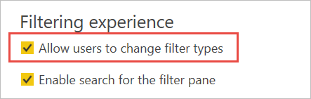

# <a name="design-filters-in-power-bi-reports"></a>Conceber filtros nos relatórios do Power BI

[!INCLUDE [applies-to](../includes/applies-to.md)] [!INCLUDE [yes-desktop](../includes/yes-desktop.md)] [!INCLUDE [yes-service](../includes/yes-service.md)]

Com a nova experiência de filtro, tem muito mais controlo sobre a conceção e a funcionalidade dos filtros de relatórios. Pode formatar o painel Filtros para se parecer com o resto do relatório. Pode bloquear e até mesmo ocultar filtros. Ao estruturar o seu relatório, já não vê o painel Filtros antigo no painel Visualizações. Faz toda a edição e formatação dos filtros num único painel Filtros. 


Enquanto estruturador de relatórios, aqui estão algumas das tarefas que pode fazer no novo painel Filtros:

- Adicionar e remover campos a filtrar. 
- Alterar o estado do filtro.
- Formatar e personalizar o painel Filtros para se integrar melhor com o relatório.
- Definir se o Painel de filtros está aberto ou fechado por predefinição quando um consumidor abre o relatório.
- Ocultar o painel Filtros completo ou filtros específicos que não quer que os consumidores de relatórios vejam.
- Controlar e até mesmo marcar o estado da visibilidade, o estado aberto e o estado fechado do painel Filtros.
- Bloquear filtros que não quer que os consumidores editem.

Ao lerem um relatório, os utilizadores podem pairar sobre qualquer elemento visual para ver uma lista só de leitura de todos os filtros ou segmentações de dados que o afetam.


## <a name="turn-on-new-filters-in-existing-reports"></a>Ativar novos filtros em relatórios existentes 

Por predefinição, a nova experiência de filtros está ativada nos novos relatórios. Pode ativar a nova experiência para relatórios já existentes no Power BI Desktop ou no serviço Power BI.

### <a name="turn-on-new-filters-for-an-existing-report-in-power-bi-desktop"></a>Ativar os novos filtros para um relatório existente no Power BI Desktop

1. No Power BI Desktop, num relatório existente, selecione **Ficheiro** > **Opções e Definições** > **Opções**.
2. No painel de navegação, em **Ficheiro atual**, selecione **Definições de relatório**.
3. Em **Experiência de filtragem**, selecione **Ativar o painel Filtros atualizado e apresentar filtros no cabeçalho do elemento visual deste relatório**.

### <a name="turn-on-new-filters-for-an-existing-report-in-the-service"></a>Ativar os novos filtros para um relatório existente no serviço

Se tiver ativado o **Novo aspeto** no serviço Power BI , a nova experiência de filtro ficará automaticamente ativa. Leia mais sobre o [novo aspeto do serviço Power BI](../consumer/service-new-look.md).

Mesmo que não tenha ativado o novo aspeto, pode ver a nova experiência de filtro ao seguir estes passos.

1. No serviço Power BI, abra a lista de conteúdos de uma área de trabalho.
2. Encontre o relatório que pretende ativar, selecione **Mais opções (...)** e, em seguida, selecione **Definições** para esse relatório.

    

3. Em **Experiência de filtragem**, selecione **Ativar o painel Filtros atualizado e apresentar filtros no cabeçalho do elemento visual deste relatório**.

    

## <a name="view-filters-for-a-visual-in-reading-mode"></a>Ver filtros de um elemento visual no Modo de leitura

No Modo de leitura, pode pairar o rato sobre o ícone de filtro de um elemento visual para ver uma lista de filtros de pop-up com todos os filtros, segmentações de dados, entre outros, que afetam esse elemento visual. A formatação da lista de filtros de pop-up é igual à formatação do painel Filtros. 


Veja a seguir os tipos de filtros que esta vista apresenta: 
- Filtros básicos
- Segmentações
- Realce cruzado 
- Filtragem cruzada
- Filtros avançados
- Filtros de itens principais
- Filtros de Data Relativa
- Segmentações de dados síncronas
- Filtros de Inclusão/Exclusão
- Filtros passados por um URL

## <a name="build-the-filters-pane"></a>Criar o painel Filtros

Depois de ativar o novo painel Filtros, este é apresentado à direita da página do relatório, formatado por predefinição com base nas suas definições de relatório atuais. No painel Filtros, configura os filtros a incluir e atualiza os filtros existentes. O painel Filtros tem o mesmo aspeto para os consumidores do seu relatório quando o publicar. 

1. Por predefinição, os consumidores do relatório podem ver o painel Filtros. Se não pretender que o vejam, selecione o ícone de olho junto a **Filtros**.

    

2. Para começar a criar o painel Filtros, arraste campos de interesse para o mesmo como filtros de nível de elemento visual, de página ou de relatório.

Quando adiciona um elemento visual a uma tela de relatórios, o Power BI adiciona automaticamente um filtro ao painel Filtros para cada campo no elemento visual. 

## <a name="hide-the-filters-pane-while-editing"></a>Ocultar o painel Filtros durante a edição

O Power BI Desktop tem um novo friso na pré-visualização. No separador **Ver**, o botão de alternar **Filtros** permite-lhe mostrar ou ocultar o painel Filtros. Esta funcionalidade é útil quando não está a utilizar o painel Filtros e precisa de espaço adicional no ecrã. Esta adição alinha o painel Filtros com os restantes painéis que pode abrir e fechar, tais como os painéis Marcadores e Seleção. 


Esta definição só oculta o painel Filtros no Power BI Desktop. Se quiser ocultar o painel Filtros para os seus utilizadores finais, tem de selecionar o ícone de **olho** junto a **Filtros**.

 

## <a name="lock-or-hide-filters"></a>Bloquear ou ocultar filtros

Pode bloquear ou ocultar cartões de filtros individuais. Se bloquear um filtro, os consumidores de relatórios poderão vê-lo, mas não o poderão alterar. Se o ocultar, nem sequer o poderão ver. Ocultar cartões de filtros será especialmente útil se precisar de ocultar filtros de limpeza de dados que excluem valores nulos ou valores inesperados. 

- No painel Filtros, selecione ou desmarque os ícones **Bloquear filtro** ou **Ocultar filtro** no cartão de filtro.

   

À medida que ativa e desativa estas definições no painel Filtros, vê as alterações refletidas no relatório. Os filtros ocultos não aparecem na lista de filtros de pop-up de um elemento visual.

Também pode configurar o estado do painel Filtros de forma a criar um fluxo juntamente com os marcadores de relatório. O estado aberto, fechado e estado de visibilidade do painel são todos passíveis de marcação.
 
## <a name="format-the-filters-pane"></a>Formatar o painel Filtros

Uma parte importante da experiência de filtro passa por poder formatar o painel Filtros de acordo com o aspeto e a funcionalidade do seu relatório. Também pode formatar o painel Filtros de forma diferente para cada página do relatório. Estes são os elementos que pode formatar: 

- Cor de fundo
- Transparência do fundo
- Limite ativado ou desativado
- Cor dos limites
- Tipo de letra, cor e tamanho do texto do título e do cabeçalho

Também pode formatar estes elementos para cartões de filtros, dependendo se estão aplicados (definidos para algo) ou disponíveis (desmarcados): 

- Cor de fundo
- Transparência do fundo
- Limite: ativado ou desativado
- Cor dos limites
- Tipo de letra, cor e tamanho do texto
- Cor de caixa de entrada

### <a name="format-the-filters-pane-and-cards"></a>Formatar o painel Filtros e os Cartões de filtros

1. No relatório, clique no relatório propriamente dito ou no fundo (*imagem de fundo*), em seguida, no painel **Visualizações** e selecione **Formatar**. 
    Verá as opções de formatação da página do relatório, da imagem de fundo e também do painel Filtros e dos Cartões de filtros.

1. Expanda o **painel Filtros** para definir a cor do fundo, o ícone e o limite esquerdo, para complementar a página do relatório.

    

1. Expanda **Cartões de filtros** para definir a cor e o limite **Disponível** e **Aplicado**. Se disponibilizar cores diferentes para cartões disponíveis e aplicados, será óbvio quais são os filtros aplicados. 
  
    

## <a name="theming-for-filters-pane"></a>Temas para o painel Filtros
Agora, pode modificar as predefinições do painel Filtros com o ficheiro de tema. Segue-se um fragmento do tema de exemplo para começar:

 
```
"outspacePane": [{ 

"backgroundColor": {"solid": {"color": "#0000ff"}}, 

"foregroundColor": {"solid": {"color": "#00ff00"}}, 

"transparency": 50, 

"titleSize": 35, 

"headerSize": 8, 

"fontFamily": "Georgia", 

"border": true, 

"borderColor": {"solid": {"color": "#ff0000"}} 

}], 

"filterCard": [ 

{ 

"$id": "Applied", 

"transparency": 0, 

"backgroundColor": {"solid": {"color": "#ff0000"}}, 

"foregroundColor": {"solid": {"color": "#45f442"}}, 

"textSize": 30, 

"fontFamily": "Arial", 

"border": true, 

"borderColor": {"solid": {"color": "#ffffff"}}, 

"inputBoxColor": {"solid": {"color": "#C8C8C8"}} 

}, 

{ 

"$id": "Available", 

"transparency": 40, 

"backgroundColor": {"solid": {"color": "#00ff00"}}, 

"foregroundColor": {"solid": {"color": "#ffffff"}}, 

"textSize": 10, 

"fontFamily": "Times New Roman", 

"border": true, 

"borderColor": {"solid": {"color": "#123456"}}, 

"inputBoxColor": {"solid": {"color": "#777777"}} 

}] 
```

## <a name="sort-the-filters-pane"></a>Ordenar o painel Filtros

A funcionalidade de ordenação personalizada está disponível no painel Filtros. Ao criar relatórios, pode arrastar e largar filtros para os reorganizar por qualquer ordem.


A sequência de ordenação predefinida dos filtros é alfabética. Para iniciar o modo de ordenação personalizada, basta arrastar qualquer filtro para uma nova posição. Apenas pode ordenar os filtros no nível a que se aplicam, por exemplo, um filtro de nível de elemento visual, de nível de página ou de nível de relatório.

## <a name="improved-filters-pane-accessibility"></a>Acessibilidade melhorada do painel Filtros

Melhorámos a navegação do teclado no painel Filtros. Pode percorrer todas as partes do painel Filtros e utilizar a tecla de contexto no seu teclado ou Shift+F10 para abrir o menu de contexto.


## <a name="rename-filters"></a>Mudar o nome dos filtros
Durante a edição do painel Filtros, pode clicar duas vezes no título para o editar. Mudar o nome é útil se pretender atualizar o cartão de filtro de forma a que faça mais sentido para os seus utilizadores finais. Lembre-se de que mudar o nome do cartão de filtro *não* muda o nome a apresentar do campo na lista campos. Muda apenas o nome a apresentar utilizado no cartão de filtro.


## <a name="filters-pane-search"></a>Pesquisa do painel Filtros

A funcionalidade de pesquisa do painel Filtros permite-lhe procurar os seus cartões de filtros por título. Esta funcionalidade é útil se tiver vários cartões de filtros diferentes no seu painel Filtros e precisar de ajuda para encontrar os que são relevantes.


Também pode formatar a caixa de pesquisa da mesma forma que formata os restantes elementos do painel Filtros.


Embora esta funcionalidade de pesquisa do painel Filtros esteja ativada por predefinição, também pode optar por desativá-la ao selecionar **Ativar a pesquisa no painel de filtro** nas Definições de relatório da caixa de diálogo Opções.


## <a name="restrict-changes-to-filter-type"></a>Restringir as alterações ao tipo de filtro

Na secção **Experiência de filtragem** das definições de relatório, tem uma opção para controlar se os utilizadores podem alterar o tipo de filtro.



## <a name="apply-filters-button-preview"></a>Botão Aplicar filtros (pré-visualização)

Pode adicionar um botão **Aplicar** único ao painel de filtros, o que permitirá que aplique (bem como aos utilizadores finais) todas as modificações do filtro de uma só vez. Ter este botão poderá ser útil se quiser adiar a aplicação de alterações de filtros. Só tem de esperar uma vez, depois de estar pronto para aplicar todas as alterações do filtro no relatório ou nos elementos visuais.

:::image type="content" source="media/power-bi-report-filter/apply-filter-button.png" alt-text="Botão Aplicar filtro":::

### <a name="turn-on-apply"></a>Ativar Aplicar

Pode definir esta função ao nível do relatório. Contudo, por predefinição, esta funcionalidade está desativada.

1. Aceda a **Ficheiro** > **Opções e definições** > **Opções** > **Redução de consultas**.

1. Selecione **Adicionar um botão Aplicar único ao painel de filtros para aplicar as alterações de uma só vez**.

    :::image type="content" source="media/power-bi-report-filter/turn-on-apply-filter-button.png" alt-text="Ativar botão Aplicar filtro":::

### <a name="format-the-apply-button"></a>Formatar o botão Aplicar

Atualmente, pode controlar parte da formatação do texto **Aplicar** do botão. Na secção do **painel Filtros** do painel **Formato**, defina estas opções:

- **Tipo de letra e cor do ícone** controla a cor do texto.
- **Tamanho do texto do cabeçalho** controla o tamanho do texto.
- **Família do tipo de letra** controla o tipo de letra.

    :::image type="content" source="media/power-bi-report-filter/format-apply-filter.gif" alt-text="Formatar o texto do botão Aplicar filtro":::

## <a name="considerations-and-limitations"></a>Considerações e limitações

A publicação na Web não apresenta o painel Filtros. Se está a planear publicar um relatório na Web, considere adicionar segmentações para filtragem.

## <a name="next-steps"></a>Próximos passos

- [Como utilizar filtros de relatório](../consumer/end-user-report-filter.md)
- [Filtros e realce em relatórios](power-bi-reports-filters-and-highlighting.md)
- [Different kinds of filters in Power BI](power-bi-report-filter-types.md) (Os diferentes tipos de filtros no Power BI)

Mais perguntas? [Pergunte à Comunidade do Power BI](https://community.powerbi.com/)
