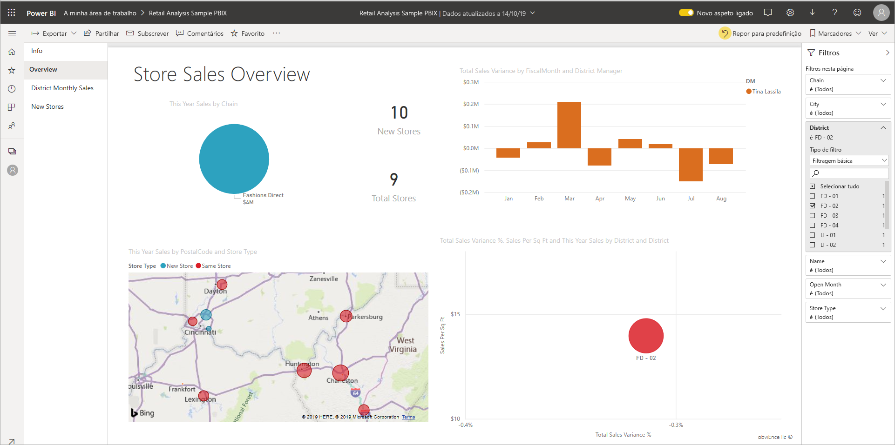
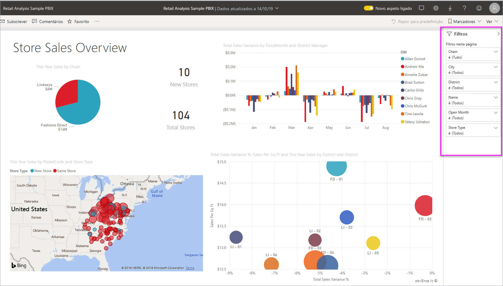
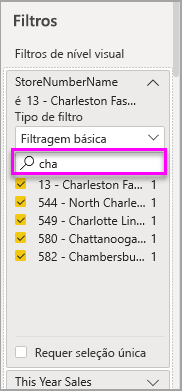
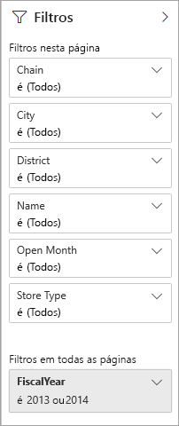
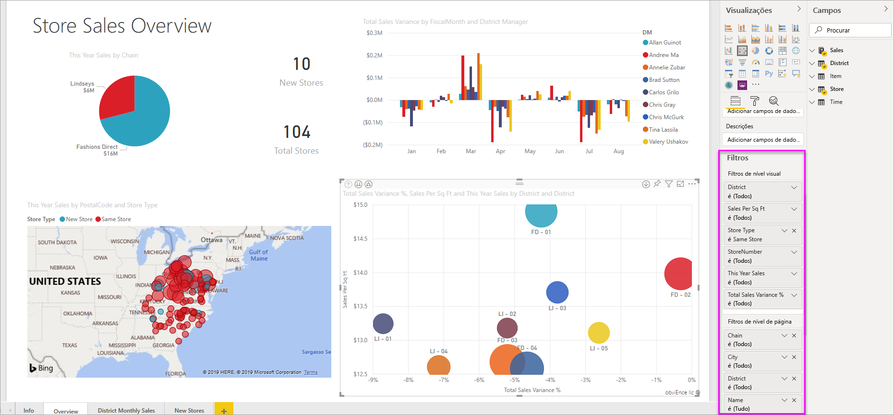

# Filtros e realces em relatórios do Power BI

 Este artigo apresenta-lhe os filtros e os realces no serviço Power BI. A experiência é praticamente a mesma no Power BI Desktop. Os *Filtros* removem tudo, menos os dados em que se pretende focar. Em geral, *realçar* não é filtrar. Na maioria dos visuais, o destaque não remove os dados não relacionados. Em vez disso, destaca os dados relacionados. O resto dos dados permanece visível, mas escurecido. Consulte [o filtro cross-filter e o cross-highlight](#cross-filter-and-cross-highlight-visuals) mais tarde neste artigo para obter mais detalhes.

Existem muitas maneiras diferentes de filtrar e destacar relatórios no Power BI. Colocar toda essa informação num artigo seria muito, por isso, partimo-la nestas secções:

* Introdução aos filtros e realce (este artigo).
* Como [filtra e realça o trabalho na vista Reading](../consumer/end-user-interactions.md) no serviço Power BI. O que pode fazer é mais limitado do que editar a vista, mas ainda tem uma vasta gama de opções de filtragem e realce.  
* Como [criar filtros no painel de filtros](power-bi-report-add-filter.md) no power BI Desktop e no serviço Power BI. Quando tem permissões de edição de um relatório, pode criar, modificar e eliminar filtros nos relatórios.
* Depois de adicionar filtros, pode [formatar os filtros](power-bi-report-filter.md) para agir da forma que quiser e parecer o resto do relatório.
* Aprendeu como os filtros e o trabalho de destaque por defeito. Agora aprendam a mudar a [forma como as visualizações num filtro de página e se destaquem mutuamente.](service-reports-visual-interactions.md)
* Leia sobre outros [tipos de filtros nos relatórios power bi](power-bi-report-filter-types.md).

## Introdução ao painel Filtros

Pode aplicar filtros no painel **de filtros** ou [fazer seleções em cortadores](../visuals/power-bi-visualization-slicers.md) diretamente na própria página do relatório. O painel filters mostra os campos em visuais individuais, e quaisquer outros filtros que o designer do relatório adiciona. 

Existem quatro tipos padrão de filtros que se criam no painel de filtros.

- **O filtro visual** aplica-se a um único visual numa página de relatório. Vê filtros de nível visual quando seleciona uma visão da tela do relatório. Mesmo que não possa editar um relatório, pode selecionar um visual e filtrar.
- **O filtro de** página aplica-se a todos os visuais na página do relatório.
- **O filtro de** relatório aplica-se a todas as páginas do relatório.
- **Filtro drill-through** Com a perfuração no serviço Power BI e power BI Desktop, cria uma página de relatório de *destino* que se foca numa entidade específica, como um fornecedor. A partir das outras páginas de relatório, os utilizadores podem clicar com o direito de um ponto de dados para essa entidade e perfurar até à página focada.

Para criar os três primeiros filtros visuais, de página e de relatório, consulte [adicionar um filtro a um relatório no Power BI](power-bi-report-add-filter.md). 

Para criar filtros de perfuração, consulte [configurar a broca nos relatórios power BI](desktop-drillthrough.md).

### Filtragem básica e avançada

Por predefinição, os leitores de relatório podem mudar de **filtragem Básica** para **Avançada.** 

**Os filtros básicos** mostram uma lista de todos os valores no campo. Pode pesquisar na página, no elemento visual e nos filtros de relatório, na Vista de leitura ou de edição para localizar e selecionar o valor pretendido. 

Um filtro com a palavra **Tudo** ao lado não é filtrado, mostrando todos os valores no campo.  Por exemplo, **Chain is (All)** significa que a página do relatório inclui dados sobre todas as cadeias de lojas. Em contrapartida, o filtro fiscal de nível de relatório **FiscalYear é 2013 ou 2014** significa que o relatório apenas apresenta dados para os anos fiscais de 2013 e 2014.

**Filtros avançados** permitem-lhe usar filtros mais complicados. Por exemplo, pode procurar valores que contenham ou não contenham, comecem com ou não comecem com um valor específico. 

:::image type="content" source="media/power-bi-reports-filters-and-highlighting/power-bi-advanced-filter.png" alt-text="Filtros avançados oferecem opções de filtragem mais matizadas.":::

Quando criar um relatório, pode desligar a ligação e [não permitir que os leitores de relatórios alterem os tipos de filtros](power-bi-report-filter.md#restrict-changes-to-filter-type). Também pode desativar a procura na vidraça do filtro.

## Filtros na Vista de leitura e de edição

Existem dois modos para interagir com relatórios no serviço Power BI: Ver vista de leitura e visualização de edição. As funções de filtragem disponíveis para si dependem do modo no qual se encontra.

* Na [visão de Leitura,](#filters-in-reading-view)pode interagir com quaisquer filtros que já existam no relatório e guardar as seleções que fizer. Não pode adicionar novos filtros.
* Na [vista de Edição,](#filters-in-editing-view)pode adicionar todos os tipos de filtros. Quando guarda o relatório, os filtros são guardados com o relatório, mesmo que os leitores de relatório o abram numa aplicação móvel. As pessoas que olham para o relatório em Reading vêem interagem com os filtros que adicionou, mas não podem adicionar novos filtros.

### Filtros na Vista de leitura

No serviço Power BI, se selecionar um visual na vista Reading, o painel de filtros é semelhante a este:

Cada visual tem filtros para todos os campos visuais. Quando se cria um relatório, pode-se adicionar mais. Neste painel de filtros, o visual tem três filtros.

Na visualização de Leitura, explora os dados modificando os filtros existentes. Só estás a filtrar a tua visão do relatório. Quando sai do relatório, as alterações que faz são guardadas com a sua visão do relatório, mesmo que abra o relatório numa aplicação móvel. Para desfazer a filtragem e voltar às predefinições definidas pelo autor do relatório, selecione **Reset para predefinição** a partir da barra de menu superior.

:::image type="content" source="../consumer/media/end-user-report-filter/power-bi-reset-icon.png" alt-text="Reinicie para o ícone predefinido.":::

Saiba mais sobre a visão de Leitura: [Faça um passeio pelo painel de filtros do relatório](../consumer/end-user-report-filter.md).

### Filtros na Vista de edição
Quando abre uma reportagem no Power BI Desktop, vê-se que **os Filtros** são apenas um dos vários painéis de edição disponíveis. Vê as mesmas vidraças se abrir um relatório na vista de Edição no serviço Power BI.

Vemos que esta página do relatório tem três filtros de nível de página e um filtro de nível de relatório. Ao selecionar o gráfico da coluna, vemos que também tem três filtros de nível visual.

#### Trabalhar com filtros na vista de edição

- Saiba como [adicionar filtros a um relatório](power-bi-report-add-filter.md) no Power BI Desktop e na visualização de Edição no serviço Power BI.

- Depois de adicionar filtros, tem muitas opções de formatação para eles. Por exemplo, pode ocultar, bloquear ou reencomendar filtros, ou formatá-los para corresponder ao resto do relatório. Aprenda a [formatar filtros num relatório](power-bi-report-filter.md). 

- Também pode alterar a forma como os visuais interagem. Para afinar o cruzamento e a filtragem cruzada, consulte [Alterar como os visuais interagem em relatórios](service-reports-visual-interactions.md).

## Visuais de filtro cruzado e cross-highlight

Pode explorar as relações entre os visuais no seu relatório sem utilizar filtros ou cortadores. Selecione uma etiqueta de valor ou eixo num visual para *cruzar o filtro* ou *realçar* os valores relacionados em outros visuais da página. Nem todos se comportam da mesma forma. 

- **Cruzamento** A seleção de um valor num visual destaca os dados relacionados em visuais como gráficos de colunas e barras. O cruzamento não remove os dados não relacionados desses visuais. Os dados não relacionados ainda são visíveis, mas escurecidos. 
- **Filtragem cruzada** Selecionar um valor num visual age mais como um filtro em outros visuais, tais como gráficos de linha e gráficos de dispersão. Nesses visuais, apenas os dados relacionados permanecem visíveis. Os dados não relacionados não são visíveis, tal como se pode ver com um filtro. 

Para remover o realce, selecione novamente o valor ou selecione um espaço vazio no mesmo elemento visual. Para mais exemplos, consulte a secção [de filtragem cruzada e de cruzamento](../consumer/end-user-interactions.md#cross-filtering-and-cross-highlighting) de "Como os visuais se filtram entre si num relatório do Power BI".

## Passos seguintes

- [Adicionar um filtro a um relatório na Vista de Edição](power-bi-report-add-filter.md)
- [Filtros de formato nos relatórios Power BI](power-bi-report-filter.md)
- [Fazer uma visita aos filtros de relatórios](../consumer/end-user-report-filter.md)
- [Como relatar visuais cruzam filtro e cruzam-se num relatório](../consumer/end-user-interactions.md)

Mais perguntas? [Pergunte à Comunidade do Power BI](https://community.powerbi.com/)
