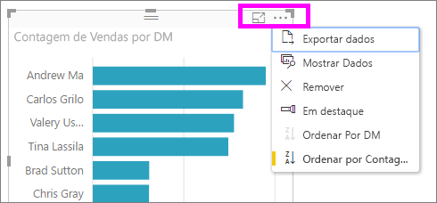

# Utilizar as Perguntas e Respostas do Power BI para explorar os seus dados e criar elementos visuais

Às vezes, a maneira mais rápida de obter uma resposta dos seus dados é fazer uma pergunta em linguagem natural. A funcionalidade Perguntas e Respostas no Power BI permite-lhe explorar os seus dados com as suas próprias palavras.  A primeira parte deste artigo mostra como utilizar as Perguntas e Respostas em dashboards no serviço Power BI. A segunda parte mostra o que pode fazer com as Perguntas e Respostas ao criar relatórios no serviço Power BI ou no Power BI Desktop. Para obter mais informações, veja o artigo [Perguntas e Respostas para consumidores](../consumer/end-user-q-and-a.md). 

As [Perguntas e Respostas nas aplicações para dispositivos móveis do Power B](../consumer/mobile/mobile-apps-ios-qna.md) e as [Perguntas e Respostas com o Power BI Embedded](../developer/embedded/qanda.md) são abordadas em artigos separados. 

As Perguntas e Respostas são interativas e até divertidas. Muitas vezes, uma pergunta leva a outras, uma vez que as visualizações revelam caminhos interessantes a seguir. Veja a Amanda a demonstrar a utilização das Perguntas e Respostas para criar visualizações, aprofundar os elementos visuais e afixá-los a dashboards.

<iframe width="560" height="315" src="https://www.youtube.com/embed/qMf7OLJfCz8?list=PL1N57mwBHtN0JFoKSR0n-tBkUJHeMP2cP" frameborder="0" allowfullscreen></iframe>

## Parte 1: Utilizar as Perguntas e Respostas num dashboard no serviço Power BI

No serviço Power BI (app.powerbi.com), um dashboard contém mosaicos afixados a partir de um ou mais conjuntos de dados e, por isso, pode fazer perguntas sobre quaisquer dados contidos em qualquer um desses conjuntos de dados. Para ver os relatórios e os conjuntos de dados que foram utilizados na criação do dashboard, selecione **Ver relacionados** na barra de menus.

A caixa de pergunta das Perguntas e Respostas está localizada no canto superior esquerdo do dashboard, onde vai escrever a sua pergunta com linguagem natural. Não vê a caixa de Perguntas e Respostas? Consulte [Considerações e resolução de problemas](../consumer/end-user-q-and-a.md#considerations-and-troubleshooting) no artigo **Perguntas e Respostas**.  As Perguntas e Respostas reconhecem as palavras que escreve e descobrem onde (em que conjunto de dados) encontrar a resposta. O P e R também o ajuda a criar a sua pergunta com preenchimento automático, ajuste e outros auxílios textuais e visuais.

A resposta à sua pergunta é apresentada como uma visualização interativa e atualiza à medida que modifica a pergunta.

1. Abra um dashboard e coloque o cursor na caixa de pergunta. No canto superior direito, selecione **Nova experiência de Perguntas e Respostas**.

    

1. Mesmo antes de começar a escrever, as Perguntas e Respostas apresentam um ecrã novo com sugestões para o ajudar a formular a sua pergunta. Irá ver expressões e perguntas completas com os nomes das tabelas nos conjuntos de dados subjacentes e poderá até ver perguntas completas listadas se o proprietário do conjunto de dados tiver criado [perguntas em destaque](service-q-and-a-create-featured-questions.md).

   

   Pode escolher uma destas perguntas como ponto de partida e continuar a melhorar a pergunta para encontrar uma resposta específica. Ou utilize um nome de tabela para o ajudar a formar uma nova pergunta.

2. Selecione da lista de perguntas ou comece a escrever a sua própria pergunta e selecione de entre as sugestões da lista pendente.

   

3. Ao escrever uma pergunta, as Perguntas e Respostas escolhem a melhor visualização para apresentar a sua resposta.

   

4. A visualização muda de forma dinâmica à medida que modifica a pergunta.

   

1. Quando escreve uma pergunta, o Power BI procura a melhor resposta, utilizando qualquer conjunto de dados que tenha um mosaico nesse dashboard.  Se todos os mosaicos forem do *conjuntodedadosA*, a sua resposta será proveniente do *conjuntodedadosA*.  Se existirem mosaicos de *conjuntodedadosA* e *conjuntodedadosB*, as Perguntas e Respostas procuram a melhor resposta entre esses dois conjuntos de dados.

   > [!TIP]
   > Por isso, tenha cuidado. Se tiver apenas um mosaico de *conjuntodedadosA* e o remover do dashboard, as Perguntas e Respostas deixam de ter acesso ao *conjuntodedadosA*.
   >

5. Quando estiver satisfeito com o resultado, afixe a visualização num dashboard, ao selecionar o ícone para afixar no canto superior direito. Se o dashboard foi partilhado consigo ou fizer parte de uma aplicação, não poderá afixar.

   

## Parte 2: Utilizar as Perguntas e Respostas num relatório no serviço Power BI ou no Power BI Desktop

Utilize as Perguntas e Respostas para explorar o conjunto de dados e adicionar visualizações ao relatório e aos dashboards. Um relatório baseia-se num único conjunto de dados e pode estar completamente em branco ou conter páginas repletas de visualizações. Mas o facto de um relatório estar em branco, não significa que não existem dados para explorar – o conjunto de dados está ligado ao relatório e está à espera que explore e crie visualizações.  Para ver que conjunto de dados está a ser utilizado para criar um relatório, abra o relatório na Vista de Leitura do serviço Power BI e selecione **Ver relacionados** na barra de menus.

Para utilizar as Perguntas e Respostas em relatórios, tem de ter permissões de edição para o relatório e o conjunto de dados subjacente. No artigo [Perguntas e Respostas para consumidores](../consumer/end-user-q-and-a.md), referimo-nos a isto como um cenário de *criador*. Se, em vez disso, estiver a *consumir* um relatório que foi partilhado consigo, as Perguntas e Respostas não estarão disponíveis.

1. Abra um relatório na Vista de edição (serviço Power BI) ou na Vista de relatório (Power BI Desktop) e selecione **Colocar uma pergunta** na barra de menus.

    **Power BI Desktop**    
    

    **Serviço**    
    

2. Uma caixa de pergunta das Perguntas e Respostas é apresentada na tela do relatório. No exemplo abaixo, a caixa de pergunta é apresentada sobre outra visualização. Não há problema, mas pode ser melhor adicionar uma página em branco ao relatório antes de fazer uma pergunta.

    

3. Coloque o cursor na caixa de pergunta. À medida que escreve, as Perguntas e Respostas apresentam sugestões para o ajudar a formular a sua pergunta.

   

4. À medida que escreve uma pergunta, as Perguntas e Respostas escolhem a melhor [visualização](../visuals/power-bi-visualization-types-for-reports-and-q-and-a.md) para apresentar a sua resposta e a visualização muda dinamicamente, à medida que modifica a pergunta.

   

5. Quando tiver a visualização de que gosta, selecione ENTER. Para guardar a visualização com o relatório, selecione **Ficheiro > Guardar**.

6. Interaja com a nova visualização. Não interessa como criou a visualização – está disponível a mesma interatividade, formatação e funcionalidades.

   

   Se tiver criado a visualização no serviço Power BI, pode até [afixá-la a um dashboard](service-dashboard-pin-tile-from-q-and-a.md).

## Informe as Perguntas e Respostas sobre qual a visualização a utilizar
Com as Perguntas e Respostas, não só pode pedir aos seus dados que falem por si próprios, como também pode indicar ao Power BI como apresentar a resposta. Basta adicionar "como um <visualization type>" ao final da pergunta.  Por exemplo, "mostrar o volume de inventário pela fábrica como um mapa" e "mostrar inventário total como um cartão".  Experimente.

## Considerações e resolução de problemas
- Se tiver ligado a um conjunto de dados com uma ligação em direto ou gateway, as Perguntas e Respostas têm de ser [ativadas para esse conjunto de dados](service-q-and-a-direct-query.md).

- Abriu um relatório e não vê a opção Perguntas e Respostas. Se estiver a utilizar o serviço Power BI, certifique-se de que o relatório está aberto na Vista de edição. Se não conseguir abrir a Vista de edição, significa que não tem permissões de edição para esse relatório e pode utilizar as Perguntas e Respostas com esse relatório específico.

## Próximos passos

- [Perguntas e Respostas para consumidores](../consumer/end-user-q-and-a.md)   
- [Sugestões para fazer perguntas nas Perguntas e Respostas](../consumer/end-user-q-and-a-tips.md)   
- [Preparar um livro para Perguntas e Respostas](service-prepare-data-for-q-and-a.md)  
- [Preparar um conjunto de dados no local para as Perguntas e Respostas](service-q-and-a-direct-query.md)   
- [Afixar um mosaico ao dashboard a partir das Perguntas e Respostas](service-dashboard-pin-tile-from-q-and-a.md)
