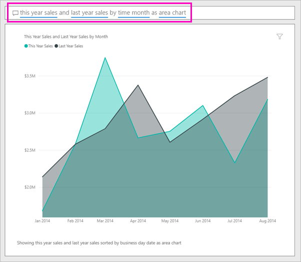
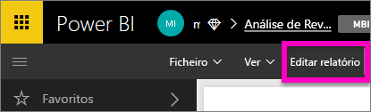

# Criar um elemento visual com as Perguntas e Respostas do Power BI

Às vezes, a forma mais rápida de obter uma resposta dos seus dados é fazer uma pergunta com linguagem natural.  Neste artigo, examinaremos duas formas diferentes de criar a mesma visualização: em primeiro lugar, fazer uma pergunta com as Perguntas e Respostas e, em segundo lugar, compilá-la num relatório. Iremos utilizar o serviço Power BI para compilar o elemento visual no relatório, mas o processo é quase idêntico a utilizar o Power BI Desktop.

Para acompanhar, tem de utilizar um relatório que possa editar, por isso iremos utilizar um dos exemplos disponíveis com o Power BI.

## Criar um elemento visual com as Perguntas e Respostas

Como podemos criar este gráfico de linhas com as Perguntas e Respostas?

1. Na área de trabalho do Power BI, selecione **Obter Dados** \> **Exemplos** \> **Exemplo de Análise de Revenda** > **Ligar**.

1. Abra o dashboard Exemplo de Análise de Revenda e coloque o cursor na caixa de Perguntas e Respostas, **Colocar uma questão sobre os dados**.

    

2. Na caixa de Perguntas e Respostas, escreva uma questão parecida com esta:
   
    **vendas deste ano e vendas do ano passado por mês como gráfico de área**
   
    Ao escrever a pergunta, o P e R escolhe a melhor visualização para apresentar a sua resposta, e a visualização muda dinamicamente, na medida em que modifica a pergunta. Além disso, as Perguntas e Respostas ajudam a formatar a sua pergunta com sugestões, preenchimento automático e correções ortográficas. As Perguntas e Respostas recomendam uma pequena alteração na linguagem: "vendas deste ano e vendas do ano passado por *hora mês* como gráfico de área".  

    

4. Selecione a frase para aceitar a sugestão. 
   
   Quando terminar de escrever a sua pergunta, o resultado será o mesmo gráfico que vê no dashboard.
   
   

4. Para afixar o gráfico no seu dashboard, selecione o ícone de afixar  no canto superior direito.

## Criar um elemento visual no editor de relatórios

1. Navegue de volta para o dashboard do Exemplo de Análise de Revenda.
   
2. O dashboard contém o mesmo mosaico de gráfico de área para "Vendas do Último Ano e Vendas Deste Ano".  Selecione este mosaico. Não selecione o mosaico que criou com as Perguntas e Respostas. A sua seleção abre as Perguntas e Respostas. O mosaico de gráfico de área original foi criado num relatório, portanto o relatório é aberto para a página que contém esta visualização.

    

1. Abra o relatório na Vista de Edição selecionando **Editar Relatório**.  Se não for proprietário de um relatório, não terá a opção de abrir o relatório na Vista de Edição.
   
    
4. Selecione o gráfico de área e reveja as definições no painel **Campos**.  O criador do relatório criou este gráfico ao selecionar estes três valores (**Vendas do Último Ano** e **Vendas Deste Ano > Valor** da tabela **Vendas** e **MêsFiscal** da tabela **Hora**) e organizá-los nas áreas **Eixos** e **Valores**.
   
    

    Vê que ficaram com o mesmo elemento visual. Não foi muito complicado criá-los desta forma. No entanto, é mais fácil criar com as Perguntas e Respostas!

## Próximas etapas

- [Utilizar Perguntas e Respostas em dashboards e relatórios](power-bi-tutorial-q-and-a.md)  
- [Perguntas e Respostas para consumidores](../consumer/end-user-q-and-a.md)
- [Fazer com que os seus dados funcionem bem com as Perguntas e Respostas no Power BI](service-prepare-data-for-q-and-a.md)

Mais perguntas? [Pergunte à Comunidade do Power BI](https://community.powerbi.com/)
