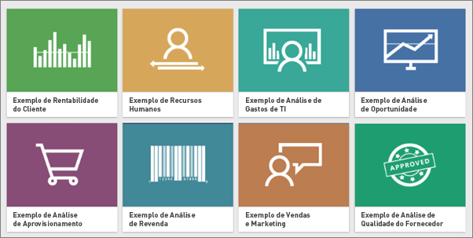
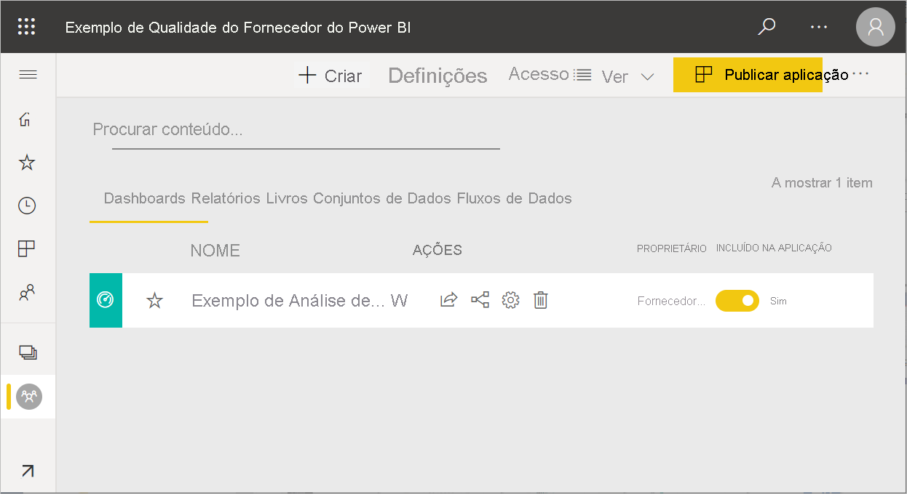
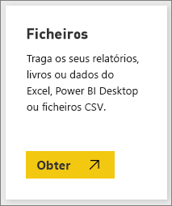
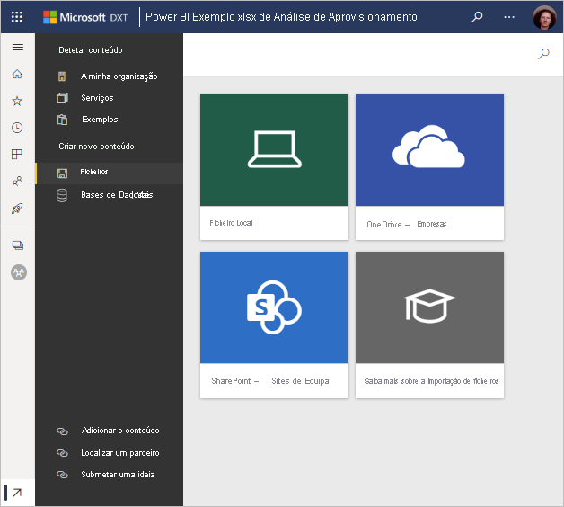
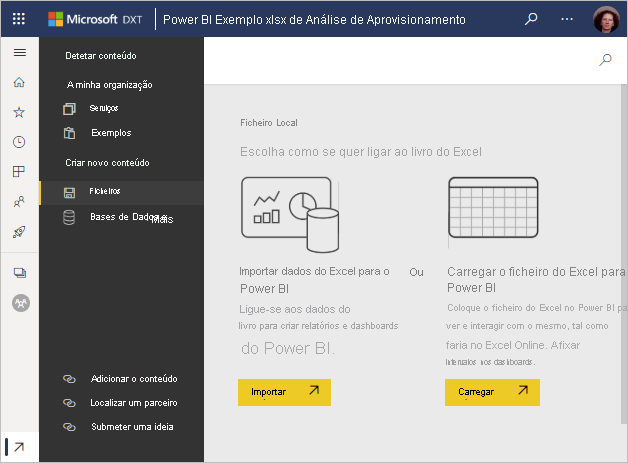

# Veja exemplos do Power BI
Diga que não está familiarizado com o Power BI e pretende experimentar, mas não tem quaisquer dados.  Ou talvez queira ver relatórios que ilustram algumas das capacidades do Power BI. Nós tratamos disso.

O Power BI oferece diferentes tipos de exemplos, para diferentes fins: 
- Um **[relatório do Power BI](#sales--returns-sample-pbix-file) (ficheiro. pbix)** , que pode ver na Data Stories Gallery, abrir e explorar no Power BI Desktop ou que pode carregar para o serviço Power BI.
- Uma **[aplicação de exemplo](#sample-app-from-appsource)** , que transfere do AppSource, também no serviço Power BI. As aplicações incluem dashboards, relatórios e conjuntos de dados. Pode modificá-las e distribuí-los pelos seus colegas.
- **[Oito exemplos originais incorporados](#eight-original-samples)** no serviço Power BI como *pacotes de conteúdos*, com dashboards, relatórios e conjuntos de dados. Instale-os diretamente no serviço Power BI. Os exemplos incorporados também estão disponíveis como relatórios do Power BI (.pbix) e livros do Excel (.xlsx).
- Versões do **[livro do Excel](#download-sample-excel-files)** dos exemplos incorporados que contêm o modelo de dados e as folhas do Power View. Pode explorar ou editar o modelo de dados no Excel, utilizar o livro do Excel como origem de dados para um relatório do Power BI. Também pode carregar o livro como um ficheiro do Excel e apresentar os elementos visuais e as Tabelas Dinâmicas do Excel nos relatórios do Power BI. 
- Também um **[livro de exemplo de Dados financeiros](sample-financial-download.md)** , uma tabela plana simples num ficheiro do Excel disponível para transferência. Contém dados anónimos com produtos fictícios, com vendas divididas por segmentos e países/regiões. Serve de origem de dados básica útil para um relatório do Power BI.

A nossa documentação online utiliza estes mesmos recursos de exemplo nos tutoriais e nas demonstrações para que consiga acompanhá-los na prática.

## Ficheiro .pbix de exemplo de Vendas e Devoluções

:::image type="content" source="media/sample-datasets/sales-returns-sample-pbix.png" alt-text="Ficheiro .pbix de exemplo de Vendas e Devoluções":::

*O relatório de exemplo de Vendas e Devoluções*

Os designers de relatórios do Power BI, Miguel Myers e Chris Hamill, criaram o ficheiro .pbix de Vendas e Devoluções para demonstrar várias novas funcionalidades do Power BI, incluindo botões, pormenorização, formatação condicional, hipóteses e descrições personalizadas. 

O cenário para este relatório é uma empresa que vende skates temáticos da Microsoft. A empresa quer ver o estado das vendas e devoluções e analisar como deve modificar as operações. 

Pode explorá-lo das seguintes formas:

- Ver e interagir com o estado na [Data Stories Gallery](https://community.powerbi.com/t5/Data-Stories-Gallery/Sales-amp-Returns-Sample-Report/m-p/876607) da Comunidade do Power BI.
- Transferir o ficheiro .pbix e explorá-lo em profundidade. Espreite os “bastidores” para ver como o Miguel o fez. Ao selecionar esta ligação, transfere o ficheiro automaticamente: [Relatório de exemplo de Vendas e Devoluções](https://github.com/microsoft/powerbi-desktop-samples/blob/main/Sample%20Reports/Sales%20%26%20Returns%20Sample%20v201912.pbix).
- Leia mais sobre o relatório na publicação de blogue do Power BI, [Take a tour of the new Sales & Returns sample report](https://powerbi.microsoft.com/blog/take_a_tour_of_the_new_sales_returns_sample_report/) (Apresentação do novo relatório de exemplo de Vendas e Devoluções).

## Aplicação de exemplo do AppSource

A *aplicação* de Marketing e Vendas está disponível no Microsoft AppSource. Uma aplicação é um tipo de conteúdo do Power BI que combina dashboards e relatórios relacionados. Uma aplicação pode ter um ou mais dashboards ou relatórios em conjunto. Pode transferir a aplicação de Marketing e Vendas em **Aplicações** no serviço Power BI ou pode aceder ao AppSource no browser.

- O artigo [Instalar e utilizar aplicações](../consumer/end-user-app-view.md) explica como transferir uma aplicação dentro do serviço Power BI.
- Esta ligação leva-o para a [aplicação de Vendas e Marketing](https://appsource.microsoft.com/product/power-bi/microsoft-retail-analysis-sample.salesandmarketingsample?tab=Overview) no AppSource.

Depois de a instalar, poderá vê-la na sua coleção de aplicações.

:::image type="content" source="media/sample-datasets/power-bi-sales-marketing-app.png" alt-text="Mosaico da aplicação de Vendas e Marketing":::

Quando a abrir, selecione **Explorar com dados de exemplo**. 

:::image type="content" source="media/sample-datasets/power-bi-explore-app.png" alt-text="Explorar a aplicação":::

Vê a vista da aplicação, com o dashboard e as páginas de relatórios individuais no painel de navegação. 

:::image type="content" source="media/sample-datasets/power-bi-sales-marketing-app-navigation.png" alt-text="Painel de navegação da aplicação":::

Por ter instalado a aplicação, também pode abrir a *área de trabalho* e editar os elementos da aplicação. Selecione o ícone de lápis **Editar** para abrir a área de trabalho.

:::image type="content" source="media/sample-datasets/power-bi-app-edit-pencil.png" alt-text="Editar a aplicação":::

Agora vê o dashboard, o relatório e o conjunto de dados da aplicação na vista de lista da área de trabalho. Aqui, na área de trabalho, pode editar cada um destes elementos.

:::image type="content" source="media/sample-datasets/power-bi-sales-marketing-workspace.png" alt-text="Área de trabalho de Vendas e Marketing":::

Se quiser, pode distribuir esta aplicação para qualquer pessoa na sua organização. Selecione **Atualizar aplicação**.

:::image type="content" source="media/sample-datasets/power-bi-update-app.png" alt-text="Botão Atualizar aplicação":::

Complete o separador **Configuração**, incluindo a escolha de uma **Cor do tema da aplicação**. 

:::image type="content" source="media/sample-datasets/power-bi-app-setup.png" alt-text="Selecionar configuração da aplicação":::

Complete os separadores **Navegação** e **Permissão** e, em seguida, selecione **Atualizar aplicação**.

:::image type="content" source="media/sample-datasets/power-bi-select-update-app.png" alt-text="Selecionar Atualizar aplicação para a publicar":::

Saiba mais sobre como [publicar aplicações no Power BI](../collaborate-share/service-create-distribute-apps.md).

## Oito exemplos originais
Estão disponíveis oito exemplos originais para utilização. Cada exemplo representa um setor diferente. Pode interagir com cada um deles em diferentes formatos:

- Instale os [pacotes de conteúdos incorporados](#install-built-in-content-packs) no serviço Power BI.
- Transfira os [ficheiros de relatório do Power BI](#download-original-sample-power-bi-files) (.pbix).
- Transfira os [ficheiros de livros do Excel](#download-sample-excel-files) (.xlsx) e, em seguida, carregue-os para o serviço Power BI.
- Explore os [ficheiros do Excel no próprio Excel](#explore-excel-samples-inside-excel).

A empresa obviEnce ([www.obvience.com](http://www.obvience.com/)) e a Microsoft juntaram-se para criar exemplos que pode utilizar com o Power BI.  Os dados são anónimos e representam as diferentes indústrias: finanças, RH, vendas e muito mais. 

Cada um destes exemplos está disponível em vários formatos: como um pacote de conteúdos, como um livro do Excel e como um ficheiro. pbix do Power BI. Se não estiver familiarizado com estes temas ou como agir – não se preocupe. Este artigo explica tudo. Para cada um destes exemplos, criámos uma *apresentação*. As apresentações são artigos que explicam a história por trás de cada exemplo e o guiam ao longo dos diferentes cenários. Um cenário poderá responder a questões do seu diretor, outro poderá ter informações competitivas ou criar relatórios e dashboards a partilha ou explicar uma mudança de negócio.

Antes de começarmos, veja a seguir as diretrizes legais para a utilização destes exemplos. A seguir às diretrizes, iremos apresentar os exemplos e mostrar como os pode utilizar.

### Diretrizes de utilização dos livros do Excel de exemplo

&copy;2015 Microsoft Corporation. All rights reserved. Os documentos e livros são fornecidos "tal como estão." As informações e opiniões expressas nos livros, incluindo URLs e outras referências a sites, podem ser alteradas sem aviso prévio. O utilizador assume o risco de usá-las. Alguns exemplos são apenas para ilustração e são fictícios. Nenhuma associação real é pretendida ou inferida. A Microsoft não faz garantias, de forma expressa ou implícita, em relação à informação aqui apresentada.

Os livros não lhe conferem qualquer direito legal sobre nenhuma propriedade intelectual de nenhum produto da Microsoft. Pode copiar e utilizar este livro para fins internos e de referência.

Os livros e os dados relacionados são fornecidos pela obviEnce. [www.obvience.com](http://www.obvience.com)

A ObviEnce é um ISV (distribuidor independente de software) e uma incubadora de propriedade intelectual voltada para Microsoft Business Intelligence. A ObviEnce trabalha em estreita colaboração com a Microsoft para desenvolver melhores práticas e liderança elaborada para início rápido e implementação de soluções de Microsoft Business Intelligence.

Os livros e os dados são propriedade da obviEnce, LLC e foram partilhados exclusivamente com o objetivo de demonstrar a funcionalidade do Power BI com dados de exemplo do setor.

Quaisquer utilizações dos livros e/ou dados devem incluir a atribuição acima (que também está na folha de cálculo de informações que acompanha cada livro). O livro e quaisquer visualizações devem ser acompanhados da seguinte notificação relativa a direitos de autor: obviEnce &copy;.

Ao clicar em qualquer uma das seguintes ligações para transferir os ficheiros dos livros do Excel ou .pbix, significa que aceita os termos acima.

### Exemplo de Rentabilidade do Cliente  
[Veja uma apresentação do exemplo de Rentabilidade do Cliente](sample-customer-profitability.md)

Este exemplo do setor analisa as métricas-chave de um CFO para os executivos, produtos e clientes da empresa. Pode investigar quais os fatores que afetam a rentabilidade da sua empresa.

### Exemplo de Recursos Humanos 
[Veja uma apresentação do exemplo de RH](sample-human-resources.md)

Este exemplo do setor concentra-se na estratégia de contratação de uma empresa por meio da análise de novos contratados, colaboradores ativos e colaboradores dispensados.  Ao explorar os dados, pode encontrar tendências em separações voluntárias e desvios na estratégia de contratação.

### Exemplo de Análise de Gastos de TI 
[Veja uma apresentação do exemplo de Análise de Gastos em TI](sample-it-spend.md)

Neste exemplo do setor, analisamos os custos planeados vs. os custos reais do departamento de TI de uma empresa. Esta comparação ajuda-nos a perceber em que medida a empresa planeou corretamente o seu ano e permite-nos investigar as áreas com grandes desvios em relação ao plano. Este exemplo mostra um ciclo de planeamento anual da empresa e apresenta trimestralmente uma nova Latest Estimate (Estimativa Mais Recente (LE)) para ajudar a analisar as alterações dos gastos de TI ao longo do ano fiscal.

### Exemplo de Análise de Oportunidade 
[Veja uma apresentação do exemplo de Análise de Oportunidade](sample-opportunity-analysis.md)

Este exemplo do setor explica um canal de vendas de uma empresa de software. Os gestores de vendas monitorizam os seus canais de vendas diretas e de parceiros acompanhando as oportunidades e a receita por região, tamanho da oferta e canal.

### Exemplo de Análise de Compras  
[Veja uma apresentação do exemplo de Análise de Compras](sample-procurement.md)

Este exemplo do setor analisa as métricas-chave de um CFO para os executivos, produtos e clientes da empresa. Pode investigar quais os fatores que afetam a rentabilidade da sua empresa.

### Exemplo de Análise de Revenda  
[veja uma apresentação do exemplo da Análise de Retalhistas](sample-retail-analysis.md)

Este exemplo do setor analisa dados de vendas de retalho dos itens vendidos em várias lojas e distritos. As métricas comparam o desempenho do ano atual com o último ano nas seguintes áreas: vendas, unidades, margem bruta e desvio, bem como a análise de novas lojas.

### Sales and Marketing sample  
[Veja uma apresentação do exemplo de Vendas e Marketing](sample-sales-and-marketing.md)

Este exemplo do setor analisa uma empresa industrial, VanArsdel Ltd. Permite ao Diretor de Marketing uma observação do setor e da quota de mercado da VanArsdel.  Ao explorar o exemplo, pode encontrar a quota de mercado da empresa, o volume de produtos, as vendas e o sentimento.

### Exemplo de Qualidade do Fornecedor  
[Veja uma apresentação do exemplo de Qualidade do Fornecedor](sample-supplier-quality.md)

Este exemplo do setor destaca um dos desafios típicos da cadeia de fornecedores – análise de qualidade do fornecedor. Esta análise depende de duas métricas principais: o número total de defeitos e o período de indisponibilidade total que estes defeitos causaram. Este exemplo tem dois objetivos principais: perceber quais são os melhores e os piores fornecedores, no que respeita à qualidade e identificar as instalações fabris que melhor localizam e rejeitam defeitos, para minimizar o período de indisponibilidade.

### Instalar pacotes de conteúdos incorporados

Comecemos pelos *pacotes de conteúdos*. Os exemplos incorporados estão disponíveis no serviço Power BI; não tem de sair do Power BI para os encontrar. Um pacote de conteúdos é um pacote de um ou mais dashboards, conjuntos de dados e relatórios que alguém cria e que pode ser utilizado com o serviço Power BI. Cada pacote de conteúdos de exemplo do Power BI inclui um conjunto de dados, o relatório e o dashboard.  Os pacotes de conteúdos ainda estão disponíveis, mas serão preteridos. Não estão disponíveis para o Power BI Desktop.

1. Abra o serviço Power BI (app.powerbi.com) e inicie sessão.
2. Navegue para A Minha Área de Trabalho ou para outra área de trabalho onde quer instalar o exemplo. 
2. No canto inferior esquerdo, selecione **Obter dados**.

    
3. Na página Obter Dados apresentada, selecione **Exemplos**.

   
4. Selecione um dos exemplos para abrir uma descrição desse exemplo e escolha **Ligar**.  

   
5. O Power BI importa o pacote de conteúdos e adiciona um novo dashboard, relatório e conjunto de dados para a sua área de trabalho atual. Utilize os exemplos para testar o Power BI.  

   

Agora que tem dados, está no bom caminho.  Experimente alguns dos nossos tutoriais com os pacotes de conteúdos de exemplo ou abra o serviço Power BI e explore.

### Transferir os ficheiros do Power BI de exemplo originais
Cada um dos pacotes de conteúdos de exemplo também está disponível como ficheiro. pbix do Power BI. Os ficheiros .pbix são concebidos para serem utilizados com o Power BI Desktop.  

1. Transfira os ficheiros individualmente utilizando as ligações abaixo. Selecionar estas ligações guarda o ficheiro automaticamente na pasta Transferências. 

   - [Ficheiro PBIX de Exemplo de Rentabilidade do Cliente](https://download.microsoft.com/download/6/A/9/6A93FD6E-CBA5-40BD-B42E-4DCAE8CDD059/Customer%20Profitability%20Sample%20PBIX.pbix)
   - [Ficheiro PBIX de Exemplo de Recursos Humanos](https://download.microsoft.com/download/6/9/5/69503155-05A5-483E-829A-F7B5F3DD5D27/Human%20Resources%20Sample%20PBIX.pbix)
   - [Ficheiro PBIX de Exemplo de Análise de Aprovisionamento](https://download.microsoft.com/download/D/5/3/D5390069-F723-413B-8D27-5888500516EB/Procurement%20Analysis%20Sample%20PBIX.pbix)
   - [Ficheiro PBIX de Exemplo de Análise de Revenda](https://download.microsoft.com/download/9/6/D/96DDC2FF-2568-491D-AAFA-AFDD6F763AE3/Retail%20Analysis%20Sample%20PBIX.pbix)
   - [Ficheiro PBIX de Exemplo de Vendas e Marketing](https://download.microsoft.com/download/9/7/6/9767913A-29DB-40CF-8944-9AC2BC940C53/Sales%20and%20Marketing%20Sample%20PBIX.pbix)
   - [Ficheiro PBIX de Exemplo de Análise de Qualidade do Fornecedor](https://download.microsoft.com/download/8/C/6/8C661638-C102-4C04-992E-9EA56A5D319B/Supplier-Quality-Analysis-Sample-PBIX.pbix)

1. No Power BI Desktop, selecione **Ficheiro > Abrir** e navegue para a localização onde guardou o ficheiro .pbix de exemplo.

4. Selecione o ficheiro .pbix para o abrir no Power BI Desktop.

### Transferir ficheiros do Excel de exemplo
Cada um dos pacotes de conteúdos de exemplo também está disponível como livro do Excel. Os livros do Excel foram concebidos para serem utilizados com o serviço Power BI.  

1. Transfira os ficheiros individualmente utilizando as ligações abaixo ou [transfira um ficheiro zip de todos os ficheiros de exemplo](https://go.microsoft.com/fwlink/?LinkId=535020). Os utilizadores avançados podem transferir os livros do Excel para explorar ou editar os modelos de dados.

   - [Exemplo de Rentabilidade do Cliente](https://go.microsoft.com/fwlink/?LinkId=529781)
   - [Exemplo de Recursos Humanos](https://go.microsoft.com/fwlink/?LinkId=529780)
   - [Exemplo de Acompanhamento de Oportunidades](https://go.microsoft.com/fwlink/?LinkId=529782)
   - [Exemplo de Análise de Compras](https://go.microsoft.com/fwlink/?LinkId=529784)
   - [Exemplo de Análise de Retalho](https://go.microsoft.com/fwlink/?LinkId=529778)
   - [Exemplo de Vendas e Marketing](https://go.microsoft.com/fwlink/?LinkId=529785)
   - [Exemplo de Análise de Qualidade do Fornecedor](https://go.microsoft.com/fwlink/?LinkId=529779)

2. Guarde o ficheiro transferido. O local onde guarda o ficheiro é importante.

      **Local**: se guardar o ficheiro numa unidade local no computador ou noutro local na sua organização, através do Power BI, é possível importar o ficheiro para o Power BI. O ficheiro permanecerá na unidade local; portanto, o ficheiro completo não é importado para o Power BI. O que ocorre é que um novo conjunto de dados é criado no site do Power BI e os dados (e, em alguns casos, o modelo de dados) são carregados para esse conjunto de dados. Se o ficheiro tiver relatórios, estes serão apresentados no site do Power BI, em Relatórios.
    
     **OneDrive para Empresas**: se tiver o OneDrive para Empresas e iniciar sessão neste com a mesma conta utilizada para o Power BI, o OneDrive para Empresas será, sem dúvida, o melhor local para manter o seu trabalho no Excel, no Power BI ou num ficheiro .CSV em sincronização com o seu conjunto de dados, os seus relatórios e os seus dashboards no Power BI. Visto que tanto o Power BI quanto o OneDrive ficam na cloud, o Power BI liga-se ao seu ficheiro no OneDrive em intervalos aproximados de uma hora. Caso sejam encontradas alterações, o conjunto de dados, os relatórios e os dashboards serão atualizados automaticamente no Power BI.
    
     **Sites de Equipa do SharePoint**: guardar os seus ficheiros do Power BI nos Sites de Equipa do SharePoint é muito semelhante a guardá-los no OneDrive para Empresas. A maior diferença neste caso é como liga ao ficheiro do Power BI. Pode especificar um URL ou ligar à pasta raiz.
1. Abra o serviço Power BI (app.powerbi.com) e inicie sessão.

1. Navegue para A Minha Área de Trabalho ou para outra área de trabalho ou crie uma área de trabalho apenas para o exemplo.

4. No canto inferior esquerdo do painel de navegação, selecione **Obter dados**.

    
5. Na página **Obter Dados** apresentada, selecione **Ficheiros > Obter**.

    
6. Selecione a localização para onde transferiu e guardou o exemplo.

    
7. Selecione o ficheiro. Dependendo de onde guardou o ficheiro, selecione **Ligar** ou **Abrir**.

8. Escolha se pretende importar os dados ou colocar o livro no Power BI e vê-lo exatamente como no Excel online.

    
9. Se selecionar **Importar**, o Power BI importará o livro de exemplo e adiciona-o como um novo dashboard, relatório e conjunto de dados, neste caso, cada um com o nome **Exemplo de Análise de Compras**.

    - Uma vez que o livro tem folhas do Power View, o Power BI cria um relatório com uma página para cada folha do Power BI. 
    - O Power BI cria um novo dashboard com um novo mosaico em branco.  A seleção desse mosaico leva-o para o relatório que acabou de adicionar.

10. Abra o relatório. Selecione diferentes elementos do relatório para explorar as interações. 

    

### Explorar os exemplos do Excel dentro do Excel

(Opcional) Quer saber como os dados num livro do Excel são convertidos em conjuntos de dados e relatórios do Power BI? Ao abrir os exemplos de Excel *no Excel* e explorar as folhas de cálculo obtém algumas de respostas.

- Ao abrir um livro de exemplo no Excel pela primeira vez, verá dois avisos. O primeiro aviso diz que o livro está em Modo de Vista Protegida. Selecione **Ativar Edição**. O segundo aviso diz que o livro tem ligações de dados externos. Selecione **Ativar Conteúdo**.
- Cada livro contém várias folhas do Power View. Se quiser ver as folhas do Power View no Excel, terá de [ativar o suplemento do Power View](https://support.office.com/article/flash-silverlight-and-shockwave-controls-blocked-in-microsoft-office-55738f12-a01d-420e-a533-7cef1ff6aeb1) ao transferir um pacote de chaves do registo.
- Por isso, onde estão os dados reais? Estão no modelo de dados do Power Pivot. Não precisa das folhas do Power View para ver os dados. No separador **PowerPivot**, selecione **Gerir**.

    Não vê o separador **PowerPivot**? [Ative o suplemento do Power Pivot](https://support.office.com/article/Start-Power-Pivot-in-Microsoft-Excel-2013-add-in-A891A66D-36E3-43FC-81E8-FC4798F39EA8).

    No Power Pivot, pode ver os dados em todas as tabelas subjacentes, bem como todas as fórmulas DAX. 

- O separador Informações dispõe de informações sobre a obviEnce, a empresa que criou o exemplo.

## Próximos passos
[Conceitos básicos para designers no serviço Power BI](../fundamentals/service-basic-concepts.md)

[Tutorial: Ligar aos exemplos do Power BI](sample-tutorial-connect-to-the-samples.md)

[Origens de dados para o Power BI](../connect-data/service-get-data.md)

Mais perguntas? [Pergunte à Comunidade do Power BI](https://community.powerbi.com/)
