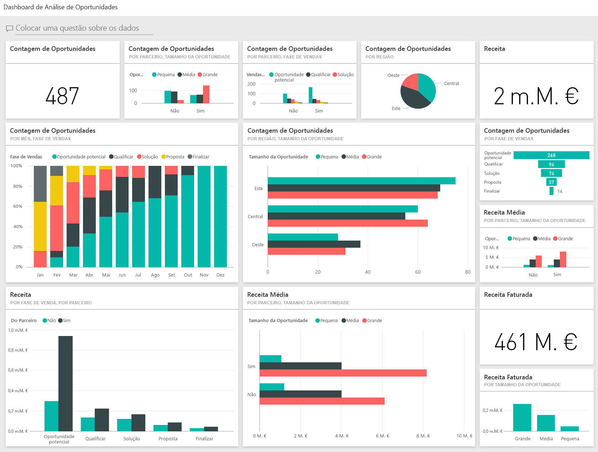
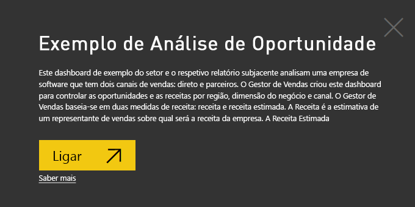

# Exemplo de Análise de Oportunidade do Power BI: veja uma apresentação

O pacote de conteúdos do exemplo da Análise de Oportunidade contém um dashboard, um relatório e um conjunto de dados para uma empresa de software que tem 2 canais de vendas: *direta* e *parceiro*. O gestor de vendas criou este dashboard para controlar as oportunidades e as receitas por região, dimensão do negócio e canal.

Este exemplo baseia-se em duas medidas de receita:

* Receita: a estimativa de um representante de vendas sobre qual será a receita.
* Receita de fatores: Calculada como a percentagem (%) entre a receita x probabilidade e é aceite como sendo uma previsão mais precisa da receita de vendas real. A probabilidade é determinada pela *fase de vendas* atual do negócio:
  * Cliente potencial: 10%  
  * Elegível: 20%  
  * Solução: 40%  
  * Proposta: 60%  
  * Finalizar: 80%

Este exemplo faz parte de uma série que mostra como pode utilizar o Power BI com dados, relatórios e dashboards orientados para negócios. Foi criado com dados reais da [obviEnce](http://www.obvience.com/), que foram mantidos anónimos. Os dados estão disponíveis em vários formatos: pacote de conteúdos, ficheiro .pbix do Power BI Desktop ou livro do Excel. Veja [Exemplos do Power BI](sample-datasets.md). 

Este tutorial explora o pacote de conteúdos do exemplo da Análise de Oportunidade no serviço Power BI. Uma vez que a experiência do relatório é semelhante no Power BI Desktop e no serviço, também pode acompanhar com o ficheiro .pbix de exemplo no Power BI Desktop. 

Não precisa de uma licença do Power BI para explorar os exemplos no Power BI Desktop. Se não tiver uma licença do Power BI Pro, pode guardar o exemplo em A Minha Área de Trabalho no serviço Power BI. 

## Obter o exemplo

Para poder utilizar o exemplo, primeiro tem de transferi-lo como um [pacote de conteúdos](#get-the-content-pack-for-this-sample), um [ficheiro .pbix](#get-the-pbix-file-for-this-sample) ou um [livro do Excel](#get-the-excel-workbook-for-this-sample).

### Obter o pacote de conteúdos para este exemplo

1. Abra o serviço Power BI (app.powerbi.com), inicie sessão e abra a área de trabalho onde quer guardar o exemplo. 

    Se não tiver uma licença do Power BI Pro, pode guardar o exemplo em A Minha Área de Trabalho.

2. No canto inferior esquerdo, selecione **Obter Dados**.

    
3. Na página **Obter Dados** apresentada, selecione **Exemplos**.

4. Selecione **Exemplo da Análise de Oportunidade** e, em seguida, escolha **Ligar**.  

   
5. O Power BI importa o pacote de conteúdos e adiciona um novo dashboard, um relatório e um conjunto de dados à área de trabalho atual.

   

### Obter o ficheiro .pbix para este exemplo

Em alternativa, pode transferir o exemplo de Análise de Oportunidade como um [ficheiro .pbix](https://download.microsoft.com/download/9/1/5/915ABCFA-7125-4D85-A7BD-05645BD95BD8/Opportunity%20Analysis%20Sample%20PBIX.pbix), concebido para utilização com o Power BI Desktop.

### Obter o livro do Excel para este exemplo

Se quiser ver a origem de dados deste exemplo, também está disponível como um [livro do Excel](https://go.microsoft.com/fwlink/?LinkId=529782). O livro contém as folhas do Power View que pode ver e modificar. Para ver os dados não processados, ative os suplementos de Análise de Dados e, em seguida, selecione **Power Pivot > Gerir**. Para ativar os suplementos do Power View e do Power Pivot, veja [Explorar os exemplos do Excel](sample-datasets.md#explore-excel-samples-inside-excel) para obter detalhes.

## O que nos diz o nosso dashboard?
O nosso gestor de vendas criou um dashboard para monitorizar as métricas mais importantes. Quando vê algo interessante, pode selecionar um mosaico para examinar os dados:

- A receita da empresa é de 2 mil milhões de USD e a receita faturada de 461 milhões de USD.
- A contagem de oportunidades e a receita seguem um padrão de funil familiar, com totais que diminuem em cada fase subsequente.
- A maioria de nossas oportunidades são na região leste.
- As grandes oportunidades geram uma receita maior do que as oportunidades pequenas ou médias.
- Os negócios grandes com parceiros geram mais receita: 8 milhões de USD em média em contraste com 6 milhões de USD de vendas diretas.

Uma vez que o esforço necessário para firmar um negócio é o mesmo independentemente de o negócio ser classificado como grande, médio ou pequeno, a nossa empresa deve analisar os dados para saber mais sobre grandes oportunidades.

1. Na área de trabalho onde guardou o exemplo, abra o separador **Dashboards** e, em seguida, localize o dashboard **Exemplo de Análise de Oportunidade** e selecione-o.

2. Selecione o mosaico **Contagem de Oportunidades Controladas por Parceiro, Fase de Vendas** para abrir a primeira página do relatório do Exemplo de Análise de Oportunidade. 

    

## Explore outras páginas no relatório

Veja cada página no relatório ao selecionar os separadores de página na parte inferior.

### Página Descrição Geral de Contagem de Oportunidades

Repare nos seguintes detalhes:
* Leste é a nossa região maior em termos de contagem de oportunidades.  
* No gráfico circular **Contagem de Oportunidades por Região**, selecione cada região à vez para filtrar a página por região. Para cada região, observe que os parceiros procuram significativamente mais oportunidades grandes.   
* O gráfico de colunas **Contagem de Oportunidades Controladas por Parceiro e Tamanho da Oportunidade** mostra que a maioria das grandes oportunidades são controladas por parceiro, enquanto a maioria das pequenas e médias oportunidades não o são.
* No gráfico de barras **Contagem de Oportunidades por Fase de Vendas**, selecione cada **Fase de Vendas** à vez para ver a diferença na contagem regional. Observe que, embora a região Leste tenha a maior contagem de oportunidades, as três regiões nas fases de vendas Solução, Proposta e Finalizar têm contagens comparáveis. Este resultado significa que podemos fechar uma percentagem maior de negócios nas regiões Central e Oeste.

### Página Análise de Receita
Esta página examina de modo semelhante os dados, mas numa perspetiva de receita em vez de contagem.  

Repare nos seguintes detalhes:
* O Leste também é a nossa maior região não apenas na contagem de oportunidades, mas na receita.  
* Se filtrar o gráfico **Receita por Fase de Vendas e Controlada por Parceiro** ao selecionar **Sim** para **Controlada por Parceiro**, verá uma receita de 1,5 mil milhões de USD e uma receita de fatores de 294 milhões de USD. Compare estes valores com 644 milhões e 166 milhões de USD para receita controlada por não parceiros. 
* A receita média para contas grandes é maior com 8 milhões se as oportunidades forem controladas por parceiros, em comparação com 6 milhões relativos a empresas não parceiras.  
* Para parceiros comerciais, a receita média para grandes oportunidades é quase o dobro da das oportunidades de empresas médias.  
* A receita média relativa a pequenas e médias empresas é comparável com parceiros e não parceiros comerciais.   

Claramente, os nossos parceiros estão a fazer um melhor trabalho de venda aos clientes do que os não parceiros. Poderá fazer sentido canalizar mais negócios através dos nossos parceiros.

### Contagem de Oportunidades por Região e Fase
Esta página do relatório apresenta dados semelhantes aos dados na página anterior, mas desagrega-os por região e fase. 

Repare nos seguintes detalhes:
* Se selecionou **Leste** no gráfico circular **Contagem de Oportunidades por Região** para filtrar pela região Leste, verá que as oportunidades nesta região são repartidas quase igualmente entre parceiros e não parceiros.
* As grandes oportunidades são mais comuns na região Central, as pequenas oportunidades são mais comuns na região Leste e as médias oportunidades são mais comuns na região Oeste.

### Página Oportunidades Futuras por Mês
Para esta página, estamos a analisar fatores semelhantes, mas numa perspetiva de data e hora. 
 

A nossa CFO usa esta página para gerir a carga de trabalho. Ao examinar as oportunidades de receita por mês e o nível de vendas, pode efetuar o devido planeamento.

Repare nos seguintes detalhes:
* A receita média para a fase Finalizar é a mais alta. Fechar estes negócios são a prioridade maior.
* Se filtrar por mês (selecionando um mês na segmentação de dados **Mês**) verá que janeiro tem uma grande quantidade de negócios grandes na fase Finalizar com receita de fatores de 75 milhões de USD. Fevereiro, por outro lado, tem principalmente negócios médios nas fases de vendas de Proposta e Solução.
* Em geral, os números de receita faturada flutuam com base no nível de vendas, no número de oportunidades e no tamanho do negócio. Adicione filtros para estes fatores usando o painel **Filtro** à direita para descobrirem mais informações.

## Next steps: Ligar aos seus dados
Aqui pode explorar à vontade, pois pode optar por não guardar as alterações. No entanto, se as guardar, pode sempre aceder a **Obter Dados** para obter uma nova cópia deste exemplo.

Esperamos que esta apresentação tenha mostrado como os dashboards, as Perguntas e Respostas e os relatórios do Power BI podem fornecer informações sobre os dados do exemplo. Agora, é a sua vez: ligue-se aos seus próprios dados. Com o Power BI, pode ligar-se a uma grande variedade de origens de dados. Para saber mais, veja [Introdução ao serviço Power BI](../fundamentals/service-get-started.md).
