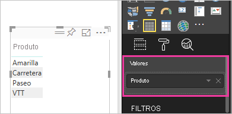
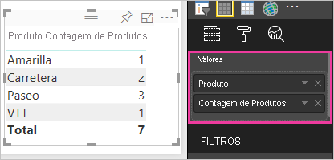

# Trabalhar com agregações (soma, média, etc.) no serviço Power BI

## O que é um agregado?

Por vezes, pode querer combinar matematicamente valores nos seus dados. A operação matemática pode ser uma soma, média, máximo, contagem, etc. O processo de combinar valores nos seus dados denomina-se *agregação*. O resultado dessa operação matemática é um *agregado*.

Quando o serviço Power BI e o Power BI Desktop criam visualizações, podem agregar os seus dados. Muitas vezes, a agregação é exatamente aquilo de que precisa, mas outras vezes poderá querer agregar os valores de outra forma.  Por exemplo, uma soma versus uma média. Existem várias formas diferentes de gerir e alterar a agregação utilizada pelo Power BI numa visualização.

Primeiro, vamos observar os *tipos* de dados, pois são estes que determinam como, e se, o Power BI pode agregá-los.

## Tipos de dados

A maioria das bases de dados tem mais do que um tipo de dados. No nível mais básico, os dados são numéricos ou não numéricos. O Power BI pode agregar dados numéricos através de uma soma, média, contagem, mínimo, desvio, entre muitas outras formas. O serviço pode até agregar dados textuais, frequentemente denominados dados *categóricos*. Se tentar agregar um campo categórico, ao colocá-lo num registo exclusivamente numérico como **Valores** ou **Descrições**, o Power BI poderá contar as ocorrências de cada categoria ou contar as ocorrências diferentes de cada categoria. Os tipos de dados especiais, como as datas, têm algumas opções de agregação exclusivas: mais antiga, mais recente, primeiro e último.

No exemplo abaixo:

- **Unidades Vendidas** e **Preço de Fabrico** são colunas que contêm dados numéricos

- **Segmento**, **País**, **Produto**, **Mês** e **Nome do Mês** contêm dados categóricos

   

Quando for criada uma visualização no Power BI, o serviço irá agregar campos numéricos (a predefinição é *soma*) antes da agregação dos campos categóricos.  Por exemplo, "Unidades Vendidas ***por Produto***", "Unidades Vendidas ***por Mês***" e "Preço de Fabrico ***por Segmento***". O Power BI refere-se a alguns campos numéricos como **medidas**. É fácil identificar medidas no editor de relatórios do Power BI – A lista **Campos** apresenta as medidas juntamente com o símbolo ∑. Para obter mais informações, veja [O editor de relatórios... faça uma visita](service-the-report-editor-take-a-tour.md).

## Por que é que os agregados não funcionam da forma que pretendo?

Trabalhar com agregações no serviço Power BI pode ser confuso. Talvez tenha um campo numérico e o Power BI não permita que altere a agregação. Pode também ter um campo, como um ano, que não pretenda agregar, mas apenas contar o número de ocorrências.

Normalmente, o problema subjacente é a definição de campo no conjunto de dados. Talvez o proprietário do conjunto de dados tenha definido o campo como texto e isso explique por que motivo o Power BI não pode somar ou calcular a média. Infelizmente, [apenas o proprietário do conjunto de dados pode alterar a forma como um campo é categorizado](../transform-model/desktop-measures.md). Por isso, se tiver permissões de proprietário no conjunto de dados, no Power BI Desktop ou no programa que foi utilizado para criar o conjunto de dados (por exemplo, o Excel), pode corrigir este problema. Caso contrário, precisará de contactar o proprietário do conjunto de dados para obter ajuda.  

Existe uma secção especial no final deste artigo, intitulada [**Considerações e resolução de problemas**](#considerations-and-troubleshooting). Este artigo fornece sugestões e orientações. Se não encontrar a resposta aqui, publique a sua pergunta no [fórum de Comunidade do Power BI](https://community.powerbi.com). Obterá uma resposta rápida diretamente da equipa do Power BI.

## Mudar a forma como um campo numérico é agregado

Suponhamos que tem um gráfico que soma as unidades vendidas de produtos diferentes, mas prefere ter a média.

1. Crie um **gráfico de colunas agrupadas** que utilize uma medida e uma categoria. Neste exemplo, estamos a utilizar Unidades Vendidas por Produto.  Por predefinição, o Power BI cria um gráfico que soma as unidades vendidas (arraste a medida para o conjunto de campos **Valor**) de cada produto (arraste a categoria para conjunto de campos **Eixo**).

   

1. No painel **Visualizações**, clique com o botão direito do rato na medida e selecione o tipo de agregação de que necessita. Neste caso, selecionamos **Média**. Se não conseguir ver a agregação de que precisa, veja a secção [**Considerações e resolução de problemas**](#considerations-and-troubleshooting).

   

   > [!NOTE]
   > As opções disponíveis na lista pendente variam de acordo com 1) o campo selecionado e 2) a forma como o proprietário do conjunto de dados categorizou esse campo.

1. Agora, a sua visualização está a utilizar a agregação por média.

   

## Formas de agregar os seus dados

Algumas das opções que podem estar disponíveis para a agregação de um campo:

- **Não resumir**. Com esta opção escolhida, o Power BI trata cada valor nesse campo separadamente e não os resume. Utilize esta opção se tiver uma coluna de ID numérica que o serviço não deve somar.

- **Soma**. Adiciona todos os valores nesse campo para cima.

- **Média**. Usa uma média aritmética dos valores.

- **Mínimo**. Mostra o menor valor.

- **Máximo**. Mostra o maior valor.

- **Contagem (Não em Branco).** Conta o número de valores nesse campo que não estão em branco.

- **Contagem (Distinta).** Conta o número de valores diferentes nesse campo.

- **Desvio-padrão.**

- **Desvio**.

- **Mediana**.  Mostra o valor mediano (meio). Este valor tem o mesmo número de itens acima e abaixo.  Se existirem duas medianas, o Power BI obterá a média delas.

Por exemplo, estes dados:

| País | Montante |
|:--- |:--- |
| EUA |100 |
| REINO UNIDO |150 |
| Canadá |100 |
| Alemanha |125 |
| França | |
| Japão |125 |
| Austrália |150 |

Daria os seguintes resultados:

- **Não Resumir**: Cada valor é apresentado separadamente

- **Soma**: 750

- **Média**: 125

- **Máximo**:  150

- **Mínimo**: 100

- **Contagem (Não em Branco):** 6

- **Contagem (Distinta):** 4

- **Desvio padrão:** 20,4124145...

- **Desvio:** 416,666...

- **Mediana:** 125

## Criar uma agregação com um campo categórico (de texto)

Também pode agregar um campo não numérico. Por exemplo, se tiver um campo com o nome do produto, poderá adicioná-lo como um valor e defini-lo como **Contagem**, **Contagem distinta**, **Primeiro** ou **Último**.

1. Arraste o campo **Produto** para o conjunto de campos **Valores**. O conjunto de campos **Valores** costuma ser utilizado para campos numéricos. O Power BI reconhece que é um campo de texto, define a agregação para **Não resumir** e apresenta-lhe uma tabela de coluna única.

   

1. Se alterar a agregação da predefinição **Não resumir** para **Contagem (Distinta)** , o Power BI contará o número de produtos diferentes. Neste caso, existem quatro.
  
   

1. Se alterar a agregação para **Contagem**, o Power BI contará o número total. Neste caso, existem sete entradas para **Produto**.

   

1. Ao arrastarmos o mesmo campo (neste caso, **Produto**) para o conjunto de campos **Valores** e deixarmos a agregação predefinida como **Não resumir**, o Power BI divide a contagem por produto.

   

## Considerações e Resolução de Problemas

P:  Por que não tenho uma opção de **Não resumir**?

R:  É possível que o campo que selecionou seja uma medida calculada num modelo multidimensional ou uma medida criada no Excel ou no [Power BI Desktop](../transform-model/desktop-measures.md). Cada medida tem a sua própria fórmula codificada. Não pode alterar a agregação utilizada pelo Power BI. Por exemplo, se for uma soma, só poderá ser uma soma. A lista **Campos** mostra as *medidas* com o símbolo de calculadora.

P:  O meu campo **é** numérico, por que é que só tenho as opções de **Contagem** e **Contagem distinta**?

R1:  Provavelmente, tal acontece porque o proprietário do conjunto de dados *não* classificou o campo como um número. Por exemplo, se um conjunto de dados tiver um campo **ano**, o proprietário do conjunto de valores poderá categorizar o valor como texto. É mais provável que o Power BI conte o campo **ano** (por exemplo, o número de pessoas nascidas em 1974). É menos provável que o Power BI efetue a soma ou média. Se for proprietário, pode abrir o conjunto de dados no Power BI Desktop e utilizar o separador **Modelação** para alterar o tipo de dados.

R2: Se o campo tiver um ícone de calculadora, significa que é uma *medida*. Cada medida tem a sua própria fórmula, que apenas o proprietário do conjunto de dados pode alterar. O cálculo que o Power BI utiliza pode ser uma agregação simples, como uma média ou soma. Pode também ser algo mais complexo, como uma "percentagem de contributo para categoria principal" ou um "total desde início do ano". O Power BI não irá somar ou calcular a média dos resultados. Em vez disso, apenas voltará a calcular (com a fórmula codificada) para cada ponto de dados.

R3:  Também é possível que tenha deixado o campo num *registo* que apenas permite valores categóricos.  Nesse caso, as suas únicas opções serão a contagem e a contagem distinta.

R4:  A quarta hipótese é estar a utilizar o campo para um eixo. No eixo de um gráfico de barras, por exemplo, o Power BI mostra uma barra para cada valor distinto; não agrega os valores dos campos.

>[!NOTE]
>A exceção a esta regra são os gráficos de dispersão, que *requerem* valores agregados para os eixos X e Y.

P:  Por que motivo não consigo agregar os campos de texto das origens de dados do SQL Server Analysis Services (SSAS)?

R:  As ligações dinâmicas a modelos multidimensionais do SSAS não permitem agregações do lado do cliente, incluindo as seguintes: primeiro, último, média, mínimo, máximo e soma.

P:  Tenho um gráfico de dispersão e quero que o meu campo *não* agregue.  Como posso fazê-lo?

R:  Adicione o campo ao registo **Detalhes** e não aos registos dos eixos X e Y.

P:  Quando adiciono campos numéricos a uma visualização, a maioria dos mesmos ficam predefinidos como soma, mas outros ficam predefinidos como média, contagem ou outra agregação.  Por que é que a agregação predefinida não é sempre a mesma?

R:  Os proprietários de conjuntos de dados podem predefinir o resumo para cada campo. Se for um proprietário de conjunto de dados, altere o resumo predefinido no separador **Modelação** do Power BI Desktop.

P:  Sou um proprietário de conjunto de dados e quero garantir que um campo nunca é agregado.

R:  No Power BI Desktop, no separador **Modelação**, defina **Tipo de dados** como **Texto**.

P:  Não vejo a opção **Não resumir** na minha lista pendente.

R:  Experimente remover o campo e voltar a adicioná-lo.

Mais perguntas? [Pergunte à Comunidade do Power BI](https://community.powerbi.com/)
