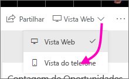
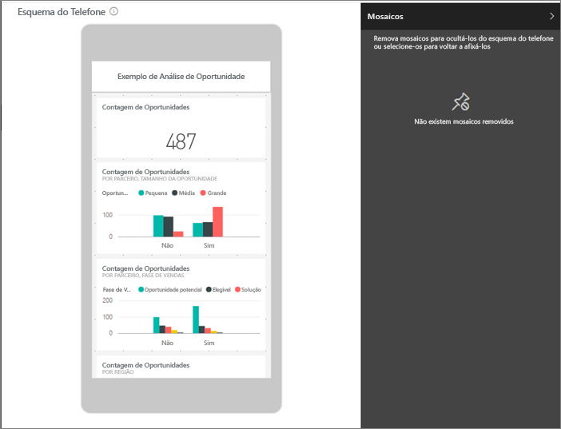
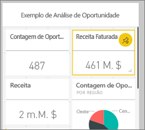
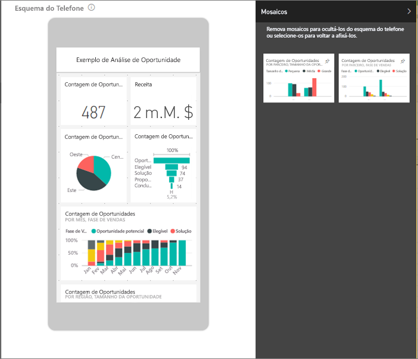
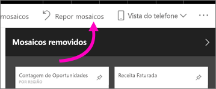

# Otimizar um dashboard para telemóveis – Power BI 
Quando vê dashboards no modo vertical num telemóvel, pode reparar que os mosaicos do dashboard estão dispostos um a seguir ao outro, todos com o mesmo tamanho. No serviço Power BI, pode criar uma vista personalizada de um dashboard, especificamente para o modo vertical em telemóveis. Mesmo que crie uma vista de telemóvel, quando vira o telemóvel de lado, vê o dashboard tal como está disposto no serviço.

Procura informações sobre como ver dashboards num dispositivo móvel? Em alternativa, experimente este início rápido, [Explorar dashboards e relatórios nas aplicações móveis do Power BI](../consumer/mobile/mobile-apps-quickstart-view-dashboard-report.md).

> [!NOTE]
> À medida que edita a vista de telefone, qualquer pessoa que esteja a ver o dashboard num telemóvel pode ver as alterações que faz em tempo real. Por exemplo, se remover todos os mosaicos na vista de telefone do dashboard, o dashboard no telemóvel ficará subitamente sem mosaicos. 
> 
> 

## Create a phone view of a dashboard (Criar uma vista de telefone de um dashboard)
1. No serviço Power BI, abra um dashboard.
2. Selecione a seta junto a **Vista Web** no canto superior direito > selecione **Vista do telefone**.

    

    Se não for o proprietário do dashboard, não verá esta opção.

    

    A vista de edição do dashboard do telefone abre. Aqui, pode remover, redimensionar e reorganizar os mosaicos para se ajustarem à vista do telefone. A versão Web do dashboard não é alterada.

1. Selecione um mosaico para arrastar, redimensionar ou remover o mesmo. Irá reparar que os outros mosaicos saem do caminho à medida que arrasta um mosaico.
   
    
   
    Os mosaicos removidos vão para o painel Mosaicos removidos, onde permanecem, a menos que os adicione novamente.
   
    
2. Se mudar de ideias, selecione **Repor mosaicos** para voltar a colocá-los no tamanho e na ordem em que se encontravam antes.
   
    
   
    Basta abrir a vista de Edição do Telefone no serviço Power BI para alterar ligeiramente o tamanho e a forma dos mosaicos num telemóvel. Por isso, para voltar a colocar o dashboard no estado exato em que estava antes de o abrir na vista de Edição do Telefone, selecione **Repor mosaicos**.
3. Quando estiver satisfeito com o esquema do dashboard do telefone, selecione a seta junto a **Vista do telefone** no canto superior direito > selecione **Vista Web**.
   
    O Power BI guarda automaticamente o esquema do telefone.

## Próximas etapas
* [Criar relatórios otimizados para aplicações de telemóvel do Power BI](desktop-create-phone-report.md)
* [Criar elementos visuais reativos otimizados para qualquer tamanho](../visuals/power-bi-report-visualizations.md)
* Mais perguntas? [Experimente perguntar à Comunidade do Power BI](https://community.powerbi.com/)
