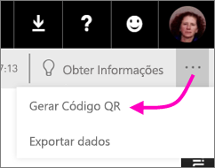
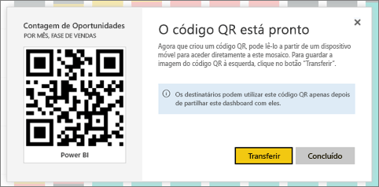

# Criar um código QR para um mosaico no Power BI a utilizar nas aplicações móveis
Os códigos QR no Power BI podem ligar qualquer coisa do mundo real diretamente às informações do BI relacionadas &#151; não é necessária navegação ou pesquisa.

Pode criar um código QR no serviço Power BI para mosaicos em qualquer dashboard, mesmo em dashboards que não pode editar. Em seguida, coloque o código QR num local estratégico. Por exemplo, pode colá-lo num e-mail ou imprimir e colá-lo num local específico. 

Os colegas com quem partilhou o dashboard podem [digitalizar o código QR para aceder ao mosaico diretamente no respetivo dispositivo móvel](../consumer/mobile/mobile-apps-qr-code.md). Podem utilizar o scanner de código QR localizado na aplicação do Power BI ou qualquer outro scanner QR instalado no dispositivo.

## Criar um código QR para um mosaico
1. Abra um dashboard no serviço Power BI.
2. Selecione **Mais opções** (...) no canto superior direito do mosaico e selecione **Modo de detalhe** .
3. Selecione **Mais opções** (...) no canto superior direito e, em seguida, **Gerar código QR**. 
   
    
4. Será apresentada uma caixa de diálogo com o código QR. 
   
    
5. Aqui, pode digitalizar o código QR ou transferir e guardá-lo para: 
   
   * Adicioná-lo a um e-mail ou a outro documento ou 
   * Imprimi-lo e colocá-lo numa localização específica. 

## Imprimir o código QR
O Power BI gera o código QR como um ficheiro JPG pronto para impressão. 

1. Selecione **Transferir** e abra o ficheiro JPG num computador ligado a uma impressora.  
   
   > [!TIP]
   > O ficheiro JPG tem o mesmo nome do mosaico. Por exemplo, "Opportunity Count - by Month, Sales Stage.jpg".
   > 
   > 
2. Imprima o ficheiro em 100% ou "tamanho real".  
3. Recorte o código QR e cole-o num local relevante para o mosaico. 

## Próximos passos
* [Ligar a dados do Power BI do mundo real](../consumer/mobile/mobile-apps-data-in-real-world-context.md) com as aplicações móveis
* [Digitalizar um código QR do Power BI a partir do seu dispositivo móvel](../consumer/mobile/mobile-apps-qr-code.md)
* [Criar um código QR para um relatório](service-create-qr-code-for-report.md)
* Perguntas? [Experimente perguntar à Comunidade do Power BI](https://community.powerbi.com/)
