# Criar um dashboard do Power BI a partir de um relatório
Leu a [Introdução aos dashboards no Power BI](service-dashboards.md) e, agora, quer criar o seu. Existem várias formas diferentes de criar um dashboard. Por exemplo, pode criar um dashboard a partir de um relatório, de raiz, de um conjunto de dados ou ao duplicar um dashboard existente.  

Vamos começar por criar um dashboard, de forma rápida e fácil, que afixe visualizações a partir de um relatório existente. 

Quando concluir este artigo, terá uma boa compreensão sobre:
- A relação entre dashboards e relatórios
- Como abrir a vista de Edição no editor de relatórios
- Como afixar mosaicos 
- Como navegar entre um dashboard e um relatório 
 
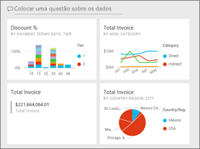

> [!NOTE] 
> Os dashboards são uma funcionalidade do serviço Power BI, não do Power BI Desktop. Apesar de não criar dashboards nas aplicações móveis do Power BI, poderá utilizá-las para [visualização e partilha](../consumer/mobile/mobile-apps-view-dashboard.md).
>
> 

## Vídeo: Criar um dashboard ao afixar elementos visuais e imagens de um relatório
Veja a Amanda a criar um novo dashboard ao afixar visualizações de um relatório. Em seguida, siga os passos na próxima secção, [Importar um conjunto de dados com um relatório](#import-a-dataset-with-a-report), para experimentar por si próprio com o exemplo de Análise de Aprovisionamento.
    

<iframe width="560" height="315" src="https://www.youtube.com/embed/lJKgWnvl6bQ" frameborder="0" allowfullscreen></iframe>

## Importar um conjunto de dados com um relatório
Nestas instruções passo a passo, vamos importar um dos conjuntos de dados de exemplo do Power BI e utilizá-lo para criar o nosso novo dashboard. O exemplo que utilizamos é um livro do Excel com duas folhas do PowerView. Quando o Power BI importar o livro, adiciona um conjunto de dados e um relatório à sua área de trabalho. O relatório é automaticamente criado a partir das folhas do PowerView.

1. Transfira o ficheiro Excel [Exemplo de Análise de Aprovisionamento](https://go.microsoft.com/fwlink/?LinkId=529784). Recomendamos que o guarde no seu OneDrive para Empresas.
2. Abra o serviço Power BI no browser (app.powerbi.com).
3. No painel de navegação, selecione **A Minha Área de Trabalho** e, em seguida, **Obter Dados**.

    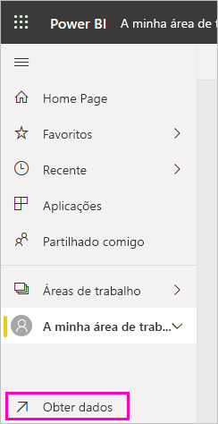
5. Em **Ficheiros**, selecione **Obter**.

   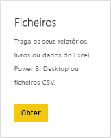
6. Navegue para o local onde guardou o ficheiro de exemplo de Análise de Aprovisionamento do Excel. Selecione-o e selecione **Ligar**.

   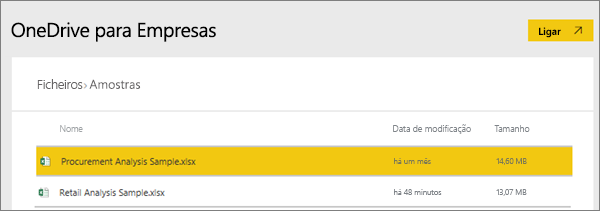
7. Neste exercício, selecione **Importar**.

    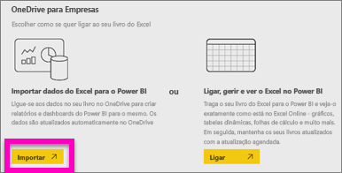
8. Quando for apresentada a mensagem de êxito, selecione o **x** para a dispensar.

   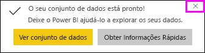

> [!TIP]
> Sabia que? Pode diminuir o painel de navegação ao selecionar o ícone com três linhas na parte superior , o que lhe permite ter mais espaço para o relatório propriamente dito.

### Abrir o relatório e afixar mosaicos no dashboard
1. Na mesma área de trabalho, selecione o separador **Relatórios** e, em seguida, selecione **Exemplo de Análise de Aprovisionamento** para abrir o relatório.

    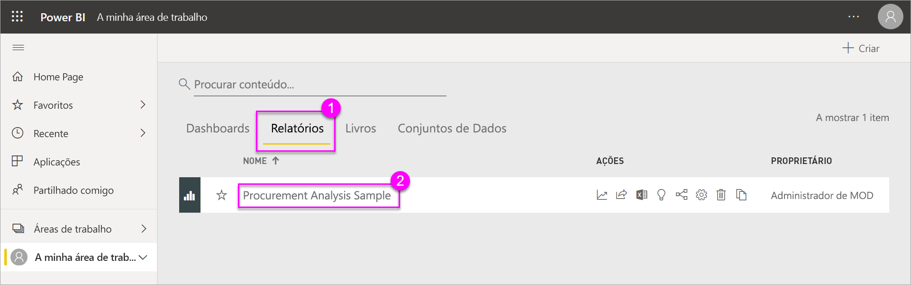 O relatório é aberto na Vista de leitura. Repare que tem dois separadores na parte esquerda: **Discount Analysis** (Análise de Desconto) e **Spend Overview** (Descrição Geral de Gastos). Cada separador representa uma página do relatório.

2. Selecione **Mais opções (...)**  > **Editar relatório** para abrir o relatório na Vista de edição.

    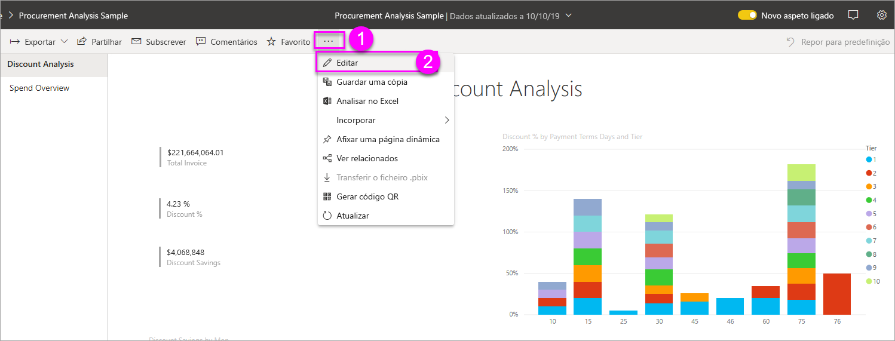
3. Passe o cursor sobre uma visualização para ver as opções disponíveis. Para adicionar uma visualização a um dashboard, selecione o ícone de afixar .

    
4. Visto que estamos a criar um novo dashboard, selecione a opção **Novo dashboard** e atribua um nome ao mesmo.

    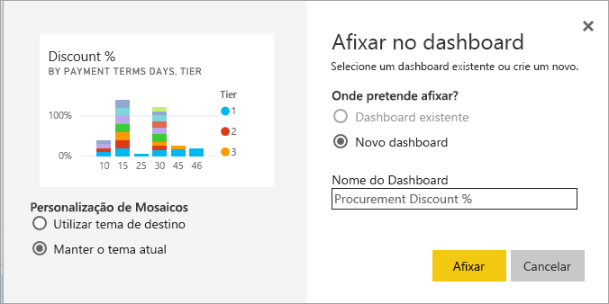
5. Quando selecionar **Afixar**, o Power BI irá criar o novo dashboard na área de trabalho atual. Após a mensagem **Afixado ao dashboard** ser apresentada, selecione **Ir para o dashboard**. Se lhe for pedido que guarde o relatório, selecione **Guardar**.

    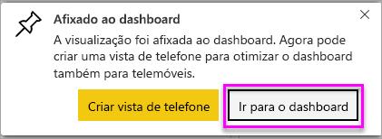

    O Power BI abre o novo dashboard. Tem um mosaico, que é a visualização que afixou.

   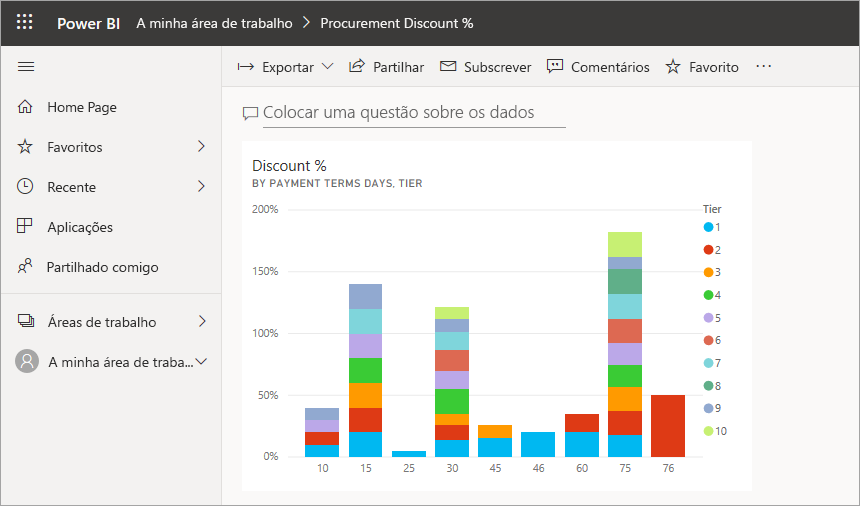
7. Selecione o mosaico para regressar ao relatório. Afixe mais alguns mosaicos ao dashboard. Quando for apresentada a janela **Afixar ao dashboard**, selecione **Dashboard existente**.  

   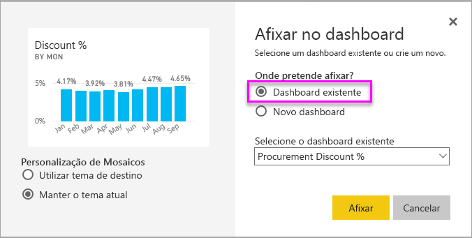

## Afixar uma página de relatório inteira ao dashboard
Em vez de afixar um elemento visual de cada vez, pode [afixar uma página de relatório inteira como um *mosaico dinâmico*](service-dashboard-pin-live-tile-from-report.md). Vamos a isso.

1. No editor de relatórios, selecione o separador **Spend Overview** (Descrição Geral de Gastos) para abrir a segunda página do relatório.

   

2. Queremos todos os elementos visuais do relatório no dashboard. No canto superior direito da barra de menus, selecione **Afixar página dinâmica**. Num dashboard, os mosaicos de página dinâmicos são atualizados sempre que a página é atualizada.

   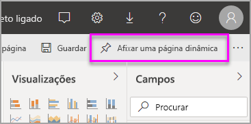

3. Quando for apresentada a janela **Afixar ao dashboard**, selecione **Dashboard existente**.

   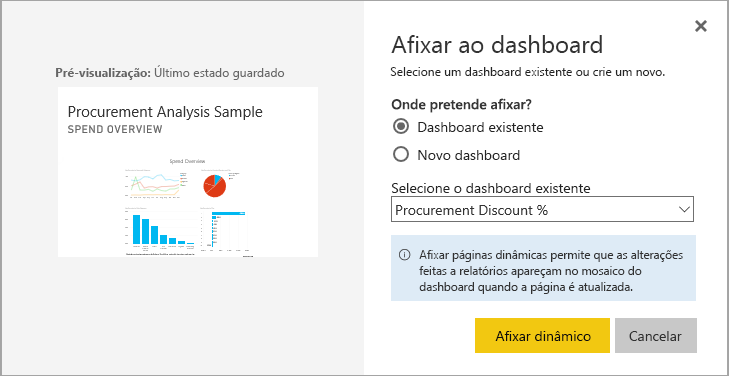

4. Após a mensagem de êxito ser apresentada, selecione **Ir para o dashboard**. Poderá ver aí os mosaicos que afixou a partir do relatório. No exemplo abaixo, afixámos dois mosaicos da primeira página do relatório e um mosaico dinâmico que corresponde à segunda página do relatório.

   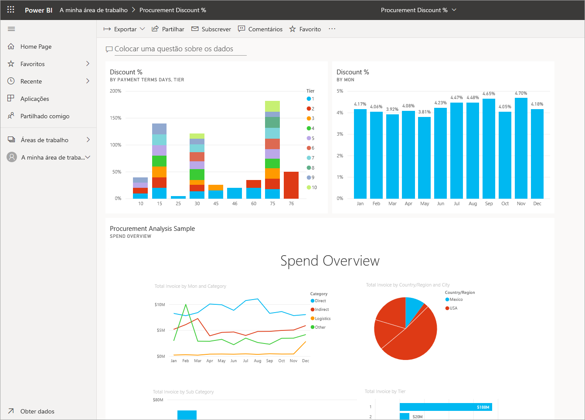

## Próximos passos
Parabéns pela criação do seu primeiro dashboard! Agora que tem um dashboard, pode realizar muitas mais operações com o mesmo. Veja um dos artigos sugeridos abaixo ou comece a explorar de forma autónoma: 

* [Redimensionar e mover mosaicos](service-dashboard-edit-tile.md)
* [Tudo sobre mosaicos de dashboards](service-dashboard-tiles.md)
* [Partilhar o seu dashboard ao criar uma aplicação](../collaborate-share/service-create-workspaces.md)
* [Power BI - Conceitos Básicos](../fundamentals/service-basic-concepts.md)
* [Sugestões para criar um excelente dashboard](service-dashboards-design-tips.md)

Mais perguntas? [Experimente a Comunidade do Power BI](https://community.powerbi.com/).
