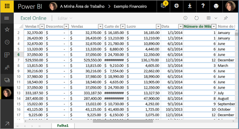
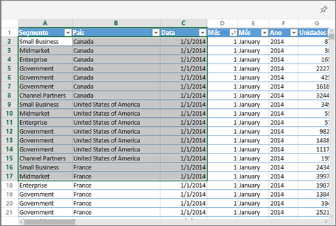
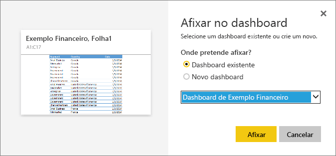
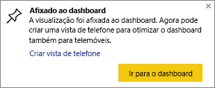
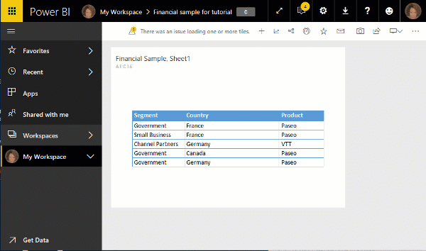

# Pin a tile to a Power BI dashboard from Excel (Afixar um mosaico a um dashboard do Power BI a partir do Excel)
Para poder afixar um mosaico a partir do livro do Excel, primeiro terá de ligar esse livro ao serviço Power BI (app.powerbi.com). Ligar um livro coloca, essencialmente, uma versão só de leitura ligada desse livro no serviço Power BI e permite-lhe afixar intervalos a dashboards. Pode até afixar uma folha de cálculo inteira a um dashboard.  
Se um livro tiver sido partilhado consigo, terá a capacidade de ver os mosaicos afixados pelo proprietário, mas não poderá criar os mosaicos do dashboard. 

Para obter informações aprofundadas sobre como o Excel e o Power BI funcionam em conjunto, veja [Obter dados de ficheiros de livro do Excel](https://go.microsoft.com/fwlink/?LinkID=521962).

Veja o Will a demonstrar várias formas de importar dados de livros do Excel e a ligar a livros do Excel.

<iframe width="560" height="315" src="https://www.youtube.com/embed/l8JoB7w0zJA" frameborder="0" allowfullscreen></iframe>

## Ligar o seu livro do Excel ao Power BI partir do OneDrive para Empresas
Ao escolher **Ligar**, o livro será apresentado no Power BI, exatamente como apareceria no Excel Online. Mas, ao contrário do Excel Online, terá algumas excelentes funcionalidades para ajudá-lo a afixar elementos das suas folhas de cálculo diretamente nos dashboards.

Não é possível editar o livro no Power BI. Mas se precisar de fazer algumas alterações, pode selecionar o ícone de lápis no separador **Livros** da sua área de trabalho e, em seguida, optar por editar o livro no Excel Online ou abri-lo no Excel no seu computador. Todas as alterações efetuadas são guardadas no livro no OneDrive.

1. Carregue o seu livro para o OneDrive para Empresas.

2. No Power BI, [ligue-se a esse livro](../connect-data/service-excel-workbook-files.md) ao selecionar **Obter Dados > Ficheiros > OneDrive – Empresas**  e navegue até à localização onde guardou o ficheiro do Excel. Selecione o ficheiro e escolha **Ligar > Ligar**.

    

3. No Power BI, o livro é adicionado ao separador **Livros** da sua área de trabalho.  O  indica que se trata de um livro do Excel e um asterisco amarelo indica que é novo.
    
    
4. Abra o livro no Power BI, selecionando o nome do livro.

    As alterações feitas ao livro no Power BI não são guardadas e não afetam o livro original no OneDrive para Empresas. Se ordenar, filtrar ou alterar os valores no Power BI, essas alterações não poderão ser guardadas ou afixadas. Se tiver de fazer alterações que serão guardadas, selecione **Editar** no canto superior direito para abri-lo para edição no Excel Online ou no Excel. As alterações efetuadas desta forma podem demorar alguns minutos a atualizar os mosaicos nos dashboards.
   
    

## Afixar um intervalo de células a um dashboard
Uma forma de adicionar um novo [mosaico do dashboard](../consumer/end-user-tiles.md) é a partir de um livro do Excel no Power BI. Os intervalos podem ser afixados a partir de livros do Excel que foram guardados no OneDrive para Empresas ou noutra biblioteca de documentos partilhada pelo grupo. Os intervalos podem conter dados, tabelas, gráficos, Tabelas Dinâmicas, Gráficos Dinâmicos e outras partes do Excel.

1. Realce as células que pretende afixar a um dashboard.
   
    
2. Selecione o ícone  . 
3. Afixe o mosaico a um dashboard existente ou a um novo dashboard. 
   
   * Dashboard existente: selecione o nome do dashboard na lista pendente.
   * Novo dashboard: escreva o nome do novo dashboard.
   
     
4. Selecione **Afixar**. Uma mensagem de Êxito (perto do canto superior direito) informa que o intervalo foi adicionado, como um mosaico, ao dashboard. 
   
    
5. Selecione **Ir para o dashboard**. A partir daqui, pode [mudar o nome, redimensionar, ligar e mover](service-dashboard-edit-tile.md) a visualização afixada. Por predefinição, selecionar o mosaico afixado abre o livro no Power BI.

## Afixar uma tabela ou tabela dinâmica inteira a um dashboard
Siga os passos acima, mas em vez de selecionar um intervalo de células, selecione uma tabela inteira ou uma tabela dinâmica.

Para afixar uma tabela, selecione o intervalo inteiro da tabela e certifique-se de que inclui os cabeçalhos.  Para afixar uma tabela dinâmica, certifique-se de que inclui todas as partes visíveis da tabela dinâmica, incluindo os filtros, caso sejam utilizados.

 

Um mosaico criado a partir de uma tabela ou de uma tabela dinâmica irá mostrar a tabela inteira.  Se adicionar/remover/filtrar linhas ou colunas no livro original, também serão adicionadas/removidas/filtradas no mosaico.

## Ver o livro ligado ao mosaico
Selecionar um mosaico do livro abre o livro ligado no Power BI. Como o ficheiro de livro está localizado no OneDrive para Empresas do proprietário, a visualização do livro exige que tenha permissões de Leitura para o livro. Se não tiver permissão, receberá uma mensagem de erro.  

 

## Considerações e resolução de problemas
Funcionalidades não suportadas: o Power BI utiliza os Serviços do Excel para obter os mosaicos do livro. Por isso, como algumas das funcionalidades do Excel não são suportadas na API REST dos Serviços do Excel, não serão vistas nos mosaicos no Power BI. Por exemplo: gráficos Sparkline, formatação condicional de conjunto de ícones e segmentação de dados de tempo. Para obter uma lista completa das funcionalidades não suportadas, veja [Funcionalidades Não Suportadas na API REST dos Serviços do Excel](https://msdn.microsoft.com/library/office/ff394477.aspx)

## Próximas etapas
[Partilhar um dashboard que contém ligações para um livro do Excel](../collaborate-share/service-share-dashboard-that-links-to-excel-onedrive.md)

[Obter dados de livros do Excel](../connect-data/service-excel-workbook-files.md)

Mais perguntas? [Pergunte à Comunidade do Power BI](https://community.powerbi.com/)
