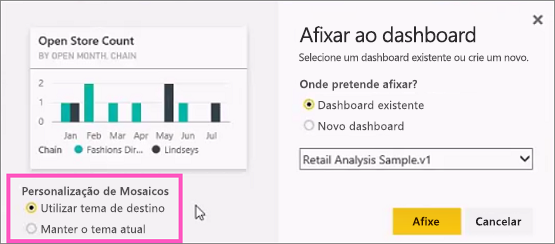
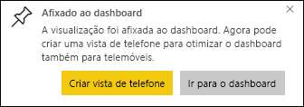

# Afixar um mosaico a um dashboard do Power BI a partir de um relatório

Uma forma de adicionar um [mosaico de dashboard](../consumer/end-user-tiles.md) é a partir de um [relatório do Power BI](../consumer/end-user-reports.md). Quando seleciona um destes mosaicos, o mesmo é aberto no relatório.

É possível afixar uma página de relatório inteira num dashboard, que se designa por afixar um mosaico *dinâmico*. É denominado mosaico dinâmico porque é possível interagir com o mosaico no dashboard. Ao contrário dos mosaicos de visualização individual, as alterações feitas no relatório são sincronizadas automaticamente com o dashboard. Para obter mais informações, veja [Afixar uma página de relatório inteira](#pin-an-entire-report-page).

Não é possível afixar mosaicos de relatórios que tenham sido partilhados consigo ou do Power BI Desktop. 

> [!TIP]
> Como algumas visualizações utilizam imagens de fundo, poderá não ser possível afixar se a imagem de fundo for muito grande. Tente reduzir o tamanho da imagem ou utilizar a compressão de imagem.  
> 
> 

## Afixar um mosaico a partir de um relatório
Veja a Amanda criar um dashboard ao afixar elementos visuais e imagens a partir de um relatório do Power BI.
    

<iframe width="560" height="315" src="https://www.youtube.com/embed/lJKgWnvl6bQ" frameborder="0" allowfullscreen></iframe>

Agora, crie o seu próprio dashboard através de um dos relatórios de exemplo do Power BI.

1. No relatório, paire o cursor sobre a visualização que pretende afixar e selecione o ícone de afixar. . O Power BI abre o ecrã **Afixar no dashboard**.
   
     
2. Selecione se quer afixar num dashboard existente ou num novo.
   
   * **Dashboard existente**: selecione o nome do dashboard a partir da lista pendente. Os dashboards partilhados consigo não serão apresentados na lista pendente.
   * **Novo dashboard**: escreva o nome do novo dashboard.
3. Em alguns casos, o item que está a afixar poderá ter um *tema* já aplicado. Por exemplo, os elementos visuais afixados a partir de um livro do Excel. Nesse caso, selecione o tema a aplicar ao mosaico.
4. Selecione **Afixar**.
   
   Uma mensagem de êxito (perto do canto superior direito) informa que a visualização foi adicionada, como um mosaico, ao dashboard.
   
   
5. No painel de navegação, selecione o dashboard com o novo mosaico. [Edite a apresentação e o comportamento do mosaico](service-dashboard-edit-tile.md) ou selecione o mosaico para regressar ao relatório.

## Afixar uma página de relatório inteira
Também é possível afixar uma página de relatório inteira num dashboard, o que torna mais fácil afixar mais de uma visualização de cada vez. Quando afixa uma página inteira, os mosaicos são *dinâmicos*. Isto significa que pode interagir com os mesmos no dashboard. As alterações feitas a qualquer uma das visualizações no editor de relatórios, como adicionar um filtro ou alterar os campos utilizados no gráfico, também são refletidas no mosaico do dashboard.  

Para obter mais informações, veja [Afixar uma página de relatório inteira](service-dashboard-pin-live-tile-from-report.md).

## Próximos passos
- [Dashboards para consumidores do serviço Power BI](../consumer/end-user-dashboards.md)
- [Mosaicos do dashboard no Power BI](../consumer/end-user-tiles.md)
- [Relatórios no Power BI](../consumer/end-user-reports.md)
- [Atualização de dados no Power BI](../connect-data/refresh-data.md)
- [Conceitos básicos para designers no serviço Power BI](../fundamentals/service-basic-concepts.md)

Mais perguntas? [Pergunte à Comunidade do Power BI](https://community.powerbi.com/)
