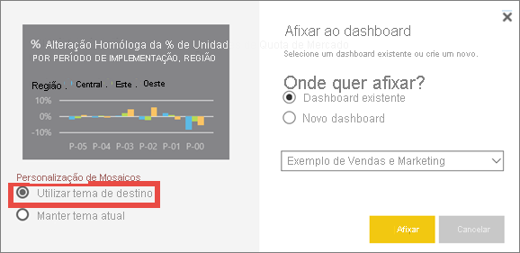

# <a name="use-dashboard-themes-in-the-power-bi-service"></a>Utilizar os temas de dashboard no serviço Power BI
Com os **temas de dashboard**, pode aplicar um tema de cores a todo o dashboard, como cores empresariais, cores sazonais ou qualquer outro tema de cores que pretenda aplicar. Quando aplica um tema de dashboard, todos os elementos visuais no dashboard utilizam as cores do tema selecionado. Aplicam-se algumas exceções, descritas na secção [Considerações e limitações](#considerations-and-limitations) deste artigo.


Alterar as cores dos elementos visuais do relatório no dashboard não afeta os elementos visuais no relatório associado. Além disso, ao afixar mosaicos de um relatório que já tem um [tema de relatório aplicado](desktop-report-themes.md), pode optar por manter o tema atual ou utilizar o tema do dashboard.


## <a name="prerequisites"></a>Pré-requisitos
* Para acompanhar, abra o [dashboard de exemplo de Vendas e Marketing](sample-datasets.md).


## <a name="how-dashboard-themes-work"></a>Como funcionam os temas de dashboard
Para começar, abra um dashboard criado por si ou que possa editar. Selecione **Editar** > **Tema de dashboard**. 


No painel do dashboard apresentado, selecione um dos temas pré-criados.  No exemplo abaixo, selecionámos **Escuro**.


## <a name="create-a-custom-theme"></a>Criar um tema personalizado

O tema predefinido para os dashboards do Power BI é **Claro**. Se quiser personalizar as cores ou criar o seu próprio tema, selecione **Personalizar** no menu pendente. 


Utilize as opções de personalização para criar o seu próprio tema do dashboard. Se adicionar uma imagem de fundo, recomendamos que a sua imagem tenha uma resolução mínima de 1920x1080. Para utilizar uma imagem como fundo, carregue a imagem para um site público, copie o URL e cole-o no campo **URL da imagem**. 

## <a name="use-a-json-theme"></a>Utilizar um tema JSON
Outra forma de criar um tema personalizado é carregar um ficheiro JSON que tenha definições para todas as cores que pretende utilizar no seu dashboard. No Power BI Desktop, os criadores de relatórios utilizam ficheiros JSON para [criar temas para relatórios](desktop-report-themes.md). Pode carregar estes ficheiros JSON para dashboards ou encontrar e carregar ficheiros JSON a partir da [Página da galeria de temas](https://community.powerbi.com/t5/Themes-Gallery/bd-p/ThemesGallery) na Comunidade do Power BI. 


Também pode guardar o seu tema personalizado como um ficheiro JSON e, em seguida, partilhá-lo com outros criadores de dashboards. 

### <a name="use-a-theme-from-the-theme-gallery"></a>Utilizar um tema da Galeria de Temas

Tal como as opções personalizadas e incorporadas, ao carregar um tema, as cores são automaticamente aplicadas em todos os mosaicos no dashboard. 

1. Paire o cursor sobre um tema e selecione **View report (Ver relatório)**.

    

2. Desloque-se para baixo e procure a ligação para o ficheiro JSON.  Selecione o ícone de transferência e guarde o ficheiro.

    

3. No serviço Power BI, na janela Personalizar tema do dashboard, selecione **Carregar tema JSON**.

    

4. Navegue até à localização onde guardou o ficheiro do tema JSON e selecione **Abrir**.

5. Na página Tema do dashboard, selecione **Guardar**. O novo tema é aplicado ao seu dashboard.

    

## <a name="reports-and-dashboards-with-different-themes"></a>Relatórios e dashboards com temas diferentes

Na maioria dos casos, se o relatório utilizar um tema diferente do tema do dashboard, pode controlar se o elemento visual mantém o tema atual do relatório ou utiliza o tema do dashboard. No entanto, os elementos visuais de cartão nos dashboards utilizam a família do tipo de letra "DIN", com texto preto. Pode alterar a cor do texto para todos os mosaicos num dashboard, incluindo os cartões, ao criar um tema de dashboard personalizado.

- Quando afixar um mosaico a um dashboard, para manter o tema do relatório, selecione **Manter o tema atual**. O elemento visual no dashboard irá manter o tema do relatório, incluindo as definições de transparência.

    Só verá as opções de **Personalização de Mosaicos** se tiver criado o relatório no Power BI Desktop, [adicionado um tema de relatório](desktop-report-themes.md) e, em seguida, publicado o relatório no serviço Power BI.

    

- Experimente afixar novamente o mosaico e selecionar **Utilizar tema do dashboard**.

    

## <a name="dashboard-theme-json-file-format"></a>Formato de ficheiro JSON do tema de dashboard

No seu nível mais básico, o ficheiro JSON de temas tem apenas uma linha necessária: **name**.

```json
{
    "name": "Custom Theme"
}
```

Além de **name**, tudo o resto é opcional. Pode adicionar apenas as propriedades que pretende formatar especificamente para o ficheiro de temas e continuar a utilizar as predefinições do Power BI para o resto.

O ficheiro JSON para os temas de dashboard inclui:

- name: o nome do tema, (único campo obrigatório).
- foreground e background: cores do dashboard.
- dataColors: uma lista de código hexadecimal para utilizar nos dados de gráficos. Pode incluir a quantidade de cores que pretender.
- tiles: configurações de cores e fundo dos dashboards.
- visualStyles: formatação granular para elementos visuais.

Eis o exemplo de um JSON para o tema Claro predefinido:

```json
{

"name":"Light",

"foreground":"#000000",

"background":"#EAEAEA",

"dataColors":["#01B8AA","#374649","#FD625E","#F2C80F","#5F6B6D","#8AD4EB","#FE9666","#A66999"],

"tiles":{"background":"#FFFFFF","color":"#000000"},

"visualStyles":{"*":{"*":{"*":[{"color":{"solid":{"color":"#000000"}}}]}}}

}
```

## <a name="considerations-and-limitations"></a>Considerações e limitações

* Não pode aplicar os temas de dashboard a páginas de relatórios dinâmicos afixados, mosaicos de iFrame, mosaicos de SSRS, mosaicos de livros ou imagens.
* Verá os temas de dashboard em dispositivos móveis, mas apenas pode criar um tema de dashboard no serviço Power BI.
* Os temas de dashboard personalizados só funcionam com mosaicos afixados a partir de relatórios.

## <a name="next-steps"></a>Passos seguintes

- [Aplicar temas a relatórios](desktop-report-themes.md)
