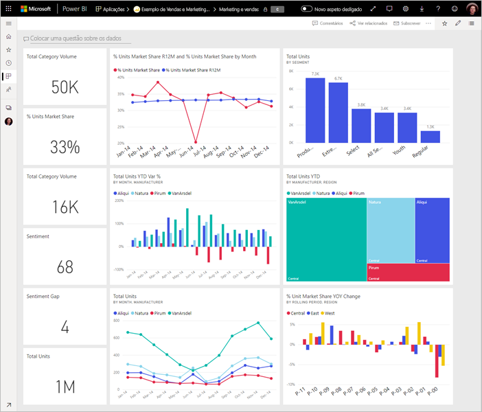
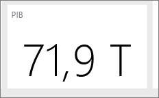

# Tips for designing a great Power BI dashboard (Sugestões para criar um dashboard excelente no Power BI)
Agora que já criou um dashboard e adicionou alguns mosaicos, pense em como tornar o dashboard não apenas bonito, mas também funcional. Em geral, significa destacar as informações mais importantes e torná-las claras e organizadas.

> [!TIP]
> Gosta deste dashboard? Pode transferi-lo, assim como os relatórios relacionados, a partir do AppSource. Aceda a **Obter dados** > **Serviços**. Procure **Exemplo Microsoft - Vendas e Marketing** > **Obter agora**.

Eis algumas sugestões para dashboards.

## Vídeo de melhores práticas de estrutura de dashboards

Veja este vídeo, [Dashboard design best practices in Power BI](https://www.youtube.com/watch?v=-tdkUYrzrio) (Melhores práticas de estrutura de dashboards no Power BI), para obter sugestões de design de Marco Russo da SQLBI.com.

## Considerar o público-alvo
Quais são as principais métricas que ajudarão a tomar decisões? Como será utilizado o dashboard? Que suposições aprendidas ou culturais podem afetar as opções de design? De que informações o público-alvo precisa para ser bem-sucedido?

Não se esqueça de que um dashboard é uma descrição geral, um local para monitorizar o estado atual dos dados. O dashboard é baseado em conjuntos de dados e relatórios subjacentes, e costumam conter muitos detalhes. Os leitores podem explorar os relatórios a partir do seu dashboard. Por esse motivo, não coloque detalhes no dashboard, a menos que seja o que os leitores precisam de monitorizar.

Onde será apresentado o dashboard? Se for apresentado num monitor grande, pode colocar mais conteúdos. No entanto, se os leitores o virem num tablet, um dashboard com menos mosaicos é mais legível.

## Contar uma história num ecrã
Uma vez que os dashboards devem mostrar informações importantes rapidamente, é melhor ter todos os mosaicos num único ecrã. Pode evitar barras de deslocamento no seu dashboard?

O dashboard está muito confuso?  Remova tudo exceto as informações essenciais que podem ser facilmente lidas e interpretadas.

## Utilizar o modo de ecrã inteiro
Ao apresentar um dashboard, mostre-o em [modo de ecrã inteiro](../consumer/end-user-focus.md), sem distrações.

## Destacar as informações mais importantes
Se o texto e as visualizações no dashboard forem do mesmo tamanho, os leitores terão dificuldade em se concentrar no que é mais importante. Por exemplo, as visualizações de cartão são uma boa forma de apresentar um número importante em destaque:  

Mas não se esqueça de fornecer contexto.  

Saiba mais sobre [criar um mosaico apenas com um número](../visuals/power-bi-visualization-card.md).

## Colocar as informações mais importantes
A maioria das pessoas lê de cima para baixo. Por isso, deve colocar os dados mais importantes no canto superior esquerdo e mostrar mais detalhes à medida que avança na direção que a audiência utiliza para ler (da esquerda para a direita, de cima para baixo).

## Utilizar a visualização certa para os dados
Evite várias visualizações.  As visualizações devem ter uma visão geral e serem fáceis de "ler" e interpretar.  Para alguns dados e visualizações, uma visualização gráfica simples é suficiente. No entanto, outros dados podem exigir uma visualização mais complexa. Certifique-se de que utiliza títulos, etiquetas e outras personalizações para ajudar o leitor.  

* Tenha cuidado ao utilizar elementos visuais que parecem atrativos mas são difíceis de ler, como gráficos 3D. 
* Pode ser uma desilusão saber que os gráficos circulares, gráficos em anel, medidores e outros tipos de gráficos circulares não são uma melhor prática da visualização de dados. Os gráficos circulares são recomendados se tiverem menos de oito categorias. Uma vez que os humanos não conseguem comparar valores lado a lado, é mais difícil comparar valores num gráfico circular do que em gráficos de barras e colunas. Os gráficos circulares pode ser bons para ver relações de parte a um todo em vez de comparar as partes. Os gráficos de medidor são ótimos para apresentar o estado atual no contexto de um objetivo.
* Seja consistente com escalas de gráfico de eixos, ordenação da dimensão do gráfico e também com as cores utilizadas para os valores de dimensão nos gráficos.
* Certifique-se de que codifica corretamente os dados quantitativos. Não exceda três ou quatro dígitos quando apresentar números. Apresente medidas com um ou dois números à esquerda da vírgula decimal e escala de milhares ou milhões, ou seja 3,4 milhões e não 3 400 000.
* Não misture os níveis de precisão e tempo. Certifique-se de que os períodos de tempo são bem compreendidos. Não é necessário um gráfico com o mês passado ao lado de gráficos filtrados de um determinado mês do ano.
* Não misture medidas grandes e pequenas na mesma escala, como um gráfico de linhas ou de barras. Por exemplo, uma medida pode estar em milhões e outras medidas em milhares. Com uma escala grande, seria difícil ver as diferenças da medida que está em milhares. Se precisar de combinar, escolha uma visualização que permita a utilização de um segundo eixo.
* Não sobrecarregue os gráficos com etiquetas de dados desnecessárias. Os valores em gráficos de barras são normalmente compreendidos sem apresentar o número real.
* Preste atenção a como [os gráficos são ordenados](../consumer/end-user-change-sort.md). Se quiser chamar a atenção para o número mais alto ou mais baixo, ordene pela medida. Se quiser que as pessoas localizem rapidamente uma categoria específica de entre muitas outras categorias, ordene pelo eixo.  

Para obter instruções específicas de visualização, consulte [Tipos de visualização no Power BI](../visuals/power-bi-visualization-types-for-reports-and-q-and-a.md).  

## Saiba mais sobre o design de dashboards
Para dominar a arte da excelente criação de dashboards, considere aprender os Princípios básicos de Gestalt de percepção visual e como comunicar claramente as informações acionáveis no contexto. Felizmente, existe um número infinito de recursos já amplamente disponíveis e espalhados nos nossos blogues. Alguns dos nossos livros favoritos incluem:

* *Information Dashboard Design* de Stephen Few  
* *Show Me the Numbers* de Stephen Few  
* *Now You See It* de Stephen Few  
* *Envisioning Information* de Edward Tufte  
* *Advanced Presentations* by Design de Andrew Abela   

## Próximas etapas
[Criar um dashboard a partir de um relatório](service-dashboard-create.md)  
[Conceitos básicos para designers no serviço Power BI](../fundamentals/service-basic-concepts.md)  
Mais perguntas? [Pergunte à Comunidade do Power BI](https://community.powerbi.com/)
