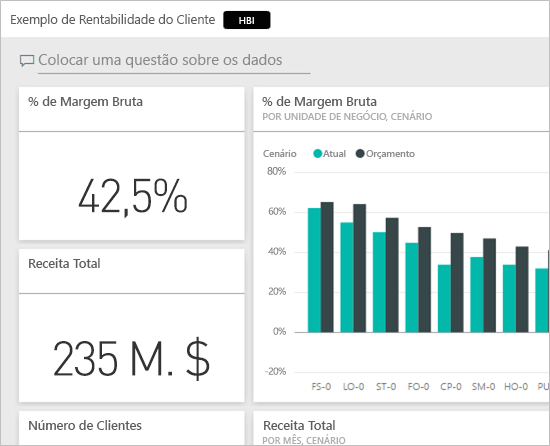
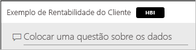
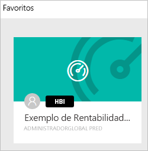
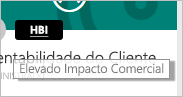
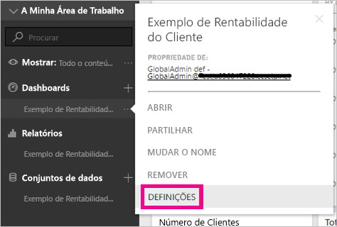
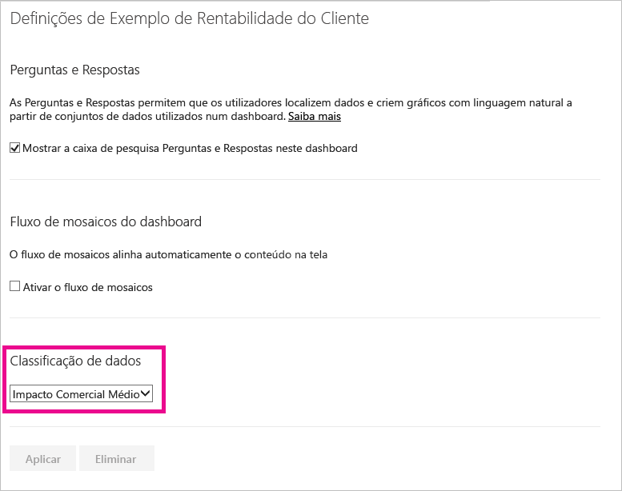
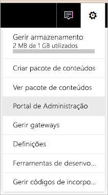
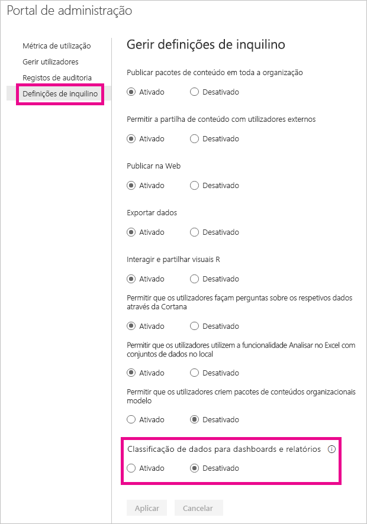
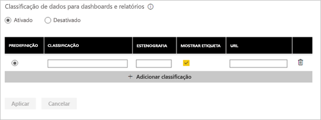
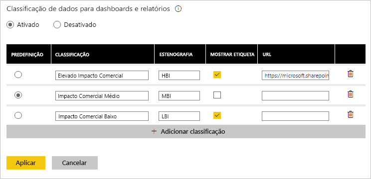

# Classificação de dados dos dashboards
Todos os dashboards são diferentes e, consoante a origem de dados à qual se está a ligar, é provável que o utilizador e os colegas com quem partilha tenham de tomar diferentes precauções, dependendo da confidencialidade dos dados. Alguns dashboards nunca devem ser partilhados com pessoas externas à empresa nem imprimidos. Outros podem ser livremente partilhados. Ao utilizar a classificação de dados de dashboard, poderá sensibilizar as pessoas que virem os seus dashboards sobre o nível de segurança a empregar. Pode marcar os seus dashboards com classificações definidas pelo departamento de TI da sua empresa, para que todas as pessoas a ver os conteúdos tenham o mesmo nível de compreensão sobre a confidencialidade dos dados.

## Etiquetas de classificação de dados
As etiquetas de classificação de dados aparecem junto ao nome do dashboard, para que qualquer pessoa a visualizá-lo saiba o nível de segurança que deve ser aplicado ao dashboard e aos respetivos dados.

Também aparecerá junto ao mosaico do dashboard na sua lista de Favoritos.

Quando passar o cursor sobre a etiqueta, irá ver o nome completo da classificação.

Os administradores também podem definir um URL de uma etiqueta para fornecer mais informações.

> [!NOTE]
> Consoante as definições de classificação definidas pelo seu administrador, alguns tipos de classificação poderão não ser apresentados como uma etiqueta no dashboard. Se for um proprietário de dashboard, pode sempre ver o tipo de classificação do dashboard nas definições de dashboard.
> 
> 

## Definir a classificação de um dashboard
Se a classificação de dados estiver ativada na sua empresa, todos os dashboards começam com um tipo predefinido de classificação mas, enquanto proprietário do dashboard, pode alterar a classificação para corresponder ao nível de segurança do seu dashboard.

Para alterar o tipo de classificação, faça o seguinte:

1. Aceda às definições do dashboard ao selecionar as **reticências** junto ao nome do dashboard e selecionar **Definições**.
   
    
2. Em Definições do dashboard, poderá ver a classificação atual do seu dashboard e utilizar o menu pendente para alterar o tipo de classificação.
   
    
3. Selecione **Aplicar** quando concluir.

Após aplicar a alteração, qualquer pessoa com quem tiver partilhado irá ver a atualização da próxima vez que atualizar o dashboard.

## Trabalhar com etiquetas de classificação de dados como administrador
A classificação de dados é configurada pelo administrador global da sua organização. Para ativar a classificação de dados, faça o seguinte:

1. Selecione a engrenagem das definições e selecione **Portal de Administração**.
   
    
2. Deixe a opção **Classificação de dados para dashboards e relatórios** *ativada* no separador **Definições de inquilino**.
   
    

Depois de ativar, será apresentado um formulário para criar as diversas classificações na sua organização.

Cada classificação tem um **nome** e uma **abreviatura** que aparecerão no dashboard. Para cada classificação, pode decidir se a etiqueta abreviada irá aparecer no dashboard ou não ao selecionar **Mostrar etiqueta**. Se decidir não mostrar o tipo de classificação no dashboard, o proprietário continuará a conseguir ver o tipo ao consultar as definições do dashboard. Além disso, pode optar por adicionar um **URL** que contenha mais informações sobre as diretrizes de classificação e requisitos de utilização da sua organização.  

A última coisa a decidir é qual o tipo de classificação predefinido.  

Após preencher o formulário com os seus tipos de classificação, selecione **Aplicar** para guardar as alterações.

Nesta fase, todos os dashboards serão atribuídos à classificação predefinida. Os proprietários do dashboard podem agora atualizar o tipo de classificação para o que for mais adequado aos respetivos conteúdos. Pode regressar a este local posteriormente para adicionar ou remover tipos de classificação ou alterar a predefinição.  

> [!NOTE]
> Há alguns elementos importantes a ter em conta quando regressar para efetuar alterações:
> 
> * Se desativar a classificação de dados, as etiquetas não serão memorizadas. Terá de começar do início se decidir ativá-la posteriormente.  
> * Se remover um tipo de classificação, os dashboards que tenham recebido o tipo de classificação removido voltarão à predefinição até que o proprietário o defina novamente.  
> * Se alterar a predefinição, todos os dashboards que ainda não tenham recebido um tipo de classificação pelo proprietário serão alterados para a nova predefinição.
> 
> 

