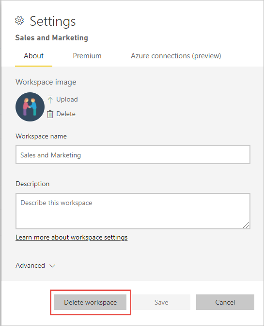

# Eliminar praticamente qualquer elemento no serviço Power BI
Este artigo mostra como eliminar um dashboard, relatório, livro, conjunto de dados, aplicação, visualização e área de trabalho no serviço Power BI. Pode eliminar praticamente qualquer elemento do serviço Power BI, com algumas exceções. 

## Eliminar um dashboard, relatório, conjunto de dados ou livro

1. Na sua área de trabalho, selecione o separador **Todos**.
1. Selecione **Mais opções (...)** ao lado do recurso que pretende eliminar e selecione **Eliminar**.

    

1. Selecione **Eliminar** para confirmar a eliminação.

## Remover uma aplicação da sua página de lista de aplicações

Pode remover facilmente aplicações da sua página da lista de aplicações. A eliminação de uma aplicação não a eliminará para outros membros. Apenas um administrador, um membro ou uma área de trabalho podem eliminar permanentemente uma aplicação dessa área de trabalho.

1. No painel de navegação, selecione **Aplicações** para abrir a página de lista de aplicações.
2. Passe o cursor sobre a aplicação para eliminar e selecione o ícone Eliminar :::image type="icon" source="media/service-delete/power-bi-delete-report2.png" border="false":::.

   

   Se remover uma aplicação acidentalmente, terá diversas opções para recuperá-la.  Pode pedir ao criador da aplicação que volte a enviá-la, pode procurar o e-mail original com a ligação para a aplicação, pode ver o seu [Centro de notificações](../consumer/end-user-notification-center.md) para saber se a notificação dessa aplicação ainda aparece na lista ou pode consultar o [AppSource da sua organização](../consumer/end-user-apps.md).

## Remover ou eliminar uma área de trabalho

O Power BI tem dois tipos diferentes de áreas de trabalho: as áreas de trabalho originais ou *clássicas* e as novas. Os processos para as remover ou eliminar são diferentes. Leia mais sobre as [áreas de trabalho novas e clássicas](../collaborate-share/service-new-workspaces.md).

### Remover membros de uma área de trabalho nova

Apenas os administradores da área de trabalho podem remover pessoas de uma área de trabalho nova. Se for administrador, poderá remover-se a si próprio ou a qualquer outra pessoa. No entanto, se for o único administrador de uma área de trabalho, o Power BI não o deixará remover-se a si próprio.

1. Na vista de lista da área de trabalho, selecione **Acesso** no canto superior direito.

    :::image type="content" source="media/service-delete/power-bi-select-access.png" alt-text="Captura de ecrã a mostrar a seleção de Acesso.":::

1. No painel **Acesso** , selecione **Mais opções (…)** ao lado do nome da pessoa que pretende remover e selecione **Remover**.

    :::image type="content" source="media/service-delete/power-bi-access-remove.png" alt-text="Captura de ecrã a mostrar a seleção de Remover no painel Acesso.":::

### Eliminar uma nova área de trabalho

Ao criar uma das *novas áreas de trabalho* , não irá criar um grupo do Microsoft 365 associado. Se for administrador de uma área de trabalho, poderá eliminar uma nova área de trabalho sem causar efeitos em quaisquer grupos do Microsoft 365. Leia mais sobre as [áreas de trabalho novas e clássicas](../collaborate-share/service-new-workspaces.md).

Como administrador de uma área de trabalho, pode eliminá-la ou remover outras pessoas da mesma. Quando a eliminar, a aplicação associada também é eliminada para todos os membros do grupo e removida do seu AppSource. 

1. No painel de navegação, selecione **Áreas de trabalho**

2. Selecione **Mais opções** (…) à direita da área de trabalho a ser eliminada e selecione **Definições da área de trabalho**.

    

3. No painel **Definições da área de trabalho** , selecione **Eliminar área de trabalho** > **Eliminar**.

### Remover uma área de trabalho clássica da lista

Se já não quiser ser membro de uma área de trabalho clássica, pode * *_sair_* _ e esta será removida da sua lista. Sair de uma área de trabalho deixa-a no local para todos os restantes membros da área de trabalho.  

> [!NOTE]
> Se for o único administrador da área de trabalho, o Power BI não permitirá que saia.
>

1. Comece na área de trabalho cujo nome quer remover.

2. No canto superior direito, selecione *Mais opções* * (…) e selecione **Sair da área de trabalho** > **Sair**.

      :::image type="content" source="media/service-delete/power-bi-leave-workspace.png" alt-text="Captura de ecrã a mostrar o menu Mais opções, Sair da área de trabalho.":::

   > [!NOTE]
   > As opções que vê no menu pendente variam consoante seja Administrador ou Membro dessa área de trabalho.
   >

### Eliminar uma área de trabalho clássica

> [!WARNING]
> Ao criar uma área de trabalho *clássica* , estará também a criar um grupo do Microsoft 365. Ao eliminar uma área de trabalho clássica, estará também a eliminar um grupo do Microsoft 365. Este grupo também será eliminado de outros produtos do Microsoft 365, como o SharePoint e o Microsoft Teams.
> 

Eliminar uma área de trabalho é diferente de sair de uma área de trabalho. Tem de ser administrador da área de trabalho para a eliminar. Quando a eliminar, a aplicação associada também é eliminada para todos os membros do grupo e removida do AppSource. No entanto, se for o único administrador de uma área de trabalho, o Power BI não o deixará remover-se a si próprio.

1. No painel de navegação, selecione **Áreas de trabalho**.

2. Ao lado da área de trabalho a ser eliminada, selecione **Mais opções (…)**  > **Definições da área de trabalho**.

    

3. No painel de **definições** , selecione **Eliminar área de trabalho** e selecione **Eliminar** para confirmar.

    

## Considerações e limitações

- Remover um *dashboard* não irá eliminar o conjunto de dados subjacente nem os relatórios associados a esse dashboard.
- Se for o *proprietário de um painel ou relatório* , poderá removê-lo. Se o partilhou com colegas, removê-lo da sua área de trabalho do Power BI também o irá remover das áreas de trabalho do Power BI deles.
- Se um *dashboard ou relatório for partilhado consigo* , não poderá removê-lo.
- Eliminar um relatório não elimina o conjunto de dados no qual o relatório se baseia.  Todas as visualizações que afixou num dashboard do relatório também estarão seguras. Permanecem no dashboard até que as elimine individualmente.
- Pode eliminar um *conjunto de dados*. No entanto, eliminar um conjunto de dados também elimina todos os mosaicos de dashboards e relatórios que contêm dados desse conjunto de dados.
- Pode remover *livros*. No entanto, remover um livro também remove todos os mosaicos de dashboards e relatórios que contêm dados deste livro. Se um livro estiver armazenado no OneDrive para Empresas, a sua eliminação do Power BI não o irá eliminar do OneDrive.
- Se um *dashboard ou relatório* fizer parte de um [pacote de conteúdos organizacionais](../collaborate-share/service-organizational-content-pack-disconnect.md), não o poderá eliminar através deste método.  Consulte [Remover a sua ligação a um pacote de conteúdos organizacionais](../collaborate-share/service-organizational-content-pack-disconnect.md).
- Se um *conjunto de dados* fizer parte de um ou mais pacotes de conteúdos organizacionais, a única forma de o eliminar é removê-lo dos pacotes de conteúdos onde está a ser utilizado, esperar até que seja processado e tentar eliminá-lo novamente.

## Passos seguintes

Este artigo abordou como eliminar os principais blocos modulares do serviço Power BI. Eis mais alguns elementos que também pode eliminar.  

- [Remover o seu dashboard em Destaque](../consumer/end-user-featured.md)
- [Remover um dashboard (remover dos favoritos)](../consumer/end-user-favorite.md)
- [Eliminar um mosaico de dashboard](service-dashboard-edit-tile.md)

Mais perguntas? [Pergunte à Comunidade do Power BI](https://community.powerbi.com/)