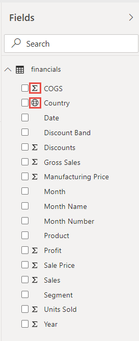

# Tutorial: De um livro do Excel a um relatório no serviço Power BI ao Microsoft Teams
O seu gestor quer ver um relatório sobre as vendas e os lucros mais recentes até ao final do dia. No entanto, os dados mais recentes estão em vários sistemas e ficheiros de terceiros no seu portátil. Anteriormente, demorava várias horas a criar elementos visuais e a formatar um relatório e, por isso, começa a sentir algum nervosismo.

Não se preocupe. Com o Power BI, pode criar um relatório impressionante e partilhá-lo imediatamente no Microsoft Teams!

:::image type="content" source="media/service-from-excel-to-stunning-report/power-bi-financial-report-service.png" alt-text="Captura de ecrã a mostrar o relatório Financial Sample (Exemplo de Finanças) concluído":::

Neste tutorial, vamos carregar um ficheiro Excel, criar um novo relatório e partilhá-lo com colegas no Microsoft Teams através do Power BI. Vai aprender a:

> [!div class="checklist"]
> * Preparar dados no Excel.
> * Transferir dados de exemplo.
> * Criar um relatório no serviço Power BI.
> * Afixar os elementos visuais do relatório num dashboard.
> * Partilhar uma ligação para o dashboard.
> * Partilhar o dashboard no Microsoft Teams

## Preparar dados no Excel
Vamos utilizar um ficheiro simples do Excel como exemplo. 

1. Antes de carregar o ficheiro do Excel no Power BI, tem de organizar os dados numa tabela simples. Numa tabela simples, cada coluna contém o mesmo tipo de dados, por exemplo, texto, data, número ou moeda. A sua tabela deve ter uma linha de cabeçalho, mas não deve ter colunas ou linhas que apresentem os totais.

   

2. Em seguida, formate os dados como uma tabela. No Excel, no separador **Base**, no grupo **Estilos**, selecione **Formatar como Tabela**. 

3. Selecione um estilo de tabela a aplicar à folha de cálculo. 

   A folha de cálculo do Excel está agora pronta para ser carregada para o Power BI.

   

## Carregar o ficheiro do Excel para o serviço Power BI
O serviço Power BI liga a muitas origens de dados, incluindo ficheiros do Excel que residem no seu computador. 

 > [!NOTE] 
 > Para acompanhar o resto deste tutorial, transfira o [livro Financial Sample](https://go.microsoft.com/fwlink/?LinkID=521962) (Exemplo de Finanças).

1. Para começar, inicie sessão no serviço Power BI. Se ainda não se inscreveu, [pode fazê-lo gratuitamente](https://powerbi.com).
1. Em **A minha área de trabalho**, selecione **Novo** > **Carregar um ficheiro**.

    :::image type="content" source="media/service-from-excel-to-stunning-report/power-bi-new-upload.png" alt-text="Captura de ecrã a mostrar a opção Carregar um ficheiro.":::

1. Selecione **Ficheiro Local**, navegue até ao local onde guardou o ficheiro Excel Financial Sample (Exemplo de Finanças) e selecione **Abrir**.
7. Na página **Ficheiro Local**, selecione **Importar**.

    Agora tem um conjunto de dados do ficheiro Financial Sample (Exemplo de Finanças). O Power BI também criou automaticamente um dashboard em branco. Se não vir o dashboard, atualize o browser.

    :::image type="content" source="media/service-from-excel-to-stunning-report/power-bi-financial-dataset.png" alt-text="Captura de ecrã a mostrar A Minha Área de Trabalho com o conjunto de dados do ficheiro Financial Sample (Exemplo de Finanças).":::

2. Quer criar um relatório. Ainda em **A minha área de trabalho**, selecione **Novo** > **Relatório**.

   

3. Na caixa de diálogo **Selecionar um conjunto de dados para criar um relatório**, selecione o conjunto de dados do ficheiro **Financial Sample** (Exemplo de Finanças) > **Criar**.

   

## Criar o relatório
 
O relatório é aberto na vista Editar e apresenta a tela de relatórios em branco. No lado direito, estão os painéis **Visualizações**, **Filtros** e **Campos**. Os dados de tabela do livro do Excel são apresentados no painel **Campos**. Na parte superior, é apresentado o nome da tabela: **financials** (finanças). Por baixo, o Power BI lista os cabeçalhos de coluna como campos individuais.

Vê os Sigmas na lista Campos? O Power BI detetou que esses campos são numéricos. O Power BI também indica um campo geográfico com o símbolo de um globo.

1. Para ter mais espaço para a tela de relatório, selecione **Ocultar o painel de navegação** e minimize o painel **Filtros**.

    :::image type="content" source="media/service-from-excel-to-stunning-report/power-bi-hide-nav-pane.png" alt-text="Captura de ecrã a mostrar a minimização do painel de navegação."::: 

1. Agora, pode começar a criar visualizações. Imagine que a sua gestora quer ver o lucro ao longo do tempo. No painel **Campos**, arraste **Lucro** para a tela do relatório. 

   Por predefinição, o Power BI apresenta um gráfico de colunas com uma coluna. 

    :::image type="content" source="media/service-from-excel-to-stunning-report/power-bi-profit-column.png" alt-text="Captura de ecrã a mostrar o gráfico de colunas com uma coluna.":::

3. Arraste **Data** para a tela do relatório. 

   O Power BI atualiza o gráfico de colunas para apresentar o lucro por data.

   

    Dezembro de 2014 foi o mês mais lucrativo.
   
    > [!TIP]
    > Se os valores do gráfico não forem o que esperava, verifique as agregações. Por exemplo, na área **Valores**, selecione o campo **Lucro** que acabou de adicionar e certifique-se de que os dados estão a ser agregados da forma que pretende. Neste exemplo, estamos a utilizar **Soma**.
    > 

### Criar um mapa

A sua gestora quer saber quais os países mais lucrativos. Impressione o seu gestor com uma visualização de mapa. 

1. Selecione uma área em branco na tela do seu relatório. 

2. No painel **Campos**, arraste o campo **País** para a tela do relatório. Em seguida, arraste o campo **Lucro** para o mapa.

   O Power BI cria um elemento visual de mapa com bolhas que representam o lucro relativo de cada local.

   

    Parece que os países europeus estão a ter um desempenho superior ao dos países norte-americanos.

### Criar um elemento visual que mostre as vendas

Que tal apresentar um elemento visual que mostre as vendas por produto e segmento de mercado? Isso é fácil. 

1. Selecione a tela em branco.

1. No painel **Campos**, selecione os campos **Vendas**, **Produto** e **Segmento**. 
   
   O Power BI cria um gráfico de colunas agrupadas. 

2. Altere o tipo de gráfico ao selecionar um dos ícones no menu **Visualizações**. Por exemplo, altere o gráfico para um **Gráfico de colunas empilhadas**. 

   

3. Para ordenar o gráfico, selecione **Mais opções** (...) > **Ordenar por**.

### Dinamizar os elementos visuais

Faça as seguintes alterações no separador **Formato** no painel Visualizações.

:::image type="content" source="media/desktop-excel-stunning-report/power-bi-format-tab-visualizations.png" alt-text="Captura de ecrã a mostrar o separador Formato no painel Visualizações.":::

1. Selecione o gráfico de colunas **Lucro por data**. Na secção **Título**, altere o **Tamanho do texto** para **16 pt**. Altere a opção **Sombra** para **Ativado**. 

1. Selecione o gráfico de colunas empilhadas **Vendas por Produto e Segmento**. Na secção **Título**, altere o **Tamanho do texto** do título para **16 pt**. Altere a opção **Sombra** para **Ativado**.

1. Selecione o mapa **Lucro por País**. Na secção **Estilos de mapa**, altere o **Tema** para **Tons de cinzento**. Na secção **Título**, altere o **Tamanho do texto** do título para **16 pt**. Altere a opção **Sombra** para **Ativado**.

## Afixar num dashboard

Agora pode afixar todos os elementos visuais no dashboard em branco que o Power BI criou por predefinição. 

1. Paire o cursor sobre um elemento visual e selecione **Afixar elemento visual**.

   

1. Para afixar um elemento visual no dashboard, tem de guardar o relatório. Atribua um nome ao relatório e selecione **Guardar**.
1. Afixe cada elemento visual no dashboard criado através do Power BI, **Financial Sample.xlsx**.
1. Quando afixar o último elemento visual, selecione **Ir para o dashboard**.
1. O Power BI adicionou automaticamente um mosaico do ficheiro Financial Sample.xlsx ao dashboard. Selecione **Mais opções (…)**  > **Eliminar mosaico**.

    :::image type="content" source="media/service-from-excel-to-stunning-report/power-bi-tile-more-options.png" alt-text="Captura de ecrã a mostrar o menu Mais opções de um mosaico.":::

1. Reordene e redimensione os mosaicos como quiser.

O dashboard e o relatório estão prontos.

## Partilhar uma ligação no dashboard

É altura de partilhar o dashboard com o seu gestor. Pode partilhar o dashboard e o relatório subjacente com os colegas que tenham uma conta do Power BI. Os colegas podem interagir com o seu relatório, mas não podem guardar alterações. Se o permitir, este poderá partilhá-lo com outras pessoas ou criar um novo relatório baseado no conjunto de dados adjacente.

1. Para partilhar o relatório, na parte superior do dashboard, selecione **Partilhar**.

   

2. Na página  **Partilhar dashboard**, introduza os endereços de e-mail dos destinatários na caixa **Introduzir endereços de e-mail** e adicione uma mensagem na caixa abaixo. 

3. Caso aplicável, decida as opções que pretende:

    - **Permitir aos destinatários partilhar o dashboard**. 
    - **Permitir que os destinatários criem novos conteúdos com os conjuntos de dados subjacentes**.
    - **Envie uma notificação por e-mail aos destinatários.**

   

1. Selecione **Partilhar**.

## Partilhar no Microsoft Teams

Também pode partilhar relatórios e dashboards diretamente com colegas no Microsoft Teams.

1. Para partilhar no Teams na parte superior do dashboard, selecione **Partilhar no Teams**.

   

2. O Power BI apresenta a caixa de diálogo **Partilhar no Teams**. Introduza o nome de uma pessoa, grupo ou canal e selecione **Partilhar**. 
   
    :::image type="content" source="media/service-from-excel-to-stunning-report/power-bi-share-teams-dialog.png" alt-text="Captura de ecrã a mostrar a caixa de diálogo Partilhar no Teams":::

3. A ligação é apresentada no painel **Publicações** dessa pessoa, grupo ou canal.

   

## Próximos passos

* Agora que criou um relatório básico no serviço Power BI, que tal criar um relatório no Power BI Desktop? Experimente o tutorial, [De um livro do Excel a um relatório incrível no Power BI Desktop](desktop-excel-stunning-report.md).

Mais perguntas? [Experimente a Comunidade do Power BI](https://community.powerbi.com/).
