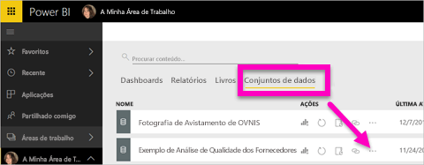
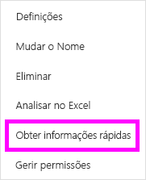
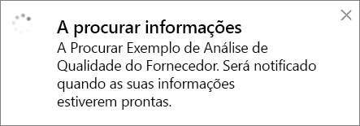
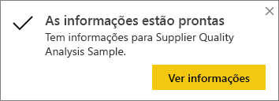
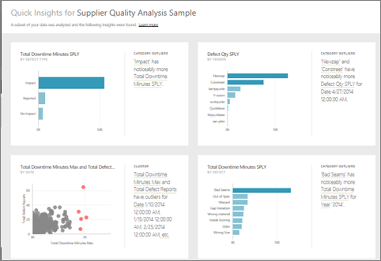
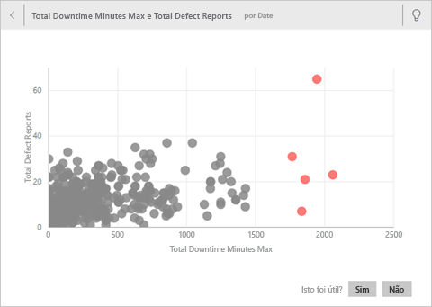
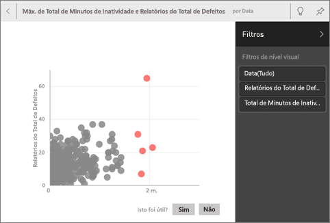
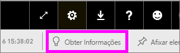
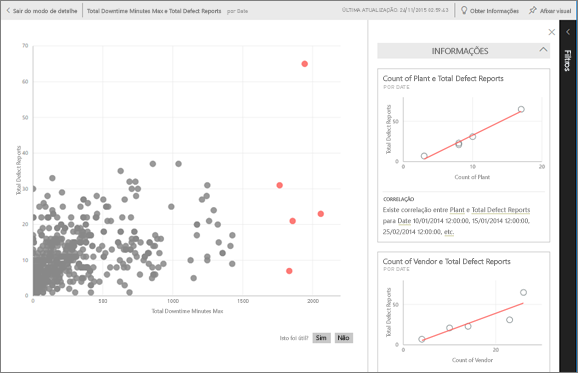

# Gerar informações de dados automaticamente no seu conjunto de dados com o Power BI
Tem um novo conjunto de dados e não sabe bem por onde começar?  Precisa criar um dashboard rapidamente?  Deseja procurar informações que pode ter perdido?

Execute as informações rápidas para gerar visualizações interessantes com base nos seus dados. Este artigo explica como executar informações rápidas num conjunto de dados completo (informações rápidas). Também pode executar [informações rápidas num mosaico específico do dashboard](../consumer/end-user-insights.md) (informações confinadas). Pode até executar informações numa informação!

> [!NOTE]
> As informações não são compatíveis com o DirectQuery. Só funcionam com dados carregados para o Power BI.
> 

Criamos a caraterística informações num [conjunto crescente de algoritmos analíticos avançados](../consumer/end-user-insight-types.md) que desenvolvemos com o Microsoft Research. Continuamos a usar estes algoritmos para ajudar mais pessoas a encontrar informações sobre os respetivos dados de formas novas e intuitivas. Também pode ter interesse em aprender a [otimizar os seus dados para as informações rápidas](service-insights-optimize.md).

## Executar as informações rápidas num conjunto de dados
Veja Amanda executar informações rápidas num conjunto de dados e abrir informações no Modo de detalhe. Amanda fixa uma informação como um mosaico no dashboard e, em seguida, obtém informações para um mosaico do dashboard.

<iframe width="560" height="315" src="https://www.youtube.com/embed/et_MLSL2sA8" frameborder="0" allowfullscreen></iframe>

Agora, é a sua vez. Explore as informações através do [exemplo de Análise de Qualidade do Fornecedor](sample-supplier-quality.md).

1. No separador **Conjuntos de dados**, selecione **Mais opções** (...) e selecione **Obter informações rápidas**.
   
    
   
    
2. O Power BI usa [vários algoritmos](../consumer/end-user-insight-types.md) para pesquisar tendências no conjunto de dados.
   
    
3. Em poucos segundos, as informações estão prontas.  Selecione **Ver informações** para apresentar as visualizações.
   
    
   
    > [!NOTE]
    > Alguns conjuntos de dados não conseguem gerar informações, porque os dados não são estatisticamente significativos.  Para saber mais, veja [Optimize your data for insights (Otimizar os dados das informações)](service-insights-optimize.md).
    > 
    
4. As visualizações são apresentadas numa tela especial de **Informações Rápidas** com até 32 cartões de informações diferentes. Cada cartão contém um gráfico e uma breve descrição.
   
    

## Interagir com os cartões das informações

1. Passe o cursor sobre um cartão e selecione o ícone do pino para adicionar a visualização a um dashboard.

2. Coloque o cursor sobre um cartão, selecione **Mais opções** (…) e, em seguida, selecione **Ver informações**. 

    É aberto o ecrã de informações em Modo de detalhe.
   
    
3. No Modo de detalhe, pode:
   
   * Filtrar as visualizações. Se o painel **Filtros** ainda não estiver aberto, expanda-o ao selecionar a seta no lado direito da janela.

       
   * Afixar o cartão de informações a um dashboard ao selecionar **Afixar elemento visual**.
   * Execute informações no próprio cartão, normalmente conhecido como *informações com âmbito*. No canto superior direito, selecione o ícone da lâmpada  ou **Obter Informações**.
     
       
     
     A informação é apresentada à esquerda. Os cartões novos, com base apenas nos dados dessa informação, são apresentados à direita.
     
       
4. Para voltar à tela original das informações, no canto superior direito, selecione **Sair do Modo de detalhe**.

## Passos seguintes
- Se é proprietário de um conjunto de dados, [otimize-o para as Informações Rápidas](service-insights-optimize.md).
- Saiba mais sobre os [tipos de Informações Rápidas disponíveis](../consumer/end-user-insight-types.md).

Mais perguntas? [Experimente a Comunidade do Power BI](https://community.powerbi.com/).
