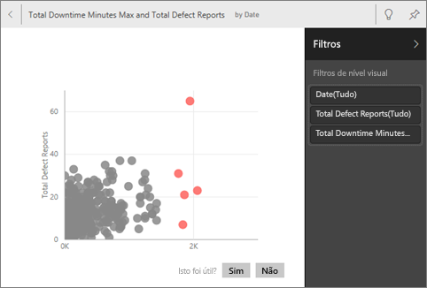
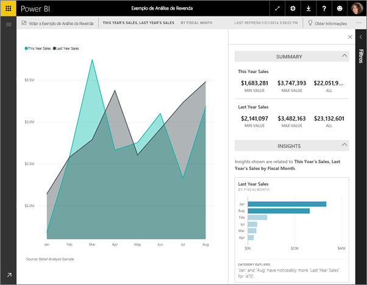

# Gerar informações de dados automaticamente com o Power BI
Tem um novo conjunto de dados e não sabe exatamente por onde começar?  Precisa criar um dashboard rapidamente?  Deseja procurar informações que pode ter perdido?

Execute as informações rápidas para gerar visualizações interativas e interessantes com base nos seus dados. As informações rápidas podem ser executadas num conjunto de dados inteiro (informações rápidas) ou num mosaico específico do dashboard (informações de confinadas). Pode até executar informações numa informação!

> [!NOTE]
> As informações não são compatíveis com o DirectQuery. Só funcionam com dados carregados para o Power BI.
> 

A funcionalidade de informações é criada com base num [conjunto de algoritmos de análise avançados](../consumer/end-user-insight-types.md) crescente, desenvolvido em conjunto com o Microsoft Research, que continuaremos a utilizar para permitir que mais pessoas descubram informações nos dados de formas novas e intuitivas.

## Executar as informações rápidas num conjunto de dados
Veja a Amanda a executar as informações rápidas num conjunto de dados, a abrir uma informação no Modo de detalhe, a afixar uma dessas informações como mosaico no dashboard dela e, em seguida, a obter as informações para um mosaico do dashboard.

<iframe width="560" height="315" src="https://www.youtube.com/embed/et_MLSL2sA8" frameborder="0" allowfullscreen></iframe>

Agora, é a sua vez. Explore as informações através do [exemplo de Análise de Qualidade do Fornecedor](sample-supplier-quality.md).

1. No separador **Conjuntos de dados**, selecione **Mais opções** (...) e selecione **Obter informações rápidas**.
   
    
   
    
2. O Power BI usa [vários algoritmos](../consumer/end-user-insight-types.md) para pesquisar tendências no conjunto de dados.
   
    
3. Em poucos segundos, as informações estão prontas.  Selecione **Ver informações** para apresentar as visualizações.
   
    
   
    > [!NOTE]
    > Alguns conjuntos de dados não conseguem gerar informações, porque os dados não são estatisticamente significativos.  Para saber mais, veja [Optimize your data for insights (Otimizar os dados das informações)](service-insights-optimize.md).
    > 
    
4. As visualizações são apresentadas numa tela especial de **Informações Rápidas** com até 32 cartões de informações diferentes. Cada cartão contém um gráfico e uma breve descrição.
   
    

## Interagir com os cartões das informações

1. Passe o cursor sobre um cartão e selecione o ícone do pino para adicionar a visualização a um dashboard.

2. Coloque o cursor sobre um cartão, selecione **Mais opções** (…) e, em seguida, selecione **Ver informações**. 

    É aberto o ecrã de informações em Modo de detalhe.
   
    
3. No Modo de detalhe, pode:
   
   * Filtrar as visualizações. Se o painel **Filtros** ainda não estiver aberto, expanda-o ao selecionar a seta no lado direito da janela.

       
   * Afixe o cartão de informações a um dashboard ao selecionar **Afixar visual**.
   * Execute informações no próprio cartão, normalmente conhecido como *informações com âmbito*. No canto superior direito, selecione o ícone da lâmpada  ou **Obter Informações**.
     
       
     
     A informação é apresentada à esquerda e os cartões novos, com base apenas nos dados dessa informação, são apresentados à direita.
     
       
4. Para voltar à tela original das informações, no canto superior direito, selecione **Sair do Modo de detalhe**.

## Executar as informações num mosaico do dashboard
Em vez de procurar informações em todo um conjunto de dados, filtre a sua pesquisa de forma a obter informações apenas dos dados que são utilizados para criar um único mosaico de dashboard. 

1. Abra um dashboard.
2. Coloque o cursor sobre um mosaico, selecione **Mais opções** (...) e, em seguida, selecione **Ver informações**. O mosaico abre-se no [Modo de detalhe](../consumer/end-user-focus.md) com os cartões de informações apresentados no lado direito.    
   
        
3. Há alguma informação que desperte o seu interesse? Selecione esse cartão de informação para investigar melhor. A informação selecionada é apresentada à esquerda e os cartões de informações novos, com base apenas nos dados dessa informação, são apresentados à direita.    
4. Continue a investigar os dados e, quando encontrar uma informação interessante, afixe-o ao dashboard ao selecionar **Afixar visual** no canto superior direito.

## Próximas etapas
- Se é proprietário de um conjunto de dados, [otimize-o para as Informações Rápidas](service-insights-optimize.md).
- Saiba mais sobre os [tipos de Informações Rápidas disponíveis](../consumer/end-user-insight-types.md).

Mais perguntas? [Experimente a Comunidade do Power BI](https://community.powerbi.com/).
