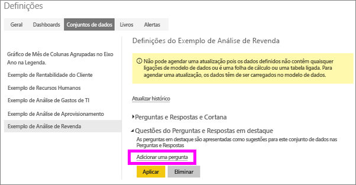
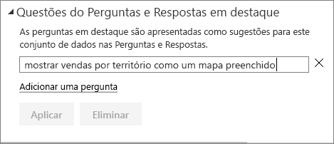
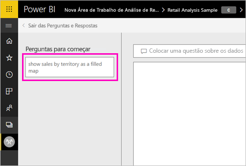
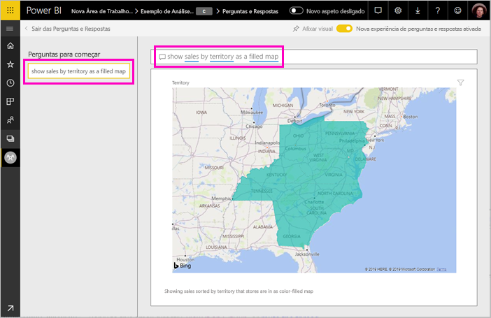

# Criar perguntas em destaque para as Perguntas e Respostas do Power BI
Se tiver permissões de edição para um conjunto de dados, pode adicionar as suas próprias perguntas em destaque para esse conjunto de dados. As Perguntas e Respostas do Power BI mostrarão essas perguntas a colegas que consumem dashboards baseados nesse conjunto de dados.  As perguntas em destaque fornecem aos seus colegas algumas ideias sobre os tipos de perguntas que eles podem fazer sobre o conjunto de dados. As perguntas em destaque adicionadas são decididas por si; pode adicionar perguntas populares, perguntas que mostram resultados interessantes ou perguntas que podem ser difíceis de formular.

> [!NOTE]
> As perguntas em destaque das Perguntas e Respostas estão disponíveis na [aplicação Microsoft Power BI em iPads, iPhones e dispositivos iPod Touch](../consumer/mobile/mobile-apps-ios-qna.md) e no serviço Power BI (app.powerbi.com). A criação de perguntas só está disponível no serviço Power BI.
> 

## Criar uma pergunta em destaque

Este artigo usa o [exemplo de Vendas de Análise de Revenda](sample-datasets.md). Siga estas instruções passo a passo para experimentar explorar um conjunto de dados por si mesmo.

1. No dashboard, seleciona a caixa de perguntas Perguntas e Respostas.   Repare que as Perguntas e Respostas já estão ser úteis ao apresentarem uma lista de termos que aparecem no conjunto de dados.
2. Para adicionar a esta lista, selecione o ícone de engrenagem no canto superior direito do Power BI.  
   
3. Selecione **Definições** &gt; **Conjuntos de dados** &gt; **exemplo de Análise de Revenda** &gt; **Perguntas das Perguntas e Respostas em destaque**.  
4. Selecione **Adicionar uma pergunta**.
   
   
5. Escreva a sua pergunta na caixa de texto. Por exemplo, escreva "mostrar as vendas do ano passado por território conforme o mapa de manchas" e selecione **Aplicar**.   Opcionalmente, adicione outra pergunta, ao selecionar **Adicionar uma pergunta** novamente.  
   painel 
6. Navegue de volta para o dashboard do Power BI, para o Exemplo de Análise de Revenda, e coloque o cursor na caixa de perguntas das Perguntas e Respostas.   
   
7. A nova pergunta em destaque, **mostrar vendas do ano passado por território conforme o mapa de manchas**, é a primeira na lista. Selecione-a.  
8. O Power BI cria a resposta e apresenta-a como uma visualização de mapa preenchido.  
   

## Próximos passos

- [Perguntas e Respostas para consumidores](../consumer/end-user-q-and-a.md)  
- [Utilizar Perguntas e Respostas em dashboards e relatórios](power-bi-tutorial-q-and-a.md)  
- [Conceitos básicos para designers no serviço Power BI](../fundamentals/service-basic-concepts.md)  

Mais perguntas? [Pergunte à Comunidade do Power BI](https://community.powerbi.com/)
