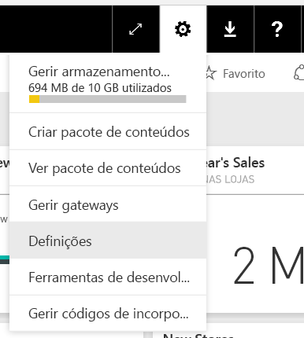
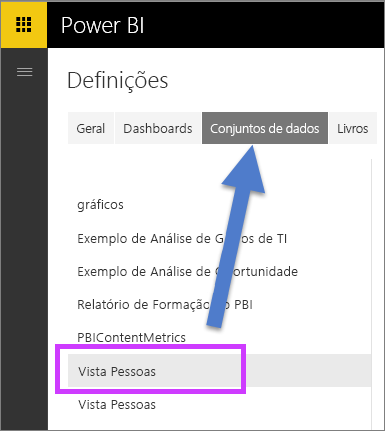
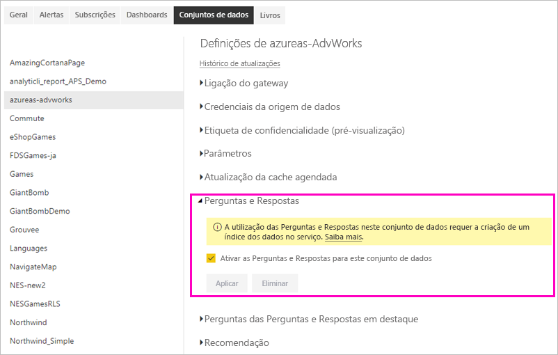

# Ativar as Perguntas e Respostas para ligações em direto no Power BI

Pode importar conjuntos de dados para o Power BI ou criar uma *ligação em direto* para os mesmos. Normalmente, os conjuntos de dados de ligações em direto encontram-se no local. Se for o caso, pode gerir as ligações em direto com um [gateway](../connect-data/service-gateway-onprem.md). Os dados e as questões são enviados e recebidos ao utilizar consultas em direto.

> [!NOTE]
> As ligações em direto também suportam conjuntos de dados do Azure Analysis Services, que não necessitam de um gateway.

## Perguntas e Respostas para conjuntos de dados de gateway de dados
Se pretende utilizar as Perguntas e Respostas com conjuntos de dados aos quais acede através de um gateway, terá de os ativar primeiro.

Após a ativação, o Power BI cria um índice da sua origem de dados e carrega um subconjunto desses dados para o Power BI para permitir a colocação de perguntas. Poderão ser necessários vários minutos para criar o índice inicial e o Power BI mantém e atualiza o índice automaticamente à medida que os seus dados mudam. Utilizar as Perguntas e Respostas com estes conjuntos de dados tem o mesmo comportamento que com os dados publicados no Power BI. O conjunto completo de funcionalidades disponíveis na experiência de Perguntas e Respostas é suportado em ambos os casos.

À medida que coloca perguntas no Power BI, as Perguntas e Respostas determinam o melhor visual para construir ou folha de relatório a utilizar para responder à sua pergunta através de um índice do seu conjunto de dados. Após determinar a melhor resposta potencial, as Perguntas e Respostas utilizam o DirectQuery para obter dados em direto da origem de dados através do gateway, de forma a preencher tabelas e gráficos. Consequentemente, as Perguntas e Respostas do Power BI mostram sempre os dados mais atualizados diretamente da origem de dados subjacente.

Uma vez que as Perguntas e Respostas do Power BI utilizam os valores de esquema e texto da sua origem de dados para determinar como consultar o modelo subjacente para obter respostas, as pesquisas de valores de texto novos ou eliminados específicos (como perguntar o nome de um cliente relacionado com um registo de texto recentemente adicionado) confiam no facto de o índice estar atualizado com os valores mais recentes. O Power BI mantém automaticamente o texto e o índice de esquema atualizados durante um período de 60 minutos das alterações.

Para obter mais informações, veja:

* O que é o [gateway de dados no local](../connect-data/service-gateway-onprem.md)?
* [Perguntas e Respostas do Power BI para consumidores](../consumer/end-user-q-and-a.md)

## Ativar as Perguntas e Respostas
Após o gateway de dados ser configurado, ligue-se aos seus dados a partir do Power BI.  Crie um dashboard ao utilizar os seus dados no local ou carregue um ficheiro .pbix que utilize dados no local.  Também pode já ter dados no local em dashboards, relatórios e conjuntos de dados que tenham sido partilhados consigo.

1. No canto superior direito do Power BI, selecione o ícone da engrenagem  e selecione **Definições**.
   
   
2. Selecione **conjuntos de dados** e selecione o conjunto de dados para ativar para as Perguntas e Respostas.
   
   
3. Expanda **Perguntas e Respostas**, selecione a caixa de verificação **Ativar as Perguntas e Respostas neste conjunto de dados** e selecione **Aplicar**.
   
    

## Que dados são colocados em cache é como é que a privacidade é protegida?
Quando ativar as Perguntas e Respostas para os seus dados no local, um subconjunto dos seus dados será colocado em cache no serviço. Esta colocação em cache garante que as Perguntas e Respostas funcionam com um desempenho razoável. O Power BI exclui valores com mais de 24 carateres da colocação em cache. A cache é eliminada dentro de poucas horas quando desativa as Perguntas e Respostas ao desmarcar a opção **Ativar as Perguntas e Respostas para este conjunto de dados**, ou quando elimina o seu conjunto de dados.

## Considerações e resolução de problemas
A funcionalidade tem algumas limitações:

* Inicialmente, a funcionalidade só está disponível para origens de dados do SQL Server 2016 Analysis Services Tabular. A funcionalidade está otimizada para trabalhar com dados de tabela. A experiência das Perguntas e Respostas ainda não é suportada em origens multidimensionais. Origens de dados adicionais suportadas pelo gateway de dados no local serão implementadas ao longo do tempo.
* O suporte integral para segurança ao nível de linha definido no SQL Server Analysis Services não está inicialmente disponível. Ao colocar perguntas nas Perguntas e Respostas, o "preenchimento automático" de perguntas ao escrever pode mostrar valores de cadeias às quais um utilizador não tem acesso. No entanto, a RLS definida no modelo é respeitada em visuais de gráficos e relatórios, o que impede a exposição dos dados numéricos subjacentes. As opções para controlar este comportamento serão lançadas em atualizações futuras.
* A segurança ao nível do objeto (OLS) não é suportada. As Perguntas e Respostas não respeitam a segurança ao nível do objeto e podem revelar os nomes das colunas ou tabelas a utilizadores que não têm acesso aos mesmos. Deve ativar o RLS para garantir que os valores de dados também estão protegidos adequadamente. 
* As ligações em direto só são suportadas com o gateway de dados no local. Como resultado, não é possível utilizar esta funcionalidade com o gateway pessoal.

## Próximos passos

- [On-premises data gateway (Gateway de dados no local)](../connect-data/service-gateway-onprem.md)  
- [Gerir a sua origem de dados – Analysis Services](../connect-data/service-gateway-enterprise-manage-ssas.md)  
- [Conceitos básicos para designers no serviço Power BI](../fundamentals/service-basic-concepts.md)  
- [Descrição Geral de Perguntas e Respostas do Power BI](../consumer/end-user-q-and-a.md)  

Mais perguntas? [Experimente perguntar à Comunidade do Power BI](https://community.powerbi.com/)
