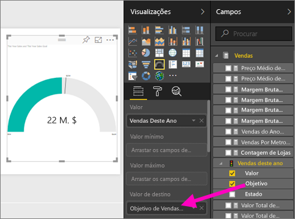

# Criar um relatório a partir de um ficheiro do Excel no serviço Power BI
Leu o artigo [Relatórios no Power BI](../consumer/end-user-reports.md) e pretende agora criar o seu. Existem várias formas de criar um relatório. Neste artigo, vamos começar por criar um relatório básico no serviço Power BI a partir de um ficheiro do Excel. Após compreender as noções básicas da criação de um relatório, verifique os [Passos seguintes](#next-steps) na parte final da página para ver tópicos mais avançados sobre relatórios.  

## Pré-requisitos
- [Inscreva-se no serviço Power BI](../fundamentals/service-self-service-signup-for-power-bi.md). 
- [Transfira o ficheiro do Excel do exemplo de Análise de Revenda](https://go.microsoft.com/fwlink/?LinkId=529778) e guarde-o localmente ou no OneDrive para Empresas.

## Importar o ficheiro do Excel
Este método de criação de um relatório começa por um ficheiro e uma tela de relatório em branco. Poderá seguir a importação a partir do ficheiro do Excel do exemplo de Análise de Revenda.

1. Na barra de navegação, selecione **A Minha Área de Trabalho** .
   
   :::image type="content" source="media/service-report-create-new/power-bi-select-my-workspace.png" alt-text="Captura de ecrã a mostrar a seleção da opção A Minha Área de Trabalho.":::
2. Na parte inferior do painel de navegação, selecione **Obter dados** .
   
   
3. Selecione **Ficheiros** e navegue para o local onde guardou o exemplo de Análise de Revenda.
   
    
4. Neste exercício, selecione **Importar** .
   
   
5. Selecione **Abrir** .

   Assim que o ficheiro do Excel for importado, é listado como um *conjunto de dados* na lista da área de trabalho.

1. Selecione **Mais opções (...)** junto ao conjunto de dados e selecione **Gerir relatório** .
   
   :::image type="content" source="media/service-report-create-new/power-bi-dataset-create-report.png" alt-text="Captura de ecrã a mostrar a seleção da opção A Minha Área de Trabalho.":::
6. O editor de relatórios é aberto. 
   
   

> [!TIP]
> Selecione o ícone de menu para ocultar o painel de navegação, para ter mais espaço.
> 
> :::image type="content" source="../media/power-bi-hide-navigation-pane.png" alt-text="Captura de ecrã a mostrar a seleção da opção A Minha Área de Trabalho.":::

## Adicionar um Medidor Radial ao relatório
Agora que o nosso conjunto de dados foi importado, vamos começar a responder a algumas perguntas.  A nossa Diretora de Marketing (CMO) quer saber quanto falta para atingirmos os nossos objetivos de vendas para este ano. Os Medidores são [uma boa opção de visualização](../visuals/power-bi-report-visualizations.md) para mostrar este tipo de informação.

1. No painel Campos, selecione **Sales (Vendas)**  > **This Year Sales (Vendas Deste Ano)**  > **Value (Valor)** .
   
    
2. Converta o visual num Medidor ao selecionar o modelo Medidor  no painel **Visualizações** .
   
    
3. Arraste **Sales (Vendas)**  > **This Year Sales (Vendas Este Ano)**  > **Goal (Objetivo)** para o well **Target value (Valor de destino)** . Parece que estamos bastante próximos do nosso objetivo.
   
    
4. Esta é uma boa altura para guardar o seu relatório.
   
   

## Adicionar um gráfico de área e segmentação de dados ao relatório
A nossa CMO quer que respondamos a algumas perguntas adicionais. Ela gostaria de comparar as vendas deste ano com as do ano anterior. Quer também saber os resultados por distrito.

1. Primeiro, vamos arranjar algum espaço na nossa tela. Selecione o Medidor e mova-o para o canto superior direito. Depois, arraste e largue um dos cantos para diminuir o tamanho.
2. Desselecione o medidor. No painel Campos, selecione **Sales (Vendas)**  > **This Year Sales (Vendas Este Ano)**  > **Value (Valor)** e selecione **Sales (Vendas)**  > **Last Year Sales (Vendas no Ano Passado)** .
   
    
3. Converta o elemento visual num Gráfico de área ao selecionar o modelo Gráfico de Área  no painel **Visualizações** .
4. Selecione **Time (Tempo)**  > **Period (Período)** para adicioná-lo ao well **Axis (Eixo)** .
   
    
5. Para ordenar a visualização por período de tempo, selecione as reticências e escolha **Ordenar por Período** .
6. Agora, vamos adicionar a segmentação de dados. Selecione uma área vazia na tela e selecione o modelo de  Segmentação de Dados. Temos agora uma segmentação de dados vazia na nossa tela.
   
        
7. No painel Campos, selecione **District (Distrito)**  > **District (Distrito)** . Mova e redimensione a segmentação de dados.
   
      
8. Utilize a segmentação de dados para procurar padrões e informações por Distrito.
   
     

Continue a explorar os dados e a adicionar visualizações. Quando encontrar informações especialmente interessantes, [afixe-as num dashboard](service-dashboard-pin-tile-from-report.md).

## Passos seguintes

* [Afixar visualizações num dashboard](service-dashboard-pin-tile-from-report.md)
* [Alterar as definições de relatórios no serviço Power BI](power-bi-report-settings.md)
* Mais perguntas? [Pergunte à Comunidade do Power BI](https://community.powerbi.com/)
