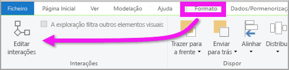
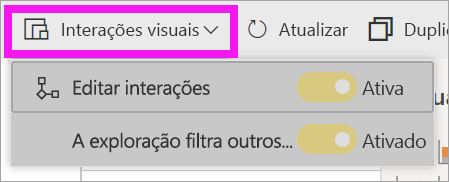
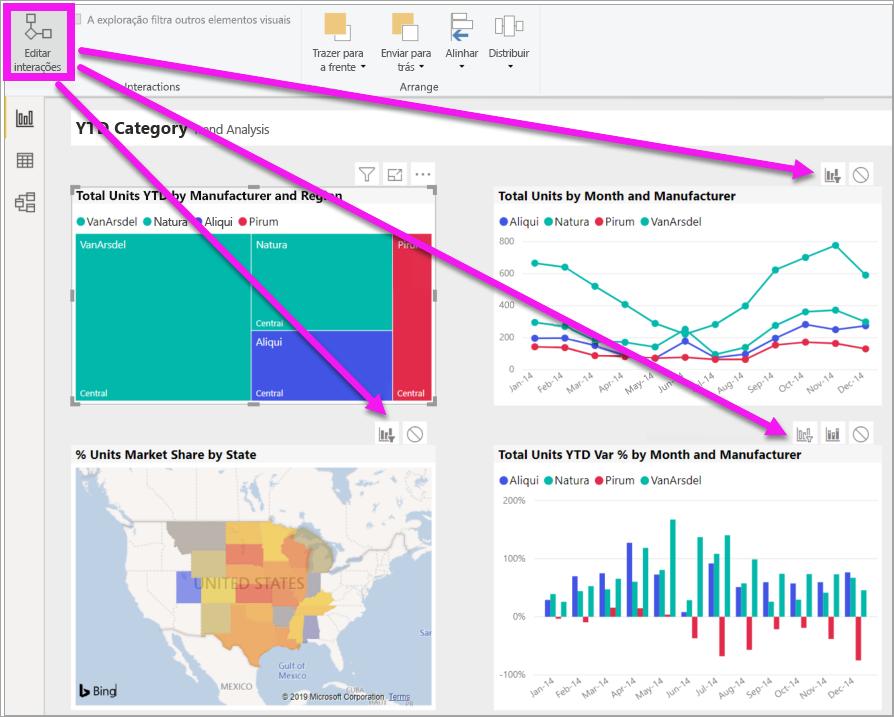
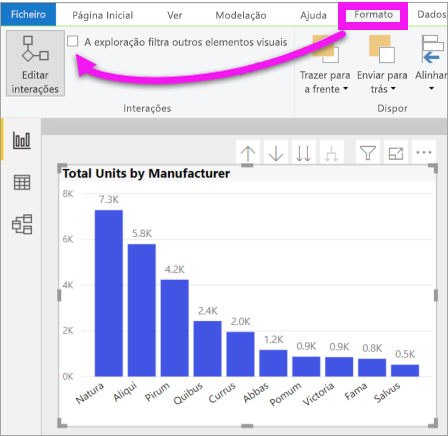

# Alterar a forma como os elementos visuais interagem num relatório do Power BI
Se tiver permissões de edição para um relatório, pode utilizar as **interações visuais** para alterar a forma como as visualizações têm impacto umas nas outras numa página de relatório. 

## Introdução às interações visuais
Por predefinição, as visualizações numa página de relatório podem ser utilizadas para filtro cruzado e realce cruzado de outras visualizações na página.
Por exemplo, selecionar um estado numa visualização de mapa realça o gráfico de colunas e filtra o gráfico de linhas para mostrar apenas os dados que se aplicam a um estado.
Consulte [Sobre filtragem e realce](power-bi-reports-filters-and-highlighting.md). Se tiver uma visualização que suporte a [exploração](../consumer/end-user-drill.md) por predefinição, a exploração de uma visualização não tem impacto nas outras visualizações na página de relatório. No entanto, estes comportamentos predefinidos podem ser substituídos e as interações podem ser definidas individualmente para cada visualização.

Este artigo mostra-lhe como utilizar as **interações visuais** no Power BI Desktop. O processo é o mesmo na [Vista de edição](service-interact-with-a-report-in-editing-view.md) do serviço Power BI. Se possuir apenas acesso de Vista de leitura ou o relatório tiver sido partilhado consigo, não conseguirá alterar as definições das interações visuais.

Os termos *filtro cruzado* e *realce cruzado* são utilizados para distinguir o comportamento descrito aqui do que acontece quando utiliza o painel **Filtros** para *filtrar* e *realçar* as visualizações.  

> [!NOTE]
> Este vídeo utiliza versões mais antigas do Power BI Desktop e do serviço Power BI. 
>
>

<iframe width="560" height="315" src="https://www.youtube.com/embed/N_xYsCbyHPw?list=PL1N57mwBHtN0JFoKSR0n-tBkUJHeMP2cP" frameborder="0" allowfullscreen></iframe>

## Ativar os controlos de interação visual
Se tiver permissões de edição num relatório, poderá ativar os controlos de interação visual e, em seguida, personalizar a forma como as visualizações na página de relatório são filtradas e realçadas. 

1. Selecione a visualização para ativá-la.  
2. Aceda às opções das **Interações Visuais**.
    

    - No Desktop, selecione **Formato > Interações**.

        

    - No serviço Power BI, abra o relatório na Vista de edição e selecione a lista pendente na barra de menus do relatório.

        

3. Para visualizar os controlos de interação de visualizações, selecione **Editar interações**. O Power BI adiciona ícones de filtragem e realce a todas as outras visualizações na página de relatório. Podemos ver que o mapa de árvore está a realizar uma filtragem cruzada do gráfico de linhas e do mapa e está a realizar um realce cruzado do gráfico de colunas. Agora, pode alterar a forma como a visualização selecionada interage com as outras visualizações na página de relatório.
   
    

## Alterar o comportamento da interação
Familiarize-se com a forma como as visualizações interagem ao selecionar cada visualização na página de relatório, uma de cada vez.  Selecione um ponto de dados, uma barra ou uma forma e observe o impacto nas outras visualizações. Se o comportamento que vê não é o pretendido, poderá alterar as interações. Estas alterações são guardadas com o relatório, pelo que o utilizador e os consumidores do relatório terão a mesma experiência de interação visual.

Comece por selecionar uma visualização para a ativar.  Tenha em atenção que todas as outras visualizações na página agora apresentam ícones de interação. O ícone a negrito é o que está a ser aplicado. Em seguida, determine o impacto que gostaria que a **visualização selecionada** tenha nas outras.  Opcionalmente, repita para todas as outras visualizações na página do relatório.

Se a visualização selecionada:
   
   * realizar a filtragem cruzada numa das outras visualizações na página, selecione o ícone de **filtro** no canto superior direito da visualização .
   * realizar o realce cruzado numa das outras visualizações na página, selecione o ícone **realçar** .
   * não tiver impacto numa das outras visualizações na página, selecione o ícone **sem impacto** .

## Alterar as interações das visualizações desagregáveis
[Algumas visualizações de Power BI podem ser desagregadas](../consumer/end-user-drill.md). Por predefinição, quando desagrega uma visualização, tal não tem impacto sobre as outras visualizações na página de relatório. No entanto, esse comportamento pode ser alterado. 

> [!TIP]
> Experimente utilizar o [ficheiro PBIX de amostra dos Recursos Humanos](https://download.microsoft.com/download/6/9/5/69503155-05A5-483E-829A-F7B5F3DD5D27/Human%20Resources%20Sample%20PBIX.pbix). Existe um gráfico de colunas com uma desagregação no separador **Novas contratações**.
>

1. Selecione o elemento visual desagregável para o ativar. 

2. Ative a desagregação ao selecionar o ícone de desagregação.

    

2. Na barra de menus, selecione **Formato** > **Filtros de desagregação de outros elementos visuais**.  Agora, quando agregar ou desagregar numa visualização, as outras visualizações na página de relatório são alteradas para refletir a seleção de exploração atual. 

    

3. Se o comportamento que vê não for o desejado, poderá alterar as interações [conforme descrito acima](#change-the-interaction-behavior).

## Considerações e resolução de problemas
Se criar uma matriz com campos de tabelas diferentes e, em seguida, tentar realçar de forma cruzada ao selecionar vários itens em diferentes níveis da hierarquia, são apresentados erros nos outros elementos visuais. 

    
## Próximas etapas
[Filtros e realces em relatórios do Power BI](power-bi-reports-filters-and-highlighting.md)