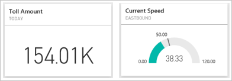
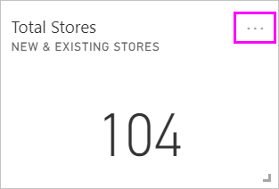
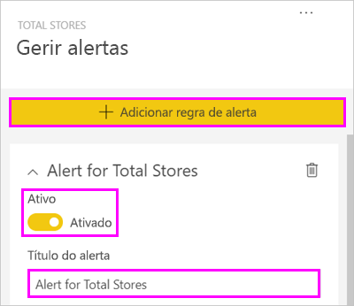
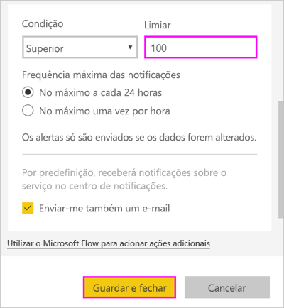
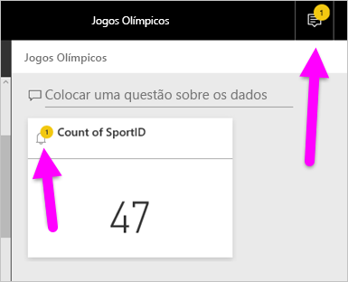
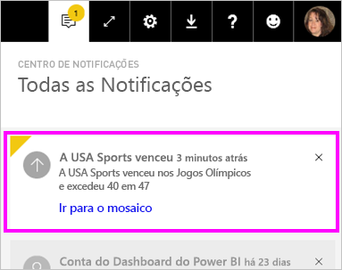
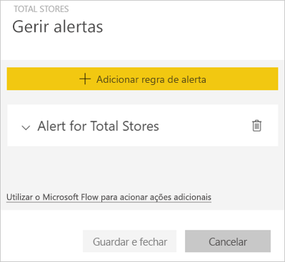
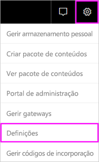
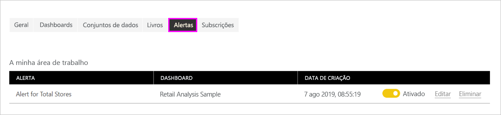

# Alertas de dados no serviço Power BI

Defina alertas para receber notificações quando os dados nos seus dashboards forem alterados para além dos limites que definiu.

Pode definir alertas em mosaicos em A Minha Área de Trabalho. Também pode definir alertas se alguém partilhar um dashboard que esteja numa [capacidade Premium](../admin/service-premium-what-is.md). Se tiver uma licença do Power BI Pro, também pode definir alertas em mosaicos em qualquer outra área de trabalho. Os alertas só podem ser definidos nos mosaicos afixados a partir de elementos visuais de relatório e apenas em medidores, KPIs e cartões. Os alertas podem ser definidos em elementos visuais criados a partir de fluxos de conjuntos de dados que afixa de um relatório a um dashboard. Os alertas não podem ser definidos em fluxos de mosaicos criados diretamente no dashboard com **Adicionar mosaico** > **Dados de transmissão em fluxo personalizados**.

Só o utilizador pode ver os alertas que definir, mesmo que partilhe o dashboard. Mesmo o proprietário do dashboard não consegue ver os alertas que definiu na vista do respetivo dashboard. Os alertas de dados são totalmente sincronizados entre plataformas; defina e veja alertas de dados [nas aplicações móveis do Power BI](../consumer/mobile/mobile-set-data-alerts-in-the-mobile-apps.md) e no serviço Power BI. Não estão disponíveis para o Power BI Desktop. Pode até automatizar e integrar alertas com o Power Automate. Pode experimentá-lo neste artigo: [Power Automate e Power BI](../collaborate-share/service-flow-integration.md).

> [!WARNING]
> As notificações de alertas com base em dados dão-lhe informações sobre os seus dados. Se vir os dados do Power BI num dispositivo móvel e esse dispositivo for roubado ou perdido, recomendamos que utilize o serviço Power BI para desativar todas as regras de alerta com base em dados.

## Definir alertas de dados no serviço Power BI

Veja a Margarida a adicionar alguns alertas a mosaicos no dashboard. Em seguida, siga as instruções passo-a-passo abaixo do vídeo para experimentar.

<iframe width="560" height="315" src="https://www.youtube.com/embed/JbL2-HJ8clE" frameborder="0" allowfullscreen></iframe>

Este exemplo utiliza um mosaico de cartão do dashboard de exemplo de Análise de Revenda. [Obtenha o exemplo de Análise de Revenda](sample-retail-analysis.md#get-the-content-pack-for-this-sample) se quiser acompanhar.

1. Inicie um dashboard. No mosaico **Total de lojas**, selecione as reticências.

   

1. Selecione o ícone de campainha  para adicionar um ou mais alertas a **Total de Lojas**.

1. Para começar, selecione **+ Adicionar regra de alerta**, certifique-se de que o controlo de deslize **Ativo** está **Ativado** e atribua um título ao alerta. Os títulos ajudam a reconhecer facilmente os alertas.

   

1. Desloque o ecrã para baixo e introduza os detalhes do alerta.  Neste exemplo, irá criar um alerta que o notifica uma vez por dia se o número total de lojas ficar acima de 100.

   

    Os alertas serão apresentados no **Centro de notificações**. O Power BI também enviará um e-mail sobre o alerta, se selecionar a caixa de verificação.

1. Selecione **Guardar e fechar**.

## Receber alertas

Quando os dados monitorizados atingirem um dos limiares que definiu, acontecerão várias coisas. Em primeiro lugar, o Power BI verifica se passou mais de uma hora ou mais de 24 horas (consoante a opção que selecionou) desde o último alerta. Se os dados passarem o limiar, receberá um alerta.

Em seguida, o Power BI envia um alerta para o **Centro de Notificações** e, opcionalmente, por e-mail. Cada alerta contém uma ligação direta para os seus dados. Selecione a ligação para ver o mosaico relevante, onde pode explorar, partilha e obter mais informações.  

* Se tiver definido o alerta para lhe enviar uma mensagem de e-mail, irá encontrar algo deste género na sua Caixa de entrada.

   

* O Power BI adiciona uma mensagem ao seu **Centro de notificações** e adiciona um ícone de novo alerta ao mosaico aplicável.

   

* O **Centro de notificações** mostra os detalhes do alerta.

    

   > [!NOTE]
   > Os alertas só funcionam em dados atualizados. Quando os dados forem atualizados, o Power BI procura alertas definidos para esses dados. Se os dados tiverem atingido um limiar de alerta, o Power BI aciona um alerta.

## Gerir alertas

Existem várias formas de gerir os alteras:

* No mosaico do dashboard.

* No menu de Definições do Power BI.

* Num mosaico nas [aplicações móveis do Power BI](../consumer/mobile/mobile-set-data-alerts-in-the-mobile-apps.md).

### No mosaico do dashboard

1. Se precisar de alterar ou remover um alerta de um mosaico, volte a abrir a janela **Gerir alertas**, ao selecionar o ícone de campainha .

    O Power BI mostra os alertas que definiu para esse mosaico.

    

1. Para modificar um alerta, selecione a seta para a esquerda do nome do alerta.

    

1. Para eliminar um alerta, selecione o recipiente do lixo à direita do nome do alerta.

      

### No menu de definições do Power BI

1. Selecione o ícone de engrenagem na barra de menus do Power BI e selecione **Definições**.

    .

1. Em **Definições**, selecione **Alertas**.

    

1. A partir daqui, pode ativar e desativar alertas, abrir a janela **Gerir alertas** para fazer alterações ou eliminar o alerta.

## Considerações e resolução de problemas

* Os alertas não são suportados para mosaicos de cartões com medidas de data/hora.
* Os alertas só funcionam com tipos de dados numéricos.
* Os alertas só funcionam em dados atualizados. Não funcionam com dados estáticos.
* Os alertas só funcionam em conjuntos de dados de transmissão em fluxo se criar um elemento visual de relatório de KPI, cartão ou medidor e, em seguida, afixar esse elemento visual ao dashboard.

## Próximas etapas

* [Criar um fluxo do Power Automate que inclua um alerta de dados](../collaborate-share/service-flow-integration.md).

* [Definir alertas de dados num dispositivo móvel](../consumer/mobile/mobile-set-data-alerts-in-the-mobile-apps.md).

* [O que é o Power BI?](../fundamentals/power-bi-overview.md)

Mais perguntas? [Experimente perguntar à Comunidade do Power BI](https://community.powerbi.com/)
