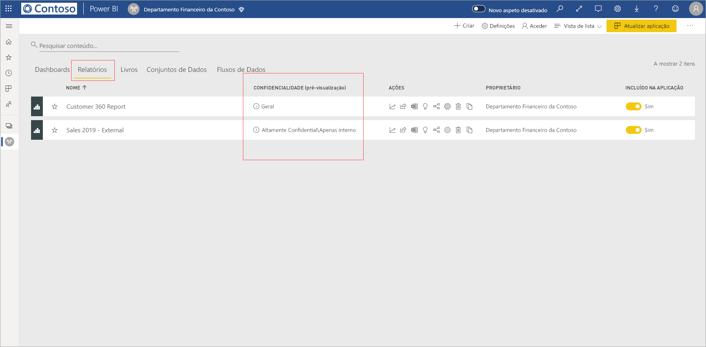
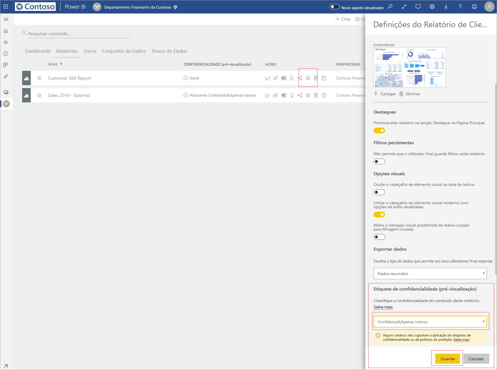
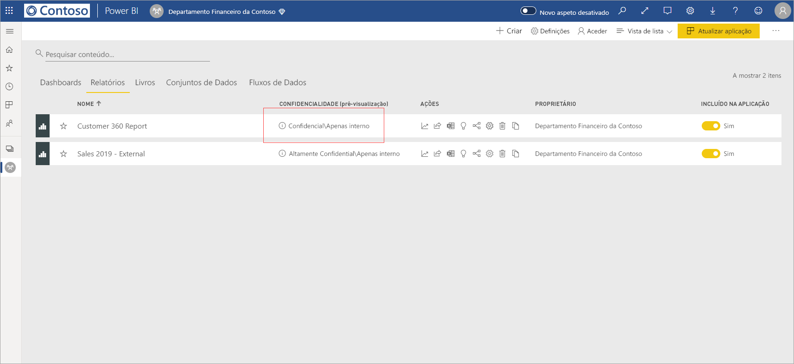
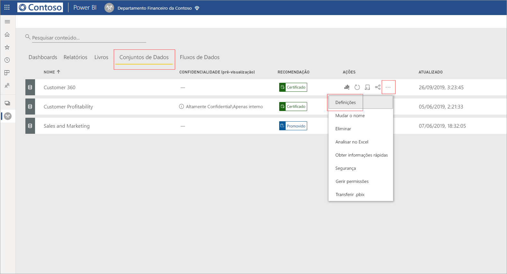
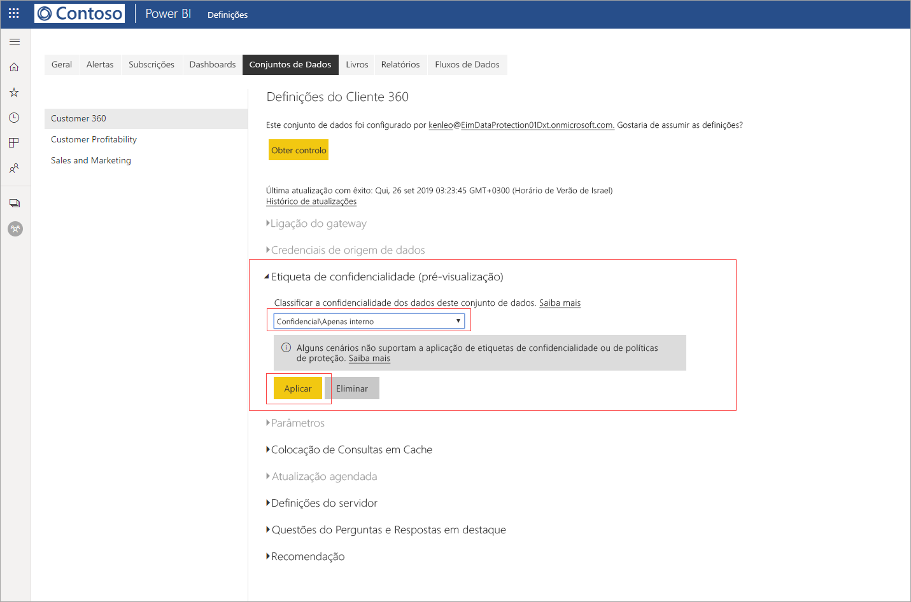
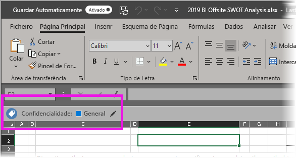

# Aplicar etiquetas de confidencialidade dos dados no Power BI (pré-visualização)

Quando as etiquetas de confidencialidade estiverem ativadas no serviço Power BI, pode proteger os seus dashboards, relatórios, conjuntos de dados e fluxos de dados contra todo o acesso não autorizado e fugas de dados ao aplicar-lhes etiquetas de confidencialidade dos dados. Se etiquetar os seus dados corretamente com etiquetas de confidencialidade dos dados, garante que apenas as pessoas autorizadas podem aceder aos seus dados.

Quando a proteção de dados estiver ativada, as etiquetas de confidencialidade aparecem na coluna de confidencialidade na vista de lista dos dashboards, relatórios, conjuntos de dados e fluxos de dados.

> [!NOTE]
> A aplicação de etiquetas de confidencialidade aos dashboards, relatórios, conjuntos de dados e fluxos de dados do Power BI exige determinadas licenças e permissões. Para obter mais informações, veja [Aplicar etiquetas de confidencialidade](#applying-sensitivity-labels).

## Aplicar etiquetas de confidencialidade

Para aplicar etiquetas de confidencialidade no Power BI, você e a sua organização têm de cumprir os seguintes requisitos:

* A sua organização tem de ter etiquetas de confidencialidade definidas no [Centro de Segurança do Microsoft 365](https://security.microsoft.com/) ou no [Centro de Conformidade do Microsoft 365](https://compliance.microsoft.com/).
* O utilizador tem de pertencer a um grupo de segurança que tenha permissões para aplicar etiquetas de confidencialidade dos dados, conforme descrito no artigo intitulado [Ativar as etiquetas de confidencialidade dos dados no Power BI (pré-visualização)](../admin/service-security-enable-data-sensitivity-labels.md#enable-data-sensitivity-labels).
* Tem de ter uma licença Power BI Pro e permissões de edição em relação aos recursos que pretende etiquetar. 
* Tem de ter uma licença Premium P1 ou Premium P2 do Azure Information Protection. O Microsoft Azure Information Protection pode ser adquirido como produto autónomo ou como parte de um dos conjuntos de licenciamento da Microsoft. Para obter mais informações, veja [Preços do Azure Information Protection](https://azure.microsoft.com/pricing/details/information-protection/).

Para aplicar ou alterar uma etiqueta de confidencialidade num relatório, clique no ícone de definições do relatório no item de lista da área de trabalho e, em seguida, aceda à secção da confidencialidade dos dados no painel lateral das definições. Selecione a etiqueta de confidencialidade apropriada e guarde as definições.

A etiqueta de confidencialidade atualizada aparece na coluna da confidencialidade. 

A aplicação ou alteração de uma etiqueta de confidencialidade num dashboard segue o mesmo processo que o descrito para os relatórios. 

Também pode definir etiquetas de confidencialidade em conjuntos de dados e fluxos de dados. A seguinte imagem mostra como definir uma etiqueta de confidencialidade num conjunto de dados e os passos para fluxos de dados são semelhantes.

Para definir uma etiqueta de confidencialidade num conjunto de dados, selecione o separador dos conjuntos de dados, clique nos três pontos no conjunto de dados ao qual pretende aplicar uma etiqueta e selecione **Definições**.

Na página das definições do conjunto de dados, abra a secção da etiqueta de confidencialidade, selecione a etiqueta de confidencialidade pretendida e clique em **Aplicar**.

A aplicação ou alteração de uma etiqueta de confidencialidade num fluxo de dados segue o mesmo processo que o descrito para os conjuntos de dados.

## Proteção de dados em ficheiros exportados

Quando [exportar dados de um relatório](https://docs.microsoft.com/power-bi/consumer/end-user-export) que tenha uma etiqueta de confidencialidade, a etiqueta de confidencialidade será herdada pelo ficheiro gerado (Excel, PowerPoint e PDF; o formato CSV não é suportado). A etiqueta de confidencialidade fica visível no ficheiro e o acesso ao ficheiro fica restrito a quem tiver permissões suficientes.

## Considerações e limitações

A aplicação de etiquetas de confidencialidade dos dados tem as seguintes considerações:

* A aplicação e visualização de etiquetas de confidencialidade do Microsoft Information Protection no Power BI requerem uma licença Premium P1 ou Premium P2 do Azure Information Protection. O Microsoft Azure Information Protection pode ser adquirido como produto autónomo ou como parte de um dos conjuntos de licenciamento da Microsoft. Para obter mais informações, veja [Preços do Azure Information Protection](https://azure.microsoft.com/pricing/details/information-protection/).
* As etiquetas de confidencialidade só podem ser aplicadas em dashboards, relatórios, conjuntos de dados e fluxos de dados.
* A imposição de controlos de proteção e de etiquetas em ficheiros exportados só é suportada para ficheiros Excel, PowerPoint e PDF. As etiquetas e a proteção não são impostas quando os dados são exportados para ficheiros .CSV, quando subscrever e-mails, quando incorporar elementos visuais e quando imprimir.
* Um utilizador que exporte um ficheiro do Power BI tem permissões para aceder a e editar esse ficheiro de acordo com as definições das etiquetas de confidencialidade. Um utilizador que exporte os dados não obtém permissões de proprietário em relação ao ficheiro. 
* As etiquetas de confidencialidade não estão atualmente disponíveis para [relatórios paginados]( https://docs.microsoft.com/power-bi/paginated-reports-report-builder-power-bi) e livros. 
* De momento, não é possível eliminar uma etiqueta de um recurso do Power BI depois de esta ter sido aplicada.
* As etiquetas de confidencialidade em recursos do Power BI só estão visíveis nas vistas de lista de áreas de trabalho e de linhagem. Neste momento, as etiquetas não estão visíveis nas vistas Favoritos, Partilhado comigo, Recente ou Aplicações. No entanto, repare que uma etiqueta aplicada a um recurso do Power BI, mesmo que não esteja visível, persiste sempre nos dados exportados para ficheiros Excel, PowerPoint e PDF.
* A etiqueta de confidencialidade *definição de encriptação de ficheiro*, configurada no [Centro de Segurança do Microsoft 365](https://security.microsoft.com/) ou no [Centro de Conformidade do Microsoft 365](https://compliance.microsoft.com/), apenas se aplica aos ficheiros que são *exportados do* Power BI e não é imposta *no* Power BI.
* A [proteção do HYOK](https://docs.microsoft.com/azure/information-protection/configure-adrms-restrictions) não é suportada para etiquetas aplicadas no Power BI.
* A visualização e a aplicação de etiquetas em aplicações do Office estão sujeitas a [requisitos de licenciamento](https://docs.microsoft.com/microsoft-365/compliance/sensitivity-labels-office-apps#subscription-and-licensing-requirements-for-sensitivity-labels).
* As etiquetas de confidencialidade só são suportadas para inquilinos na cloud (pública) global. As etiquetas de confidencialidade não são suportadas para inquilinos noutras clouds.

## Próximos passos

Este artigo descreveu como aplicar etiquetas de confidencialidade dos dados no Power BI. Os seguintes artigos fornecem mais detalhes sobre a proteção de dados no Power BI. 

* [Overview of data protection in Power BI](../admin/service-security-data-protection-overview.md) (Descrição geral da proteção de dados no Power BI)
* [Ativar etiquetas de confidencialidade de dados no Power BI](../admin/service-security-enable-data-sensitivity-labels.md)
* [Utilizar controlos do Microsoft Cloud App Security no Power BI](../admin/service-security-using-microsoft-cloud-app-security-controls.md)