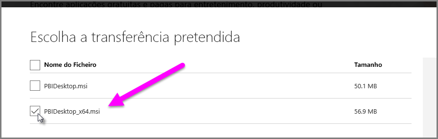

# Resolver problemas na importação de ficheiros .XLS e Access no Power BI Desktop
No **Power BI Desktop**, as **Bases de dados do Access** e as versões mais antigas dos **Livros do Excel** (ficheiros .XLS do tipo Excel 97-2003) utilizam o *Motor de Base de Dados do Access*. Há três situações comuns que podem impedir que o Motor de Base de Dados do Access funcione corretamente:

## Situação 1: Nenhum Motor de Base de Dados do Access instalado
Quando a mensagem de erro do Power BI Desktop indica que o Motor de Base de Dados do Access não está instalado, deve instalar a versão de 32 ou 64 bits do Motor de Base de Dados do Access que corresponde à sua versão do Power BI Desktop. Pode instalar o Motor de Base de Dados do Access a partir da [página de transferências](http://www.microsoft.com/download/details.aspx?id=13255).

>[!NOTE]
>Se a versão de bits instalada do Motor de Base de Dados do Access for diferente da versão de bits de instalação do Microsoft Office, as aplicações do Office não poderão usar o Motor de Base de Dados do Access.

## Situação 2: A versão de bits do Motor de Base de Dados do Access (32 ou 64 bits) é diferente da versão de bits do Power BI Desktop
Esta situação geralmente ocorre quando a versão instalada do Microsoft Office é de 32 bits e a versão do Power BI Desktop instalada é de 64 bits. Pode também ocorrer a situação oposta, e a inconsistência na versão de bits ocorre em ambos os casos (se estiver a utilizar uma subscrição do Office 365, consulte a **Situação 3** para um diferente problema e solução). Qualquer uma das seguintes soluções pode solucionar este erro de inconsistência de versão de bits:

1. Altere a versão do Power BI Desktop para corresponder à versão de bits de instalação do Microsoft Office. Para alterar a versão de bits do Power BI Desktop, desinstale o Power BI Desktop e, em seguida, instale a versão do Power BI Desktop que corresponde à sua instalação do Office. Para selecionar uma versão do Power BI Desktop, na página de transferência para ambiente de trabalho, selecione **Opções de transferência avançadas**.
   
   
   
   Na página de transferência que for apresentada, selecione o seu idioma e, em seguida, selecione o botão **Transferir**. No ecrã apresentado, selecione a caixa de verificação ao lado de PBIDesktop.msi para a versão de 32 bits ou PBIDesktop_x64.msi para a versão de 64 bits. Na ecrã seguinte, é selecionada a versão de 64 bits.
   
   
   
   >[!NOTE]
   >Ao usar a versão de 32 bits do Power BI Desktop, quando criar modelos de dados muito grandes, poderá ter problemas de memória insuficiente.
2. Altere a versão do Microsoft Office para corresponder à versão de bits da instalação do Power BI Desktop. Para alterar a versão de bits do Microsoft Office, desinstale o Office e, em seguida, instale a versão do Office que corresponde à sua instalação do Power BI Desktop.
3. Se o erro tiver ocorrido ao tentar abrir um ficheiro .XLS (um livro do Excel 97-2003), poderá evitar o uso do Motor de Base de Dados do Access ao abrir o ficheiro .XLS no Excel e guardando-o como um ficheiro XLSX.
4. Se as três soluções anteriores não forem viáveis, é possível instalar as duas versões do Motor de Base de Dados do Access, mas *não* é uma solução recomendada. Instalar ambas as versões resolverá este problema para o Power Query para Excel e Power BI Desktop, mas apresentará erros e problemas de qualquer aplicação que usa automaticamente (por predefinição) a versão de bits do Motor de Base de Dados do Access que foi instalado pela primeira vez. Para instalar as duas versões de bits do Motor de Base de Dados do Access, [transfira](http://www.microsoft.com/download/details.aspx?id=13255) ambas as versões e, em seguida, execute cada uma através da opção */passive*. Por exemplo:
   
       c:\users\joe\downloads\AccessDatabaseEngine.exe /passive
   
       c:\users\joe\downloads\AccessDatabaseEngine_x64.exe /passive

## Situação 3: Problemas ao utilizar ficheiros .XLS ou do Access com uma subscrição do Office 365
Se estiver a utilizar uma subscrição do Office 365, seja o **Office 2013** ou o **Office 2016**, o fornecedor do Motor de Base de Dados do Access é registado numa localização de registo virtual que *só* é acessível a processos do Office. Como resultado, o Motor de Aplicação Híbrida (que é responsável por executar o Excel não Office 365 e o Power BI Desktop), que não é um processo do Office, não pode utilizar o fornecedor do Motor de Base de Dados do Access.

Para solucionar esta situação, pode [transferir e instalar o Motor de Base de Dados do Access redistribuível](http://www.microsoft.com/download/details.aspx?id=13255) correspondente à versão de bits da sua instalação do Power BI Desktop (veja as secções anteriores para obter mais informações sobre as versões de bits).

## Outras situações que originam problemas de importação
Esforçamo-nos por cobrir o máximo possível de problemas que ocorram com ficheiros .XLS ou Access. Caso de se depare com problemas que não são abrangidos neste artigo, submeta uma pergunta sobre o problema ao [Suporte do Power BI](https://powerbi.microsoft.com/support/). Estamos regularmente à procura de problemas que possam afetar muitos clientes para incluí-los nos nossos artigos.

