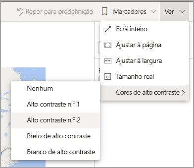
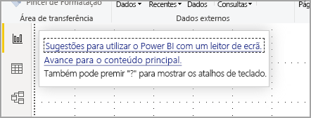
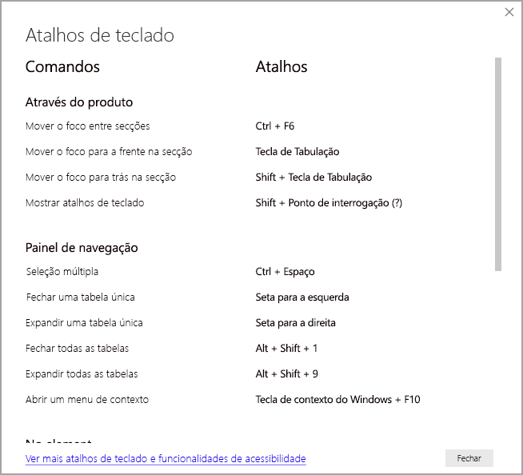
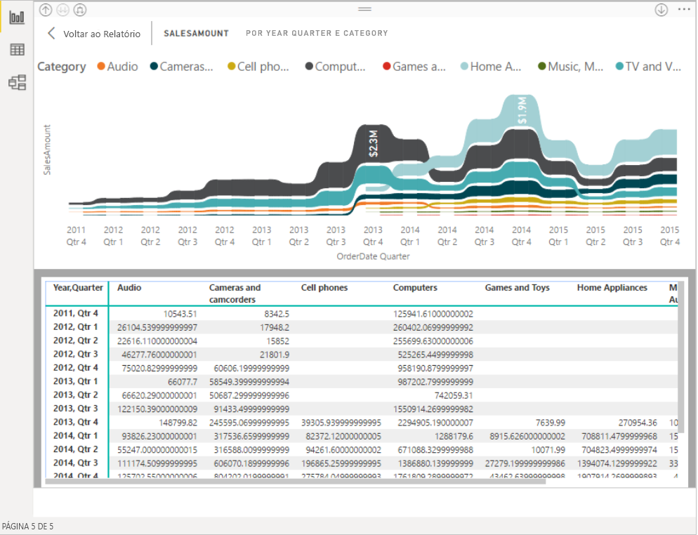

# Consumir relatórios do Power BI com as ferramentas de acessibilidade
O Power BI tem várias funcionalidades incorporadas para ajudar as pessoas com incapacidades a consumir e interagir mais facilmente com os relatórios do Power BI. Estas ferramentas ajudam os utilizadores a obter as mesmas informações de um relatório que aqueles que não utilizam tecnologias de apoio.

Existem alguns termos a conhecer à medida que lê este artigo:

* **Foco** é o local onde o rato se encontra na página. O foco é geralmente indicado por um limite azul em redor de um objeto.
* **Tela** é a área de página do relatório.

As seguintes secções descrevem as ferramentas de acessibilidade disponíveis para consumir relatórios do Power BI.

## Navegação através do teclado

Ao iniciar o Power BI Desktop ou o serviço Power BI, assim que prime a **Tecla de Tabulação**, é apresentada uma descrição no canto superior direito. A ligação intitulada **Sugestões para utilizar o Power BI com um leitor de ecrã** direciona-o para este artigo, fornecendo informações sobre como consumir um relatório com as ferramentas de acessibilidade. Clicar na ligação **Avançar para o conteúdo principal** permite-lhe aceder à tela do relatório.

Premir a tecla **?** abre uma caixa de diálogo com os atalhos de teclado utilizados com mais frequência no Power BI. Para ver uma lista completa de atalhos de teclado disponíveis no Power BI, pode navegar até à ligação na parte inferior da caixa de diálogo, que lhe permite aceder à documentação do Power BI em [atalhos de teclado](desktop-accessibility-keyboard-shortcuts.md).

Pode mudar o foco entre os separadores de página do relatório ou os objetos de uma determinada página do relatório ao premir **Ctrl+F6**. Quando o foco estiver numa página do relatório carregada, utilize a **Tecla de Tabulação** para mudar o foco para cada objeto na página, incluindo todas as caixas de texto, imagens, formas e gráficos. 

Em geral, utilizar **Enter** para selecionar ou aceder e utilizar **Esc** para sair são comandos comuns no Power BI.

### Navegação através do teclado para elementos visuais

Muitos criadores de relatórios do Power BI criam relatórios que contêm um grande volume de dados. À medida que percorre um elemento visual, pode ser cansativo navegar em todos os elementos do mesmo. A navegação através do teclado para elementos visuais foi concebida como uma hierarquia, com três níveis. Estes três níveis são descritos nos seguintes parágrafos.

Para percorrer o primeiro nível, ao navegar para um elemento visual, prima **Ctrl+Seta Para a Direita** para aceder a esse elemento visual. Depois de aceder a esse elemento visual, pode premir a **Tecla de Tabulação** para percorrer as áreas principais do mesmo. Estas áreas principais que pode percorrer são a área de representação gráfica de dados, as categorias do eixo (se aplicável ao elemento visual) e a legenda (se o elemento visual tiver uma).

O seguinte .gif mostra como um utilizador percorre o primeiro nível de um elemento visual:

O segundo nível da hierarquia é aceder a uma das áreas principais (área de representação gráfica de dados, categorias do eixo x, legenda) do elemento visual. Ao consumir um relatório, pode ir para uma dessas áreas principais e percorrer os pontos de dados ou as categorias nessa secção do elemento visual. Depois de decidir que área pretende explorar em maior detalhe, pode premir **Enter** para percorrer essa área específica.

Se quiser selecionar todos os pontos de dados numa série, navegue até à legenda e prima **Enter**. Uma vez na legenda, pode premir a **Tecla de Tabulação** para navegar nas diferentes categorias na legenda. Prima **Enter** para selecionar uma série específica.

Se quiser selecionar pontos de dados específicos, navegue até à área de representação gráfica de dados e prima **Enter**. Uma vez na área de representação gráfica de dados, pode premir a **Tecla de Tabulação** para navegar nos pontos de dados. Se o seu elemento visual tiver múltiplas séries, pode premir a tecla **Seta Para Cima** ou **Seta Para Baixo** para passar para os pontos de dados numa série diferente.

Se quiser selecionar todos os pontos de dados num eixo de categorias, navegue até às etiquetas do eixo e prima **Enter**. Uma vez nas etiquetas do eixo, pode premir a **Tecla de Tabulação** para navegar nos nomes das etiquetas. Prima **Enter** para selecionar o nome de uma etiqueta.

Se navegou para uma camada, pode premir **Esc** para sair dessa camada. O seguinte .gif mostra como um utilizador pode aceder e sair dos níveis de um elemento visual, bem como selecionar pontos de dados e etiquetas de categorias do eixo x, ir para uma série diferente e selecionar todos os pontos de dados numa série.

Se não conseguir navegar para um objeto ou um elemento visual ao utilizar um teclado, poderá ser porque o autor do relatório decidiu ocultar esse objeto da ordem de tabulação. Normalmente, os autores de relatórios ocultam objetos decorativos da ordem de tabulação. Se não conseguir percorrer um relatório de uma forma lógica, deverá contactar o autor do relatório. Os autores de relatórios podem definir a ordem de tabulação de objetos e elementos visuais.

### Navegação através do teclado para segmentações de dados

As segmentações de dados também têm a funcionalidade de acessibilidade incorporada. Quando selecionar uma segmentação de dados, para ajustar o valor da mesma, utilize **Ctrl+Seta Para a Direita** para percorrer os diversos controlos na segmentação de dados. Por exemplo, ao premir inicialmente **Ctrl+Seta Para a Direita**, o foco estará na borracha. Em seguida, premir a **Barra de Espaço** é o equivalente a clicar no botão de borracha, o que apaga todos os valores da segmentação de dados.

Pode navegar nos controlos numa segmentação de dados ao premir a **Tecla de Tabulação**. Se premir a **Tecla de Tabulação** quando estiver a utilizar a borracha, irá para o botão de menu pendente. Se premir novamente a **Tecla de Tabulação**, irá para o primeiro valor da segmentação de dados (se existirem vários valores para a segmentação de dados, como um intervalo).

### Mudar de páginas

Quando o foco estiver nos separadores de página do relatório, utilize a **Tecla de Tabulação** ou as teclas de **Seta** para mudar o foco para a página seguinte do relatório. O leitor de ecrã lê o título da página do relatório e indica se esta está atualmente selecionada. Para carregar a página do relatório que está atualmente sob foco, prima a tecla **Enter** ou a **Barra de Espaço**.

### Aceder ao cabeçalho do elemento visual
Ao navegar entre elementos visuais, pode premir **Alt+Shift+F10** para mover o foco para o cabeçalho do elemento visual. O cabeçalho do elemento visual inclui várias opções, incluindo ordenar, exportar os dados utilizados para o gráfico e o Modo de detalhe. Os ícones apresentados no cabeçalho do elemento visual irão depender das opções que o autor do relatório decidiu mostrar.

## Leitor de ecrã

Ao ver um relatório, é recomendável deixar o modo de análise desativado. O Power BI deve ser encarado mais como uma aplicação e menos como um documento, pelo que foi configurado com uma navegação personalizada para que seja mais fácil navegar pelo mesmo. Ao utilizar um leitor de ecrã com o Power BI Desktop, também deve verificar se o leitor de ecrã está aberto antes de iniciar o Power BI Desktop.

Ao navegar nos objetos, o leitor de ecrã lê o tipo e o título do objeto (caso tenha um). O leitor de ecrã também lê uma descrição desse objeto (texto alternativo), caso tenha sido fornecida pelo autor do relatório.

### Mostrar dados
Pode premir **Alt+Shift+F11** para apresentar uma versão acessível da janela **Mostrar dados**. Esta janela permite-lhe explorar os dados utilizados no elemento visual numa tabela HTML com os mesmos atalhos de teclado que normalmente utiliza com o leitor de ecrã.

A funcionalidade **Mostrar dados** é uma tabela HTML apenas acessível para um leitor de ecrã através deste atalho de teclado. Se abrir a opção **Mostrar dados** no cabeçalho do elemento visual, será apresentada uma tabela que *não* é compatível com leitores de ecrã.  Ao utilizar a funcionalidade **Mostrar dados** através de atalhos de teclado, ative o modo de análise para tirar partido de todas as teclas de atalho do seu leitor de ecrã.

Para sair da vista **Mostrar dados** e regressar a um relatório, prima **Esc**.

## Modos de alto contraste

O serviço Power BI tenta detetar as definições de alto contraste utilizadas no Windows. Porém, a eficácia da deteção depende do browser onde o serviço Power BI está a ser utilizado. Se quiser definir o tema manualmente no serviço Power BI, pode selecionar **Ver > Cores de alto contraste** e, em seguida, selecionar o tema que pretende aplicar ao relatório.

## Próximos passos

A coleção de artigos relativos à acessibilidade no Power BI é a seguinte:

* [Descrição geral da acessibilidade no Power BI](desktop-accessibility-overview.md) 
* [Criar relatórios acessíveis no Power BI](desktop-accessibility-creating-reports.md) 
* [Creating Power BI reports with accessibility tool](desktop-accessibility-creating-tools.md) (Criar relatórios no Power BI com as ferramentas de acessibilidade)
* [Accessibility keyboard shortcuts for Power BI reports](desktop-accessibility-keyboard-shortcuts.md) (Atalhos de teclado de acessibilidade para os relatórios do Power BI)
* [Lista de verificação relativa à acessibilidade dos relatórios](desktop-accessibility-creating-reports.md#report-accessibility-checklist)

