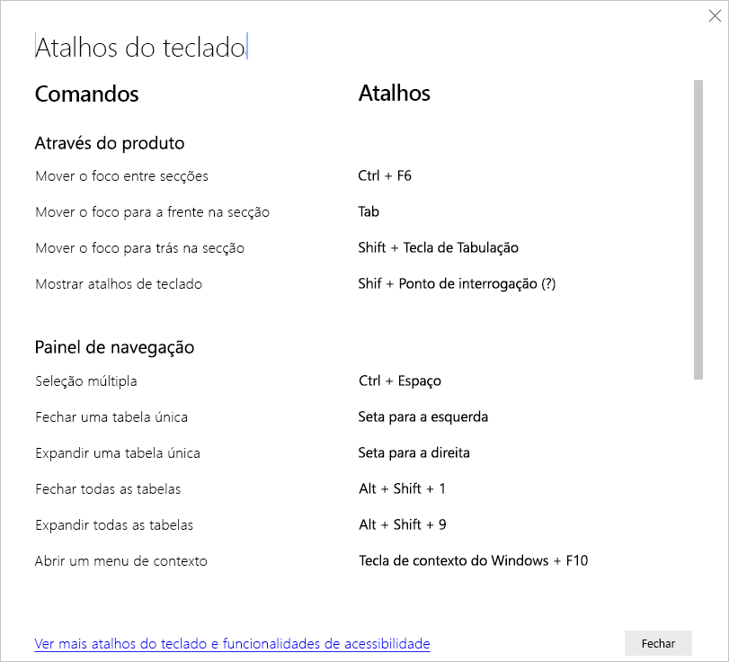

# Atalhos de teclado no Power BI Desktop

Os atalhos de teclado são úteis para se deslocar nos relatórios do Power BI com um teclado. As tabelas neste artigo descrevem os atalhos disponíveis num relatório do Power BI. 

Quando utilizar o Power BI Desktop, pode premir **Shift + ?** para mostrar os atalhos de teclado, conforme mostrado na seguinte imagem.

Para além de utilizar estes atalhos de teclado no **Power BI Desktop**, esses atalhos funcionam também nas seguintes experiências:

* Caixa de diálogo **Explorador de Perguntas e Respostas**
* Caixa de diálogo **Introdução**
* Menu **Ficheiro** e caixa de diálogo **Acerca de**
* Barra de **Aviso**
* Caixa de diálogo **Restauro de Ficheiros**
* Caixa de diálogo **Feedback Negativo**

Através dos nossos esforços contínuos de melhorar a acessibilidade, a lista anterior de experiências também suporta leitores de ecrã e definições de alto contraste.

## Atalhos frequentes
| Para efetuar esta ação           | Prima                |
| :------------------- | :------------------- |
| Mover o foco entre secções  | **Ctrl+F6** |
| Mover o foco para a frente na secção | **Tecla de Tabulação**         |
| Mover o foco para trás na secção | **Shift+Tecla de Tabulação** |
| Selecionar ou desselecionar um objeto | **Enter** ou **Barra de Espaço** |
| Selecionar vários objetos | **Ctrl+Barra de Espaço** |

## No elemento visual
| Para efetuar esta ação           | Prima                |
| :------------------- | :------------------- |
| Mover o foco para o menu visual | **Alt+Shift+F10** |
| Mostrar dados | **Alt+Shift+F11**  |
| Introduzir um elemento visual | **Ctrl+Seta Para a Direita** |
| Introduzir uma camada | **Enter** |
| Sair de uma camada ou elemento visual | **Esc** |
| Selecionar ou desselecionar um ponto de dados | **Enter** ou **Barra de Espaço** |
| Seleção múltipla | **Ctrl+Enter** ou **Ctrl+Barra de Espaço** |
| Clique com o botão direito do rato | <ul><li>Teclado do Windows: **Tecla de Contexto do Windows+F10.** A tecla de contexto do Windows está entre a tecla Alt à direita e a tecla Seta Para a Esquerda</li><li>Outro teclado: **Shift+F10**</li></ul> |
| Limpar seleção | **Ctrl+Shift+C** |
| Mostrar ou ocultar a descrição | **Ctrl+H** |

## Navegação em tabelas e matrizes
| Para efetuar esta ação          | Prima                |
| :------------------- | :------------------- |
| Mover o foco uma célula para cima/baixo (aplica-se a todas as células em todas as áreas)  | **Seta Para Cima** / **Seta Para Baixo** |
| Mover o foco uma célula para a esquerda/direita (aplica-se a todas as células em todas as áreas)  | **Seta Para a Esquerda** / **Seta Para a Direita** |

## Painel de navegação
| Para executar esta ação           | Prima                |
| :------------------- | :------------------- |
| Seleção múltipla | **Ctrl+Barra de Espaço** |
| Fechar uma tabela única | **Seta Para a Esquerda** |
| Expandir uma tabela única | **Seta Para a Direita** |
| Fechar todas as tabelas | **Alt+Shift+1** |
| Expandir todas as tabelas | **Alt+Shift+9** |
| Abrir um menu de contexto | <ul><li>Teclado do Windows: **Tecla de Contexto do Windows+F10.**  A tecla de contexto do Windows está entre a tecla Alt à direita e a tecla Seta Para a Esquerda</li><li>Outro teclado: **Shift+F10**</li></ul> |

## Segmentação de Dados
| Para efetuar esta ação         | Prima                |
| :------------------- | :------------------- |
| Interagir com uma segmentação de dados | **Ctrl+Seta Para a Direita** |

## Painel de seleção
| Para efetuar esta ação           | Prima                |
| :------------------- | :------------------- |
| Ativar o painel de seleção | **F6** |
| Mover um objeto para cima nas camadas | **Ctrl+Shift+F** |
| Mover um objeto para baixo nas camadas | **Ctrl+Shift+B** |
| Ocultar/mostrar (ativar ou desativar) um objeto | **Ctrl+Shift+S** |

## Editor DAX
| Para efetuar esta ação          | Prima                |
| :------------------- | :------------------- |
| Mover linha para cima/para baixo | **Alt+Seta Para Cima** / **Seta Para Baixo** |
| Copiar linha para cima/para baixo | **Shift+Alt+Seta Para Cima** / **Seta Para Baixo** |
| Inserir linha abaixo | **Ctrl+Enter** |
| Inserir linha acima | **Ctrl+Shift+Enter** |
| Ir para parênteses correspondente | **Ctrl+Shift+**  \ |
| Avançar linha/expandir linha para a margem | **Ctrl+]**  /  **[** |
| Inserir cursor | **Alt+Clique** |
| Selecionar a linha atual | **Ctrl+I** |
| Selecione todas as ocorrências da seleção atual | **Ctrl+Shift+L** |
| Selecionar todas as ocorrências da palavra atual | **Ctrl+F2** |

## Introduzir dados
| Para efetuar esta ação           | Prima                |
| :------------------- | :------------------- |
| Grelha editável de saída | **Ctrl+Tecla de Tabulação** |

## Considerações e limitações
Existem algumas limitações e problemas conhecidos com as funcionalidades de acessibilidade. As descrições dessas limitações e problemas encontram-se na lista seguinte:

* Ao utilizar leitores de ecrã com o **Power BI Desktop**, terá a melhor experiência se abrir o seu leitor de ecrã antes de abrir ficheiros no **Power BI Desktop**.
* Se estiver a utilizar o Narrador, existem algumas limitações com a funcionalidade **Mostrar dados** como uma tabela HTML.

## Próximos passos

A coleção de artigos relativos à acessibilidade no Power BI é a seguinte:

* [Descrição geral da acessibilidade no Power BI](desktop-accessibility-overview.md) 
* [Criar relatórios acessíveis no Power BI](desktop-accessibility-creating-reports.md) 
* [Consumir relatórios no Power BI com ferramentas de acessibilidade](desktop-accessibility-consuming-tools.md)
* [Creating Power BI reports with accessibility tool](desktop-accessibility-creating-tools.md) (Criar relatórios no Power BI com as ferramentas de acessibilidade)
* [Lista de verificação relativa à acessibilidade dos relatórios](desktop-accessibility-creating-reports.md#report-accessibility-checklist)

Poderá também estar interessado nos seguintes artigos:

* [Utilizar Temas de Relatório no Power BI Desktop](desktop-report-themes.md)

