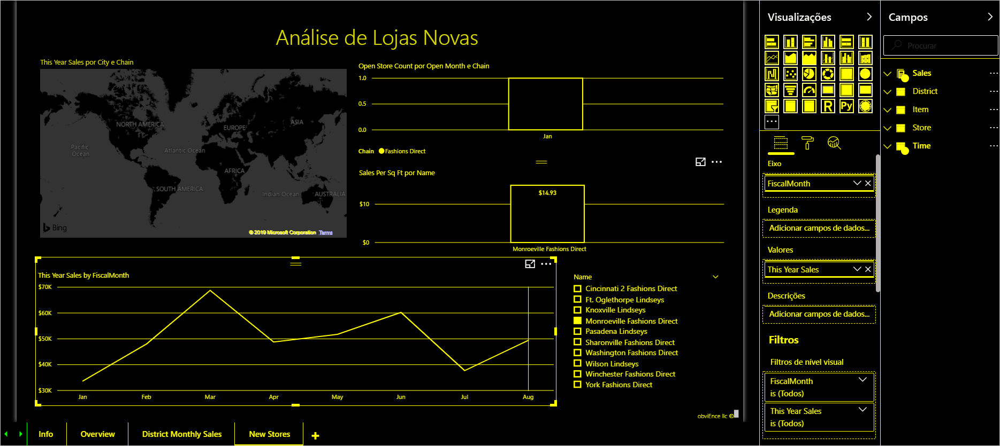

# Overview of accessibility in Power BI (Descrição geral da acessibilidade no Power BI)

Ao trabalhar com o Power BI, considere os diferentes tipos de utilizadores que podem interagir com os seus relatórios. Pode criar relatórios de fácil navegação e compreensão para utilizadores de teclado ou leitor de ecrã. Estes relatórios permitem que os utilizadores que têm deficiências visuais ou físicas beneficiem dos seus relatórios.

Este artigo apresenta uma descrição geral do Power BI e da acessibilidade. Os artigos adicionais fornecem orientações e ferramentas que podem ajudá-lo a criar ótimos relatórios tendo em conta a acessibilidade.

## Design universal

O design universal é o design de produtos que podem ser utilizados por tantas pessoas quanto razoavelmente possível, sem a necessidade de adaptação especial ou design especializado. Ao criar relatórios ou experiências no Power BI, é importante considerar as necessidades dos seus utilizadores. A criação de uma experiência acessível não só beneficiará os utilizadores finais que possam ter deficiências auditivas, motoras, cognitivas ou visuais. Como pode ajudar todos os utilizadores finais na sua organização. O Power BI fornece-lhe as ferramentas para criar e consumir relatórios acessíveis. Cabe-lhe a si, como criador de relatórios, utilizar essas ferramentas para melhorar a experiência de todos.

## Normas de acessibilidade

O Power BI está em conformidade com as seguintes normas de acessibilidade. Os padrões ajudam a garantir que as suas experiências do Power BI são acessíveis para o máximo de pessoas possível. Quando cria relatórios ou dashboards acessíveis, os conteúdos são acessíveis para quem os estiver a ver no Power BI Mobile.

### WCAG 2.1

As Diretrizes de Acessibilidade para o Conteúdo da Web (WCAG) ajudam a tornar o conteúdo da Web acessível a pessoas com deficiências. Seguem-se os princípios-chave das diretrizes:

1. **Percetível**. Os componentes da interface do utilizador e as informações têm de ser apresentados aos utilizadores de forma percetível.
2. **Operável**. Os componentes da interface do utilizador e a navegação têm de ser operáveis.
3. **Compreensível**. As informações e o funcionamento da interface do utilizador têm de ser compreensíveis.

### US Section 508

A US Section 508 é uma norma que exige que os governos e as agências federais tornem as suas tecnologias eletrónicas e de informação acessíveis a pessoas com deficiências.

### EN 301 549

A EN 301 549 é a Norma Europeia Harmonizada para os requisitos de Acessibilidade para produtos e serviços de ICT.  

## Próximas etapas

Para obter mais informações sobre a acessibilidade do Power BI, veja os recursos seguintes:

* [Criar relatórios do Power BI para acessibilidade](desktop-accessibility-creating-reports.md)
* [Consumir relatórios do Power BI com as ferramentas de acessibilidade](desktop-accessibility-consuming-tools.md)
* [Criar relatórios no Power BI com as ferramentas de acessibilidade](desktop-accessibility-creating-tools.md)
* [Atalhos de teclado no Power BI Desktop](desktop-accessibility-keyboard-shortcuts.md)
* [Lista de verificação relativa à acessibilidade dos relatórios](desktop-accessibility-creating-reports.md#report-accessibility-checklist)

