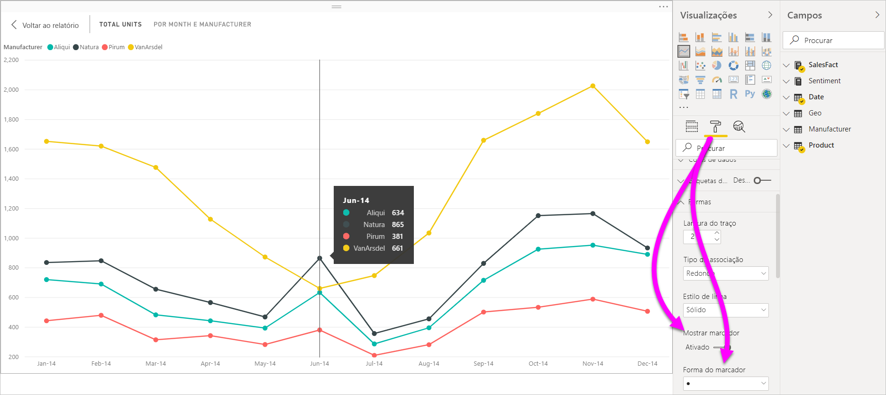
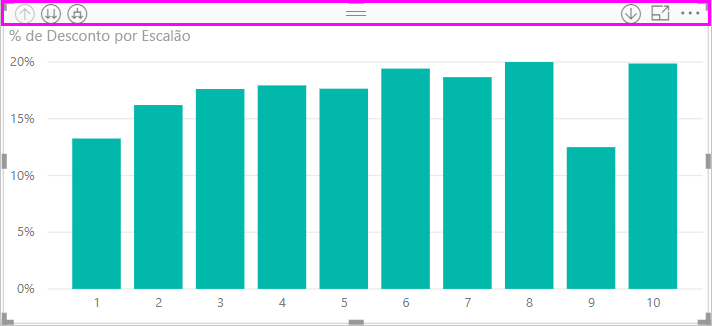
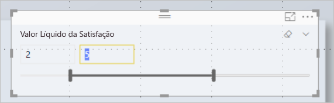
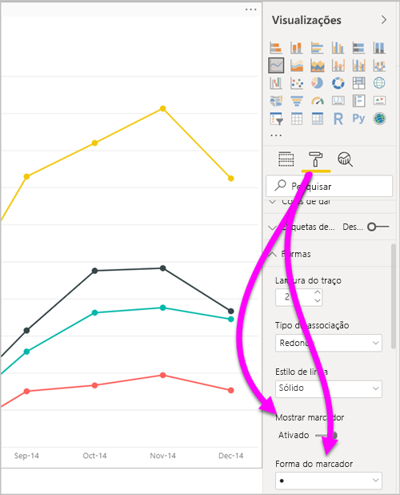
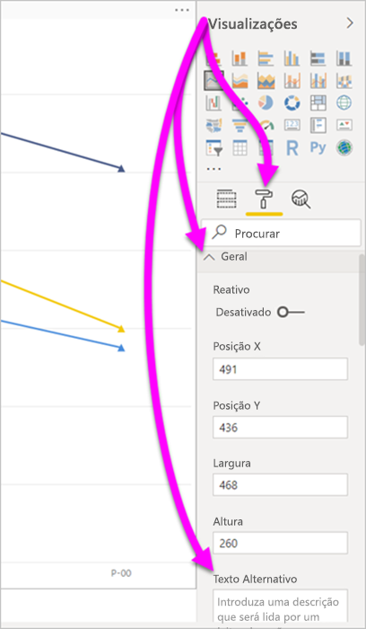
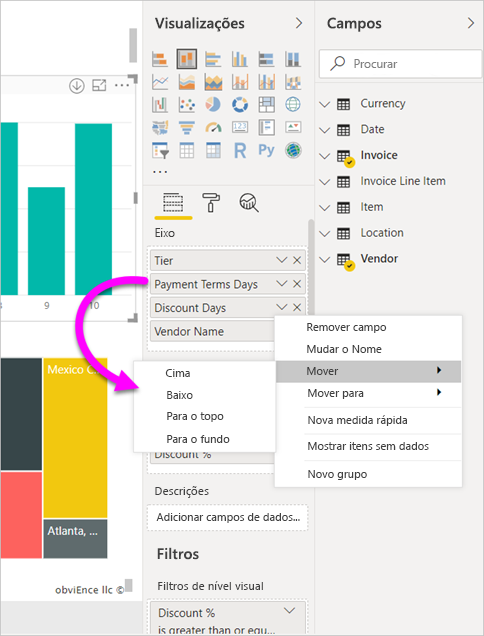
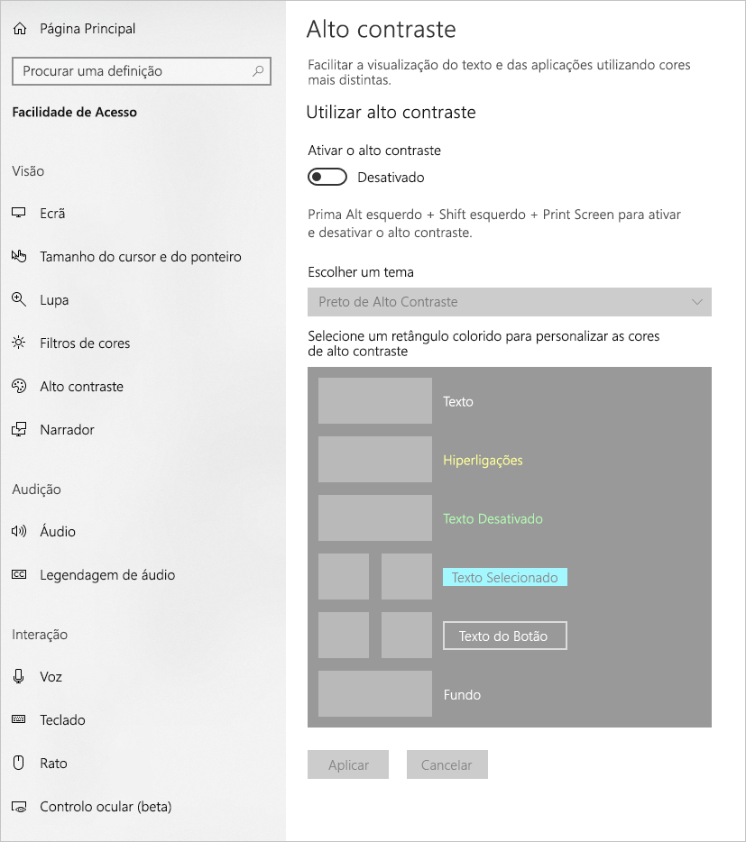
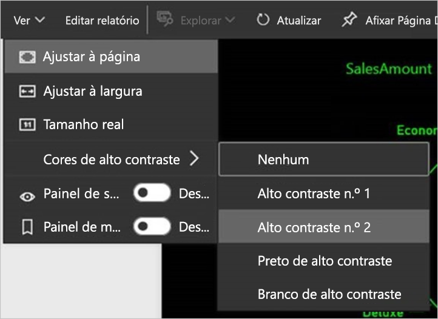

# Acessibilidade nos relatórios do Power BI Desktop
O Power BI tem funcionalidades que permitem a pessoas com incapacidades consumir e interagir mais facilmente com os relatórios do Power BI. Estas funcionalidades incluem a capacidade de consumir um relatório com o teclado ou um leitor de ecrã, utilizando a tabulação para colocar o foco em vários objetos numa página e a utilização cuidada de marcadores em visualizações.

## Consumir um relatório do Power BI Desktop com um teclado ou leitor de ecrã
A partir da versão de setembro de 2017 do **Power BI Desktop**, pode premir **Shift+?** para mostrar uma janela que descreve os atalhos de teclado de acessibilidade disponíveis no **Power BI Desktop**.

Com as melhorias de acessibilidade, pode consumir um relatório do Power BI com um teclado ou um leitor de ecrã com as seguintes técnicas:

> [!NOTE]
> Ao ver um relatório, deve ter o modo de análise desativado.

Pode mudar o foco entre os separadores de página do relatório ou os objetos de uma determinada página do relatório ao premir **Ctrl+F6**.

* Quando o foco estiver nos separadores de página do relatório, utilize a **Tecla de Tabulação** ou as teclas de **Seta** para mudar o foco para a página seguinte do relatório. O leitor de ecrã lê o título da página do relatório e indica se esta está atualmente selecionada. Para carregar a página do relatório que está atualmente sob foco, prima **Enter** ou a Barra de Espaço.
* Quando o foco estiver numa página do relatório carregada, utilize a **Tecla de Tabulação** para mudar o foco para cada objeto na página, incluindo todas as caixas de texto, imagens, formas e gráficos. O leitor de ecrã lê o tipo e o título do objeto (caso exista). O leitor de ecrã também lê uma descrição desse objeto, caso tenha sido fornecida pelo autor do relatório. 

Ao navegar entre elementos visuais, pode premir **Alt+Shift+F10** para mover o foco para o cabeçalho do elemento visual. O cabeçalho do elemento visual inclui várias opções, incluindo ordenar, exportar os dados utilizados para o gráfico e o Modo de detalhe. 

Pode premir **Alt+Shift+F11** para apresentar uma versão acessível da janela **Mostrar dados**. Esta janela permite-lhe explorar os dados utilizados no elemento visual numa tabela HTML com os mesmos atalhos de teclado que normalmente utiliza com o leitor de ecrã. 

> [!NOTE]
> A funcionalidade **Mostrar dados** só está acessível para um leitor de ecrã através deste atalho de teclado. Se abrir a janela **Mostrar dados** no cabeçalho do elemento visual, esta não será acessível para um leitor de ecrã. Ao utilizar a funcionalidade **Mostrar dados**, ative o modo de análise para tirar partido de todas as teclas de atalho do seu leitor de ecrã.

A partir da versão de julho de 2018 do **Power BI Desktop**, as segmentações de dados também têm funcionalidades de acessibilidade incorporadas. Ao selecionar uma segmentação de dados, para ajustar o valor da mesma, prima **Ctrl+Seta Para a Direita** para percorrer os diversos controlos da segmentação de dados. Por exemplo, ao premir inicialmente **Ctrl+Seta Para a Direita**, o foco estará na borracha. Em seguida, premir a Barra de Espaço é o equivalente a clicar no botão de borracha, o que apaga todos os valores da segmentação de dados. 

Pode mover-se pelos controlos numa segmentação de dados ao premir a **Tecla de Tabulação**. Se premir a **Tecla de Tabulação** quando estiver a utilizar a borracha, irá para o botão de menu pendente. Se premir novamente a **Tecla de Tabulação**, irá para o primeiro valor da segmentação de dados (se existirem vários valores para a segmentação de dados, como um intervalo). 

Estas adições de acessibilidade permitem aos utilizadores consumir totalmente relatórios do Power BI ao navegar através de um leitor de ecrã e um teclado.

## Sugestões para criar relatórios acessíveis
As sugestões seguintes podem ajudar a criar relatórios do **Power BI Desktop** que são mais acessíveis.

### Sugestões gerais para relatórios acessíveis

* Para os elementos visuais de **Linha**, **Área**, **Combinação**, **Dispersão** e **Bolhas**, ative a opção **Mostrar marcadores** e utilize uma **Forma do marcador** diferente em cada linha.
  
  * Para ativar a opção **Mostrar marcadores**, selecione a secção **Formato** no painel **Visualizações** e expanda a secção **Formas**. Desloque-se para baixo até à opção **Mostrar marcadores** e mude-a para **Ativa**.
  * Para personalizar linhas individuais, localize a opção **Personalizar séries** e mude-a para **Ativa**. Em seguida, selecione o nome de cada linha (ou área, se utilizar um gráfico de **Área**) na caixa pendente dessa secção **Formas**. Abaixo da caixa pendente, pode ajustar muitos aspetos do marcador utilizado para a linha selecionada, incluindo a respetiva forma, cor e tamanho.
  
    
  
  * Utilizar uma **Forma do marcador** diferente para cada linha permite que os consumidores do relatório distingam mais facilmente as linhas (ou áreas) umas das outras.
* No seguimento do ponto anterior, não dependa da cor para transmitir informações. Ao utilizar formas em gráficos de linhas e de dispersão, não fique dependente da formatação condicional para fornecer informações em tabelas e matrizes. 
* Escolha uma sequência de ordenação intencional para cada elemento visual no relatório. Quando os utilizadores de leitores de ecrã navegam pelos dados utilizados para o gráfico, é seguida a mesma sequência de ordenação do elemento visual.
* Selecione um tema de alto contraste e que seja funcional para utilizadores com daltonismo na galeria de temas. Importe-o através da funcionalidade de pré-visualização [**Personalização do tema**](desktop-report-themes.md).
* Forneça texto alternativo para todos os objetos num relatório. Isto garante que os consumidores do seu relatório compreendem a mensagem que está a tentar transmitir com um elemento visual. Além disso, isto pode ajudar caso os utilizadores não consigam ver o elemento visual, imagem, forma ou caixa de texto. Pode fornecer texto alternativo para qualquer objeto num relatório do **Power BI Desktop** ao selecionar o objeto (como um elemento visual, forma, entre outros) e, no painel **Visualizações**, selecionar a secção **Formato**. Em seguida, expanda a secção **Geral**, desloque-se até à parte inferior e preencha a caixa de texto **Texto Alternativo**.
  
  
* Certifique-se de que os seus relatórios têm contraste suficiente entre o texto e as cores de fundo. Existem várias ferramentas, como o [Colour Contrast Analyser](https://developer.paciellogroup.com/resources/contrastanalyser/), que pode utilizar para verificar as cores do seu relatório. 
* Utilize tamanhos e tipos de letra de texto que sejam facilmente legíveis. Um tamanho de texto pequeno, ou tipos de letra que poderão ser difíceis de ler, são inúteis para a acessibilidade.
* Inclua um título, etiquetas do eixo e etiquetas de dados em todos os elementos visuais.
* Utilize títulos relevantes em todas as páginas do relatório.
* Se for possível, evite incluir formas e imagens decorativas no seu relatório, pois estas são incluídas na ordem dos separadores do relatório. Se precisar de incluir objetos decorativos no relatório, atualize o texto alternativo dos mesmos para que os utilizadores com leitores de ecrã saibam que são decoração.

### Organizar os itens nos Registos de campo
A partir da versão de outubro de 2018 do **Power BI Desktop**, é possível navegar na área **Campos** com um teclado e interagir com leitores de ecrã. 

Para otimizar o processo de criação de relatórios com leitores de ecrã, está disponível um menu de contexto. Este menu permite mover campos na secção para cima ou para baixo na lista **Campos**. Também permite mover o campo para outras secções, como **Legenda**, **Valor**, entre outras.

## Suporte de alto contraste para relatórios

Ao utilizar modos de alto contraste no Windows, essas definições e a paleta que seleciona também são aplicadas aos relatórios no **Power BI Desktop**. 

O **Power BI Desktop** deteta automaticamente qual o tema de alto contraste que está a ser utilizado no Windows e aplica essas definições aos seus relatórios. Essas cores de alto contraste são mantidas no relatório quando for publicado no serviço Power BI, ou noutro local.

O serviço Power BI também tenta detetar as definições de alto contraste utilizadas no Windows. Porém, a eficácia da deteção depende do browser onde o serviço Power BI está a ser utilizado. Se quiser definir o tema manualmente no serviço Power BI, pode selecionar **Ver** > **Cores de alto contraste** e, em seguida, selecionar o tema que pretende aplicar ao relatório.

## Considerações e limitações
Existem algumas limitações e problemas conhecidos com as funcionalidades de acessibilidade. As descrições dessas limitações e problemas encontram-se na lista seguinte:

* Ao utilizar leitores de ecrã com o **Power BI Desktop**, terá a melhor experiência se abrir o seu leitor de ecrã antes de abrir ficheiros no **Power BI Desktop**.
* Se estiver a utilizar o Narrador, existem algumas limitações com a funcionalidade **Mostrar dados** como uma tabela HTML.

## Atalhos do teclado
Os atalhos de teclado são úteis para se deslocar nos relatórios do Power BI com um teclado. As tabelas seguintes descrevem os atalhos disponíveis num relatório do Power BI. Para além de utilizar estes atalhos de teclado no **Power BI Desktop**, esses atalhos funcionam também nas seguintes experiências:

* Caixa de diálogo **Explorador de Perguntas e Respostas**
* Caixa de diálogo **Introdução**
* Menu **Ficheiro** e caixa de diálogo **Acerca de**
* Barra de **Aviso**
* Caixa de diálogo **Restauro de Ficheiros**
* Caixa de diálogo **Feedback Negativo**

Através dos nossos esforços contínuos de melhorar a acessibilidade, a lista anterior de experiências também suporta leitores de ecrã e definições de alto contraste.

### Atalhos frequentes
| Para executar esta ação           | Prima                |
| :------------------- | :------------------- |
| Mover o foco entre secções  | **Ctrl+F6** |
| Mover o foco para a frente na secção | **Tecla de Tabulação**         |
| Mover o foco para trás na secção | **Shift+Tecla de Tabulação** |
| Selecionar ou desselecionar um objeto | **Enter** ou **Barra de Espaço** |
| Selecionar vários objetos | **Ctrl+Barra de Espaço** |

### No visual
| Para executar esta ação           | Prima                |
| :------------------- | :------------------- |
| Mover o foco para o menu visual | **Alt+Shift+F10** |
| Mostrar dados | **Alt+Shift+F11**  |
| Introduzir um elemento visual | **Ctrl+Seta Para a Direita** |
| Introduzir uma camada | **Enter** |
| Sair de uma camada ou elemento visual | **Esc** |
| Selecionar ou desselecionar um ponto de dados | **Enter** ou **Barra de Espaço** |
| Seleção múltipla | **Ctrl+Enter** ou **Ctrl+Barra de Espaço** |
| Clique com o botão direito do rato | <ul><li>Teclado do Windows: **Tecla de Contexto do Windows+F10.** A tecla de contexto do Windows está entre a tecla Alt à direita e a tecla Seta Para a Esquerda</li><li>Outro teclado: **Shift+F10**</li></ul> |
| Limpar seleção | **Ctrl+Shift+C** |

### Navegação em tabelas e matrizes
| Para executar esta ação          | Prima                |
| :------------------- | :------------------- |
| Mover o foco uma célula para cima/baixo (aplica-se a todas as células em todas as áreas)  | **Seta Para Cima** / **Seta Para Baixo** |
| Mover o foco uma célula para a esquerda/direita (aplica-se a todas as células em todas as áreas)  | **Seta Para a Esquerda** / **Seta Para a Direita** |

### Navegação no painel
| Para executar esta ação           | Prima                |
| :------------------- | :------------------- |
| Seleção múltipla | **Ctrl+Barra de Espaço** |
| Fechar uma tabela única | **Seta Para a Esquerda** |
| Expandir uma tabela única | **Seta Para a Direita** |
| Fechar todas as tabelas | **Alt+Shift+1** |
| Expandir todas as tabelas | **Alt+Shift+9** |
| Abrir um menu de contexto | <ul><li>Teclado do Windows: **Tecla de Contexto do Windows+F10.**  A tecla de contexto do Windows está entre a tecla Alt à direita e a tecla Seta Para a Esquerda</li><li>Outro teclado: **Shift+F10**</li></ul> |

### Segmentação de Dados
| Para executar esta ação         | Prima                |
| :------------------- | :------------------- |
| Interagir com uma segmentação de dados | **Ctrl+Seta Para a Direita** |

### Painel de seleção
| Para executar esta ação           | Prima                |
| :------------------- | :------------------- |
| Ativar o painel de seleção | **F6** |
| Mover um objeto para cima nas camadas | **Ctrl+Shift+F** |
| Mover um objeto para baixo nas camadas | **Ctrl+Shift+B** |
| Ocultar/mostrar (ativar ou desativar) um objeto | **Ctrl+Shift+S** |

### Editor DAX
| Para efetuar esta ação          | Prima                |
| :------------------- | :------------------- |
| Mover linha para cima/para baixo | **Alt+Seta Para Cima** / **Seta Para Baixo** |
| Copiar linha para cima/para baixo | **Shift+Alt+Seta Para Cima** / **Seta Para Baixo** |
| Inserir linha abaixo | **Ctrl+Enter** |
| Inserir linha acima | **Ctrl+Shift+Enter** |
| Ir para parênteses correspondente | **Ctrl+Shift+**  \ |
| Avançar linha/expandir linha para a margem | **Ctrl+]**  /  **[** |
| Inserir cursor | **Alt+Clique** |
| Selecionar a linha atual | **Ctrl+I** |
| Selecione todas as ocorrências da seleção atual | **Ctrl+Shift+L** |
| Selecionar todas as ocorrências da palavra atual | **Ctrl+F2** |

### Introduzir dados
| Para efetuar esta ação           | Prima                |
| :------------------- | :------------------- |
| Grelha editável de saída | **Ctrl+Tecla de Tabulação** |

## Próximos passos
* [Utilizar Temas de Relatório no Power BI Desktop (Pré-visualização)](desktop-report-themes.md)

