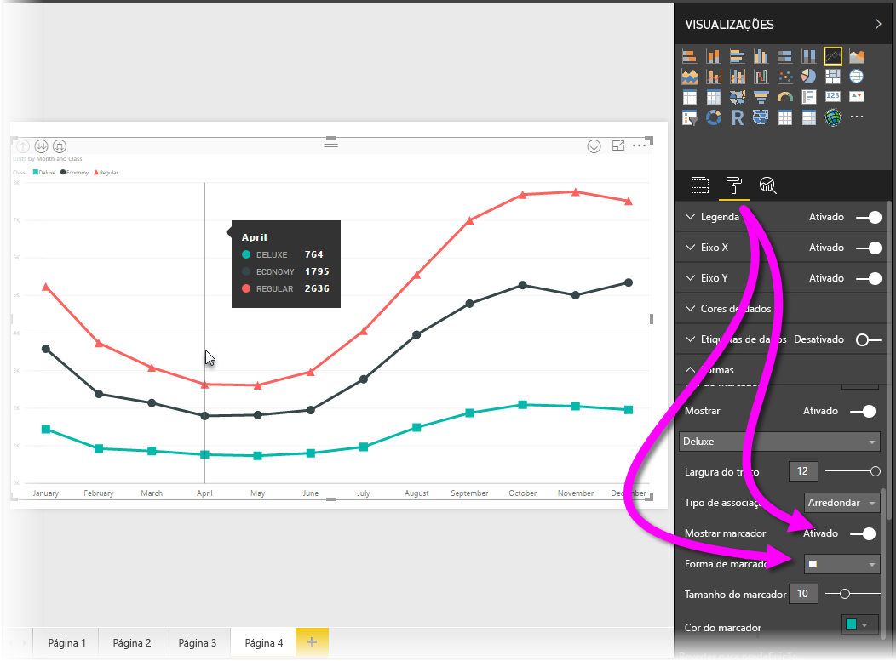
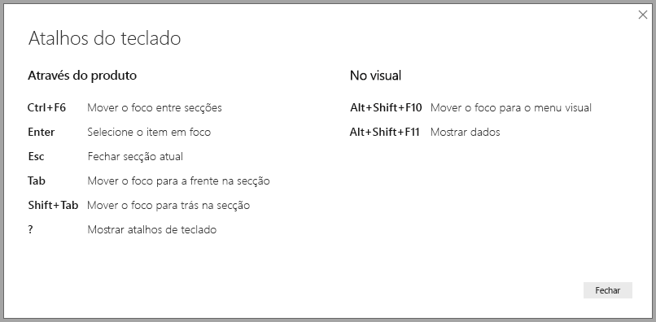
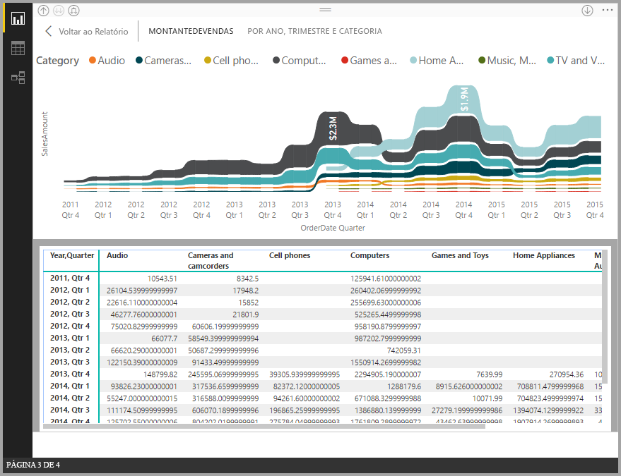
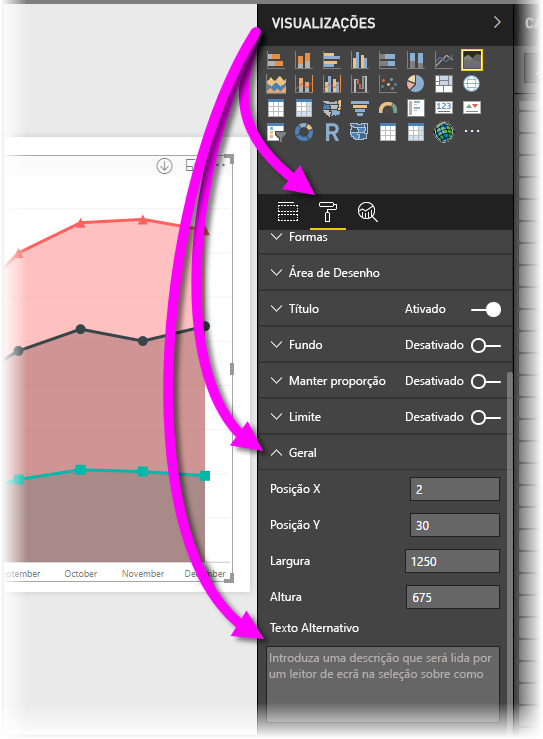
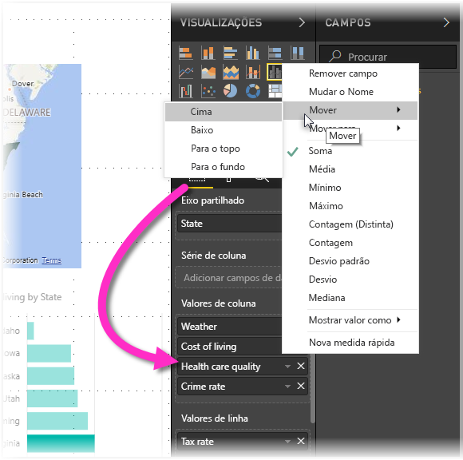

# Acessibilidade nos relatórios do Power BI Desktop
O Power BI tem funcionalidades que permitem a pessoas com incapacidades consumir e interagir mais facilmente com os relatórios do Power BI. Estas funcionalidades incluem a capacidade de consumir um relatório com o teclado ou um leitor de ecrã, utilizando a tabulação para colocar o foco em vários objetos numa página e a utilização cuidada de marcadores em visualizações.

> [!NOTE]
> Estas funcionalidades de acessibilidade estão disponíveis com a versão de junho de 2017 do **Power BI Desktop** e com as versões posteriores. Também estão planeadas para versões futuras funcionalidades de acessibilidade adicionais.
> 
> 

## Consumir um relatório do Power BI Desktop com um teclado ou leitor de ecrã
A partir da versão de setembro de 2017 do **Power BI Desktop**, pode premir a tecla **?** para mostrar uma janela que descreve os atalhos do teclado da acessibilidade disponíveis no **Power BI Desktop**.

Com as melhorias de acessibilidade, pode consumir um relatório do Power BI com um teclado ou um leitor de ecrã com as seguintes técnicas:

Pode mudar o foco entre os separadores de página do relatório ou os objetos de uma determinada página do relatório com as teclas **Ctrl+F6**.

* Quando o foco está nos *separadores de página do relatório*, utilize as teclas de *tabulação* ou de *seta* para mover o foco de uma página do relatório para a página seguinte. O leitor de ecrã lê o título da página do relatório e se esta está atualmente selecionada. Para carregar a página do relatório que tem o foco, utilize a tecla *Enter* ou a *Barra de Espaço*.
* Quando o foco está numa *página do relatório* carregado, utilize a tecla de *tabulação* para mudar o foco para cada objeto na página, que inclui todas as caixas de texto, imagens, formas e gráficos. O leitor de ecrã lê o tipo de objeto, o título do objeto (se existir um) e uma descrição do objeto, se for disponibilizada pelo autor do relatório. 

Se quiser interagir mais ao navegar pelos elementos visuais, pode premir **Alt+Shift+F10** para mover o foco para o cabeçalho do elemento visual, que contém várias opções, incluindo ordenar, exportar os dados que serviram de base para o gráfico e Modo de detalhe. 

Pode premir **Alt+Shift+F11** para apresentar uma versão acessível da janela *Mostrar dados*. Isto irá permitir-lhe explorar os dados utilizados no elemento visual de uma tabela HTML com os mesmos atalhos de teclado que normalmente utiliza com o seu leitor de ecrã. 

> [!NOTE]
> A funcionalidade Mostrar dados só está acessível para um leitor de ecrã através deste atalho de teclado. Se abrir a opção Mostrar dados no cabeçalho do elemento visual, esta não será acessível para um leitor de ecrã.

A partir da versão de julho de 2018 do **Power BI Desktop**, as segmentações de dados também têm funcionalidades de acessibilidade incorporadas. Quando seleciona uma segmentação de dados, para ajustar o valor da segmentação de dados, utilize CTRL + seta para a direita (controlo mais a tecla de seta para a direita) para percorrer os diversos controlos dentro da segmentação de dados. Por exemplo, quando inicialmente prime CTRL + seta para a direita, o foco está na borracha e premir a barra de espaços é equivalente a clicar no botão borracha, o que apaga todos os valores na segmentação de dados. 

Pode mover-se pelos controlos numa segmentação de dados ao premir a tecla TAB. Se premir a tecla TAB quando está a utilizar a borracha, irá para o botão de menu pendente; se premir novamente a tecla TAB, irá para o primeiro valor de segmentação de dados (se existirem vários valores para a segmentação de dados, como, por exemplo, um intervalo). 

Estas adições de acessibilidade foram criadas para permitir que os utilizadores consumam totalmente os relatórios do Power BI com a ajuda de navegação de um leitor de ecrã ou de um teclado.

## Sugestões para criar relatórios acessíveis
As sugestões seguintes podem ajudar a criar relatórios do **Power BI Desktop** que são mais acessíveis.

### Sugestões gerais para relatórios acessíveis

* Para os elementos visuais de **Linha**, **Área** e **Combinação**, bem como para os elementos visuais de **Dispersão** e **Bolhas**, ative os marcadores e utilize uma *Forma do marcador* diferente para cada linha.
  
  * Para ativar os *Marcadores*, selecione a secção **Formato** no painel **Visualizações**, expanda a secção **Formas** e, em seguida, desloque o ecrã para baixo para localizar o botão de alternar **Marcadores** e *Ativá-lo*.
  * Em seguida, selecione o nome de cada linha (ou área, se utilizar um gráfico de **Área**) na caixa pendente dessa secção **Formas**. Abaixo da caixa pendente, pode ajustar muitos aspetos do marcador utilizado para a linha selecionada, incluindo a respetiva forma, cor e tamanho.
  
  
  
  * Utilizar uma *Forma do marcador* diferente para cada linha permite que os consumidores do relatório distingam mais facilmente as linhas (ou áreas) umas das outras.
* No seguimento do ponto anterior, não dependa da cor para transmitir informações. Para além de utilizar formas em gráficos de linhas e de dispersão, não dependa da formatação condicional para fornecer informações em tabelas e matrizes. 
* Escolha uma sequência de ordenação intencional para cada elemento visual no relatório. Quando os utilizadores de leitores de ecrã navegam pelos dados utilizados para o gráfico, é seguida a mesma sequência de ordenação do elemento visual.
* Selecione um *tema* que seja de alto contraste e fácil de distinguir para as pessoas daltónicas na galeria de temas e importe-o com a [funcionalidade de pré-visualização **Personalização do Tema**](desktop-report-themes.md).
* Para cada objeto num relatório, forneça *Texto Alternativo*. Se o fizer, garante que os consumidores do seu relatório compreendem o que está a tentar comunicar com um elemento visual, mesmo que não consigam ver o elemento visual, imagem, forma ou caixa de texto. Pode fornecer *Texto Alternativo* para qualquer objeto num relatório do **Power BI Desktop**. Para isso, selecione o objeto (por exemplo, um elemento visual, forma, etc.) e, no painel **Visualizações**, selecione a secção **Formato**, expanda **Geral**, desloque-se para a parte inferior e preencha a caixa de texto **Texto Alternativo**.
  
  
* Certifique-se de que os seus relatórios têm contraste suficiente entre o texto e as cores de fundo. Existem várias ferramentas, como o [Colour Contrast Analyser](https://developer.paciellogroup.com/resources/contrastanalyser/) que pode utilizar para verificar as cores do seu relatório. 
* Utilize tamanhos e tipos de letra de texto que sejam facilmente legíveis. Um tamanho de texto pequeno, ou tipos de letra que poderão ser difíceis de ler, são inúteis para a acessibilidade.
* Inclua um título, etiquetas do eixo e etiquetas de dados em todos os elementos visuais.
* Utilize títulos relevantes em todas as páginas do relatório.
* Se for possível, evite incluir formas e imagens decorativas no seu relatório, pois estas são incluídas na ordem dos separadores no relatório. Se precisar de incluir objetos decorativos no relatório, atualize o texto alternativo dos mesmos para que os utilizadores com leitores de ecrã saibam que são decoração.

### Organizar os itens nos Registos de campo
A partir da versão de outubro de 2018 do **Power BI Desktop**, também se pode navegar na área **Campos** com um teclado e interagir com os leitores de ecrã. 

Para melhorar o processo de criação de relatórios com os leitores de ecrã, está disponível um menu de contexto para permitir mover campos também para cima ou para baixo na lista **Campos** ou para mover o campo para outras áreas, tais como **Legenda** ou **Valor** ou outras.

## Suporte de alto contraste para relatórios

Ao utilizar modos de alto contraste no Windows, essas definições e a paleta que seleciona também são aplicadas aos relatórios no **Power BI Desktop**. 

O **Power BI Desktop** deteta automaticamente qual o tema de alto contraste que está a ser utilizado no Windows e aplica essas definições aos seus relatórios. Essas cores de alto contraste serão mantidas no relatório quando for publicado no serviço Power BI, ou noutro local.

O serviço Power BI também tenta detetar as definições de alto contraste selecionadas para o Windows, mas a eficácia e precisão dessa deteção depende do browser que está a ser utilizado para o serviço Power BI. Se quiser definir o tema manualmente no serviço Power BI, pode selecionar **Ver > Cores de alto contraste** e, em seguida, selecionar o tema que pretende aplicar ao relatório.

No **Power BI Desktop**, tenha em atenção que algumas áreas, tais como os campos **Visualizações** e **Campos** não refletem a seleção de esquemas de cores de alto contraste do Windows.

## Considerações e limitações
Existem algumas limitações e problemas conhecidos nas funcionalidades de acessibilidade, descritos na lista seguinte:

* Ao utilizar leitores de ecrã com o **Power BI Desktop**, terá a melhor experiência se abrir o leitor de ecrã da sua preferência antes de abrir os ficheiros no Power BI Desktop.
* Se estiver a utilizar o Narrador, existem algumas limitações com a funcionalidade Mostrar dados como uma tabela HTML.

## Próximos passos
* [Utilizar Temas de Relatório no Power BI Desktop (Pré-visualização)](desktop-report-themes.md)

