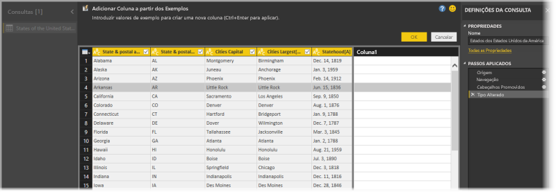
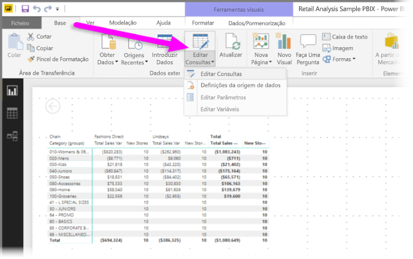
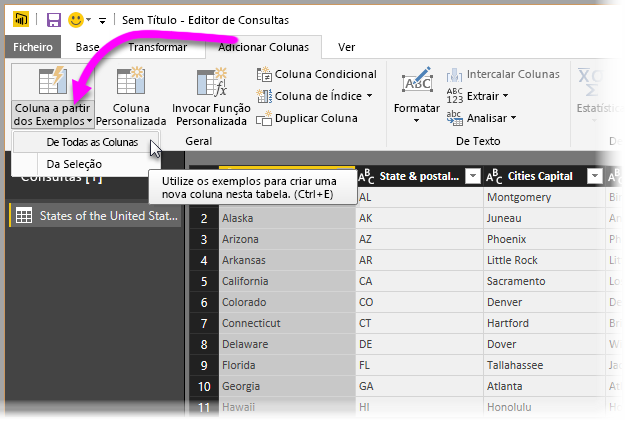
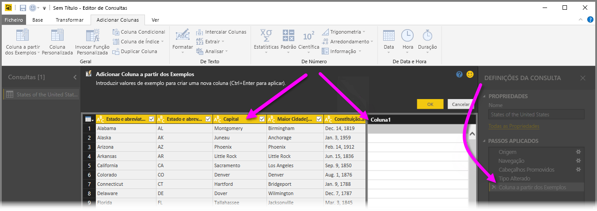
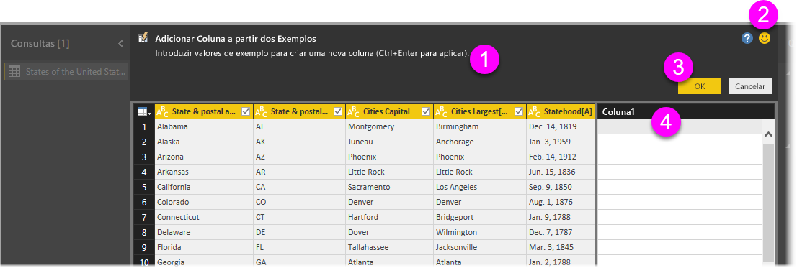
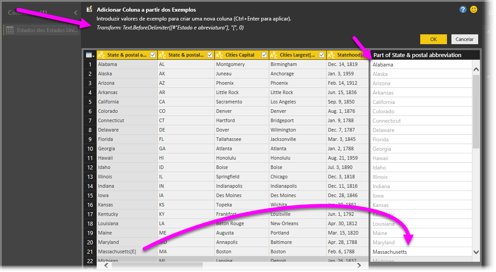

# Adicionar uma coluna de um exemplo no Power BI Desktop
Começando com a versão de abril de 2017 do **Power BI Desktop**, pode adicionar novas colunas de dados ao seu modelo com o **Editor de Consultas** ou ao apresentar simplesmente um ou mais valores de exemplo para a nova coluna. Pode criar um novo exemplo de coluna de uma seleção atual ou apresentar entradas com base em todas as colunas (ou colunas selecionadas) numa determinada tabela.

Esta abordagem ajuda-o a criar novas colunas com rapidez e facilidade, e é excelente nas seguintes situações:

* Sabe qual é o resultado de dados que pretende na sua nova coluna, mas não tem a certeza qual é a transformação (ou coleção de transformações) que irá obter.
* Já sabe quais são as transformações que precisa, mas não tem a certeza onde deve clicar ou selecionar na IU para que aconteçam.
* Sabe tudo sobre as transformações que precisa com uma expressão de *Coluna Personalizada* no **M**, mas uma (ou mais) dessas expressões não estão disponíveis para clicar ou adicionar na IU.

Utilizar a funcionalidade **adicionar coluna do exemplo** é simples e direto. Nas próximas secções, veremos como é tão fácil.

## Utilize o Editor de Consultas para adicionar uma nova coluna a partir de exemplos
Para criar uma nova coluna a partir de um exemplo, inicie o **Editor de Consultas**. Pode fazê-lo ao selecionar **Editar Consultas** no friso **Base** no **Power BI Desktop**.

Para obter dados de uma página Web, aceda ao separador **Base**, clique em **Obter Dados > Web** e, em seguida, cole o URL na caixa de diálogo apresentada. Este artigo utiliza dados de um artigo da Wikipédia. Pode clicar na seguinte ligação para obter os dados e acompanhar os passos:

* [**Lista de estados e territórios dos Estados Unidos**](https://wikipedia.org/wiki/List_of_states_and_territories_of_the_United_States)

Assim que o **Editor de Consultas** é iniciado e tiver alguns dados carregados, pode começar ao adicionar uma coluna de exemplos. Para adicionar uma nova coluna, no **Editor de Consultas** selecione o separador **Adicionar Coluna** no friso e selecione **Coluna dos Exemplos**. Se escolher a lista pendente, pode selecionar **De Todas as Colunas** (a predefinição, se selecionar apenas o botão em vez da lista pendente) ou selecionar **Da Seleção**. Neste artigo vamos explicar a seleção de **De Todas as Colunas**.

## O painel Adicionar Coluna a Partir dos Exemplos
Depois de realizar uma seleção para adicionar uma nova coluna a partir de exemplos, é apresentado um novo painel que mostra as colunas na tabela atual (poderá ter de deslocar para ver todas). A nova **Coluna1** também é apresentada à direita, que é a coluna que o **Power BI Desktop** cria com base nos seus exemplos. Abaixo do novo cabeçalho **Coluna1**, há células em branco onde pode escrever os seus exemplos que o Power BI utiliza para criar regras e transformações para corresponder ao seu exemplo.

Repare que este é um **Passo Aplicado** no painel **Definições da Consulta**. Como sempre, o **Editor de Consultas** irá registar os passos de transformação e aplicá-los na consulta, por ordem.

Esta opção é denominada no painel **Adicionar Colunas a Partir de Exemplos** e consiste em quatro áreas principais:

1. A **Barra de comandos** que inclui uma breve descrição da funcionalidade ou da transformação.
2. A opção **Enviar Comentários**, para ajudar o Power BI a melhorar esta funcionalidade.
3. Os botões **OK** e **Cancelar** que lhe permitem consolidar as transformações e adicionar a coluna ou cancelar.
4. A nova área da coluna, onde pode escrever os valores de exemplo em qualquer uma das linhas (para apresentar o seu exemplo ao Power BI), relacionados com outras colunas nessa linha.

À medida que escreve o exemplo na nova coluna, o Power BI oferece-lhe uma pré-visualização do aspeto da coluna que está a criar, com base nas transformações detetadas. Por exemplo, se escrever *Alabama* na primeira linha, corresponde ao valor *Alabama* na primeira coluna da tabela. Assim que premir *Enter*, o Power BI preencherá a coluna com base nesse valor.

Mas suponhamos que acede à linha que inclui *Massachusetts[E]* e elimina a última parte, o *[E]* (uma vez que já não a quer). O Power BI deteta a alteração e utiliza o exemplo para criar uma transformação. Observe a explicação da transformação no painel central superior.

À medida que apresenta exemplos, o **Editor de Consultas** adiciona às transformações. Quando estiver satisfeito, pode selecionar **OK** para consolidar as alterações.

## Veja Adicionar Coluna a Partir dos Exemplos em ação
Deseja ver isto a funcionar? O vídeo seguinte mostra esta funcionalidade a ser colocada em utilização, através da origem de dados apresentada anteriormente neste exemplo. Veja e acompanhe por si próprio!

<iframe width="560" height="315" src="https://www.youtube.com/embed/-ykbVW9wQfw" frameborder="0" allowfullscreen></iframe>

## Considerações e limitações
Existem várias transformações que estão disponíveis ao utilizar **Adicionar colunas a partir dos Exemplos**, mas nem todas as transformações estão incluídas. A seguinte lista apresenta todas as transformações suportadas.

* **Referência**
  
  * Referência a uma coluna específica (incluindo transformações de corte, limpeza e capitalização)

* **Transformações de texto**
  
  * Combinar (suporta a combinação de cadeias de literais e valores da coluna completa)
  * Substituir
  * Comprimento
  * Extrair   
    * Primeiros Carateres
    * Últimos Carateres
    * Intervalo
    * Texto antes do Delimitador
    * Texto após o Delimitador
    * Texto entre os Delimitadores
    * Comprimento

* As **transformações de texto** seguintes estão disponíveis a partir da versão de novembro de 2017 do **Power BI Desktop**:
    
  * Remover Carateres
  * Manter Carateres

> [!NOTE]
> Todas as transformações de *Texto* têm em consideração o potencial de corte, limpeza ou aplicar uma transformação de capitalização no valor da coluna.
> 
> 

* **Transformações de data**
  
  * Dia
  * Dia da Semana
  * Nome do Dia da Semana
  * Dia do Ano
  * Mês
  * Nome do Mês
  * Trimestre do Ano
  * Semana do Mês
  * Semana do Ano
  * Ano
  * Idade
  * Início do Ano
  * Fim do Ano
  * Início do Mês
  * Fim do Mês
  * Início do Trimestre
  * Dias no Mês
  * Fim do Trimestre
  * Início da Semana
  * Fim da Semana
  * Dia do Mês
  * Início do Dia
  * Fim do Dia

* **Transformações de hora**
  
  * Hora
  * Minuto
  * Segundo  
  * Para Hora Local

> [!NOTE]
> Todas as transformações de *Data* e *Hora* têm em consideração a potencial necessidade de converter o valor da coluna para *Data*, *Hora* ou *DateTime*.
> 
> 

* **Transformações de número** 

  * Valor Absoluto
  * Arco cosseno
  * Arco seno
  * Arco tangente
  * Converter para Número
  * Cosseno
  * Cubo
  * Dividir
  * Expoente
  * Fatorial
  * Divisão de Número Inteiro
  * É Igual
  * É Ímpar
  * Ln
  * Logaritmo de Base 10
  * Módulo
  * Multiplicar
  * Arredondar por Defeito
  * Arredondar por Excesso
  * Assinar
  * Sin
  * Raiz Quadrada
  * Quadrado
  * Subtrair
  * Som
  * Tangente

* A **transformação de número** seguinte está disponível a partir da versão de novembro de 2017 do **Power BI Desktop**:

  * Decomposição/Intervalos

* **Geral**
  
  * Coluna Condicional