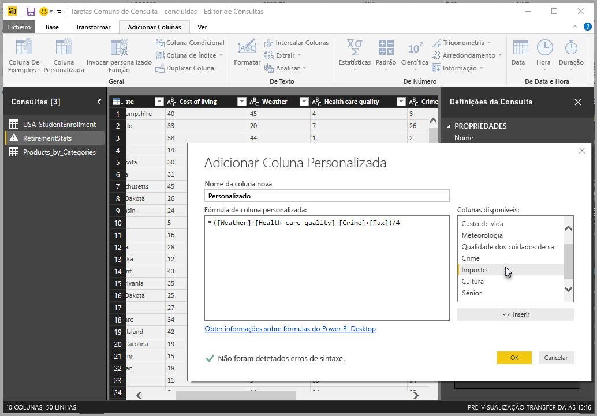
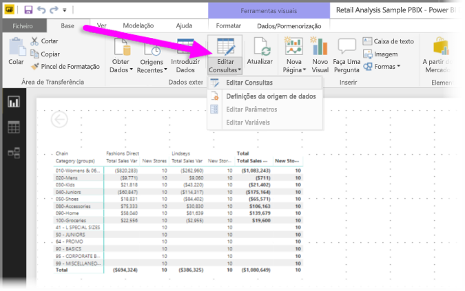
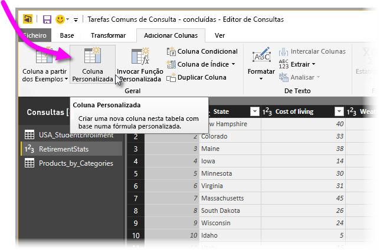
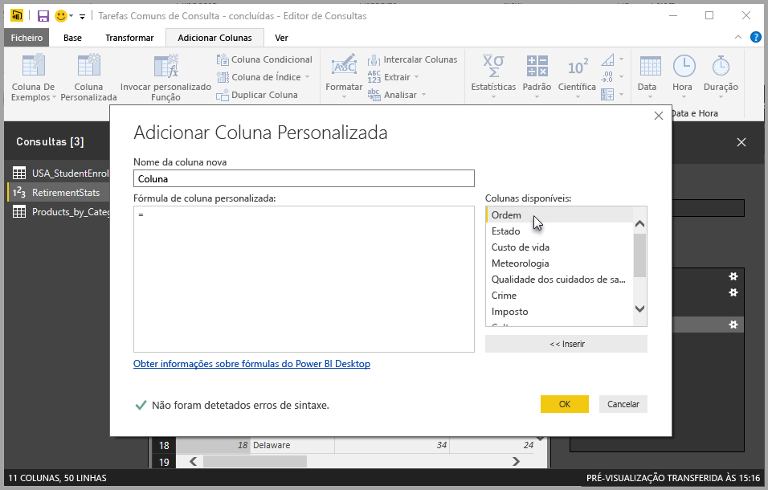
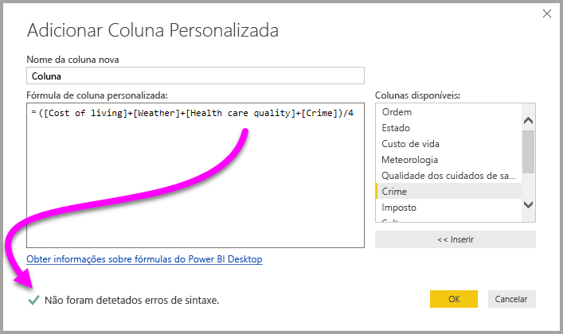
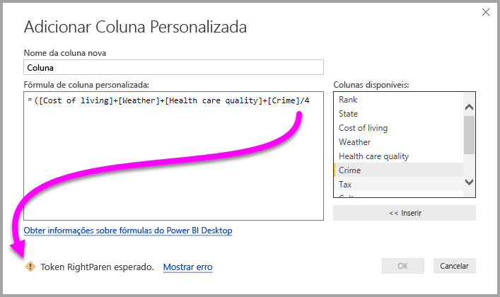
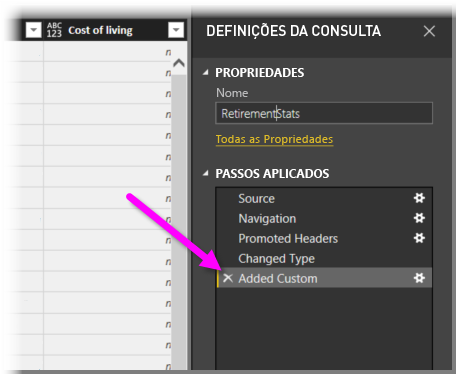
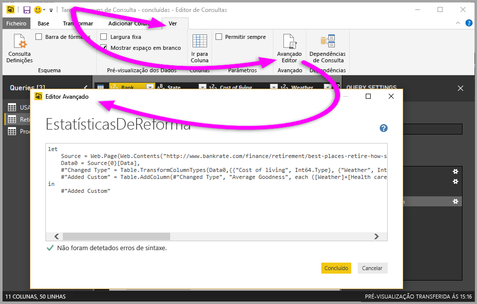

# Adicionar uma coluna personalizada no Power BI Desktop
Pode adicionar facilmente uma nova coluna de dados personalizada ao seu modelo através do **Editor de Consultas** no **Power BI Desktop**. Pode criar e mudar o nome da coluna personalizado através de botões fáceis para criar [fórmulas M](https://msdn.microsoft.com/library/mt270235.aspx) que definam a coluna personalizada. A fórmula M tem um [conjunto de conteúdos de referência de função abrangente](https://msdn.microsoft.com/library/mt779182.aspx). 

A criação de uma coluna personalizada é outro **Passo Aplicado** à consulta criada no **Editor de Consultas**, o que significa que pode ser alterada, movida anterior ou posteriormente ou modificada em qualquer altura.

## Utilizar o Editor de Consultas para adicionar uma nova coluna personalizada
Para criar uma nova coluna personalizada, inicie o **Editor de Consultas**. Pode fazê-lo ao selecionar **Editar Consultas** no friso **Base** no **Power BI Desktop**.

Depois de iniciar o **Editor de Consultas** e ter alguns dados carregados, pode adicionar uma coluna personalizada ao selecionar o separador **Adicionar Coluna** no friso e, em seguida, ao selecionar **Coluna Personalizada**.

É apresentada a janela **Adicionar Coluna Personalizada**, que abordamos na secção seguinte.

## Janela Adicionar Coluna Personalizada
Na janela **Adicionar Coluna Personalizada**, pode ver a lista de campos disponíveis no painel à direita, o nome da coluna personalizada na parte superior (pode mudá-lo ao introduzir um novo nome nessa caixa de texto) e a fórmula [**M**](https://msdn.microsoft.com/library/mt779182.aspx) que cria (ou escreve) com base na inserção de campos à direita, adição de operadores e criação da fórmula na qual a sua nova coluna personalizada será definida. 

## Criar fórmulas para a coluna personalizada
Pode selecionar um campo na lista **Colunas disponíveis:** à direita e selecionar **<< Inserir** para adicioná-las à fórmula da coluna personalizada. Também pode simplesmente fazer duplo clique numa coluna na lista para adicioná-la.

À medida que escreve a fórmula e cria a coluna, na parte inferior da janela, verá um indicador a informá-lo, em tempo real, se foram detetados erros de sintaxe. Se tudo estiver correto, verá uma marca de verificação verde.

No entanto, se tiver algum tipo de erro na sintaxe, será apresentado um ícone de aviso amarelo, juntamente com o erro detetado, e uma ligação que coloca o cursor (na fórmula) onde foi detetado o erro.

Ao selecionar **OK**, a coluna personalizada é adicionada ao modelo e o passo **Coluna Personalizada Adicionada** é adicionado aos **Passos Aplicados** da consulta.

Se fizer duplo clique no passo **Coluna Personalizada Adicionada** no painel **Passos Aplicados**, a janela **Adicionar Coluna Personalizada** é apresentada novamente, com a fórmula de coluna personalizada criada já carregada e pronta para que possa modificá-la, se necessário.

## Utilizar o Editor Avançado para Colunas Personalizadas
Também pode criar uma coluna personalizada (e modificar qualquer passo da consulta) com o **Editor Avançado**. No **Editor de Consultas**, selecione o separador **Ver** e, em seguida, selecione **Editor Avançado** para apresentar o **Editor Avançado**.

O **Editor Avançado** dá-lhe controlo total sobre a sua consulta.

## Próximos passos
Existem outras formas de criar uma coluna personalizada, incluindo a criação de uma coluna com base nos exemplos fornecidos ao **Editor de Consultas**. Veja o seguinte artigo para obter mais informações sobre a criação de colunas personalizadas a partir de exemplos:

* [Adicionar uma coluna a partir de um exemplo no Power BI Desktop](desktop-add-column-from-example.md)
* [Introdução à linguagem de fórmula M](https://msdn.microsoft.com/library/mt270235.aspx)
* [Referência à função M](https://msdn.microsoft.com/library/mt779182.aspx)  

