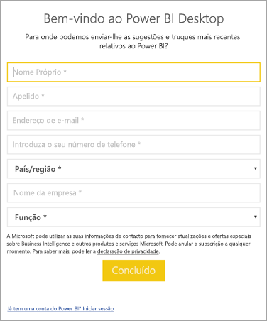

# <a name="how-administrators-can-manage-the-power-bi-desktop-sign-in-form"></a>Como os administradores podem gerir o formulário de início de sessão do Power BI Desktop
Na primeira vez que o Power BI Desktop é iniciado, é apresentado um formulário de início de sessão. As informações podem ser preenchidas, ou inicie a sessão no Power BI para continuar. Os administradores podem gerir este formulário ao utilizar uma chave do registo. 



Os administradores podem utilizar a seguinte chave do registo para desativar o formulário de início de sessão. Isto também pode ser utilizado com políticas globais para a organização inteira.

```
Key: HKEY_LOCAL_MACHINE\SOFTWARE\Policies\Microsoft\Power BI Desktop
valueName: ShowLeadGenDialog
```

Um valor de 0 desativa a caixa de diálogo.

Mais perguntas? [Experimente perguntar à Comunidade do Power BI](http://community.powerbi.com/)

