# Agregações no Power BI Desktop (Pré-visualização)

A utilização de **agregações** no Power BI permite realizar análises interativas de macrodados de uma forma que não era possível anteriormente. As **agregações** podem reduzir drasticamente o custo de desbloqueio de grandes conjuntos de dados para a tomada de decisões.

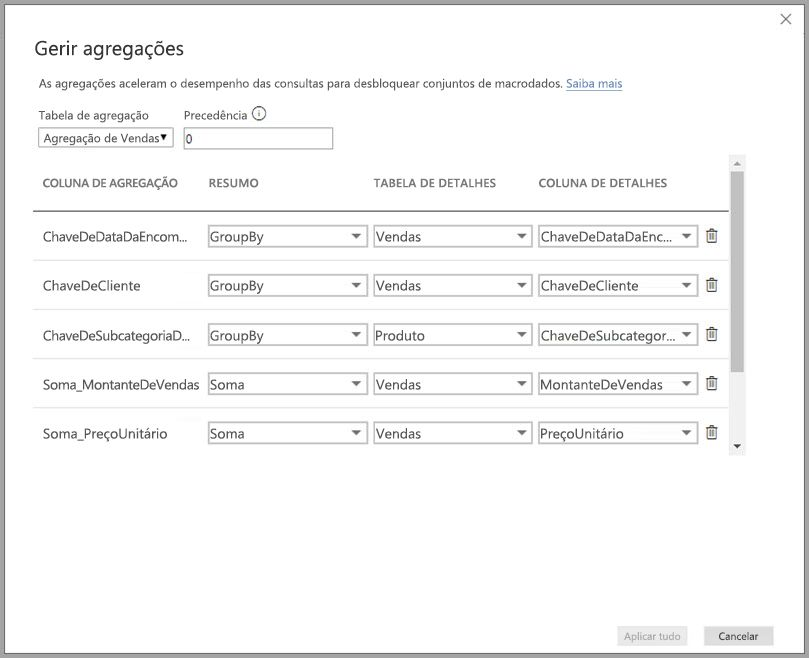

A lista seguinte apresenta as vantagens de utilizar **agregações**:

* **Desempenho das consultas em macrodados** – dado que os utilizadores interagem com elementos visuais nos relatórios do Power BI, as consultas DAX são enviadas no conjunto de dados. Aumente a velocidade das consultas ao colocar em cache dados ao nível da agregação recorrendo a uma fração dos recursos necessários ao nível do detalhe. Desbloqueie macrodados de uma maneira que não seria possível antes.
* **Otimização da atualização de dados** – reduza os tamanhos e os tempos de atualização da cache ao colocar os dados em cache ao nível da agregação. Acelere o tempo de disponibilização dos dados aos utilizadores.
* **Obter arquiteturas equilibradas** – permita que a cache dentro da memória do Power BI processe consultas agregadas, algo que faz com eficácia. Limite as consultas enviadas para a origem de dados no modo DirectQuery ao manter-se dentro dos limites de simultaneidade. As consultas que são enviadas são, normalmente, consultas filtradas e de nível transacional, que os armazéns de dados e os sistemas de macrodados costumam processar corretamente.

### Armazenamento ao nível da tabela
Normalmente, o armazenamento ao nível da tabela é utilizado com a funcionalidade de agregações. Para obter mais informações, veja o artigo [Modo de armazenamento no Power BI Desktop](desktop-storage-mode.md).

### Tipos de origem de dados
As agregações são utilizadas com origens de dados que representam modelos dimensionais, tais como armazéns de dados e data marts, bem como origens de macrodados baseadas no Hadoop. Este artigo descreve as diferenças de modelação típica no Power BI para cada tipo de origem de dados.

Todas as origens de importação e do DirectQuery (não multidimensionais) do Power BI funcionam com agregações.

## Ativar a funcionalidade de pré-visualização de agregações

A funcionalidade **agregações** está em Pré-visualização e tem de ser ativada no **Power BI Desktop**. Para ativar as **agregações**, selecione **Ficheiro > Opções e Definições > Opções > Funcionalidades de pré-visualização** e, em seguida, selecione as caixas de verificação **Modelos compostos** e **Gerir agregações**. 

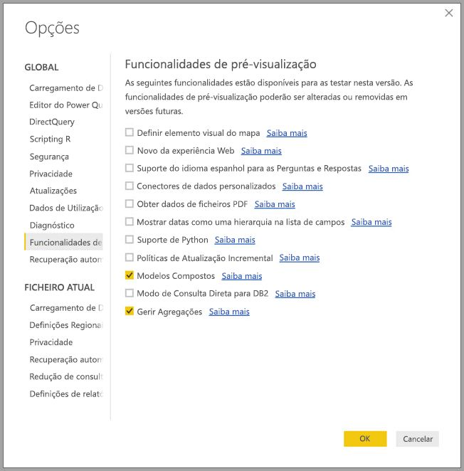

Terá de reiniciar o **Power BI Desktop** para que a funcionalidade seja ativada.

## Agregações baseadas em relações

Normalmente, as **agregações** baseadas em relações são utilizadas com modelos dimensionais. Os conjuntos de dados do Power BI obtidos a partir de armazéns de dados e de data marts assemelham-se a esquemas de estrelas/flocos de neve com relações entre tabelas de dimensão e tabelas de factos.

Considere o modelo seguinte obtido a partir de uma origem de dados única. Digamos que todas as tabelas estão a utilizar o DirectQuery para começar. A tabela de factos **Sales** (Vendas) contém mil milhões de linhas. A definição do modo de armazenamento da tabela **Sales** (Vendas) para **Importar** com vista à colocação em cache consumiria bastante memória e levaria à sobrecarga de gestão.

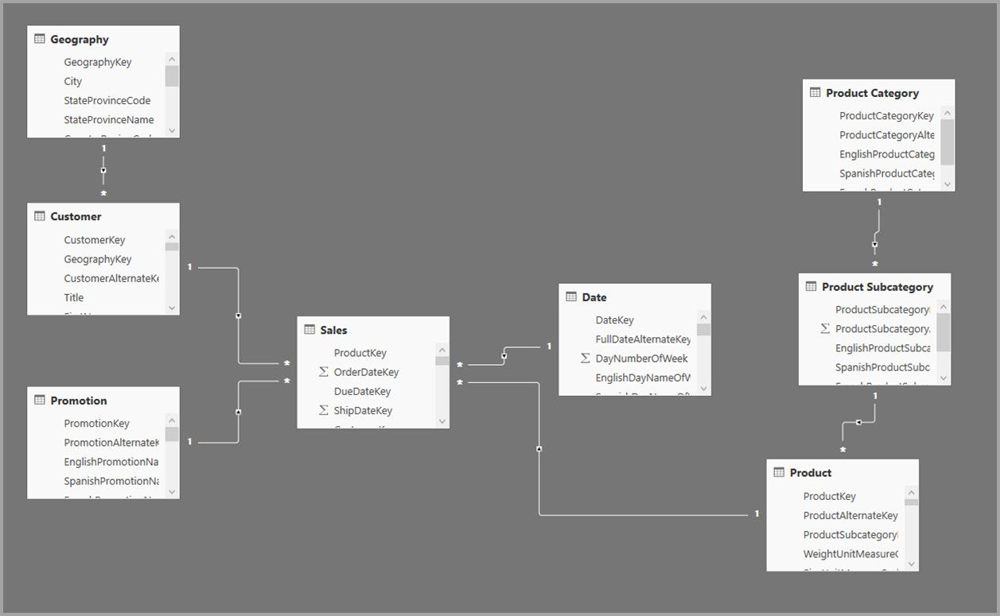

Em alternativa, criamos a tabela **Sales Agg** (Agregação de Vendas) como uma tabela de agregação. Tem uma granularidade superior a **Sales** (Vendas) e, por isso, terá muito menos linhas. O número de linhas deve ser igual à soma de **SalesAmount** (MontanteDeVendas) agrupada por **CustomerKey** (ClientePrincipal), **DateKey** (DataPrincipal) e **ProductSubcategoryKey** (SubcategoriaDeProdutoPrincipal). Em vez de mil milhões, poderão ser milhões de linhas, que são muito mais fáceis de gerir.

Vamos supor que as seguintes tabelas de dimensão são as tabelas normalmente utilizadas para as consultas com valores comerciais altos. São estas tabelas que conseguem filtrar a tabela **Sales Agg** (Agregação de Vendas) através de relações de *um-para-muitos* (ou *muitos-para-um*).

* Geografia
* Cliente
* Data
* Product Subcategory
* Product Category (Categoria de Produto)

A imagem seguinte ilustra este modelo.

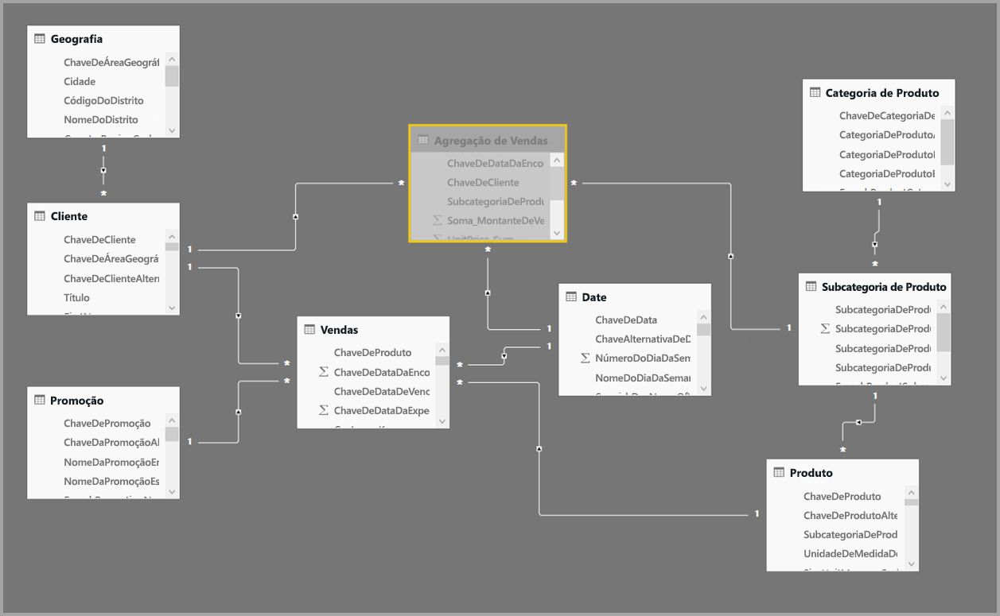

> [!NOTE]
> A tabela **Sales Agg** (Agregação de Vendas) é apenas outra tabela, pelo que tem a flexibilidade de ser carregada de várias formas. Por exemplo, a agregação pode ser executada na base de dados de origem através de processos ETL/ELT ou através da [expressão M](https://msdn.microsoft.com/query-bi/m/power-query-m-reference) para a tabela. A agregação pode utilizar o modo Importação do armazenamento com ou sem [atualização incremental no Power BI Premium](service-premium-incremental-refresh.md), ou pode utilizar o modo DirectQuery e ser otimizada para consultas rápidas com [índices columnstore](https://docs.microsoft.com/sql/relational-databases/indexes/columnstore-indexes-overview). Esta flexibilidade permite obter arquiteturas equilibradas que distribuem a carga de consulta para evitar estrangulamentos.

### Modo de armazenamento 
Vamos continuar com o exemplo que estamos a utilizar. Vamos definir o modo de armazenamento da tabela **Sales Agg** (Agregação de Vendas) para **Importar** para acelerar as consultas.

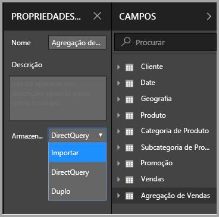

Depois de o fazermos, a caixa de diálogo seguinte é apresentada e indica que as tabelas de dimensão relacionadas podem ser definidas para o modo de armazenamento **Duplo**. 

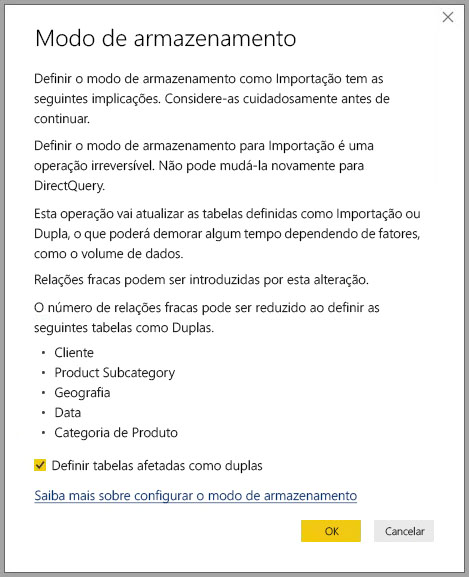

Ao defini-las para **Duplo**, as tabelas de dimensão relacionadas vão agir como Importação ou como DirectQuery, consoante a subconsulta.

* As consultas que agregam métricas da tabela **Sales Agg** (Agregação de Vendas), que é de importação, e que se agrupam por atributo(s) das tabelas Duplas relacionadas podem ser devolvidas a partir da cache dentro da memória.
* As consultas que agregam métricas na tabela **Sales** (Vendas), que é do DirectQuery, e que se agrupam por atributo(s) das tabelas Duplas relacionadas podem ser devolvidas no modo DirectQuery. A lógica de consulta, incluindo a operação agrupar por, será transmitida à base de dados de origem.

Para obter mais informações sobre o modo de armazenamento **Duplo**, veja o artigo [Modo de armazenamento](desktop-storage-mode.md).

### Relações fortes vs. fracas
Os resultados das agregações com base nas relações exigem relações fortes.

As relações fortes incluem as seguintes combinações, em que ambas as tabelas são proveniente de uma *única origem*.

| Tabela no lado *muitos | Tabela no lado *1* |
| ------------- |----------------------| 
| Duplo          | Duplo                 | 
| Importar        | Importação ou Dual       | 
| DirectQuery   | DirectQuery ou Dual  | 

O único caso em que uma relação de *origem cruzada* é considerada segura é quando ambas as tabelas são de Importação. As relações de muitos para muitos são sempre consideradas fracas.

Para obter resultados da agregação de *origem cruzada* que não dependem de relações, veja a seção a seguir sobre as agregações baseadas em colunas Agrupar por.

### A tabela de agregação está oculta
A tabela **Sales Agg** (Agregação de Vendas) está oculta. As tabelas de agregação devem estar sempre ocultadas para os consumidores do conjunto de dados. Os consumidores e as consultas referem-se à tabela de detalhes e não à tabela de agregação, os consumidores nem precisam de saber que a tabela de agregação existe.

### Caixa de diálogo Gerir agregações
Em seguida, vamos definir as agregações. Selecione o menu de contexto **Gerir agregações** para a tabela **Sales Agg** (Agregação de Vendas) ao clicar com o botão direito do rato na tabela.

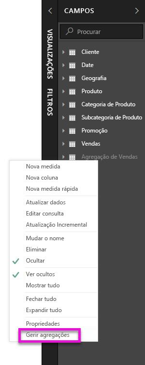

É apresentada a caixa de diálogo **Gerir agregações**. Mostra uma linha para cada coluna na tabela **Sales Agg** (Agregação de Vendas) onde podemos especificar o comportamento de agregação. As consultas submetidas no conjunto de dados do Power BI que se refere à tabela **Sales** (Vendas) são redirecionadas internamente para a tabela **Sales Agg** (Agregação de Vendas). Os consumidores do conjunto de dados não precisam de saber que a tabela **Sales Agg** (Agregação de Vendas) ainda existe.

A tabela seguinte mostra as agregações da tabela **Sales Agg** (Agregação de Vendas).

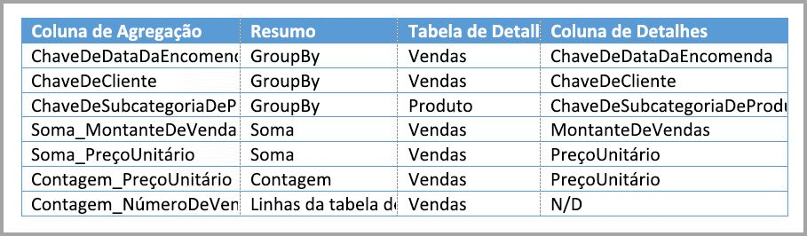

#### Função Resumo

A lista pendente Resumo apresenta os seguintes valores para seleção.
* Contagem
* GroupBy
* Máx
* Mín
* Soma
* Linhas da tabela de contagem

#### Validações

A caixa de diálogo impõe as seguintes validações relevantes:

* A coluna de detalhes selecionada tem de ter o mesmo tipo de dados que a coluna de agregação, exceto para as funções de resumo Contagem e Contagem de linhas da tabela. A Contagem e as Contagem de linhas da tabela são apenas disponibilizadas para as colunas de agregação de número inteiro e não necessitam de um tipo de dados correspondente.
* Não são permitidas agregações em cadeia que abranjam três ou mais tabelas. Por exemplo, não é possível configurar agregações na **Tabela A** que se referem à **Tabela B** que tem agregações que se referem à **Tabela C**.
* Não são permitidas agregações duplicadas em que duas entradas utilizem a mesma função de resumo e se refiram à mesma tabela/coluna de detalhes.

Durante esta pré-visualização pública das **agregações**, também são impostas as validações seguintes. Pretendemos remover estas validações após o lançamento para disponibilidade geral.

* Não se podem utilizar agregações com segurança ao nível da linha (RLS). *Limitação de pré-visualização pública.*
* A tabela de detalhes tem de ser do DirectQuery e não de Importação. *Limitação de pré-visualização pública.*

A maioria destas validações são impostas através da desativação dos valores de lista pendente e da apresentação do texto explicativo na descrição, tal como mostra a imagem seguinte.

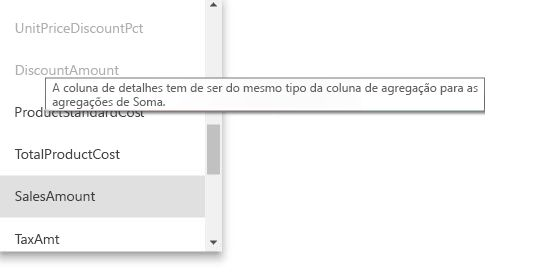

### Colunas Agrupar por

Neste exemplo, as três entradas GroupBy são opcionais e não afetam o comportamento de agregação (exceto para a consulta de exemplo DISTINCTCOUNT mostrada na imagem abaixo). Estas foram incluídas principalmente para fins de legibilidade. Sem estas entradas GroupBy, as agregações poderiam continuar a ser acedidas com base nas relações. Este é um comportamento diferente daquele que obtém ao utilizar agregações sem relações, cujo tema será abordado através do exemplo de macrodados apresentado mais adiante neste artigo.

### Detetar se as agregações dão ou não resultados através de consultas

Para obter mais informações sobre como detetar se as consultas são devolvidas a partir da cache dentro da memória (motor de armazenamento) ou se o DirectQuery (enviado para a origem de dados) está a utilizar o SQL Profiler, veja o artigo [Modo de armazenamento](desktop-storage-mode.md). Esse processo também pode ser utilizado para detetar se está a obter resultados das agregações.

Para além disso, é fornecido o evento expandido seguinte no SQL Profiler.

    Query Processing\Aggregate Table Rewrite Query

O fragmento JSON seguinte mostra um exemplo do resultado do evento quando é utilizada uma agregação.

* **matchingResult** mostra que foi utilizada uma agregação para a subconsulta.
* **dataRequest** mostra as colunas Agrupar por e as colunas agregadas utilizadas pela subconsulta.
* **mapping** mostra as colunas na tabela de agregação às quais foi mapeado.

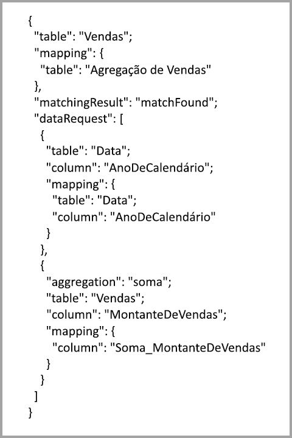

### Exemplos de consulta
A consulta seguinte obtém resultados da agregação porque as colunas na tabela *Date* (Data) têm o nível de detalhe que permite obter resultados da agregação. Será utilizada a agregação **Soma** para **SalesAmount** (MontanteDeVendas).

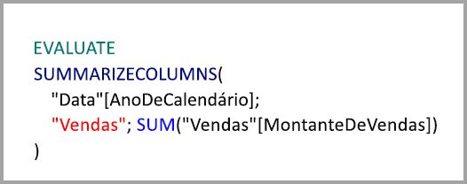

A consulta seguinte não obtém resultados da agregação. Apesar de se pedir a soma de **SalesAmount** (MontanteDeVendas), está a realizar-se a operação agrupar por numa coluna na tabela **Product** (Produto), que não tem a granularidade que permite obter resultados da agregação. Se observar as relações no modelo, uma subcategoria de produto poderá ter múltiplas linhas **Product** (Produto). A consulta não seria capaz de determinar o produto ao qual se iria agregar. Neste caso, a consulta é revertida para o DirectQuery e submete uma consulta SQL para a origem de dados.

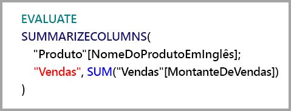

As agregações não se destinam apenas a cálculos simples que realizam uma soma básica. Também podem ser vantajosas para cálculos complexos. Conceptualmente, um cálculo complexo é dividido em subconsultas para cada função SUM, MIN, MAX e COUNT, e cada subconsulta é avaliada para determinar se é possível obter resultados da agregação. Esta lógica nem sempre é verdadeira devido à otimização do plano de consulta, mas, em geral, deve ser aplicada. O exemplo seguinte obtém resultados da agregação:

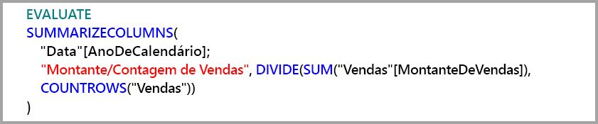

A função COUNTROWS pode beneficiar com as agregações. A consulta seguinte obtém resultados da agregação porque existe uma agregação das linhas da tabela **Count** (Contagem) definida para a tabela **Sales** (Vendas).

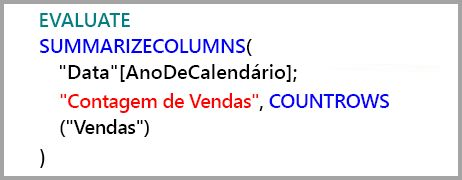

A função AVERAGE pode beneficiar com as agregações. A consulta seguinte obtém resultados da agregação porque AVERAGE (MÉDIA) é obtida internamente através da SUM (SOMA) dividida pela COUNT (CONTAGEM). Como a coluna **UnitPrice** (PreçoUnitário) tem agregações definidas para SUM e COUNT, a agregação dará resultados.

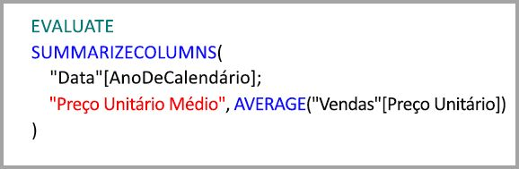

Em alguns casos, a função DISTINCTCOUNT pode beneficiar com as agregações. A consulta seguinte obtém resultados da agregação porque existe uma entrada GroupBy (AgruparPor) para **CustomerKey** (ClientePrincipal), que mantém a distinção de **CustomerKey** (ClientePrincipal) na tabela de agregação. Essa técnica continua a ser sujeita ao limiar de desempenho em que aproximadamente dois a cinco milhões de valores distintos podem afetar o desempenho da consulta. No entanto, pode ser útil em contextos em que existam milhares de milhões de linhas na tabela de detalhes e dois a cinco milhões de valores distintos na coluna. Neste caso, a contagem distinta pode ser realizada com maior rapidez do que uma análise da tabela com milhares de milhões de linhas, mesmo que tenha sido colocada em cache dentro da memória.

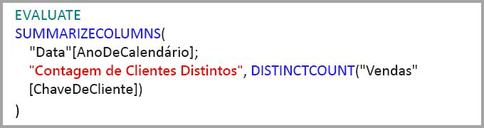

## Agregações baseadas em colunas Agrupar por 

Os modelos de macrodados baseados no Hadoop têm caraterísticas diferentes das dos modelos dimensionais. Para evitar associações entre tabelas grandes, estes modelos muitas vezes não se baseiam em relações. Em vez disso, os atributos de dimensão são muitas vezes desnormalizados para tabelas de factos. Esses modelos de macrodados podem ser desbloqueados para análise interativa através de **agregações** baseadas em colunas Agrupar por.

A tabela seguinte contém a coluna numérica **Movement** (Deslocação) para ser agregada. Todas as outras colunas são atributos pelos quais se vai agrupar. Contém dados de IoT e um grande número de linhas. O modo de armazenamento é o DirectQuery. As consultas na origem de dados que são agregadas em todo o conjunto de dados são lentas devido ao grande volume.

Para ativar a análise interativa neste conjunto de dados, podemos adicionar uma tabela de agregação que agrupa pela maioria dos atributos, mas exclui os atributos de cardinalidade elevada, tais como a longitude e a latitude. Isto reduz drasticamente o número de linhas, sendo a tabela suficientemente pequena para caber confortavelmente numa cache dentro da memória. O modo de armazenamento da tabela **Driver Activity Agg** (Agregação de Atividades do Condutor) é importação.

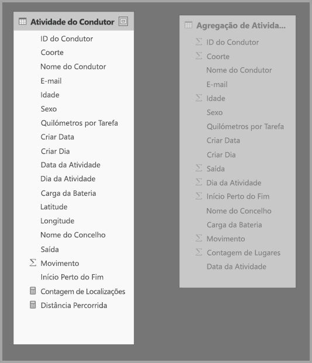

Em seguida, definimos os mapeamentos de agregação na caixa de diálogo **Gerir agregações**. Mostra uma linha para cada coluna na tabela **Driver Activity Agg** (Agregação de Atividades do Condutor) onde podemos especificar o comportamento de agregação.

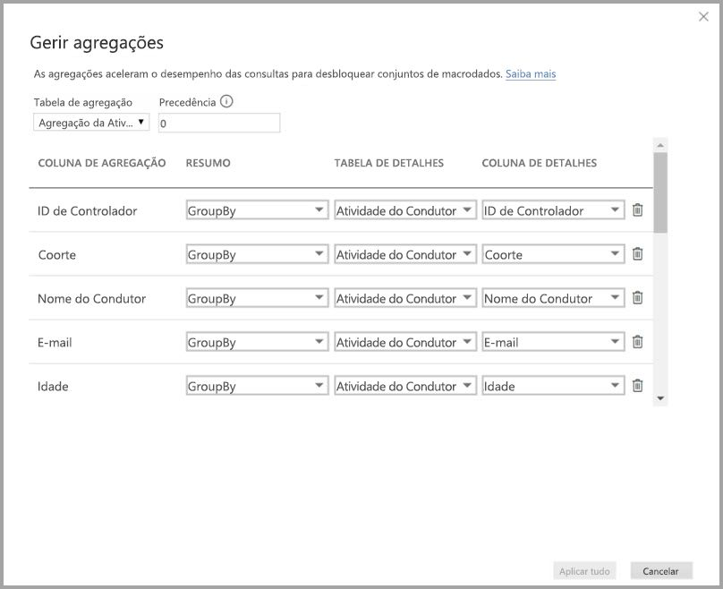

A tabela seguinte mostra as agregações da tabela **Driver Activity Agg** (Agregação de Atividades do Condutor).

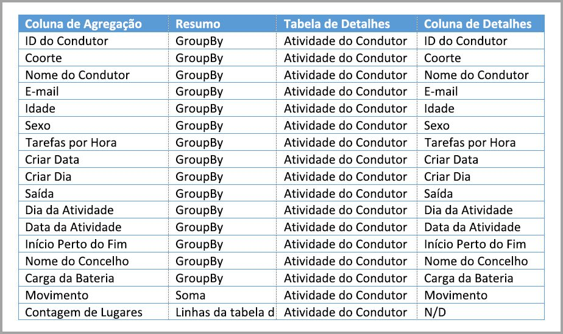

### Colunas Agrupar por

Neste exemplo, as entradas **GroupBy** (AgruparPor) são entradas **não opcionais** e, sem estas, não seria possível obter resultados das agregações. Este é um comportamento diferente daquele que obtém ao utilizar agregações baseadas em relações, que foi descrito através do exemplo de modelo dimensional fornecido anteriormente neste artigo.

### Exemplos de consulta

A consulta seguinte obtém resultados da agregação porque a coluna **Activity Date** (Data de Atividade) é abrangida pela tabela de agregação. A função COUNTROWS utiliza a agregação Contagem de linhas da tabela.

É aconselhável utilizar as agregações Contagem de linhas da tabela especialmente para os modelos que contêm atributos de filtro em tabelas de factos. O Power BI pode submeter consultas no conjunto de dados com a função COUNTROWS nos casos em que isso não é explicitamente pedido pelo utilizador. Por exemplo, a caixa de diálogo de filtros mostra a contagem de linhas para cada valor.

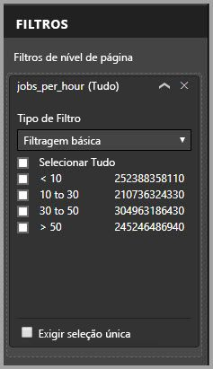

## Precedência de agregação

A precedência de agregação permite que múltiplas tabelas de agregação sejam consideradas por uma subconsulta única.

Considere o exemplo seguinte. Trata-se de um [modelo composto](desktop-composite-models.md) que contém múltiplas origens do DirectQuery.

* A tabela de importação **Driver Activity Agg2** (Agregação de Atividades do Condutor2) tem um nível de detalhe elevado porque os atributos Agrupar por são poucos e têm uma cardinalidade baixa. O número de linhas poderia estar apenas na ordem dos milhares para que a tabela coubesse facilmente numa cache dentro da memória. Estes atributos costumavam ser utilizados por um dashboard executivo com uma posição de relevo, pelo que as consultas que se referem a esses atributos devem ser o mais rápidas possível.
* A tabela **Driver Activity Agg** (Agregação de Atividades do Condutor) é uma tabela de agregação intermediária no modo DirectQuery. Contém mais de mil milhões de linhas e está otimizada na origem com índices columnstore.
* A tabela **Driver Activity** (Atividade do Condutor) é do DirectQuery e contém mais de um bilião de linhas de dados de IoT obtidos a partir de um sistema de macrodados. Destina-se a consultas de pormenorização para ver leituras de IoT individuais em contextos de filtros controlados.

A quantidade de memória deste modelo é relativamente pequena, mas permitirá desbloquear um enorme conjunto de dados. Representa uma arquitetura equilibrada porque distribui a carga de consultas pelos componentes da arquitetura ao utilizá-los com base nos seus pontos fortes.

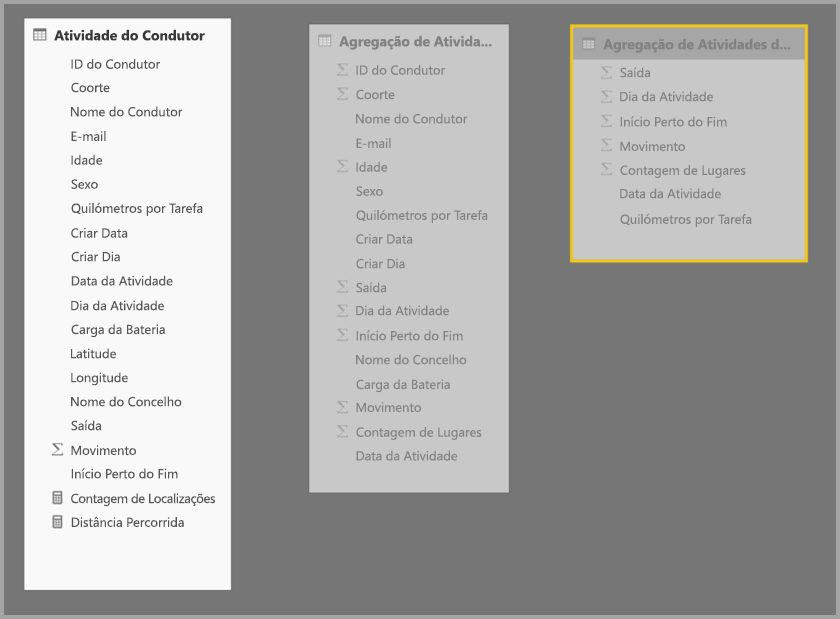

A caixa de diálogo **Gerir agregações** da tabela **Driver Activity Agg2** (Agregação de Atividades do Condutor2) mostra que o campo *Precedência* é 10, que é mais alto do que o da **Driver Activity Agg** (Agregação de Atividades do Condutor), o que significa que será considerado em primeiro lugar pelas consultas que utilizam agregações. As subconsultas que não têm o nível de detalhe para que a tabela **Driver Activity Agg2** (Agregação de Atividades do Condutor2) devolva resultados considerarão então a tabela **Driver Activity Agg** (Agregação de Atividades do Condutor). As consultas de detalhes que não conseguirem obter resposta de uma tabela de agregação serão direcionadas para a tabela **Driver Activity** (Atividade do Condutor).

A tabela especificada na coluna **Tabela de Detalhes** é a **Driver Activity** (Atividade do Condutor) e não a **Driver Activity Agg** (Agregação de Atividades do Condutor) porque não são permitidas agregações em cadeia (veja [Validações](#validations) no início deste artigo).

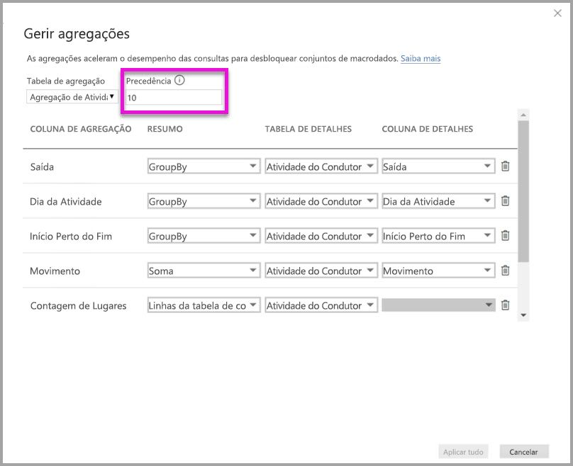

A tabela seguinte mostra as agregações da tabela **Driver Activity Agg2** (Agregação 2 de Atividades do Condutor).

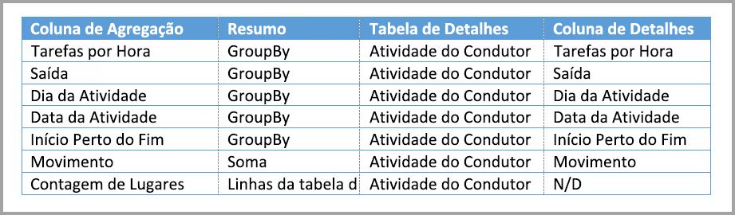

## Agregações baseadas em colunas Agrupar por combinadas com relações

Pode inclusive combinar as duas técnicas de agregação descritas no início deste artigo. As **agregações** baseadas em relações podem exigir a divisão das tabelas de dimensão desnormalizadas em múltiplas tabelas. Se tal for dispendioso ou impraticável para algumas tabelas de dimensão, os atributos necessários podem ser replicados na tabela de agregação para algumas dimensões e relações utilizadas para outras.

O modelo seguinte replica *Month* (Mês), *Quarter* (Trimestre), *Semester* (Semestre) e *Year* (Ano) na tabela **Sales Agg** (Agregação de Vendas). Não existe nenhuma relação entre a tabela **Sales Agg** (Agregação de Vendas) e **Date** (Data). Existem relações entre **Customer** (Cliente) e **Product Subcategory** (Subcategoria de Produto). O modo de armazenamento da tabela **Sales Agg** (Agregação de Vendas) é o de importação.

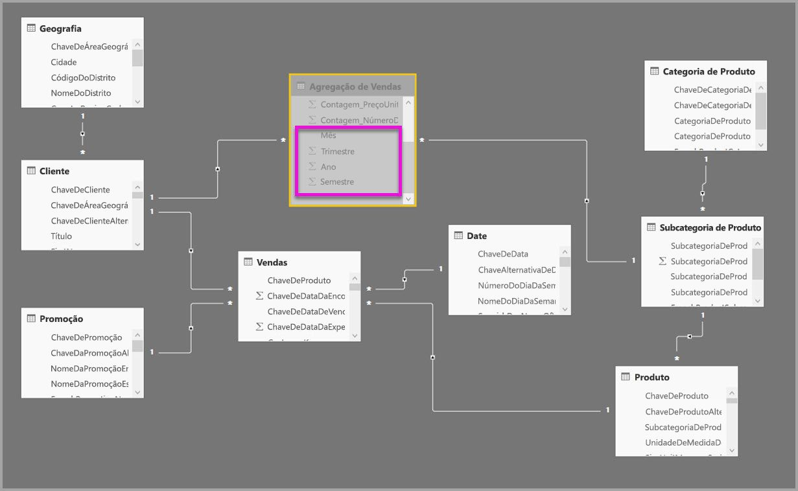

A tabela seguinte mostra as entradas definidas na caixa de diálogo **Gerir agregações** da tabela **Sales Agg** (Agregação de Vendas). As entradas GroupBy em que **Date** (Data) corresponde à tabela de detalhes são obrigatórias para obter resultados de agregações para as consultas são agrupadas pelos atributos Date (Data). Tal como no exemplo anterior, as entradas GroupBy para CustomerKey (ClientePrincipal) e ProductSubcategoryKey (SubcategoriaDeProdutoPrincipal) não afetam os resultados da agregação devido à presença de relações (novamente com a exceção de DISTINCTCOUNT).

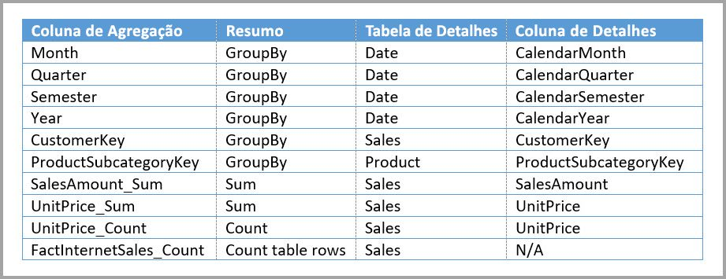

> Nota: este modelo exige que a tabela **Data** esteja no modo DirectQuery para preencher a caixa de diálogo Gerir agregações porque se trata de uma tabela de detalhes. Esta é uma limitação de Pré-visualização que pretendemos remover na Disponibilidade Geral.

### Exemplos de consulta

A consulta seguinte obtém resultados da agregação porque CalendarMonth (MêsDoCalendário) está abrangido pela tabela de agregação e CategoryName (NomeDaCategoria) é acessível através de relações um-para-muitos. É utilizada a agregação Soma para **SalesAmount** (MontanteDeVendas).

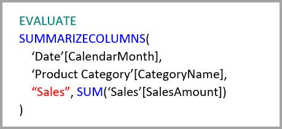

A consulta seguinte não obtém resultados da agregação porque CalendarDay (DiaDoCalendário) não é abrangido pela tabela de agregação.

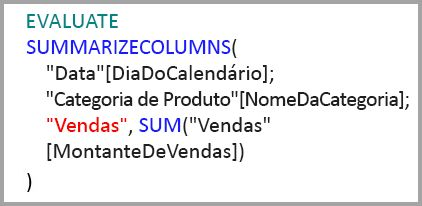

A seguinte consulta de tempo-inteligência não alcançará a agregação porque a função DATESYTD gera uma tabela de valores CalendarDay (DiaDoCalendário), que não é abrangida pela tabela de agregação.

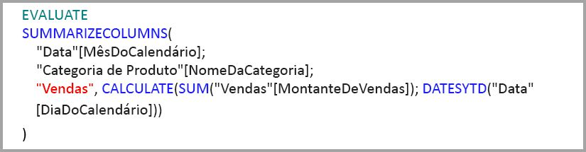

## As caches devem ser mantidas sincronizadas

As **agregações** que combinam o modo DirectQuery e o modo Importação do armazenamento e/ou Duplo podem devolver dados diferentes se a cache dentro da memória não permanecer sincronizada com os dados de origem. A execução da consulta não tentará dissimular os problemas de dados ao filtrar, por exemplo, os resultados do DirectQuery para corresponder aos valores da cache. Estas funcionalidades são otimizações de desempenho e devem ser utilizadas apenas de modo a que não comprometam a sua capacidade de satisfazer os requisitos comerciais. É da sua responsabilidade conhecer os seus fluxos de dados, pelo que deve criá-los em conformidade. Existem técnicas estabelecidas para lidar com estes problemas na origem, se necessário.

## Próximos passos

Os artigos seguintes descrevem de forma mais detalhada os modelos compostos e o DirectQuery.

* [Modelos compostos no Power BI Desktop (Pré-visualização)](desktop-composite-models.md)
* [Relações muitos para muitos no Power BI Desktop (Pré-visualização)](desktop-many-to-many-relationships.md)
* [Modo de armazenamento no Power BI Desktop (Pré-visualização)](desktop-storage-mode.md)

Artigos do DirectQuery:

* [Utilizar o DirectQuery no Power BI](desktop-directquery-about.md)
* [Origens de dados suportadas pelo DirectQuery no Power BI](desktop-directquery-data-sources.md)
