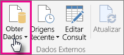
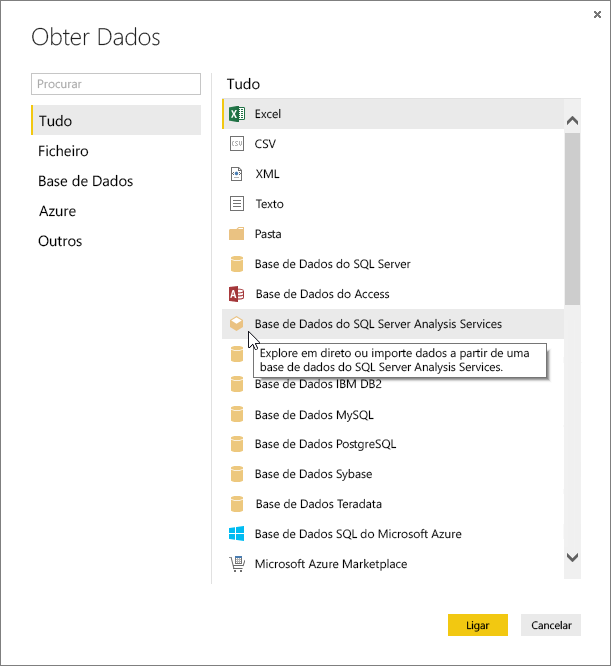
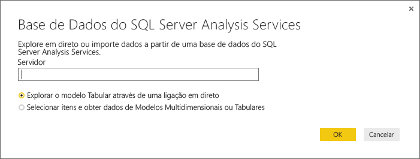
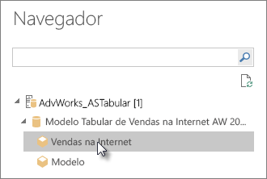
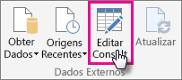
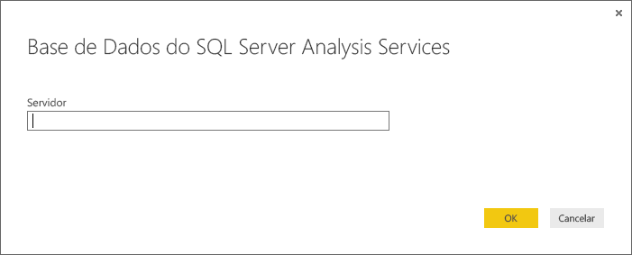

# Utilizar os dados de tabela do Analysis Services no Power BI Desktop
Com o Power BI Desktop, existem duas formas de ligar e obter dados dos modelos Tabulares do SQL Server Analysis Services: Explorar através de uma ligação dinâmica ou Selecionar itens e importá-los para o Power BI Desktop.

Vamos ver isso mais de perto.

**Explorar através de uma ligação dinâmica** – Ao utilizar uma ligação dinâmica, os itens no modelo Tabular ou perspetiva, como tabelas, colunas e medidas, aparecem na lista Campos do Power BI Desktop. Pode utilizar as ferramentas avançadas de relatório e visualização do Power BI Desktop para explorar o modelo Tabular de formas novas e altamente interativas.

Ao ligar-se dinamicamente, nenhuns dados do modelo Tabular são importados para o Power BI Desktop. Cada vez que interagir com uma visualização, o Power BI Desktop consulta o modelo Tabular e calcula os resultados que vê. Estará sempre a ver os dados mais recentes disponíveis no modelo Tabular, quer sejam da última hora de processamento ou das tabelas do DirectQuery disponíveis no Modelo Tabular. 

Tenha em atenção que os modelos Tabulares são altamente seguros. Os itens que aparecem no Power BI Desktop dependem das suas permissões para o modelo Tabular ao qual está ligado.

Quando tiver criado relatórios dinâmicos no Power BI Desktop, pode partilhá-los ao publicá-los no site do Power BI. Ao publicar um ficheiro do Power BI Desktop com uma ligação dinâmica num modelo em Tabela do site do Power BI, um Gateway de dados no local deverá ser instalado e configurado por um administrador. Para saber mais, veja [Gateway de dados no local](service-gateway-onprem.md).

**Selecionar itens e importar para o Power BI Desktop** – Ao ligar a esta opção, pode selecionar os itens como tabelas, colunas e medidas no modelo Tabular ou perspetiva e carregá-los para um modelo do Power BI Desktop. Pode utilizar o Editor de Consultas avançado do Power BI Desktop para personalizar ainda mais o que quer. Pode utilizar as funcionalidades de modelação do Power BI Desktop para modelar ainda mais os dados. Nenhuma ligação dinâmica é mantida entre o Power BI Desktop e o modelo Tabular. Pode então explorar o modelo do Power BI Desktop offline ou publicar no site do Power BI.

## Para ligar a um modelo Tabular
1. No Power BI Desktop, no separador **Base**, clique em **Obter Dados**.
   
   
2. Clique em **Base de Dados do SQL Server Analysis Services** e em **Ligar**.
   
   
3. Introduza o Nome do servidor e selecione um modo de ligação. 
   
   
4. Este passo depende do modo de ligação selecionado:

* Se estiver a ligar dinamicamente, no Navegador, selecione um modelo Tabular ou uma perspetiva.
  
  
* Se escolher Selecionar itens e Obter dados, no Navegador, selecione um modelo Tabular ou uma perspetiva. Além disso, pode selecionar apenas determinadas tabelas ou colunas para carregar. Para formatar os dados antes do carregamento, clique em Editar para abrir o Editor de Consultas. Quando estiver pronto, clique em Carregar para importar os dados para o Power BI Desktop.

  

## Perguntas Mais Frequentes
**Pergunta:** É necessário um Gateway de dados no local?

**Resposta:** Depende. Se utilizar o Power BI Desktop para se ligar dinamicamente a um modelo Tabular, mas não tem intenção de publicar no site do Power BI, não será necessário ter um gateway. Por outro lado, se pretende publicar no site do Power BI, é necessário ter um gateway de dados para garantir a comunicação segura entre o serviço Power BI e o servidor local do Analysis Services. Certifique-se de falar com o administrador do servidor do Analysis Services antes de instalar um gateway de dados.

Se escolher selecionar itens e obter dados, importará dados do modelo de Tabela diretamente no ficheiro do Power BI Desktop e, por isso, não é necessário ter um gateway.

**Pergunta:** Qual é a diferença entre uma ligação dinâmica a um modelo Tabular do serviço Power BI e uma ligação dinâmica a partir do Power BI Desktop?

**Resposta:** Durante a ligação dinâmica a um modelo Tabular do site no serviço Power BI para uma base de dados local do Analysis Services na organização, é necessário ter um Gateway de dados no local para proteger a comunicação entre eles. Durante a ligação dinâmica a um modelo Tabular do Power BI Desktop, não é necessário ter um gateway, pois tanto o Power BI Desktop como o servidor do Analysis Services ao qual está a ligar estão a ser executados localmente na sua organização. No entanto, se publicar o ficheiro do Power BI Desktop no site do Power BI, é necessário um gateway.

**Pergunta:** Se tiver criado uma ligação dinâmica, posso ligar a outra origem de dados no mesmo ficheiro do Power BI Desktop?

**Resposta:** Não. Não pode explorar dados dinâmicos e ligar a outro tipo de origem de dados no mesmo ficheiro. Se já tiver importado os dados ou ligado a uma origem de dados diferente num ficheiro do Power BI Desktop, tem de criar um novo ficheiro para explorar dinamicamente.

**Pergunta:** Se tiver criado uma ligação dinâmica, posso editar o modelo ou a consulta no Power BI Desktop?

**Resposta:** Pode criar medidas ao nível dos relatórios no Power BI Desktop, mas todas as outras funcionalidades de consulta e modelação estão desativadas ao explorar os dados dinâmicos.

**Pergunta:** Se tiver criado uma ligação dinâmica, esta é segura?

**Resposta:** Yes. As suas credenciais atuais do Windows são utilizadas para ligar ao servidor do Analysis Services. Não pode utilizar credenciais Básicas ou armazenadas no serviço Power BI ou no Power BI Desktop quando explorar dinamicamente.

**Pergunta:** No Navegador, vejo um modelo e uma perspetiva. Qual é a diferença?

**Resposta:** Uma perspetiva é uma vista específica de um modelo Tabular. Pode incluir apenas determinadas tabelas, colunas ou medidas consoante uma necessidade de análise de dados exclusiva. Um modelo Tabular contém sempre pelo menos uma perspetiva, que pode incluir tudo no modelo. Se não tiver a certeza de qual deve selecionar, contacte o seu administrador.

## Para alterar o nome do servidor após a ligação inicial
Depois de criar um ficheiro do Power BI Desktop com uma ligação dinâmica de exploração, pode haver alguns casos em que quer alternar a ligação para um servidor diferente. Por exemplo, se tiver criado o ficheiro do Power BI Desktop ao ligar a um servidor de desenvolvimento e, antes da publicação no serviço Power BI, quer alternar a ligação para o servidor de produção.

1. Selecione **Editar Consultas** no Friso.
   
   
2. Introduza o nome do novo servidor.
   
   
   
   
## Resolução de problemas 
A lista seguinte descreve todos os problemas conhecidos ao ligar-se ao SQL Server Analysis Services (SSAS) ou ao Azure Analysis Services. 

* **Erro: Não foi possível carregar o esquema do modelo**. Normalmente, este erro ocorre quando o utilizador que se liga ao Analysis Services não tem acesso à base de dados/modelo.

