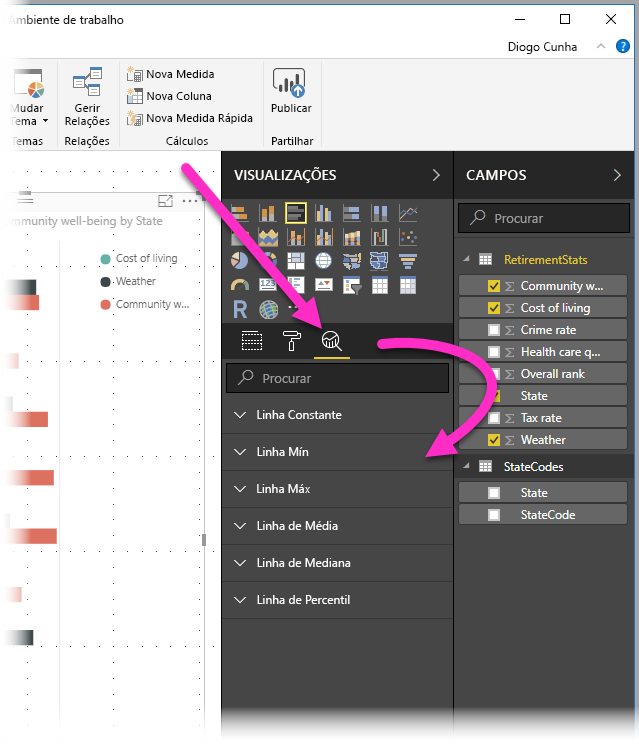
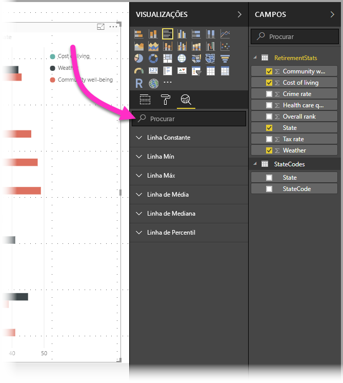
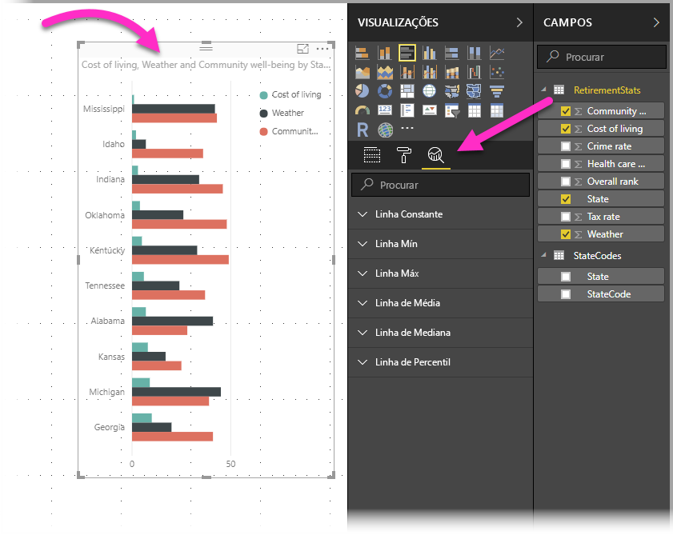
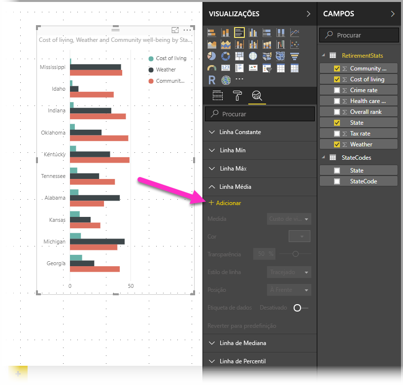
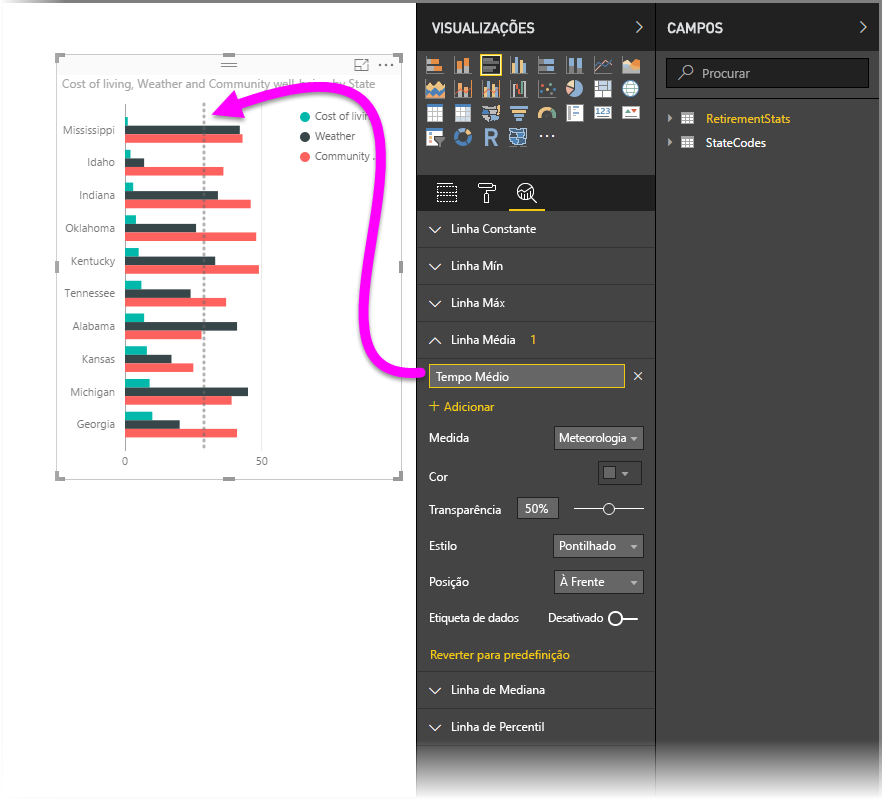
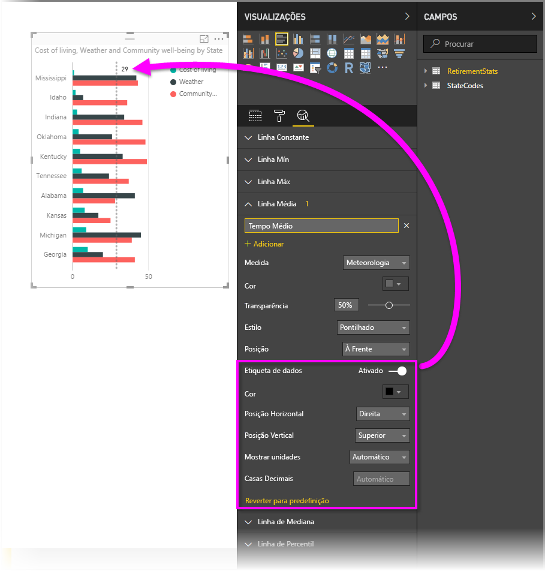
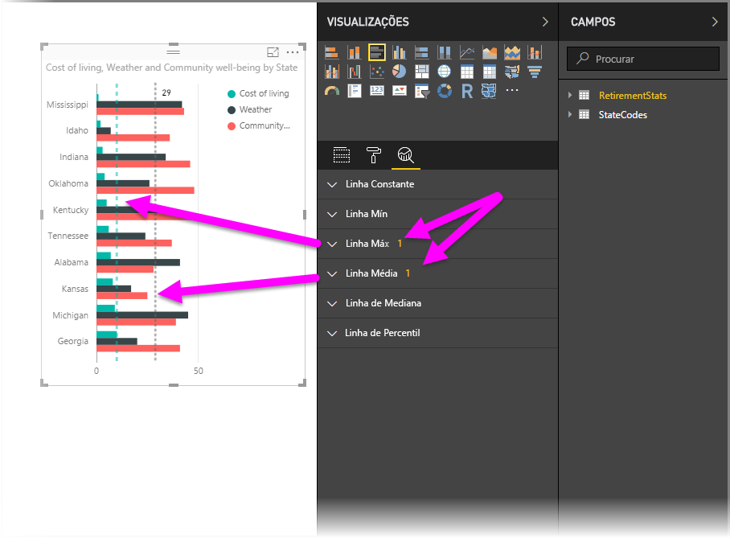
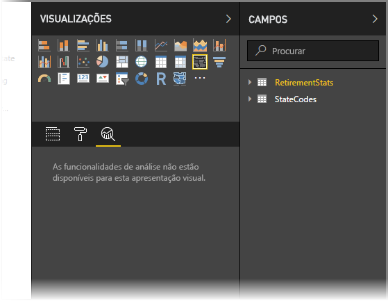
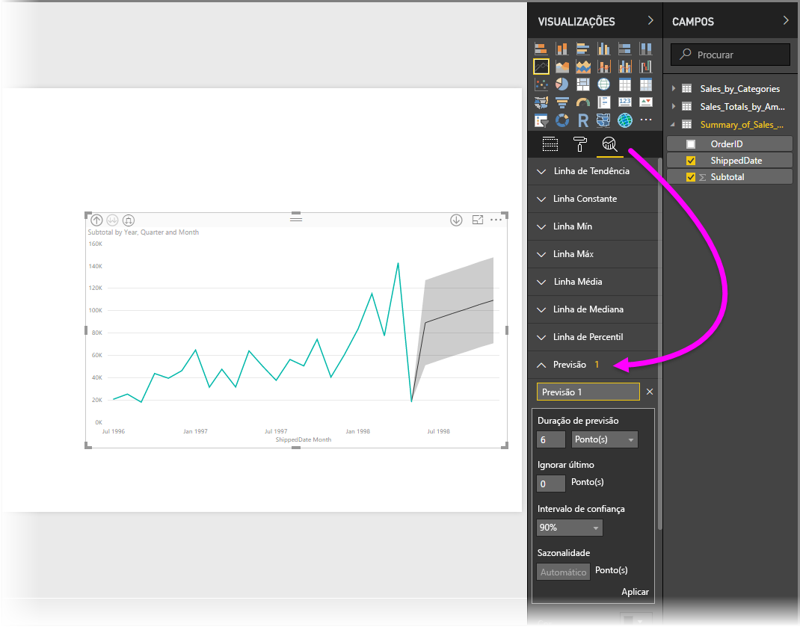

# Utilizar o painel Análise no Power BI Desktop
Com o painel **Análise** no **Power BI Desktop**, pode adicionar *linhas de referência* dinâmicas a visuais e dar foco a tendências ou informações importantes. O painel **Análise** encontra-se na área **Visualizações** do Power BI Desktop.

> [!NOTE]
> O painel **Análise** aparece apenas quando seleciona um visual na tela do Power BI Desktop.

## Pesquisar no painel Análise
A partir do lançamento de fevereiro de 2018 do **Power BI Desktop** (versão 2.55.5010.201 ou posterior), pode pesquisar no painel **Análise**, que é uma subsecção do painel **Visualizações**. Conforme mostrado na imagem abaixo, a caixa de pesquisa é apresentada quando o painel **Análise** está selecionado.

## Utilizar o painel Análise
Com o painel **Análise**, pode criar os seguintes tipos de linhas de referência dinâmica (nem todas as linhas estão disponíveis para todos os tipos de visuais):

* Linha constante do Eixo X
* Linha constante do Eixo Y
* Linha Mín
* Linha Máx
* Linha Média
* Linha Mediana
* Linha de Percentil

As seguintes secções mostram como pode utilizar o painel **Análise** e linhas de referência dinâmicas nas suas visualizações.

Para ver as linhas de referência dinâmicas disponíveis para um visual, siga estes passos:

1. Selecione ou crie um visual e, em seguida, selecione o ícone **Análise** na secção **Visualizações**.
   
   
2. Selecione a seta para baixo do tipo de linha que pretende criar para expandir as respetivas opções. Neste caso, vamos selecionar **Linha Média**.
   
   
3. Para criar uma nova linha, selecione **+ Adicionar**. Depois, pode especificar um nome para a linha ao fazer duplo clique na caixa de texto e, em seguida, escrever o seu nome.
   
   Tem diversos tipos de opções para a sua linha, como selecionar a *cor*, *transparência*, *estilo* e *posição* (relativamente aos elementos de dados do visual) e se pretende incluir a etiqueta. Um aspeto importante: pode selecionar qual a **Medida** no visual na qual pretende que a sua linha se baseie ao selecionar o menu pendente **Medida**, que é automaticamente preenchido com elementos de dados do visual. Neste caso, vamos selecionar *Weather (Tempo)* como medida, dar-lhe a etiqueta de *Average Weather (Tempo Médio)* e personalizar algumas das restantes opções, conforme mostrado abaixo.
   
   
4. Se pretender que apareça uma etiqueta de dados, ative o controlo de deslize **Etiqueta de dados**. Quando o fizer, receberá uma série de opções adicionais para a sua etiqueta de dados, conforme mostrado na imagem seguinte.
   
   
5. Repare no número apresentado junto ao item **Linha média** no painel **Análise**. Isto indica-lhe quantas linhas dinâmicas, e de que tipo, tem atualmente no seu elemento visual. Se adicionarmos uma **Linha máxima** para *Cost of Living (Custo de Vida)*, pode ver que o painel **Análise** demonstra que temos também uma linha de referência dinâmica **Linha máxima** aplicada a este visual.
   
   

Se o visual que selecionou não pode ter linhas de referência dinâmicas aplicadas (neste caso, um visual de **Mapa**), irá ver o seguinte quando selecionar o painel **Análise**.

Existem diversas informações interessantes que pode destacar ao criar linhas de referência dinâmicas com o painel **Análise**.

Estamos a planear mais funcionalidades e capacidades, incluindo expandir que visuais podem ter linhas de referência dinâmicas aplicadas, pelo que recomendamos que consulte esta secção com frequência para estar a par das novidades.

## Aplicar a Previsão
Pode utilizar a funcionalidade **Previsão** ao selecionar um visual e, em seguida, expandir a secção **Previsão** do painel **Análise**. Pode especificar muitas entradas para modificar a previsão, como a *Duração de previsão*, o *Intervalo de confiança* e muitos outros. A imagem seguinte mostra um visual de linha básica com a previsão aplicada, mas pode utilizar a sua imaginação (e experimentar a funcionalidade *previsão*) para saber como se pode aplicar aos seus modelos.

## Limitações
A capacidade de utilizar linhas de referência dinâmicas baseia-se no tipo de visual utilizado. A lista seguinte mostra quais as linhas dinâmicas que estão atualmente disponíveis para cada visual:

Utilização integral de linhas dinâmicas disponível nos seguintes visuais:

* Gráfico de área
* Gráfico de linhas
* Gráfico de dispersão
* Gráfico de Colunas agrupadas
* Gráfico de barras agrupadas

Os seguintes visuais só podem utilizar uma *linha constante* no painel **Análise**:

* Áreas Empilhadas
* Barras Empilhadas
* Colunas Empilhadas
* Barras Empilhadas a 100%
* Colunas Empilhadas a 100%

Para os seguintes visuais, a única opção atualmente disponível é uma *linha de tendência*:

* Linhas Não Empilhadas
* Gráfico de Colunas agrupadas

Finalmente, os visuais não Cartesianos não podem atualmente aplicar linhas dinâmicas do painel **Análise**, nomeadamente:

* Matriz
* Gráfico circular
* Anel
* Tabela

A linha de percentil só está disponível quando utiliza dados importados no **Power BI Desktop** ou quando está ligado em direto a um modelo num servidor com o **Analysis Service 2016** ou posterior, o **Azure Analysis Services** ou um conjunto de dados no serviço Power BI. 

## Próximos passos
Existem inúmeras coisas que pode fazer com o Power BI Desktop. Para obter mais informações sobre as suas capacidades, veja os seguintes recursos:

* [Novidades no Power BI Desktop](desktop-latest-update.md)
* [Transferir o Power BI Desktop](desktop-get-the-desktop.md)
* [O que é o Power BI Desktop?](desktop-what-is-desktop.md)
* [Descrição Geral das Consultas no Power BI Desktop](desktop-query-overview.md)
* [Tipos de Dados no Power BI Desktop](desktop-data-types.md)
* [Formatar e Combinar Dados com o Power BI Desktop](desktop-shape-and-combine-data.md)
* [Tarefas Comuns de Consulta no Power BI Desktop](desktop-common-query-tasks.md)    

