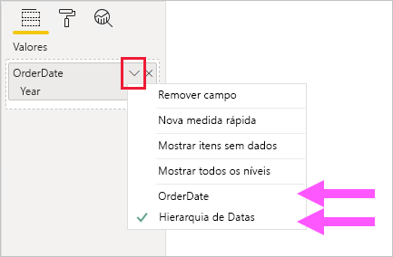
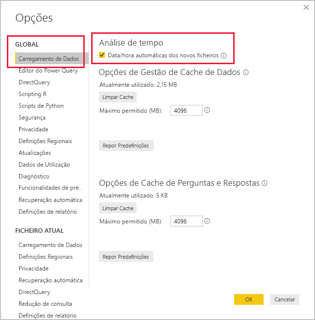

# <a name="apply-auto-datetime-in-power-bi-desktop"></a>Aplicar data/hora automáticas no Power BI Desktop

Este artigo destina-se aos modeladores de dados que criam Modelos de importação ou Composição no Power BI Desktop. Apresenta e descreve a opção _Data/hora automáticas_.

A Data/hora automática é uma opção de carregamento de dados no Power BI Desktop. A finalidade desta opção é suportar relatórios de inteligência de tempo convenientes com base em colunas de data carregadas para um modelo. Especificamente, esta opção permite que os autores de relatório que utilizam o seu modelo de dados possam filtrar, agrupar e desagregar através de períodos de tempo de calendário (anos, trimestres, meses e dias). O importante é que não precisa de desenvolver explicitamente estes recursos de análise de tempo.

Quando a opção está ativada, o Power BI Desktop cria uma tabela oculta de data/hora automáticas para cada coluna de data, desde que todas as condições a seguir sejam verdadeiras:

- O modo de armazenamento da tabela é Importação
- O tipo de dados da coluna é data ou data/hora
- A coluna não é o lado "muitos" de uma relação de modelo

## <a name="how-it-works"></a>Como funciona

Cada tabela de data/hora automáticas é, na verdade, uma [tabela calculada](desktop-calculated-tables.md) que gera linhas de dados através da função do DAX [CALENDAR](/dax/calendar-function-dax). Cada tabela também inclui seis colunas calculadas: **Dia**, **MonthNo**, **Mês**, **QuarterNo**, **Trimestre** e **Ano**.

> [!NOTE]
> O Power BI traduz e formata os nomes e valores de coluna de acordo com a [linguagem do modelo](supported-languages-countries-regions.md#choose-the-language-for-the-model-in-power-bi-desktop).

O Power BI Desktop também cria uma relação entre a coluna **Data** da data/hora automática da tabela e a coluna de data do modelo.

A tabela de data/hora automática inclui os anos do calendário completos que abrangem todos os valores de data armazenados na coluna de data do modelo. Por exemplo, se o valor mais antigo numa coluna de data for 20 de março de 2016 e o valor mais recente for 23 de outubro de 2019, a tabela irá conter 1461 linhas. Representa uma linha para cada data nos quatro anos de calendário de 2016 a 2019. Quando o Power BI atualiza o modelo, cada tabela de data/hora automática também é atualizada. Desta forma, o modelo contém sempre as datas que abrangem os valores da coluna de data.

Se fosse possível ver as linhas de uma tabela de data/hora automática, estas teriam o seguinte aspeto:


> [!NOTE]
> As tabelas de data/hora automáticas são permanentemente ocultadas, mesmo de modeladores. Elas não podem ser vistas no painel **Campos** ou no diagrama da vista Modelo e as suas linhas não podem ser vistas na vista Dados. Além disso, a tabela e respetiva coluna não podem ser referenciadas diretamente por expressões do DAX.

A tabela também define uma hierarquia, ao apresentar elementos visuais com um caminho de desagregação nos níveis de ano, trimestre, mês e dia.

Se fosse possível ver uma tabela de data/hora automática no diagrama da vista Modelo, esta teria o seguinte aspeto (as colunas relacionadas estão destacadas):


## <a name="work-with-auto-datetime"></a>Trabalhar com data/hora automáticas

Quando existe uma tabela de data/hora automáticas para uma coluna de data (e essa coluna está visível), os autores de relatório não irão encontrar essa coluna como um campo no painel **Campos**. Ao invés, encontram um objeto expansível que tem o nome da coluna de data. Pode identificá-lo facilmente porque tem um ícone de calendário. Quando os autores do relatório expandem o objeto do calendário, encontram uma hierarquia chamada **Hierarquia de Data**. Depois de expandir a hierarquia, encontram quatro níveis: **Ano**, **Trimestre**, **Mês** e **Dia**.


A hierarquia de data/hora automáticas gerada pode ser utilizada para configurar um elemento visual exatamente da mesma forma que as hierarquias regulares podem ser utilizadas. Os elementos visuais podem ser configurados com a hierarquia completa **Hierarquia de Data** ou níveis específicos da hierarquia.

Existe, no entanto, uma funcionalidade adicional que não é suportada por hierarquias regulares. Quando a hierarquia de data/hora automática (ou um nível da hierarquia) é adicionada a um elemento visual, os autores do relatório podem alternar entre utilizar a hierarquia ou a coluna de data. Esta abordagem faz sentido para alguns elementos visuais, quando tudo o que precisam é a coluna de data, dispensando a hierarquia e os respetivos níveis. Começam por configurar o campo do elemento visual (clique com o botão direito do rato no campo do elemento visual ou clique na seta para baixo) e, em seguida, utilizam o menu de contexto para alternar entre a coluna de data ou a hierarquia de data.



Por fim, os cálculos de modelo, escritos no DAX, podem referenciar uma coluna de data _diretamente_ ou as colunas da tabela oculta de data/hora automática _indiretamente_.

A fórmula escrita no Power BI Desktop pode fazer referência a uma coluna de data da forma normal. As colunas da tabela de data/hora automáticas, no entanto, devem ser referenciadas com uma sintaxe estendida especial. Comece primeiro por referenciar a coluna de data e, em seguida, seguindo-a por um ponto final (.). A barra de fórmulas de preenchimento automático irá permitir que selecione uma coluna da tabela de data/hora automáticas.

![Exemplo de inserção de uma expressão de medida do DAX na barra de fórmulas. A fórmula até ao momento lê Date Count = COUNT(Sales[OrderDate]. e uma lista de preenchimento automático apresenta as sete colunas da tabela oculta de data/hora automáticas. Estas colunas são: Data, Dia, Mês, MonthNo, Trimestre, QuarterNo e Ano.](media/desktop-auto-date-time/auto-date-time-dax-auto-complete.png)

No Power BI Desktop, uma expressão de medida válida pode ler:

```dax
Date Count = COUNT(Sales[OrderDate].[Date])
```

> [!NOTE]
> Embora esta expressão de medida seja válida no Power BI Desktop, ela não é uma sintaxe do DAX correta. Internamente, o Power BI Desktop transpõe a sua expressão para fazer referência à coluna da tabela verdadeira (oculta) de data/hora automáticas.

## <a name="configure-auto-datetime-option"></a>Configurar opção de data/hora automáticas

A data/hora automáticas pode ser configurada _globalmente_ ou para o _ficheiro atual_. A opção global aplica-se a novos ficheiros do Power BI Desktop e pode ser ativada ou desativada a qualquer momento. Para uma nova instalação do Power BI Desktop, ambas as opções estão ativadas por predefinição.

A opção de ficheiro atual também pode ser ativada ou desativada a qualquer momento. Quando ativada, são criadas tabelas de data/hora automáticas. Quando desativada, todas as tabelas de data/hora automáticas são removidas do modelo.

> [!CAUTION]
> Preste atenção quando desativar a opção de ficheiro atual, uma vez que tal irá remover as tabelas de data/hora automática. Certifique-se de que corrige todos os filtros de relatório ou elementos visuais incorretos que tenham sido configurados para serem utilizados.

No Power BI Desktop, selecione _Ficheiro > Opções e definições > Opções_ e, em seguida, selecione a página **Global** ou **Ficheiro Atual**. Em qualquer página, a opção existe na secção **Inteligência de tempo**.



## <a name="next-steps"></a>Próximos passos

Para obter mais informações relacionadas com este artigo, consulte os seguintes recursos:

- [Orientação de data/hora automáticas no Power BI Desktop](guidance/auto-date-time.md)
- [Definir e utilizar tabelas de datas no Power BI Desktop](desktop-date-tables.md)
- Perguntas? [Experimente perguntar à Comunidade do Power BI](https://community.powerbi.com/)
