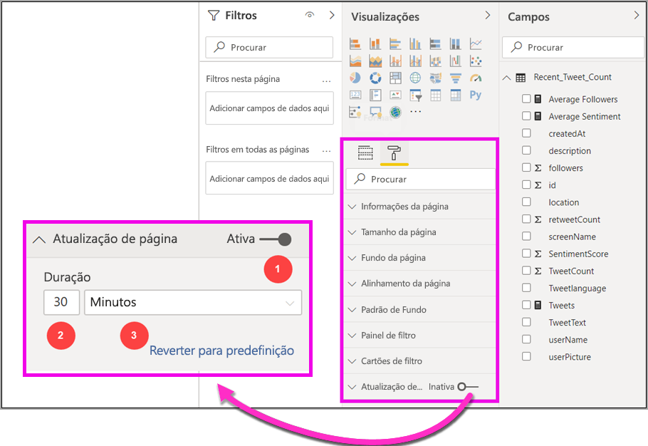
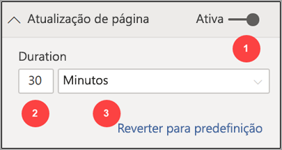
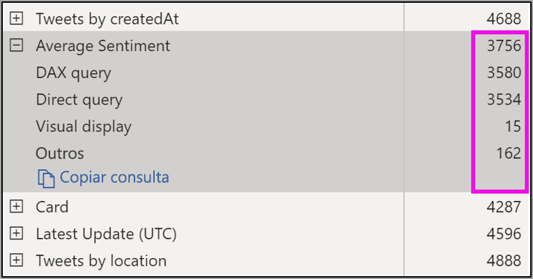
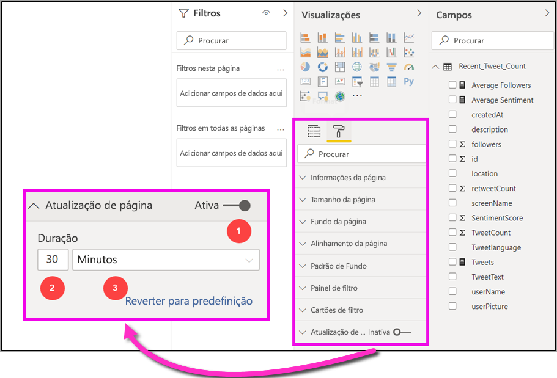

# Automatic page refresh in Power BI Desktop (preview) (Atualização automática de páginas no Power BI Desktop [pré-visualização])

Durante a monitorização de eventos críticos, é importante que os dados sejam atualizados assim que a origem de dados é atualizada. Por exemplo, na indústria transformadora, é essencial saber quando uma máquina tem problemas de funcionamento ou está perto de os ter.

A funcionalidade de atualização automática de página (APR) no Power BI permite que a página de relatório ativa consulte quanto à existência de novos dados, com uma cadência predefinida, nas [origens do DirectQuery](https://docs.microsoft.com/power-bi/desktop-directquery-about).

## Utilizar a atualização automática de página

Para esta versão de pré-visualização, deve ativar a funcionalidade de atualização automática de página no Power BI Desktop. Aceda a **Ficheiro > Opções e definições** e, em seguida, selecione **Opções** e **Funcionalidades de pré-visualização** no painel esquerdo. Ative a funcionalidade ao selecionar a caixa de verificação ao lado de *Atualização automática de página*. A atualização automática de página só está disponível para as origens de dados do DirectQuery.

Para utilizar a atualização automática de página, selecione a página de relatório para a qual deseja ativar a atualização. No painel **Visualizações**, selecione o ícone **Formatação** (um rolo de tinta) e localize **Atualização de página** próximo da parte inferior do painel. 

A imagem seguinte mostra o cartão **Atualização de página**. As explicações dos elementos numerados estão descritas nos parágrafos seguintes:

1.  Controlo de deslize da Atualização Automática de Página – ativa/desativa a atualização de página
2.  Valor do intervalo da atualização de página – valor do número para o intervalo de atualização
3.  Unidade de intervalo da atualização de página – unidade de intervalo para a atualização de página

Aqui, pode ativar a atualização de página e selecionar a duração da atualização. O valor predefinido é de 30 minutos (o intervalo de atualização mínimo é de um segundo). O relatório começará a ser atualizado com o intervalo definido. 

## Determinar o intervalo de atualização de página

Quando a atualização automática de página está ativada, o Power BI Desktop está constantemente a enviar consultas para a origem de dados do DirectQuery. Existirá um atraso entre o envio da consulta e a devolução dos dados, assim, para intervalos de atualização curtos deve confirmar que as consultas devolveram com sucesso os dados da consulta dentro do intervalo configurado. Se os dados não forem devolvidos dentro do intervalo, deverá criar situações nas quais os elementos visuais são atualizados com menos frequência do que aquela que foi configurada.

Como melhor prática, o intervalo de atualização deve, pelo menos, corresponder à taxa de chegada esperada dos novos dados:

* Se os novos dados chegarem à origem a cada 20 minutos, o intervalo de atualização não poderá ser inferior a 20 minutos. 

* Se os novos dados chegarem a cada segundo, o intervalo deverá ser definido como um segundo. 

Para intervalos de atualização baixos, como um segundo, deve também considerar o tipo da origem de dados de consulta direta, a carga que as consultas criam sobre a mesma, a distância a que ficam os visualizadores dos relatórios do datacenter da capacidade e etc. 

Pode fazer uma estimativa com o Analisador de Desempenho no Power BI Desktop, que lhe permite confirmar se cada consulta visual tem tempo suficiente para regressar com o resultado da origem e onde o tempo é gasto. Com base nos resultados do Analisador de Desempenho, pode ajustar e fazer alterações à origem de dados ou pode experimentar com outros elementos visuais e outras medidas no relatório.

A seguinte imagem mostra os resultados de um DirectQuery no Analisador de Desempenho:

Vamos considerar outras características sobre esta origem de dados. 

1.  Os dados chegam a uma taxa de dois segundos. 
2.  O analisador de desempenho mostra uma consulta máxima + tempo de apresentação de aproximadamente 4,9 segundos (4688 milissegundos). 
3.  A origem de dados está configurada para lidar com aproximadamente 1000 consultas simultâneas por segundo. 
4.  Espera que aproximadamente 10 utilizadores visualizem o relatório em simultâneo.

O que resulta no seguinte:

* **5 elementos visuais x 10 utilizadores = aproximadamente 50 consultas**

Este cálculo resulta em muito mais carga do que a origem de dados consegue suportar. Os dados chegam a uma taxa de dois segundos. Assim, esta deve ser a sua taxa de atualização. No entanto, dado que a conclusão da consulta demora cerca de cinco segundos, devemos defini-la para mais de cinco segundos. 

Note também que este resultado pode ser diferente quando publica o relatório no serviço, dado que o relatório utilizará a instância do Analysis Services alojada na cloud. Pode querer ajustar as taxas de atualização em conformidade. 

Para ter em conta o tempo das consultas e de atualização, o Power BI só executará a próxima consulta de atualização quando todas as consultas de atualização restantes forem concluídas. Assim, mesmo que o intervalo de atualização seja menor do que o tempo que consultas demoram a ser processadas, o Power BI só atualizará novamente quando as consultas restantes forem concluídas. 

Em seguida, vamos ver como pode, potencialmente, detetar e diagnosticar problemas de desempenho como um administrador de capacidade. Também pode ver a secção **FQA da atualização automática de páginas** mais adiante neste artigo, para obter mais perguntas e respostas sobre desempenho e a resolução de problemas.

## Atualização automática de página no serviço Power BI

Também pode definir os intervalos de atualização automática de página para os relatórios que foram criados no Power BI Desktop e publicados no serviço Power BI. 

A atualização automática de página para os relatórios no serviço Power BI é configurada com passos semelhantes à configuração no Power BI Desktop. A imagem a seguir mostra a configuração da **Página de atualização** para o serviço Power BI:

1.  Controlo de deslize da Atualização Automática de Página – ativa/desativa a atualização de página
2.  Valor do intervalo da atualização de página – o valor do número para o intervalo de atualização ( deve ser um número inteiro)
3.  Unidade de intervalo da atualização de página – unidade de intervalo para a atualização de página

### Intervalos da atualização de páginas

Os intervalos da atualização de páginas permitidos no serviço Power BI são afetados pelo tipo de área de trabalho do relatório. Tal aplica-se a todos estes relatórios:

* Publicar um relatório numa área de trabalho que tem a atualização automática de páginas ativada
* Editar um intervalo de atualização de páginas que já se encontra na área de trabalho
* Criar um relatório diretamente no serviço

O Power BI Desktop não tem restrições para os intervalo de atualização. A frequência do intervalo de atualização pode ser definida para um segundo. No entanto, quando os relatórios são publicados no serviço Power BI, aplicam-se certas restrições (descritas nas seguintes secções).

### Restrições dos intervalos de atualização

No serviço Power BI, as restrições da atualização automática de páginas aplicam-se com base em fatores, por exemplo, área de trabalho e se os serviços Premium estão a ser utilizados.

Para esclarecer como isto funciona, vamos começar com algum contexto sobre as [capacidades e áreas de trabalho](whitepaper-powerbi-premium-deployment.md#capacities)

As **capacidades** são um conceito base do Power BI que representa um conjunto de recursos (armazenamento, processador e memória) utilizados para hospedar e fornecer conteúdos do Power BI. As capacidades podem ser partilhadas ou dedicadas. Uma **Capacidade Partilhada** é partilhada com outros clientes da Microsoft, enquanto uma **Capacidade Dedicada** é totalmente alocada a um único cliente. As capacidades dedicadas são apresentadas no artigo [Capacidades premium](whitepaper-powerbi-premium-deployment.md#capacities).

Na capacidade partilhada, as cargas de trabalho são executadas em recursos computacionais partilhados com outros clientes. Dado que a capacidade deve partilhar recursos, são impostos limites para garantir *fair play*, como definir um tamanho máximo de modelo (1 GB) e uma frequência máxima de atualização diária (oito vezes por dia).

As **áreas de trabalho** do Power BI residem nas capacidades e representam contentores de implementação, colaboração e segurança. Cada utilizador do Power BI tem uma área de trabalho pessoal conhecida como **A Minha Área de Trabalho**. As áreas de trabalho adicionais podem ser criadas para permitir a colaboração e a implementação, e são conhecidas como **áreas de trabalho**. Por predefinição, as áreas de trabalho, incluindo as áreas de trabalho pessoais, são criadas na **capacidade partilhada**.

Veja a seguir alguns detalhes dos dois cenários de área de trabalho:

**Áreas de trabalho partilhadas** – para áreas de trabalho normais (áreas de trabalho que não fazem parte de uma capacidade Premium), a atualização automática de páginas tem um intervalo mínimo de 30 minutos (o intervalo mais baixo permitido).

**Áreas de trabalho Premium**  – a disponibilidade da atualização automática de páginas nas áreas de trabalho Premium dependerá das definições da carga de trabalho que o administrador premium configurou para a capacidade do Power BI Premium. Existem duas variáveis que podem afetar a capacidade para configurar a atualização automática de páginas:

 1. *Funcionalidade ativada/desativada*: se o administrador de capacidade tiver decidido desativar a funcionalidade, não conseguirá configurar nenhum tipo de atualização de página no relatório publicado.

 2. *Intervalo mínimo de atualização*: ao ativar a funcionalidade, o administrador de capacidade deve definir um intervalo de atualização mínimo. Se o intervalo for inferior ao mínimo, o serviço Power BI definirá o intervalo para respeitar o intervalo mínimo definido pelo administrador de capacidade.

A tabela abaixo descreve com mais detalhes onde esta funcionalidade está disponível e os limites para cada tipo de capacidade e [modo de armazenamento](whitepaper-powerbi-premium-deployment.md#model-storage-modes)

| Modo de Armazenamento | Capacidade Dedicada | Capacidade Partilhada |
| --- | --- | --- |
| Direct Query | **Suportada** – Sim.  **Intervalo de atualização mínimo** – 1 segundo  **Definição manual do administrador de capacidade** – Sim. | **Suportada** – Sim.  **Intervalo de atualização mínimo** – 30 minutos  **Definição manual do administrador de capacidade** – Não. |
| Importar | **Suportada** – Não.  **Intervalo de atualização mínimo** – N/D.  **Definição manual do administrador de capacidade** – N/D. | **Suportada** – Não.  **Intervalo de atualização mínimo** – N/D.  **Definição manual do administrador de capacidade** – N/D. |
| Modo Misto (DQ + outros) | **Suportada** – Sim.  **Intervalo de atualização mínimo** – 1 segundo  **Definição manual do administrador de capacidade** – Sim. | **Suportada** – Sim.  **Intervalo de atualização mínimo** – 30 minutos  **Definição manual do administrador de capacidade** – Não. |
| Live Connect AS | **Suportada** – Não.  **Intervalo de atualização mínimo** – N/D.  **Definição manual do administrador de capacidade** – N/D. | **Suportada** – Não.  **Intervalo de atualização mínimo** – N/D.  **Definição manual do administrador de capacidade** – N/D. |
| Live Connect PBI | **Suportada** – Não.  **Intervalo de atualização mínimo** – N/D.  **Definição manual do administrador de capacidade** – N/D. | **Suportada** – Não.  **Intervalo de atualização mínimo** – N/D.  **Definição manual do administrador de capacidade** – N/D. |

> [!NOTE]
> Ao publicar o relatório com a atualização automática de páginas ativada no Power BI Desktop para o serviço, terá de fornecer as credenciais para a origem de dados do DirectQuery no menu de definições do conjunto de dados.

## Considerações e limitações

Existem algumas coisas a ter em conta ao utilizar a atualização automática de páginas no Power BI Desktop ou no serviço Power BI.

* Os modos de armazenamento Push, LiveConnect e Importação não são suportados pela atualização automática de páginas.  
* São suportados os modelos compostos que têm, pelo menos, uma origem de dados do DirectQuery.
* O Power BI Desktop não tem restrições para o intervalo de atualização, que pode ser tão frequente como a cada segundo. Quando os relatórios são publicados no serviço Power BI, certas restrições aplicam-se, conforme descrito anteriormente neste documento.

### Diagnósticos de desempenho

A atualização automática de páginas é útil para cenários de monitorização e exploração de dados em rápida mudança. No entanto, por vezes pode colocar uma carga indevida sobre a capacidade ou a origem de dados.

Para evitar uma carga indevida sobre as origens de dados, o Power BI tem as seguintes salvaguardas:

1. Todas as consultas de atualização automática de páginas são executadas com uma prioridade mais **baixa** para garantir que as consultas interativas (por exemplo, carregamento de páginas e filtragem cruzada de elementos visuais) tenham prioridade.
2. Se a consulta não tiver sido concluída antes do próximo ciclo de atualização, o Power BI não emitirá novas consultas de atualização até que a consulta anterior seja concluída. Por exemplo, se possuir um intervalo de atualização de um segundo e as consultas demorarem em média quatro segundos, o Power BI só emitirá efetivamente uma consulta a cada quatro segundos.

Existem duas áreas nas quais ainda pode encontrar estrangulamentos de desempenho:

1. **Capacidade:** a consulta atinge primeiro a capacidade premium que vai criar e avaliar a consulta DAX gerada a partir das visualizações do relatório para a origem das consultas.
2. **Origem de dados do Direct Query:** as consultas convertidas no passo anterior são, em seguida, executadas em relação à origem. Tal ocorreria nos SQL Servers, origens do SAP Hana e assim por diante.

Com a [aplicação de métricas Premium](service-admin-premium-monitor-capacity.md) disponível para os administradores, pode visualizar quanta da capacidade está a ser utilizada por consultas de baixa prioridade.

As consultas de baixa prioridade consistem em consultas de atualização automática de páginas e consultas de atualização de modelos. Atualmente, não existe forma de distinguir entre a carga de atualização automática de páginas e consultas de Atualização de Modelos.

Se notar que a capacidade está a ficar sobrecarregada com consultas de baixa prioridade, existem algumas ações que poderá executar:

1. Pedir um SKU premium maior.
2. Contactar o proprietário do relatório e pedir para diminuir o intervalo de atualização.
3. No portal de administrador de capacidade, pode:
  1. Desativar a atualização automática de páginas para essa capacidade
  2. Aumentar o intervalo de atualização mínimo, o que vai afetar todos os relatórios dessa capacidade.

### Perguntas frequentes

Esta secção proporciona perguntas e respostas comuns para os seguintes casos 

1. Sou autor de relatórios. Defini o intervalo de atualização do meu relatório como um segundo na Área de trabalho, mas após a publicação, o meu relatório não está a ser atualizado no serviço.

    * Confirme se a atualização automática de páginas está ativada para a página. Dado que esta definição é por página, é necessário garantir que está ativada para cada página no relatório que deseja que seja atualizado.
    * Confirme que carregou para uma área de trabalho com uma capacidade premium anexada. Caso contrário, o intervalo de atualização ficará bloqueado durante 30 minutos.
    * Se o relatório se encontrar numa área de trabalho premium, confirme com o administrador se ele ativou esta funcionalidade para a capacidade anexada. Além disso, confirme que o intervalo mínimo de atualização para a capacidade é inferior ou igual ao do seu relatório.

2. Sou um administrador de capacidade. Alterei as minhas definições de intervalo de atualização automática de página, mas estas não estão a ser refletidas. Por outras palavras, os relatórios ainda estão a ser atualizados a uma taxa que não deveriam ou não estão a ser atualizados apesar de ter ativado a definição.

    * As alterações à definição de atualização automática de página feitas na IU do administrador de capacidade demoram até cinco minutos a serem propagadas para os relatórios.
    * Para além de ativar a atualização automática de página para a capacidade, também deve ativá-la para as páginas de um relatório em que pretenda vê-la.

3. O meu relatório está a funcionar no modo misto (DQ + Importação). Nem todos os elementos visuais estão a ser atualizados.

    * Se os elementos visuais fizerem referência a tabelas de Importação, esta situação será normal. A atualização automática de página não é suportada para a Importação.
    * Veja a pergunta 1 nesta secção.

4. O meu relatório estava a atualizar sem problemas no serviço e subitamente parou.

    * Tente atualizar a página para ver se o problema se resolveu sozinho.
    * Consulte o administrador de capacidade, pois ele pode ter desativado a funcionalidade ou aumentado o intervalo mínimo de atualização (Veja Pergunta 2)

5. Sou autor de relatórios. Os meus elementos visuais não estão a ser atualizados na cadência que indiquei. Estão a ser atualizados a uma taxa mais lenta.

    * Se as consultas estiverem a demorar demasiado a ser executadas, o intervalo de atualização será atrasado. A atualização automática de página espera que todas as consultas sejam executadas antes de executar novas consultas.
    * O administrador de capacidade pode ter definido um intervalo de atualização mínimo superior ao que tinha definido no relatório. Contacte o administrador de capacidade e peça que este seja reduzido.

6. As consultas de atualização automática de página são servidas a partir da cache?

    * Não, todas as consultas de atualização automática de página ignoram os dados armazenados em cache.

## Próximos passos

Para obter mais informações, veja os seguintes artigos:

* [Utilizar o DirectQuery no Power BI](desktop-directquery-about.md)
* [Utilizar o Analisador de Desempenho para examinar o desempenho do elemento de relatório](desktop-performance-analyzer.md)
* [Implementar e Gerir Capacidades do Power BI Premium](whitepaper-powerbi-premium-deployment.md)
* [Origens de Dados no Power BI Desktop](desktop-data-sources.md)
* [Formatar e Combinar Dados com o Power BI Desktop](desktop-shape-and-combine-data.md)
* [Ligar a livros do Excel no Power BI Desktop](desktop-connect-excel.md)   
* [Introduzir dados diretamente no Power BI Desktop](desktop-enter-data-directly-into-desktop.md)   
