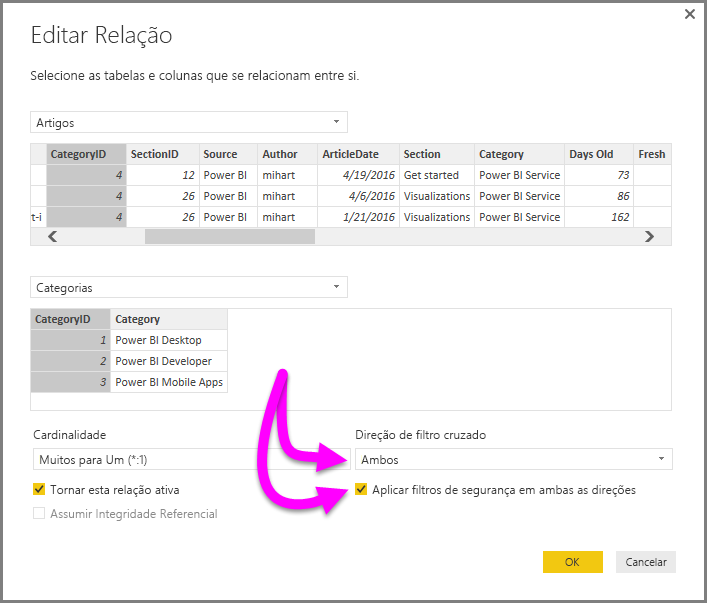

# Ativar a filtragem cruzada bidirecional para o DirectQuery no Power BI Desktop

Ao filtrar tabelas para criar uma vista apropriada dos dados, os criadores de relatórios (e modeladores de dados) deparam-se com dificuldades ao determinar como a filtragem é aplicada a um relatório: o contexto de filtro de uma tabela foi retido num dos lados da relação, mas não no outro, requerendo habitualmente fórmulas DAX complexas para obter os resultados pretendidos.

Na filtragem cruzada bidirecional, os criadores de relatórios (e modeladores de dados) têm agora maior controlo sobre a aplicação dos filtros ao trabalhar com tabelas relacionadas, permitindo que esses filtros sejam aplicados a *ambos* os lados de uma relação entre tabelas. Para tal, é necessário que um contexto de filtro seja propagado para uma segunda tabela relacionada no outro lado de uma relação entre tabelas.

## Documento técnico detalhado para filtragem cruzada bidirecional
Está disponível um [documento técnico detalhado](https://download.microsoft.com/download/2/7/8/2782DF95-3E0D-40CD-BFC8-749A2882E109/Bidirectional%20cross-filtering%20in%20Analysis%20Services%202016%20and%20Power%20BI.docx), que explica a filtragem cruzada bidirecional no Power BI Desktop (o documento técnico também abrange o SQL Server Analysis Services 2016, sendo que ambos têm o mesmo comportamento).

* Transferir o documento técnico [Filtragem cruzada bidirecional para o Power BI Desktop](https://download.microsoft.com/download/2/7/8/2782DF95-3E0D-40CD-BFC8-749A2882E109/Bidirectional%20cross-filtering%20in%20Analysis%20Services%202016%20and%20Power%20BI.docx)

## Ativar a filtragem cruzada bidirecional para o DirectQuery

Para ativar a filtragem cruzada, na caixa de diálogo **Editar Relação** para uma relação, os seguintes itens têm de estar selecionados:

* Deve definir a **Direção de filtragem cruzada** como **Ambas**
* A definição **Aplicar filtros de segurança em ambas as direções** tem também de estar selecionada

  

> [!NOTE]
> Ao criar fórmulas DAX de filtragem cruzada no Power BI Desktop, utilize o *UserPrincipalName* (que costuma ser igual ao início de sessão do utilizador, como <em>joe@contoso.com</em>), em vez de *UserName*. Por esse motivo, poderá precisar de criar uma tabela relacionada que mapeie *UserName* (ou EmployeeID, por exemplo) a *UserPrincipalName*.

Para obter mais informações, e para obter exemplos do funcionamento da filtragem cruzada bidirecional, consulte o [documento técnico](https://download.microsoft.com/download/2/7/8/2782DF95-3E0D-40CD-BFC8-749A2882E109/Bidirectional%20cross-filtering%20in%20Analysis%20Services%202016%20and%20Power%20BI.docx) mencionado anteriormente neste artigo.

