# Utilizar marcadores para partilhar informações e criar histórias no Power BI 
A utilização de **marcadores** no Power BI ajuda a capturar a vista atualmente configurada de uma página de relatório, incluindo a filtragem e o estado dos elementos visuais, e permite-lhe voltar mais tarde a esse estado ao selecionar o marcador guardado. 

Também pode criar uma coleção de marcadores, dispô-los pela ordem que quiser e, subsequentemente, seguir cada marcador numa apresentação para realçar uma série de informações ou a história que quer contar com os seus elementos visuais e relatórios. 

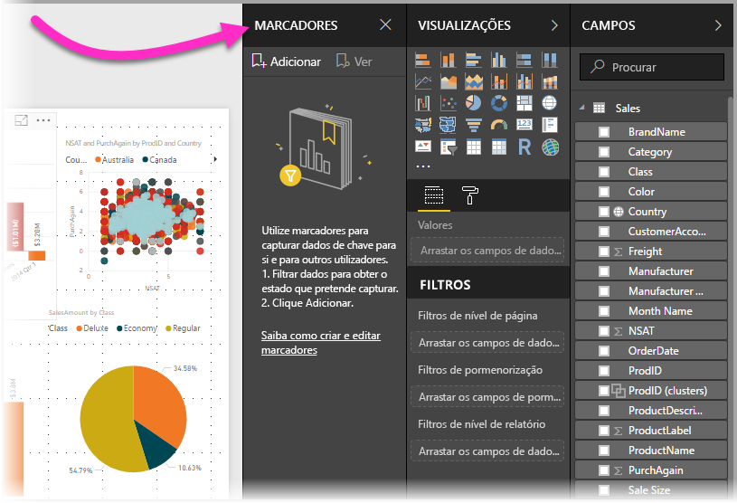

Existem muitas utilizações de marcadores. Pode utilizá-los para controlar o seu próprio progresso de criação de relatórios (os marcadores são fáceis de adicionar, eliminar e mudar o nome) e pode criar uma apresentação do PowerPoint que utilize marcadores por ordem, contando assim uma história com o seu relatório. Podem existir outras utilizações com base na forma como considera que os marcadores podem ser melhor utilizados.

> [!TIP]
> Para obter informações sobre como utilizar Marcadores Pessoais no serviço Power BI, veja o [anúncio do blogue](https://powerbi.microsoft.com/blog/announcing-personal-bookmarks-in-the-power-bi-service/) relativo à funcionalidade Marcadores Pessoais. 

### Ativar a pré-visualização de marcadores (versões anteriores a março de 2018)
A partir da versão de março de 2018 do Power BI Desktop, os marcadores estarão disponíveis para todos os utilizadores. 

Recomendamos sempre que atualize para a versão mais recente. Porém, se tiver uma versão anterior do Power BI Desktop, pode experimentar a nova funcionalidade de **marcadores** a partir da versão de **outubro de 2017** do **Power BI Desktop** e para relatórios compatíveis com marcadores, também no **serviço Power BI**. Para ativar a funcionalidade de pré-visualização, selecione **Ficheiro > Opções e Definições > Opções > Funcionalidades de Pré-visualização** e, em seguida, selecione a caixa de verificação junto a **Marcadores**. 

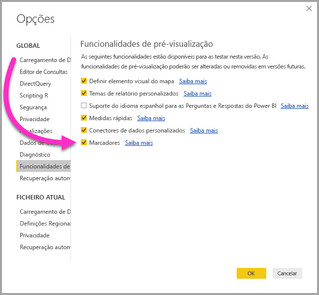

Irá precisar de reiniciar o **Power BI Desktop** após fazer a seleção para ativar a versão de pré-visualização dos marcadores.

## Utilizar marcadores
Para utilizar marcadores, selecione o friso **Ver** e, em seguida, selecione a caixa **Painel de Marcadores**. 

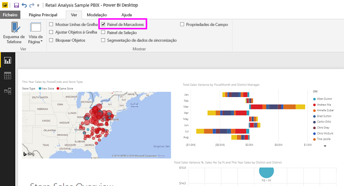

Quando criar um marcador, os elementos seguintes são guardados com o marcador:

* Página atual
* Filtros
* Segmentação de Dados, incluindo o tipo de segmentação de dados (por exemplo, lista pendente ou lista) e o estado da segmentação de dados
* Estado da seleção do elemento visual (por exemplo, os filtros de realce cruzado)
* Sequência de ordenação
* Localização de agregação
* Visibilidade (de um objeto, através do painel **Seleção**)
* Os modos de detalhe ou **Em Destaque** de qualquer objeto visível

Configure uma página de relatório conforme quiser que apareça no marcador. Depois da página de relatório e dos elementos visuais serem dispostos como pretende, selecione **Adicionar** no painel **Marcadores** para adicionar um marcador. 

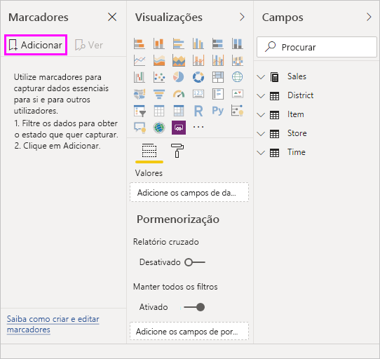

O **Power BI Desktop** cria um marcador e atribui-lhe um nome genérico. Pode facilmente *mudar o nome*, *eliminar* ou *atualizar* um marcador ao selecionar as reticências junto ao nome e, em seguida, ao selecionar uma ação no menu apresentado.

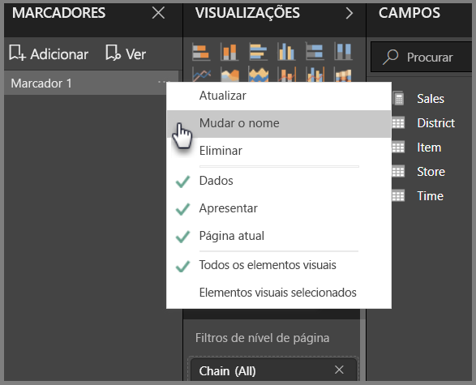

Depois de ter um marcador, pode apresentá-lo ao clicar simplesmente nele no painel **Marcadores**. 

Pode também selecionar se cada marcador aplicará propriedades de *dados* tais como filtros e segmentações de dados, propriedades de *visualização* tais como destaque e a sua visibilidade, bem como alterações à página que apresenta a página que estava visível quando o marcador foi adicionado. Estas funcionalidades são úteis quando utiliza marcadores para alternar entre vistas de relatórios ou seleções de elementos visuais, caso em que pretenderá, provavelmente, desativar as propriedades dos dados para que os filtros não sejam repostos quando os utilizadores alternarem entre vistas ao selecionar um marcador. 

Para fazer essas alterações, selecione as reticências junto ao nome do marcador, conforme mostrado na imagem anterior e, em seguida, selecione ou desselecione as marcas de verificação junto a *Dados*, *Apresentar* e outros controlos. 

## Dispor marcadores
À medida que cria marcadores, pode considerar que a ordem pela qual são criados não é necessariamente a mesma ordem pela qual quer apresentá-los ao seu público. Não há problema, pode reorganizar facilmente a ordem dos marcadores.

No painel **Marcadores**, basta arrastar e largar marcadores para alterar a sua ordem, conforme mostrado na imagem seguinte. A barra amarela entre os marcadores designa onde o marcador arrastado será colocado.

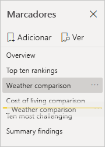

A ordem dos marcadores pode tornar-se importante quando utiliza a funcionalidade **Ver** dos marcadores, conforme descrito na secção seguinte.

## Marcadores como uma apresentação de diapositivos
Quando tiver uma coleção de marcadores que queira apresentar, por ordem, pode selecionar **Ver** no painel **Marcadores** para iniciar uma apresentação de diapositivos.

Quando estiver no modo **Visualização**, existem alguns aspetos a ter em consideração:

1. O nome do marcador é apresentado na barra de título, que aparece na parte inferior da tela.
2. A barra de título do marcador tem setas que lhe permitem mover para o marcador anterior ou seguinte.
3. Pode sair do modo **Visualização** ao selecionar **Sair** no painel **Marcadores** ou ao selecionar o **X** localizado na barra de título do marcador. 

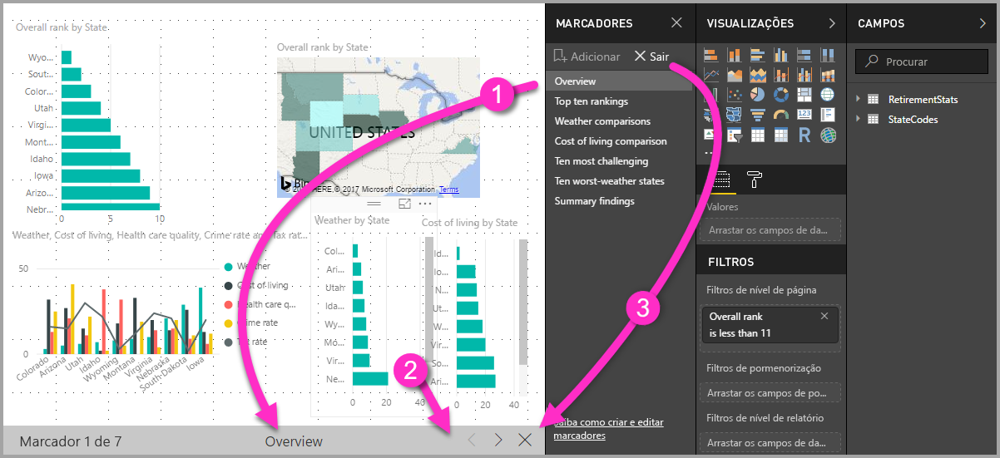

Quando estiver no **Visualização**, pode fechar o painel **Marcadores** (ao clicar no X nesse painel) para dar mais espaço à sua apresentação. No modo **Visualização**, todos os elementos visuais são interativos e estão disponíveis para realce cruzado, tal como acontece quando interage com eles. 

## Visibilidade – através do painel Seleção
Com o lançamento de marcadores, também é introduzido o novo painel **Seleção**. O painel **Seleção** fornece uma lista de todos os objetos na página atual e permite-lhe selecionar o objeto e especificar se um determinado objeto está visível. 

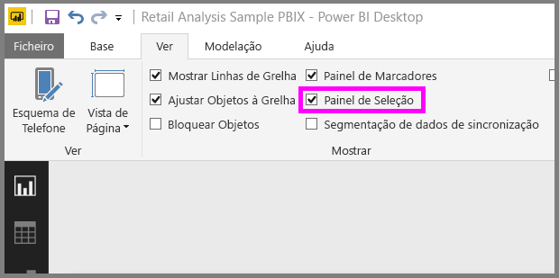

Pode selecionar um objeto através do painel **Seleção**. Além disso, pode alternar se o objeto está atualmente visível ao clicar no ícone de olho à direita do elemento visual. 

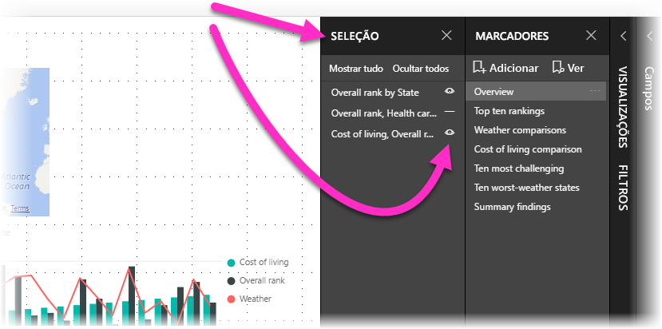

Quando é adicionado um marcador, o estado visível de cada objeto também é guardado com base na respetiva definição no painel **Seleção**. 

É importante ter em atenção que as **segmentações de dados** continuam a filtrar uma página de relatório, independentemente de estarem visíveis. Como tal, pode criar vários marcadores diferentes, com diversas definições de segmentação de dados e fazer uma única página de relatório parecer muito diferente (e realçar diferentes informações) em vários marcadores.

## Marcadores para formas e imagens
Também pode ligar formas e imagens a marcadores. Com esta funcionalidade, quando clica num objeto, será apresentado o marcador associado a esse objeto. Essa funcionalidade pode ser especialmente útil ao trabalhar com botões. Pode obter mais informações ao ler o artigo sobre como [utilizar botões no Power BI](desktop-buttons.md). 

Para atribuir um marcador a um objeto, selecione o objeto e, em seguida, expanda a secção **Ação** no painel **Formatar Forma**, conforme mostrado na imagem seguinte.

Depois de colocar o controlo de deslize **Ação** como **Ativado**, pode selecionar se o objeto é um botão de retrocesso, um marcador ou um comando de Perguntas e Respostas. Se selecionar vários marcadores, pode selecionar a qual deles o objeto está ligado.

Existem todos os tipos de coisas interessantes que pode fazer com marcadores ligados a objetos. Pode criar um índice visual da página de relatório ou pode fornecer diferentes vistas (por exemplo, tipos visuais) dessas mesmas informações apenas ao clicar num objeto.

Quando estiver no modo de edição, pode utilizar ctrl+clique para seguir a ligação e, quando não estiver nesse modo, basta clicar no objeto para seguir a ligação. 

## Grupos de marcadores

A partir da versão de agosto de 2018 do **Power BI Desktop**, poderá criar e utilizar grupos de marcadores. Um grupo de marcadores é uma coleção de marcadores que especifica e que pode ser apresentada e organizada como um grupo. 

Para criar um grupo de marcadores, mantenha a tecla Ctrl premida e selecione os marcadores que pretende incluir no grupo. Em seguida, clique nas reticências ao lado de qualquer marcador selecionado e selecione **Grupo** no menu que é apresentado.

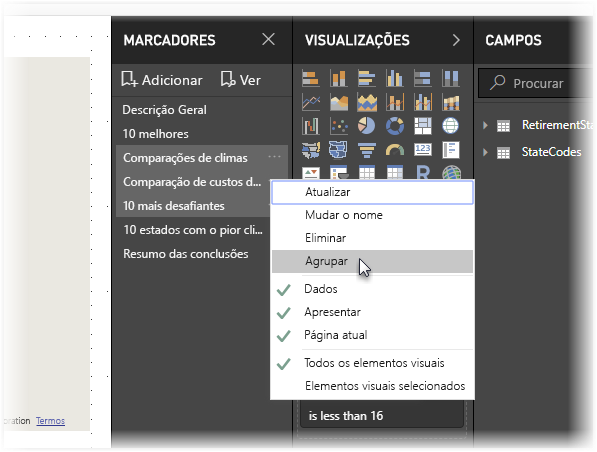

O **Power BI Desktop** dá automaticamente o nome *Grupo 1* ao grupo. Felizmente, pode fazer duplo clique no nome e mudá-lo para outro à sua escolha.

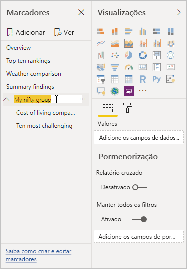

Clicar no nome de um grupo de marcadores só expande ou fecha esse grupo e não representa um marcador individual. 

Ao utilizar a funcionalidade **Ver** dos marcadores, aplica-se o seguinte:

* Se o marcador selecionado estiver num grupo quando selecionar **Ver** nos marcadores, apenas os marcadores *nesse grupo* serão apresentados na sessão de visualização. 

* Se o marcador selecionado não estiver num grupo, ou se estiver no nível superior (como o nome de um grupo de marcadores), todos os marcadores de todo o relatório serão apresentados, incluindo os marcadores em qualquer grupo. 

Para desagrupar marcadores, selecione qualquer marcador num grupo, clique nas reticências e, em seguida, selecione **Desagrupar** no menu que é apresentado. 

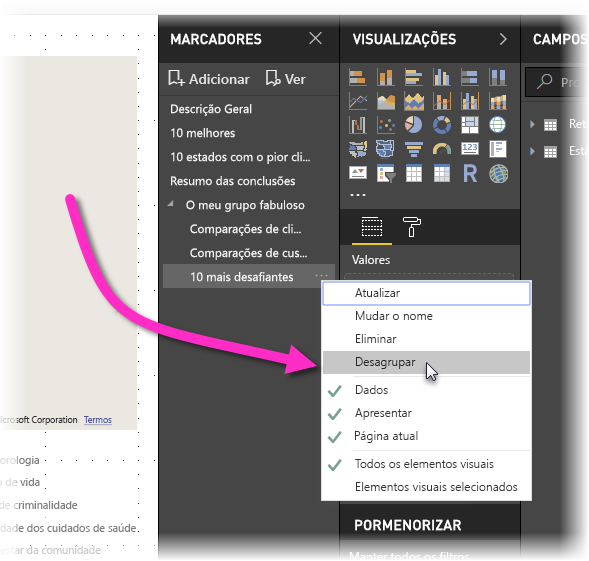

Tenha em atenção que a seleção de **Desagrupar** em qualquer marcador de um grupo removerá todos os marcadores do grupo (elimina o grupo, mas não os marcadores em si). Para remover um só marcador de um grupo, tem de **Desagrupar** um dos membros desse grupo (o que elimina o agrupamento) e, em seguida, selecionar os membros que pretende incluir no novo grupo (ao manter a tecla Ctrl premida e clicar em cada marcador) e selecionar **Grupo** novamente. 

## Utilizar o modo Em Destaque
Outra funcionalidade lançada com os marcadores é o modo **Em Destaque**. Com o modo **Em Destaque**, pode chamar a atenção para um gráfico específico, por exemplo, quando apresentar os seus marcadores no modo **Visualização**.

Vamos comparar o modo **Em Destaque** com o modo de **detalhe** para ver as diferenças.

1. No modo de **detalhe**, pode ter um elemento visual a preencher toda a tela ao selecionar o ícone **modo de detalhe**.
2. Ao utilizar o modo **Em Destaque**, pode realçar um elemento visual no respetivo tamanho original, fazendo com que todos os outros elementos visuais na página desvaneçam para uma quase transparência. 

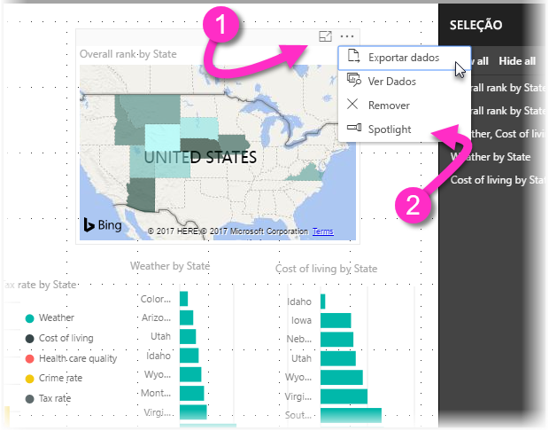

Quando o elemento visual na imagem anterior tiver o respetivo ícone de **detalhe** clicado, a página tem o seguinte aspeto:

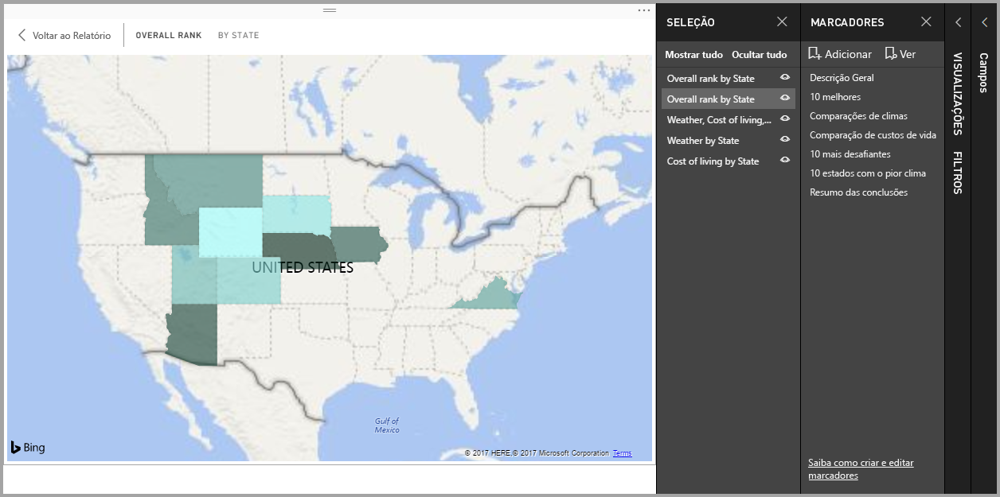

Em contrapartida, quando o modo **Em Destaque** é selecionado no menu de reticências do elemento visual, a página parece ter o seguinte aspeto:

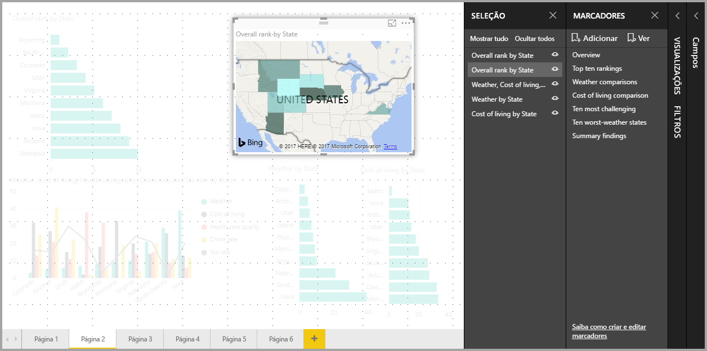

Se qualquer um dos modos for selecionado quando é adicionado um marcador, esse modo (detalhe ou Em Destaque) é mantido no marcador.

## Marcadores no serviço Power BI
Quando publica um relatório no **serviço Power BI** com, pelo menos, um marcador, pode ver e interagir com esses marcadores no **serviço Power BI**. Quando estão disponíveis marcadores num relatório, pode selecionar **Ver > Painel de seleção** ou **Ver > Painel de marcadores** para mostrar todos os painéis.

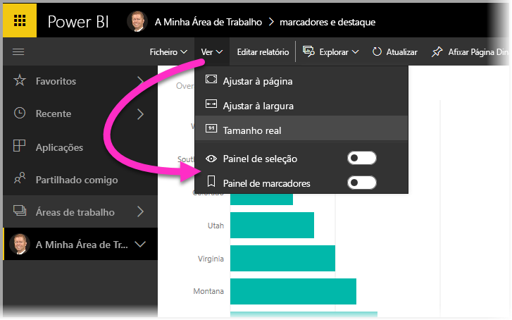

No **serviço Power BI**, o **Painel de marcadores** funciona tal como no **Power BI Desktop**, incluindo a capacidade de selecionar **Ver** para mostrar os marcadores por ordem, como uma apresentação de diapositivos.

Tenha em atenção que tem de utilizar a barra de título do marcador cinzenta para navegar pelos marcadores e não as setas pretas (as setas pretas movem-no nas páginas de relatório, não nos marcadores).

## Limitações e considerações
Nesta versão dos **marcadores**, existem algumas limitações e considerações a não esquecer.

* A maioria dos elementos visuais personalizados deve funcionar devidamente com a marcação. Caso se depare com problemas com um marcador e um elemento visual personalizado, contacte o criador desse elemento visual personalizado e peça-lhe para adicionar suporte para marcadores ao elemento visual. 
* Se adicionar um elemento visual numa página de relatório depois de criar um marcador, este será apresentado no estado predefinido. Isto também significa que se apresentar uma segmentação de dados numa página onde criou anteriormente marcadores, esta irá estar no estado predefinido.
* O movimento entre os elementos visuais depois de ser criado um marcador será refletido no marcador. 

## Próximos passos
Para obter mais informações sobre funcionalidades semelhantes ou como interagir com marcadores, veja os artigos seguintes:

* [Utilizar a pormenorização no Power BI Desktop](desktop-drillthrough.md)
* [Apresentar um mosaico do dashboard ou um elemento visual do relatório no modo de detalhe](consumer/end-user-focus.md)

