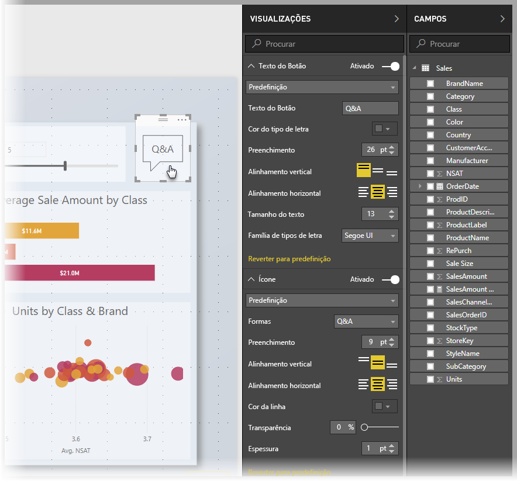
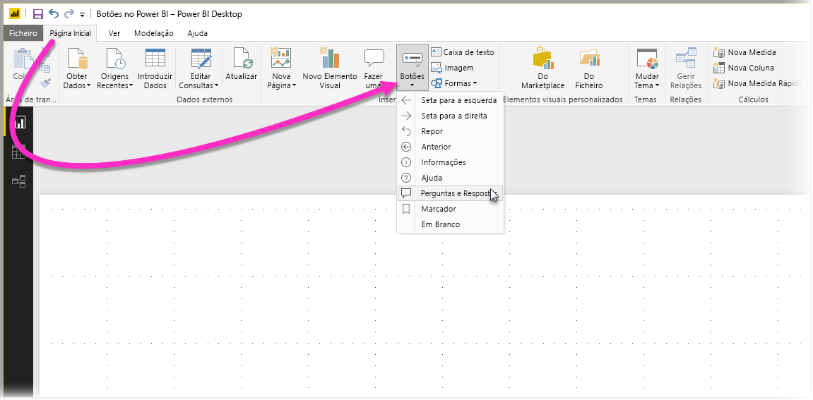
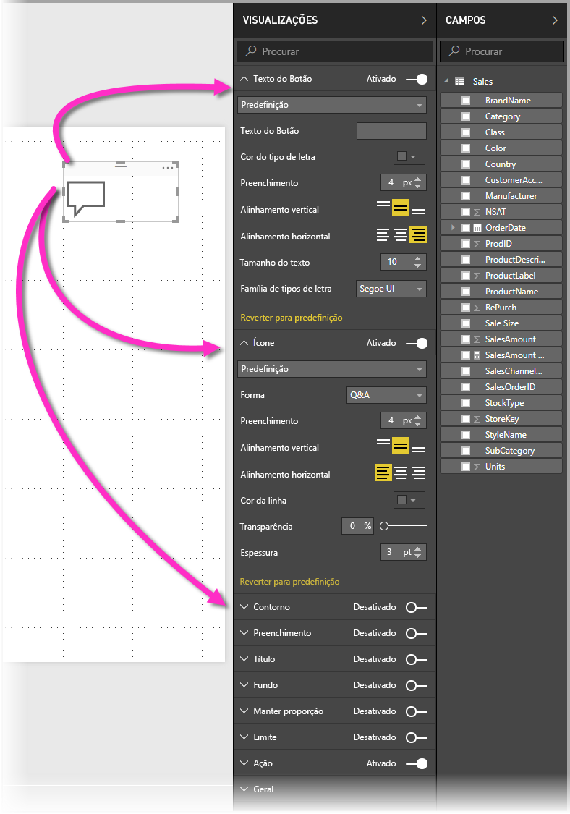
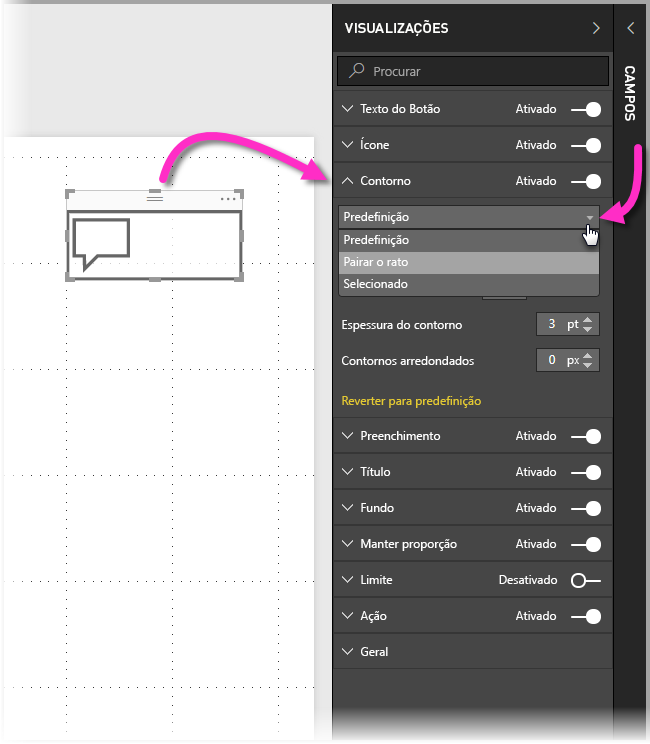
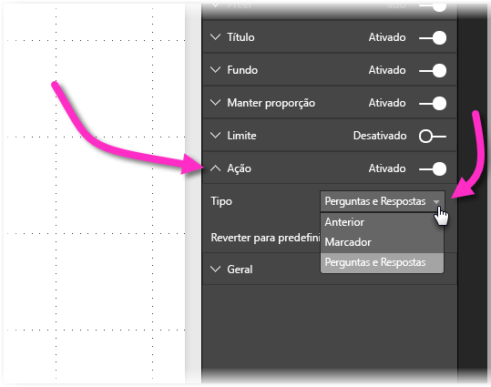

# Utilizar botões no Power BI
A utilização de **botões** no Power BI permite-lhe criar relatórios e dashboards que têm um comportamento semelhante às aplicações e, deste modo, poderá criar um ambiente apelativo onde os utilizadores podem pairar o rato, clicar e ter uma maior interação com os conteúdos do Power BI. Pode adicionar botões a relatórios no **Power BI Desktop** e partilhar ou publicar esses relatórios no serviço Power BI para criar dashboards que proporcionam aos utilizadores um comportamento semelhante às aplicações.

Os botões que criar no **Power BI Desktop** estão disponíveis para utilização em relatórios ou dashboards publicados no **serviço Power BI**.

## Criação de botões em relatórios
Para criar um botão num relatório do **Power BI Desktop**, no friso **Página Principal**, selecione **Botões** e será apresentado um menu pendente, onde poderá selecionar o botão pretendido a partir de uma coleção de opções, conforme indicado na imagem seguinte. 

Quando cria um botão e o seleciona na tela do relatório, o painel **Visualizações** apresenta-lhe as várias formas através das quais pode personalizar o botão para que este se ajuste às suas necessidades. Por exemplo, pode ativar ou desativar o **Texto do Botão** ao ativar o controlo de deslize nesse cartão do painel **Visualizações**. Também pode alterar o ícone e o preenchimento do botão, o título e a ação efetuada quando os utilizadores clicam no botão num relatório ou dashboard, entre outras propriedades.

## Definir as propriedades de botão para predefinição (inativo), ao pairar com o rato ou quando selecionado

Os botões no Power BI têm três estados: predefinição (a forma como são apresentados quando o rato não está a pairar sobre eles ou quando não estão selecionados), ao pairar com o rato ou quando selecionados (mais conhecido como *clicar*). Muitos dos cartões no painel **Visualizações** podem ser modificados individualmente com base nestes três estados, o que lhe dá uma grande flexibilidade para personalizar os seus botões.

Os seguintes cartões no painel **Visualizações** permitem-lhe ajustar a formatação ou o comportamento de um botão com base nos seus três estados:

* Texto do Botão
* Ícone
* Contorno
* Preenchimento

Para selecionar a forma como um botão deve ser apresentado em cada estado, expanda um desses cartões e selecione a lista pendente apresentada na parte superior do cartão. Na imagem seguinte, pode ver o cartão **Contorno** expandido, com a lista pendente selecionada para apresentar os três estados:

## Selecionar a ação para um botão

Pode selecionar qual a ação efetuada quando o utilizador seleciona um botão no Power BI. Pode aceder às opções para ações do botão a partir do cartão **Ação** no painel **Visualizações**.

As opções para ações do botão são:

* Anterior
* Marcador
* Perguntas e Respostas

A seleção **Anterior** leva o utilizador para a página anterior do relatório. Isto é especialmente útil para páginas de desagregação.

A seleção **Marcador** apresenta a página do relatório associada a um marcador que está definido para o relatório atual. Pode [obter mais informações sobre marcadores no Power BI](desktop-bookmarks.md). 

A seleção **Perguntas e Respostas** na lista pendente apresenta uma janela do **Q&A Explorer**. 

Alguns botões terão uma ação predefinida selecionada automaticamente. Por exemplo, o botão **Perguntas e Respostas** seleciona automaticamente **Perguntas e Respostas** como a ação predefinida. Pode saber mais sobre o **Q&A Explorer** ao consultar [esta mensagem do blogue](https://powerbi.microsoft.com/blog/power-bi-desktop-april-2018-feature-summary/#Q&AExplorer).

Pode experimentar ou testar os botões que criar para o seu relatório ao utilizar *Ctrl+Clique* no botão que pretende utilizar. 

## Passos seguintes
Para obter mais informações sobre funcionalidades semelhantes ou como interagir com botões, veja os artigos seguintes:

* [Utilizar a pormenorização no Power BI Desktop](desktop-drillthrough.md)
* [Apresentar um mosaico do dashboard ou um elemento visual do relatório no modo de detalhe](service-focus-mode.md)
* [Utilizar marcadores para partilhar informações e criar histórias no Power BI](desktop-bookmarks.md)

