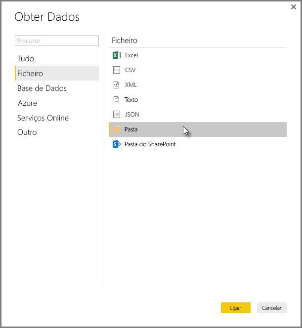
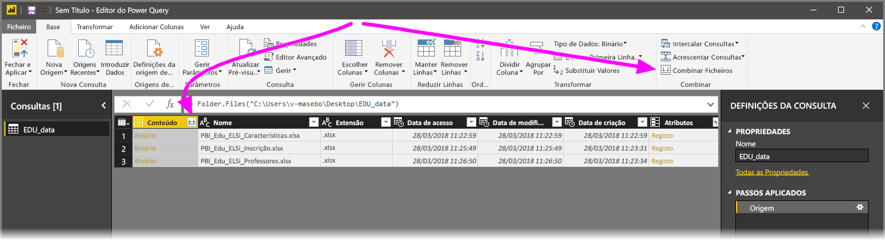
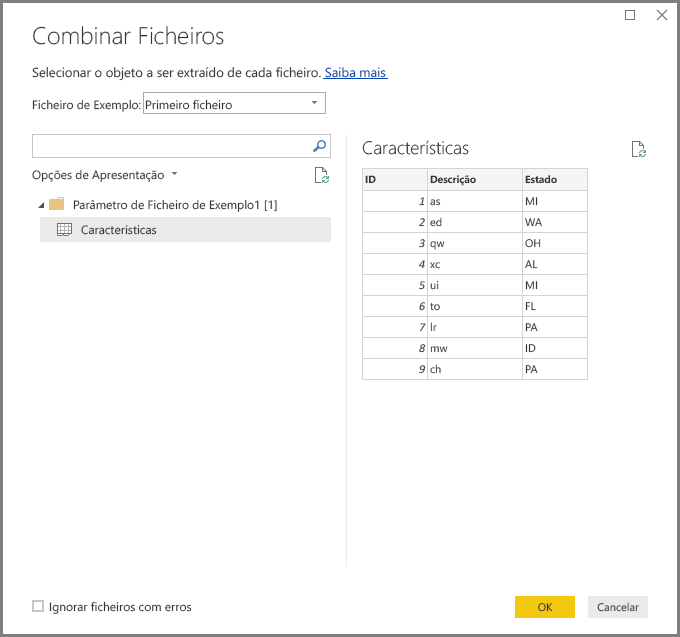
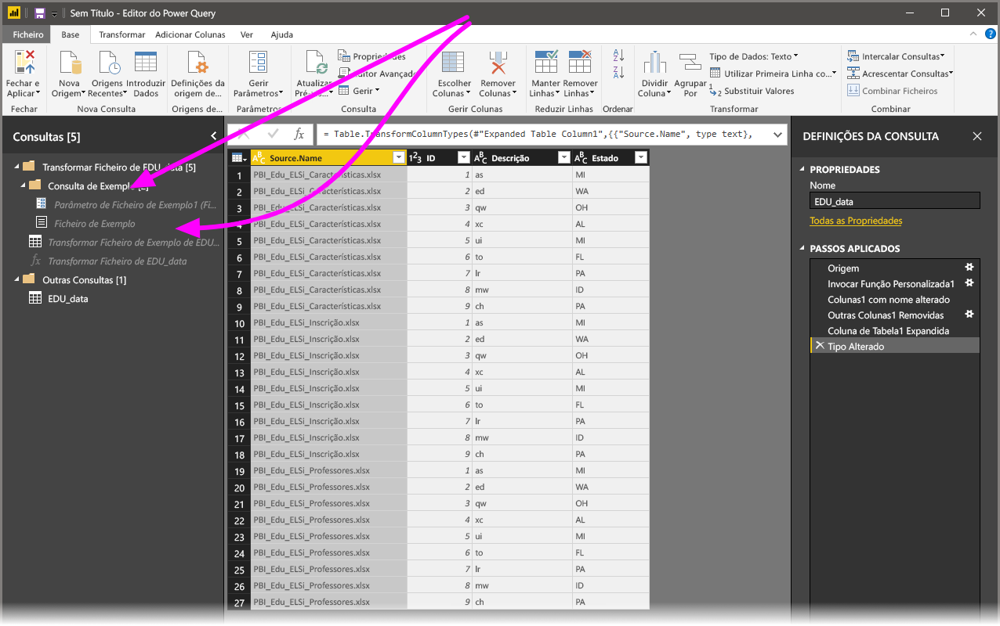

# Combinar ficheiros (binários) no Power BI Desktop

Veja a seguir uma abordagem poderosa para importar dados para o **Power BI Desktop**: se tiver vários ficheiros com o mesmo esquema, combine-os numa única tabela lógica. Esta técnica popular ficou mais prática e abrangente.

Para começar o processo de combinar ficheiros da mesma pasta, selecione **Obter Dados**, escolha **Ficheiro** > **Pasta** e, em seguida, selecione **Ligar**.

Introduza o caminho da pasta, selecione **OK** e, em seguida, **Transformar Dados** para ver os ficheiros da pasta no Editor do Power Query.

## Comportamento da combinação de ficheiros

Para combinar ficheiros binários no Editor do Power Query, selecione **Conteúdo** (a primeira etiqueta da coluna) e, em seguida, **Página Inicial** > **Combinar Ficheiros**. Em alternativa, pode apenas selecionar o ícone **Combinar Ficheiros** junto a **Conteúdo**.

A transformação *combinar ficheiros* tem o seguinte comportamento:

* A transformação “combinar ficheiros” analisa cada ficheiro de entrada para determinar o formato de ficheiro correto a utilizar, como *texto*, *Livro do Excel* ou *ficheiro JSON*.
* A transformação permite-lhe selecionar um objeto específico do primeiro ficheiro, como um livro do Excel, a extrair.
  
  
* Em seguida, a transformação “combinar ficheiros” executa automaticamente estas ações:
  
  * Cria uma consulta de exemplo que efetua todos os passos de extração necessários num único ficheiro.
  * Cria uma *consulta de função* que parametriza a entrada de ficheiro/binário para a *consulta de exemplo*. A consulta de exemplo e a coluna de função estão ligadas, pelo que as alterações à consulta de exemplo refletem-se na consulta de função.
  * Aplica a *consulta de função* à consulta original com binários de entrada, como a consulta *Pasta*. Aplica a consulta de função das entradas binárias em cada linha e, em seguida, expande a extração de dados resultante como colunas de nível superior.

    

> [!NOTE]
> O âmbito da sua seleção num livro do Excel irá afetar o comportamento da combinação de binários. Por exemplo, pode selecionar uma folha de cálculo específica para combinar essa folha de cálculo ou selecionar a raiz para combinar o ficheiro inteiro. Selecionar uma pasta combina todos os ficheiros nessa pasta. 

Com o comportamento de combinar ficheiros, poderá facilmente combinar todos os ficheiros numa determinada pasta se tiverem o mesmo tipo de ficheiro e estrutura (como as mesmas colunas).

Além disso, pode facilmente aplicar passos adicionais de transformação ou extração ao modificar a consulta de exemplo criada automaticamente, sem ter de se preocupar em modificar ou criar passos adicionais de consulta de função. Todas as alterações à consulta de exemplo são geradas automaticamente na consulta de função associada.

## Próximos passos

Pode ligar a todos os tipos de dados com o Power BI Desktop. Para obter mais informações sobre origens de dados, veja os seguintes recursos:

* [O que é o Power BI Desktop?](desktop-what-is-desktop.md)
* [Origens de dados no Power BI Desktop](desktop-data-sources.md)
* [Formatar e combinar dados com o Power BI Desktop](desktop-shape-and-combine-data.md)
* [Ligar a ficheiros CSV no Power BI Desktop](desktop-connect-csv.md)
* [Introduzir dados diretamente no Power BI Desktop](desktop-enter-data-directly-into-desktop.md)
