# Tarefas comuns de consulta no Power BI Desktop
Ao trabalhar na janela do **Editor de Consultas** do Power BI Desktop, existem algumas tarefas comuns. Este documento demonstra essas tarefas comuns e apresenta ligações para informações adicionais. 

As tarefas comuns de consulta demonstradas aqui são as seguintes:

* Ligar-se a dados
* Formatar e combinar dados
* Agrupar linhas
* Colunas Pivot
* Criar colunas personalizadas
* Consultar fórmulas

Iremos utilizar algumas ligações de dados para concluir estas tarefas. Os dados estão disponíveis para transferir ou ligar-se, caso deseje executar estas tarefas por conta própria.

A primeira ligação de dados é um livro do Excel, que pode transferir a partir [desta ligação](http://download.microsoft.com/download/5/7/0/5701F78F-C3C2-450C-BCCE-AAB60C31051D/PBI_Edu_ELSi_Enrollment_v2.xlsx). A outra é um recurso da Web (que também é utilizado noutro conteúdo de ajuda do Power BI Desktop), que pode ser acedido aqui:

[*http://www.bankrate.com/finance/retirement/best-places-retire-how-state-ranks.aspx*](http://www.bankrate.com/finance/retirement/best-places-retire-how-state-ranks.aspx)

É nos passos necessários para se ligar a ambas as origens de dados que começam as tarefas comuns de Consulta.

## Ligar-se a dados
Para se ligar aos dados no Power BI Desktop, selecione o botão **Obter Dados** do separador **Base** no friso. O Power BI Desktop apresenta um menu com as origens de dados mais comuns. Para obter uma lista completa de origens de dados às quais o Power BI Desktop se pode ligar, selecione o botão **Mais...** na parte inferior do menu. Para obter mais informações, consulte [Origens de Dados no Power BI Desktop](https://docs.microsoft.com/power-bi/desktop-data-sources).

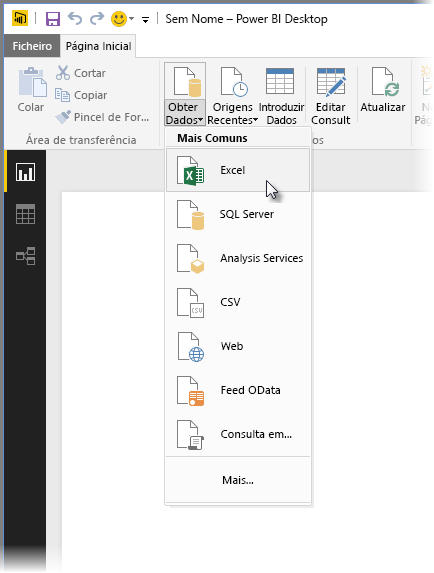

Para começar, selecione **Excel**, navegue para o livro e, em seguida, selecione-o. A Consulta inspeciona o livro e apresenta os dados encontrados na janela do **Navegador**.

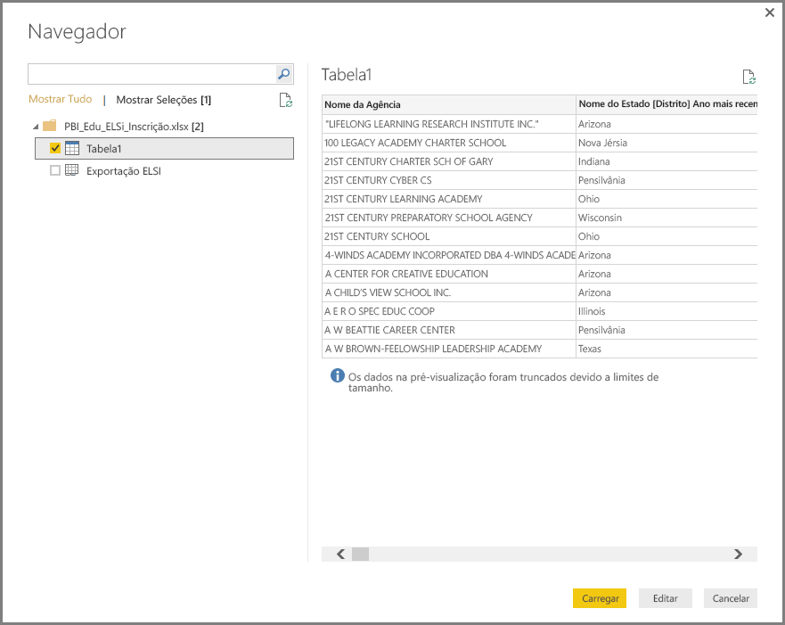

Pode selecionar **Editar** para ajustar, ou *formatar* os dados, antes de os carregar no Power BI Desktop. Editar uma consulta antes de carregar é especialmente útil ao trabalhar com grandes conjuntos de dados que pretende reduzir antes do carregamento. Como pretendemos fazer precisamente isso, selecionamos **Editar**.

É igualmente fácil ligar-se a diferentes tipos de dados. Também gostaríamos de nos ligar a um recurso da Web. Selecione **Obter Dados \> Mais...** e, em seguida, selecione **Outro \> Web**.

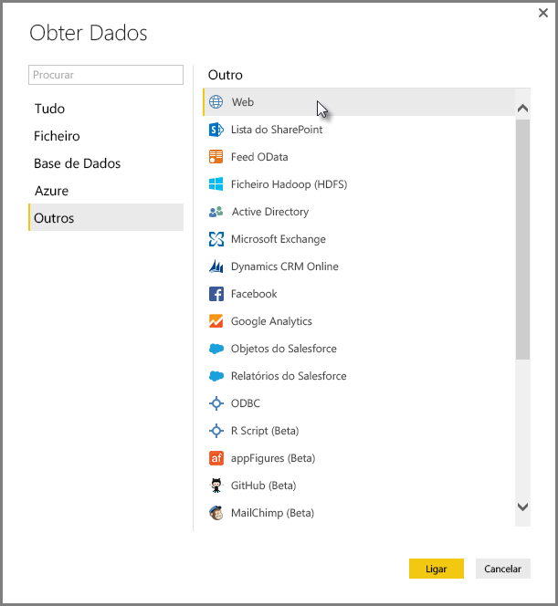

É apresentada a janela **Da Web**, onde pode escrever o URL da página Web.

Selecione **OK** e, tal como antes, o Power BI Desktop inspeciona o livro e apresenta os dados encontrados na janela do **Navegador**.

Outras ligações de dados são semelhantes. Se precisar de autenticar-se para fazer uma ligação de dados, o Power BI Desktop pedir-lhe-á as credenciais apropriadas.

Para ver uma demonstração passo a passo da ligação a dados no Power BI Desktop, consulte [Ligar-se a Dados no Power BI Desktop](https://docs.microsoft.com/power-bi/desktop-connect-to-data).

## Formatar e combinar dados
Pode formatar e combinar dados facilmente com o Editor de Consultas. Esta secção inclui alguns exemplos sobre como pode formatar dados. Para obter uma demonstração mais completa da formatação e da combinação de dados, veja **[Formatar e Combinar Dados com o Power BI Desktop](https://docs.microsoft.com/power-bi/desktop-shape-and-combine-data)** .

Na secção anterior, ligámos os dois conjuntos de dados – um livro do Excel e um recurso da Web. Depois de carregados no Editor de Consultas, vemos o seguinte, com a consulta da página da Web selecionada (obtida das consultas disponíveis listadas no painel **Consultas**, no lado esquerdo da janela do Editor de Consultas).

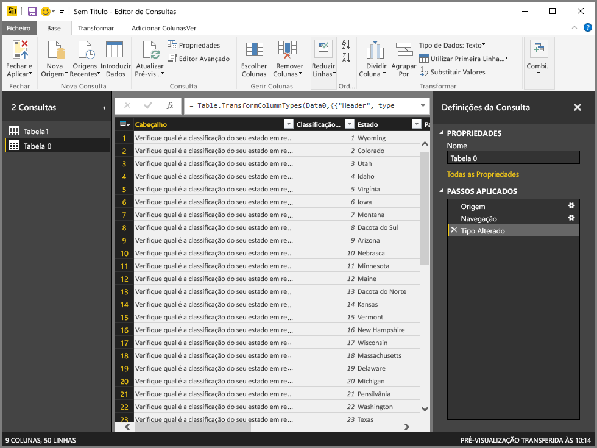

Ao formatar dados, transforma uma origem de dados na forma e formato que atendem às suas necessidades. Neste caso, não precisamos desta primeira coluna, com o nome *Cabeçalho*, por isso vamos removê-la.

No **Editor de Consultas**, podem ser encontrados muitos comandos no friso e num menu contextual ao clicar com o botão direito do rato. Por exemplo, quando clica com o botão direito do rato na coluna *Cabeçalho*, o menu apresentado permite-lhe remover a coluna. Pode também selecionar a coluna e, em seguida, selecionar o botão **Remover Colunas** no friso.

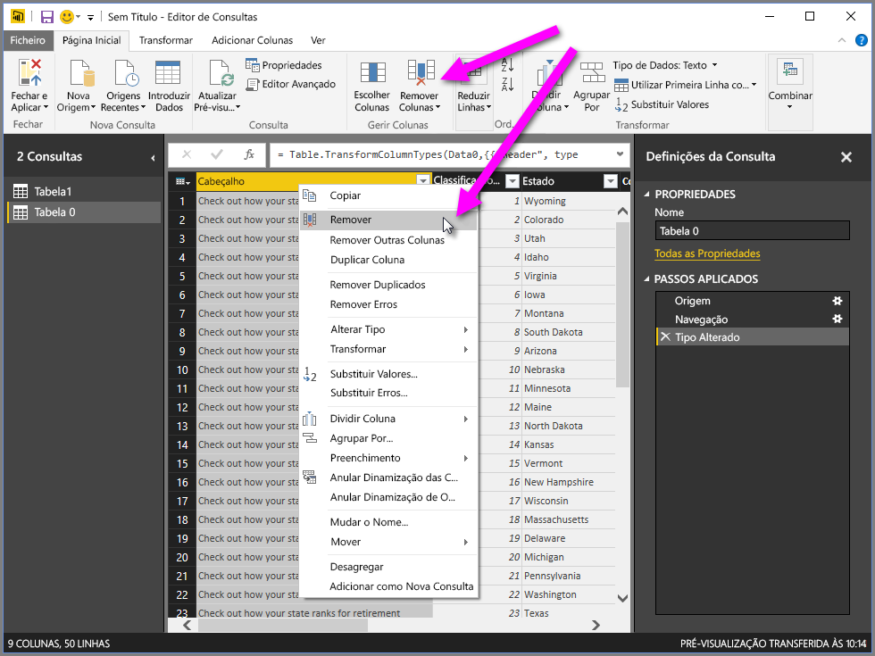

Existem muitas outras formas de formatar os dados nesta consulta: pode remover qualquer número de linhas na parte superior ou inferior, adicionar colunas, dividir colunas, substituir valores e executar outras tarefas de formatação para direcionar o Editor de Consultas a obter os dados do modo que pretende.

## Agrupar linhas
No Editor de Consultas, pode agrupar os valores de várias linhas num único valor. Isto pode ser útil ao resumir o número de produtos oferecidos, o total de vendas ou a contagem de alunos.

Neste exemplo, agrupamos linhas num conjunto de dados de matrículas académicas. Os dados são de um livro do Excel e foram formatados para que o Editor de Consultas obtivesse apenas as colunas de que precisamos; atribua um nome à tabela e realize algumas outras transformações.

Vamos ver quantas Agências (isto inclui distritos educacionais e outras entidades educacionais, como distritos de serviços regionais, e assim por diante) existem em cada estado. Selecionamos a coluna *Abrev. do Estado* e o botão **Agrupar por** No separador **Transformar** ou no separador **Base** do friso (**Agrupar Por** está disponível em ambos os separadores).

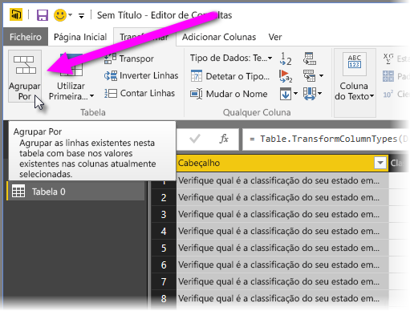

É apresentada a janela **Agrupar Por…** . Quando o Editor de Consultas agrupa linhas, cria uma nova coluna na qual coloca os resultados de **Agrupar Por**. Pode ajustar a operação **Agrupar Por** das seguintes formas:

1. *Agrupar por* – esta é a coluna a ser agrupada; o Editor de Consultas escolhe a coluna selecionada, mas nesta janela o utilizador pode alterá-la para qualquer outra coluna na tabela.
2. *Nome da nova coluna* – o Editor de Consultas sugere um nome para a nova coluna com base na operação que ele aplica à coluna que está a ser agrupada, mas o utilizador pode nomear a nova coluna como desejar.
3. *Operação* – especifique aqui a operação aplicada pelo Editor de Consultas.
4. *Adicionar agrupamento* e *Adicionar agregação* – estas opções são apresentados depois de selecionar a opção **Avançadas**. Pode executar operações de agrupamento (ações **Agrupar Por**) em várias colunas e executar múltiplas agregações, tudo na janela **Agrupar Por**, e tudo numa operação. O Editor de Consultas cria uma nova coluna (com base nas suas seleções nessa janela) que opera em várias colunas. 

Selecione o botão **Adicionar agrupamento** ou **Adicionar agregação** para adicionar mais agrupamentos ou agregações a uma operação **Agrupar Por**. Pode remover um agrupamento ou uma agregação ao selecionar o ícone **...** e, em seguida, **Eliminar**. Portanto, vá em frente, experimente e veja o resultado.
   
   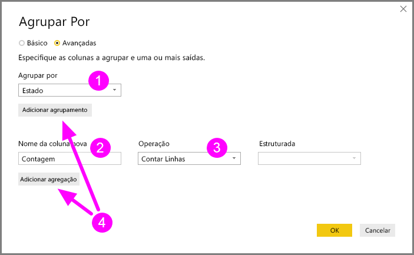

Quando selecionarmos **OK**, a Consulta efetua a operação **Agrupar Por** e devolve os resultados. Repare que Ohio, Texas, Illinois e Califórnia agora têm mais de mil entidades cada um!

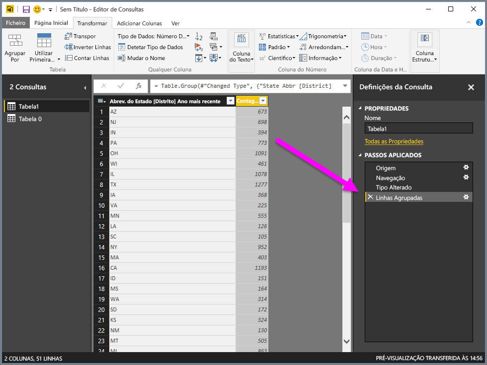

E com o Editor de Consultas, pode sempre remover a última operação de formatação ao selecionar o **X** ao lado do passo que acabou de concluir. Portanto, vá em frente e experimente, refaça o passo se não gostar dos resultados até que o Editor de Consultas formate os seus dados conforme pretende.

## Colunas Pivot
Com o Power BI Desktop, pode dinamizar colunas e criar uma tabela que contém valores agregados para cada valor exclusivo numa coluna. Por exemplo, se precisa de saber quantos produtos diferentes tem em cada categoria de produto, pode criar rapidamente uma tabela que faz exatamente isso.

Vejamos um exemplo. A tabela **Products** a seguir foi formatada para mostrar apenas cada produto exclusivo (por nome) e a qual categoria cada produto pertence. Para criar uma nova tabela que mostra uma contagem de produtos para cada categoria (com base na coluna *CategoryName*), selecione a coluna e selecione **Coluna Dinâmica** no separador **Transformar** do friso.

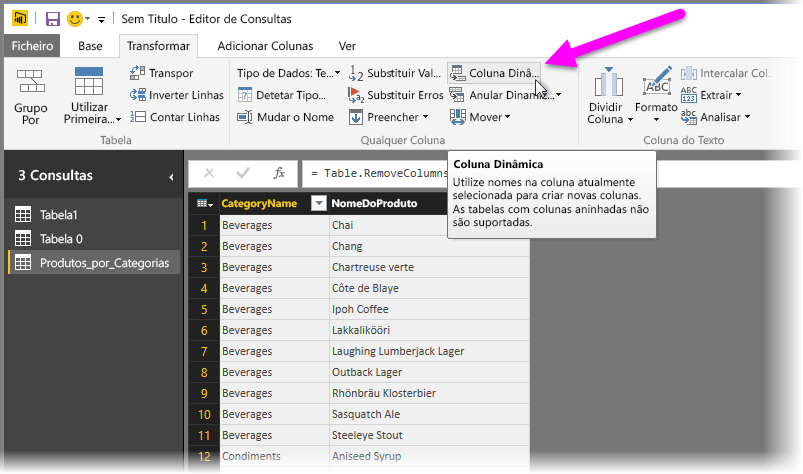

A janela **Coluna Dinâmica** é apresentada e poderá ver quais os valores da coluna que serão utilizados para criar novas colunas (1); além disso, ao expandir as **Opções avançadas** (2), pode selecionar a função que será aplicada aos valores agregados (3).

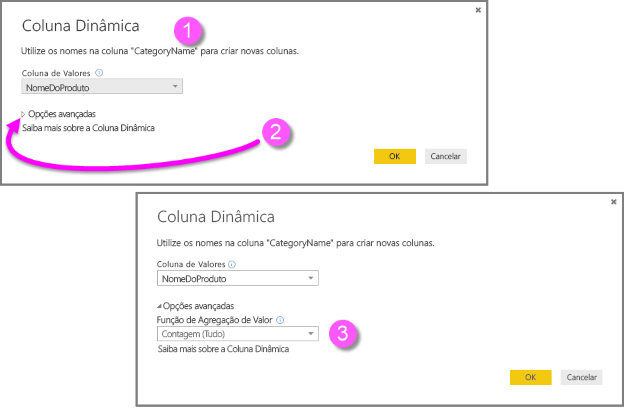

Ao selecionar **OK**, a Consulta mostra a tabela de acordo com as instruções de transformação fornecidas na janela **Coluna Dinâmica**.

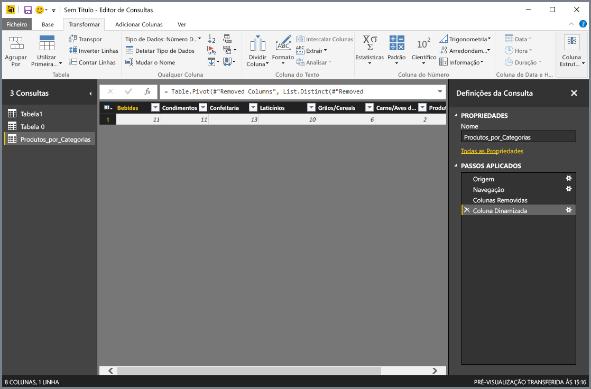

## Criar colunas personalizadas
No Editor de Consultas, pode criar fórmulas personalizadas que operam em várias colunas na sua tabela e, em seguida, colocar os resultados dessas fórmulas numa nova coluna (personalizada). O Editor de Consultas facilita a criação de colunas personalizadas.

No Editor de Consultas, selecione **Coluna Personalizada** no separador **Adicionar Coluna** do friso.

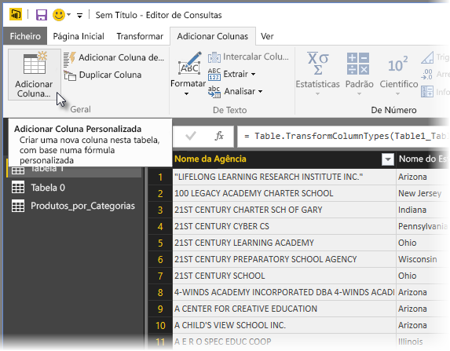

A janela a seguir é apresentada. No exemplo a seguir, criamos uma coluna personalizada chamada *Percent ELL* que calcula a percentagem entre o total de estudantes que são ELL (English Language Learners, estudantes de língua inglesa).

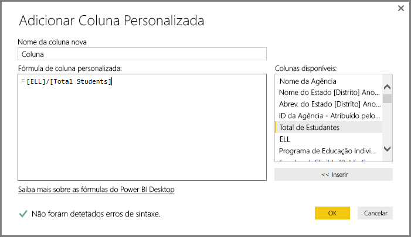

Assim como com qualquer outro passo aplicado no Editor de Consultas, se a nova coluna personalizada não fornecer os dados que procura, basta eliminar o passo da secção **Passos Aplicados** do painel **Definições**  ao selecionar o **X** junto ao passo **Personalizado Adicionado**.

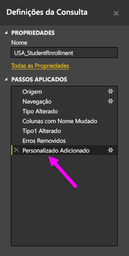

## Consultar fórmulas
Pode editar os passos que o Editor de Consultas gera e criar fórmulas personalizadas para obter um controlo preciso sobre a ligação aos seus dados e sobre a sua formatação. Sempre que o Editor de Consultas executar uma ação nos dados, a fórmula associada à ação é mostrada na **Barra de Fórmulas**. Para ver a **Barra de Fórmulas**, selecione a caixa de verificação junto à **Barra de Fórmulas** no separador **Ver** do friso.

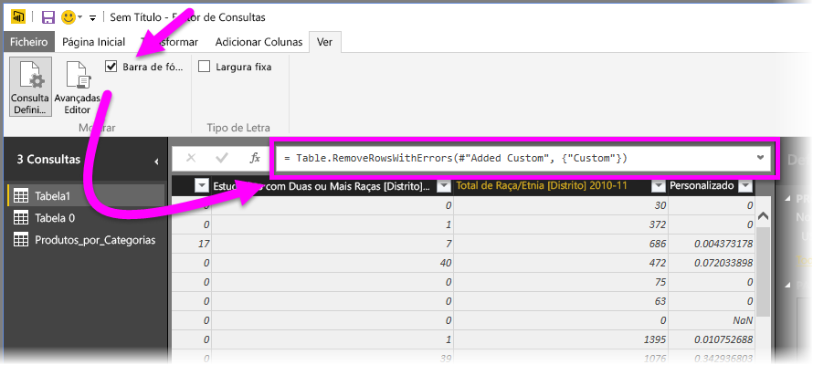

Todos os passos aplicados de cada consulta são mantidos pelo Editor de Consultas como texto que pode ver ou modificar. Pode ver ou modificar o texto de qualquer consulta ao utilizar o **Editor Avançado**, que é mostrado ao selecionar **Editor Avançado** no separador **Ver** do friso.

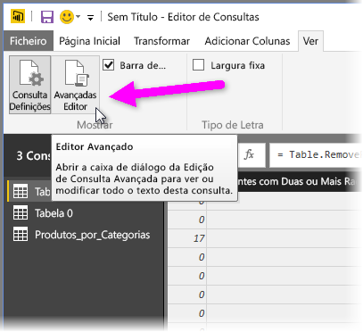

Eis uma apresentação do **Editor Avançado**, com os passos de consulta associados à consulta **USA\_StudentEnrollment** apresentados. Estes passos são criados na Linguagem de Fórmula do Power Query, normalmente conhecida como **M**. Para obter informações, consulte [Saiba mais sobre as fórmulas do Power Query](https://support.office.com/article/Learn-about-Power-Query-formulas-6bc50988-022b-4799-a709-f8aafdee2b2f). Para ver a especificação da linguagem, veja [Microsoft Power Query for Excel Formula Language Specification](http://go.microsoft.com/fwlink/?linkid=320633) (Especificação da Linguagem de Fórmula do Microsoft Power Query para Excel).

O Power BI Desktop oferece um amplo conjunto de categorias de fórmula. Para obter mais informações e uma referência completa de todas as fórmulas do Editor de Consultas, visite [Categorias de Fórmula do Power Query](https://support.office.com/article/Power-Query-formula-categories-125024ec-873c-47b9-bdfd-b437f8716819).

As categorias de fórmula do Editor de Consultas são as seguintes:

* Número
  * Constantes
  * Informação
  * Conversão e formatação
  * Formato
  * Arredondamento
  * Operações
  * Aleatório
  * Trigonometria
  * Bytes
* Texto
  * Informação
  * Comparações de texto
  * Extração
  * Modificação
  * Associação
  * Transformações
* Lógico
* Data
* Hora
* DateTime
* DateTimeZone
* Duração
* Registo
  * Informação
  * Transformações
  * Seleção
  * Serialização
* Lista
  * Informação
  * Seleção
  * Transformação
  * Associação
  * Definir operações
  * Ordenação
  * Médias
  * Adição
  * Números
  * Geradores
* Tabela
  * Construção da tabela
  * Conversões
  * Informação
  * Operações de linha
  * Operações de coluna
  * Associação
* Valores
* Operações aritméticas
* Tipos de Parâmetro
* Metadados
* Aceder a dados
* URI
* Formatos de binários
  * Números de leitura
* Binário
* Linhas
* Expressão
* Função
* Erro
* Comparador
* Divisor
* Combinador
* Substituinte
* Tipo

## Próximos passos
Existem inúmeras coisas que pode fazer com o Power BI Desktop. Para obter mais informações sobre as suas capacidades, veja os seguintes recursos:

* [O que é o Power BI Desktop?](desktop-what-is-desktop.md)
* [Descrição Geral das Consultas no Power BI Desktop](desktop-query-overview.md)
* [Origens de Dados no Power BI Desktop](desktop-data-sources.md)
* [Ligar a Dados no Power BI Desktop](desktop-connect-to-data.md)
* [Formatar e Combinar Dados com o Power BI Desktop](desktop-shape-and-combine-data.md)

