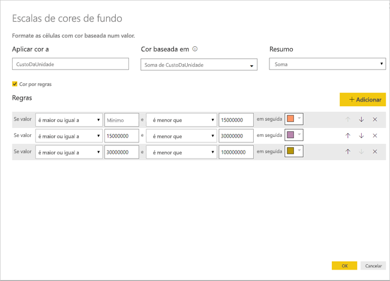

# Formatação condicional em tabelas 
Com a formatação condicional para tabelas, pode especificar cores personalizadas para células, com base nos valores de célula ou noutros valores ou campos, incluindo cores com gradação. Também pode apresentar os valores de célula com barras de dados. 

Para aceder à formatação condicional, na área **Campos** do painel **Visualizações** no Power BI Desktop, selecione a seta para baixo junto ao valor na área **Valores** que pretende formatar (ou clique com o botão direito do rato no campo). Só pode gerir a formatação condicional para os campos na área **Valores** da área **Campos**.

As seguintes secções descrevem cada uma destas três opções de formatação condicional. Podem ser combinadas uma ou mais opções numa coluna de tabela única.

> [!NOTE]
> Quando aplicada a uma tabela, a formatação condicional substitui qualquer estilo de tabela personalizado que tenha sido aplicado às células formatadas condicionalmente.

Para remover a formatação condicional de uma visualização, clique novamente no campo com o botão direito do rato, selecione **Remover formatação condicional** e introduza a formatação a remover.

## Escalas de cores de fundo

Selecionar **Formatação condicional** e, em seguida, **Escalas de cores de fundo** irá apresentar a caixa de diálogo seguinte.

Pode selecionar um campo do modelo de dados para basear as cores no mesmo ao definir **Cor baseada em** para esse campo. Além disso, pode especificar o tipo de agregação para o campo selecionado com o valor **Resumo**. O campo a colorir é especificado no campo **Aplicar cor a**, para que não se perca. Pode aplicar formatação condicional em campos de datas e texto, desde que selecione um valor numérico como base da formatação.

Para utilizar valores de cor discretos para intervalos de valores especificados, selecione **Cor por regras**. Para utilizar um espectro de cores, deixe a opção **Cor por regras** desselecionada. 

### Cor por regras

Ao selecionar **Cor por regras**, pode introduzir um ou mais intervalos de valores, cada um com uma cor definida.  Cada intervalo de valores é iniciado por uma condição de *valor Se*, uma condição de valor *e* uma cor.

As células da tabela com valores em cada intervalo são preenchidas com a cor especificada. Existem três regras na seguinte figura.

A tabela de exemplo tem agora este aspeto:

### Cor mínima até máxima

Pode configurar os valores *Mínimo* e *Máximo* e as respetivas cores. Se selecionar a caixa **Divergente**, também pode configurar um valor de *Centro* opcional.

A tabela de exemplo tem agora este aspeto:

## Escalas de cores de tipo de letra

Selecionar **Formatação condicional** e, em seguida, **Escalas de cores de tipo de letra** irá apresentar a caixa de diálogo seguinte. Esta caixa de diálogo é semelhante à caixa de diálogo **Escalas de cores de fundo**, mas altera a cor do tipo de letra em vez da cor de fundo da célula.

A tabela de exemplo tem agora este aspeto:

## Barras de dados

Selecionar **Formatação condicional** e, em seguida, **Barras de dados** irá apresentar a caixa de diálogo seguinte. 

Por predefinição, a opção **Mostrar apenas a barra** está desselecionada, pelo que a célula da tabela apresenta a barra e o valor real.

Se a opção **Mostrar apenas a barra** for selecionada, a célula da tabela apresentará apenas a barra.

## Formatação de cor por valor do campo

Pode utilizar uma medida ou uma coluna que especifique uma cor (com um valor de texto ou um código hexadecimal) para aplicar essa cor ao fundo ou cor do tipo de letra de um elemento visual de tabela ou matriz. Também pode criar lógica personalizada para um determinado campo e utilizá-la para aplicar a cor pretendida ao tipo de letra ou fundo.

Por exemplo, na seguinte tabela há uma cor associada a cada modelo de produto. 

Para formatar essa célula com base no respetivo valor de campo, selecione o diálogo **Formatação condicional** ao clicar com o botão direito do rato na coluna *Cor* desse elemento visual e, neste caso, selecione **Cor de fundo** no menu. 

No diálogo apresentado, selecione **Valor do campo** na área pendente **Formatar por**, conforme mostrado na seguinte imagem.

Pode repetir esse processo para a cor do tipo de letra. O resultado no elemento visual será uma cor sólida na coluna de **cor**, conforme mostrado no seguinte ecrã.

Também pode criar um cálculo DAX, com base em lógica de negócio, que exporta diferentes códigos hexadecimais a partir das condições que preferir. Normalmente, esta opção é mais fácil do que criar múltiplas regras no diálogo de formatação condicional. Considere o campo *ColorKPI* na seguinte imagem de exemplo.

Pode então definir o valor de campo da **Cor de fundo** da seguinte forma.

Poderá então obter resultados como a seguinte matriz.

Pode criar muitas mais variações apenas com a sua imaginação e um pouco de DAX.

Pode utilizar qualquer um dos valores listados na especificação de cores CSS em [https://www.w3.org/TR/css-color-3/](https://www.w3.org/TR/css-color-3/) para colorir os seus visuais:
* códigos hexadecimais de 3, 6 ou 8 dígitos, como #3E4AFF. Certifique-se de que inclui o símbolo # no início do código. "3E4AFF" não é aceite. 
* Valores RGB ou RGBA, como RGBA(234, 234, 234, 0.5)
* Valores HSL ou HSLA, como HSLA(123, 75%, 75%, 0.5)
* Nomes de cores, como Green, SkyBlue, PeachPuff 

## Considerações e limitações
Existem algumas considerações a ter em mente ao trabalhar com formatação condicional de tabelas:

* A formatação condicional é aplicada apenas aos valores de um visual de **Matriz** e não se aplica a subtotais ou totais gerais. 
* A formatação condicional não é aplicada à linha **Total**
* As Tabelas que não tenham um agrupamento são apresentadas como uma única linha que não suporta a formatação condicional.
* Se utilizar o formato de gradação com valores máx./mín. automáticos ou formatação baseada em regras com regras de percentagem, a formatação condicional não poderá ser aplicada quando os dados tiverem valores NaN. NaN significa “Não é um número” e, geralmente, é provocado por um erro de divisão por zero. Pode utilizar a [função DIVIDE() DAX ](https://docs.microsoft.com/dax/divide-function-dax) para evitar estes erros.

## Próximos passos
Para obter mais informações, veja o seguinte artigo:  

* [Sugestões e truques para formatação de cor no Power BI](visuals/service-tips-and-tricks-for-color-formatting.md)  

