# Utilizar a formatação condicional em tabelas 

Com a formatação condicional para tabelas no Power BI Desktop, pode especificar cores personalizadas para células, incluindo gradações de cores, com base nos valores de campo. Também pode representar valores de célula com barras de dados ou ícones de KPI, ou como ligações Web ativas. Pode aplicar a formatação condicional a qualquer campo de texto ou de dados, desde que baseie a formatação num campo que tenha um código numérico, hexadecimal ou de nome de cor, ou valores de URL da Web. 

Para aplicar a formatação condicional, selecione a visualização **Tabela** ou **Matriz** no Power BI Desktop. Na secção **Campos** do painel **Visualizações**, clique com o botão direito do rato ou selecione a seta para baixo junto ao campo no conjunto **Valores** que pretende formatar. Selecione **Formatação condicional** e o tipo de formatação a aplicar.

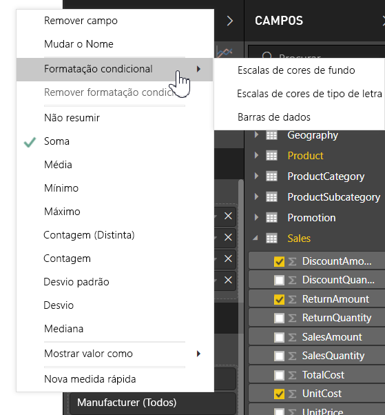

> [!NOTE]
> A formatação condicional substitui qualquer cor de fundo ou tipo de letra personalizada que aplicar à célula formatada condicionalmente.

Para remover a formatação condicional de uma visualização, selecione **Remover formatação condicional** no menu pendente do campo e, em seguida, selecione o tipo de formatação a remover.

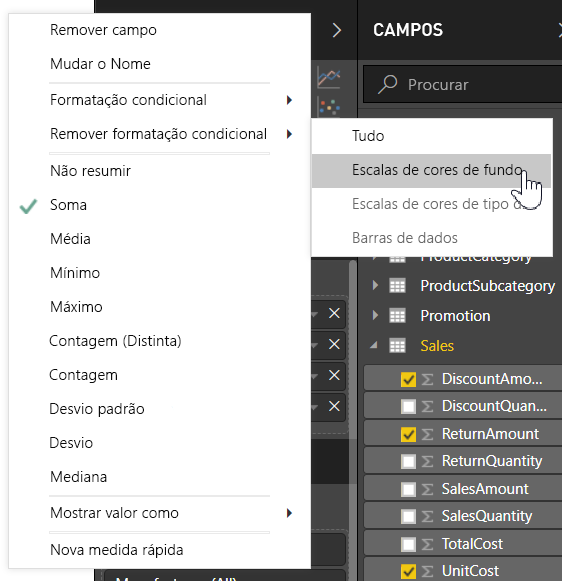

As seguintes secções descrevem cada uma das opções de formatação condicional. Pode combinar mais de uma opção numa única coluna de tabela.

## Formatar a cor de fundo ou do tipo de letra

Para formatar a cor de fundo ou do tipo de letra da célula, selecione **Formatação condicional** para um campo e, em seguida, selecione **Cor de fundo** ou **Cor do tipo de letra** no menu pendente. 

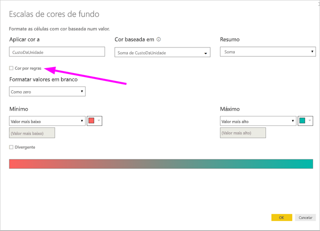

É aberta a caixa de diálogo **Cor de fundo** ou **Cor do tipo de letra**, com o nome do campo que está a formatar no título. Depois de selecionar as opções de formatação condicional, selecione **OK**. 

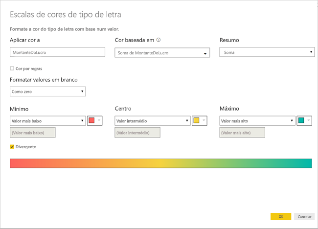

As opções para **Cor de fundo** e **Cor do tipo de letra** são as mesmas, mas afetam a cor de fundo e a cor do tipo de letra da célula, respetivamente. Pode aplicar a mesma ou outra formatação condicional à cor de fundo e à cor do tipo de letra de um campo. Se o tipo de letra e o fundo de um campo tiverem a mesma cor, serão combinados para que a coluna da tabela apresente apenas as cores.

## Cor por escala de cores

Para formatar a cor de fundo ou do tipo de letra da célula por escala de cores, no campo **Formatar por** da caixa de diálogo **Cor de fundo** ou **Cor do tipo de letra**, selecione **Escala de cores**. Em **Com base no campo**, selecione o campo no qual a formatação será baseada. Pode basear a formatação no campo atual ou em qualquer campo no seu modelo que tenha dados numéricos ou de cores. 

Em **Resumo**, especifique o tipo de agregação que pretende utilizar para o campo selecionado. Em **Formatação predefinida**, selecione uma formatação a aplicar a valores em branco. 

Em **Mínimo** e **Máximo**, escolha se quer aplicar o esquema de cores com base nos valores de campo mais baixo e mais alto ou em valores personalizados introduzidos. No menu pendente, selecione as coleções de cores que pretende aplicar aos valores mínimo e máximo. Selecione a caixa de verificação **Divergente** para especificar também um valor e uma cor para o **Centro**. 

Uma tabela de exemplo com a formatação do fundo com a escala de cores na coluna **Acessibilidade** tem o seguinte aspeto:

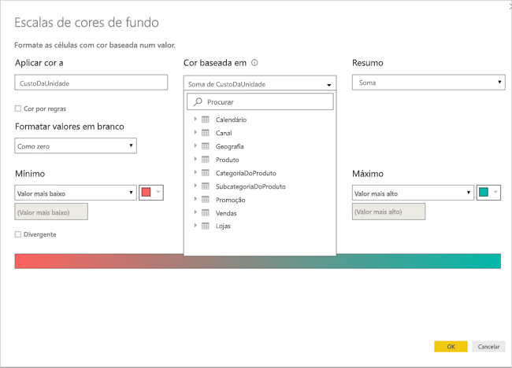

Uma tabela de exemplo com a formatação do tipo de letra com a escala de cores na coluna **Acessibilidade** tem o seguinte aspeto:

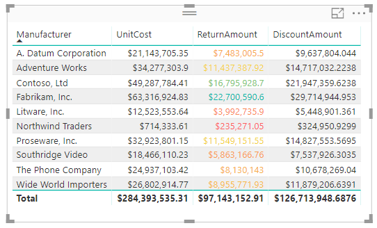

## Cor por regras

Para formatar a cor de fundo ou do tipo de letra da célula por regras, no campo **Formatar por** da caixa de diálogo **Cor de fundo** ou **Cor do tipo de letra**, selecione **Regras**. Novamente, **Com base no campo** apresenta o campo no qual a formatação será baseada e **Resumo** apresenta o tipo de agregação do campo. 

Em **Regras**, introduza um ou mais intervalos de valores e defina uma cor para cada um. Cada intervalo de valores tem uma condição de *valor Se* e uma condição de valor *e*, bem como uma cor. Os fundos ou os tipos de letra das células em cada intervalo de valores são coloridos com a cor especificada. O seguinte exemplo tem três regras:

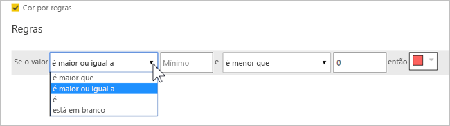

Uma tabela de exemplo com a formatação da cor de fundo baseada em regras na coluna **Acessibilidade** tem o seguinte aspeto:

## Cor por valores de cor

Se tiver um campo ou uma medida com dados de valores hexadecimais ou de nome de cor, poderá utilizar a formatação condicional para aplicar automaticamente essas cores ao fundo ou ao tipo de letra de uma coluna. Também pode utilizar a lógica personalizada para aplicar cores ao fundo ou ao tipo de letra.

O campo pode utilizar quaisquer valores de cor apresentados na especificação de cor CSS em [https://www.w3.org/TR/css-color-3/](https://www.w3.org/TR/css-color-3/). Esses valores de cor podem incluir:
- Códigos hexadecimais de 3, 6 ou 8 dígitos, como, por exemplo, #3E4AFF. Certifique-se de que inclui o símbolo # no início do código. 
- Valores RGB ou RGBA, como RGBA(234, 234, 234, 0,5).
- Valores HSL ou HSLA, como HSLA(123, 75%, 75%, 0,5).
- Nomes de cores, como Verde, Azul-celeste ou Pêssego. 

A seguinte tabela tem um nome de cor associado a cada estado: 

Para formatar a coluna **Cor** com base nos respetivos valores de campo, selecione **Formatação condicional** para o campo **Cor** e, em seguida, selecione **Cor de fundo** ou **Cor do tipo de letra**. 

Na caixa de diálogo **Cor de fundo** ou **Cor do tipo de letra**, selecione **Valor de campo** no campo pendente **Formatar por**.

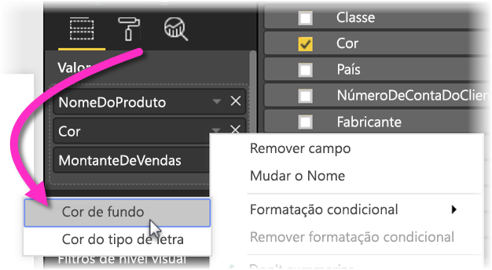

Uma tabela de exemplo com a formatação da **Cor de fundo** baseada no valor de campo de cor na coluna **Cor** tem o seguinte aspeto:

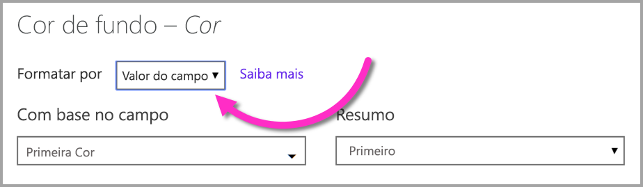

Se também utilizar o **Valor de campo** para formatar a **Cor do tipo de letra** da coluna, o resultado será uma cor sólida na coluna **Cor**:

## Cor baseada num cálculo

Pode criar um cálculo DAX que devolve diferentes valores com base nas condições de lógica de negócio que selecionar. Normalmente, criar uma fórmula DAX é mais rápido do que criar múltiplas regras na caixa de diálogo da formatação condicional. 

Por exemplo, a seguinte fórmula DAX aplica valores de cor hexadecimais a uma nova coluna **Classificação de acessibilidade**, com base nos valores da coluna **Acessibilidade** existentes:

Para aplicar as cores, selecione a formatação condicional de **Cor de fundo** ou **Cor do tipo de letra** para a coluna **Acessibilidade** e baseie a formatação no **Valor de campo** da coluna **Classificação de acessibilidade**. 

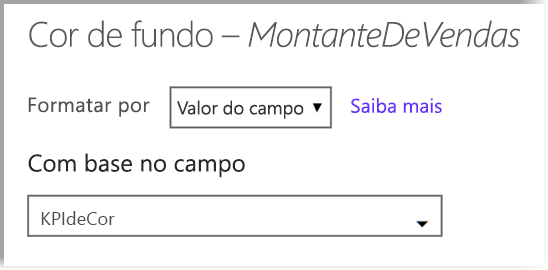

Uma tabela de exemplo com a cor de fundo de **Acessibilidade** baseada na **Classificação de acessibilidade** calculada tem o seguinte aspeto:

Pode criar muitas mais variações apenas com a sua imaginação e um pouco de DAX.

## Adicionar barras de dados

Para apresentar barras de dados baseadas em valores de célula, selecione **Formatação condicional** para o campo **Acessibilidade** e, em seguida, selecione **Barras de dados** no menu pendente. 

Na caixa de diálogo **Barras de dados**, a opção **Mostrar apenas a barra** está desselecionada por predefinição, pelo que as células da tabela apresentam as barras e os valores reais. Para apresentar apenas as barras de dados, selecione a caixa de verificação **Mostrar apenas a barra**.

Pode especificar valores **Mínimo** e **Máximo**, as cores e a direção das barras de dados e a cor do eixo. 

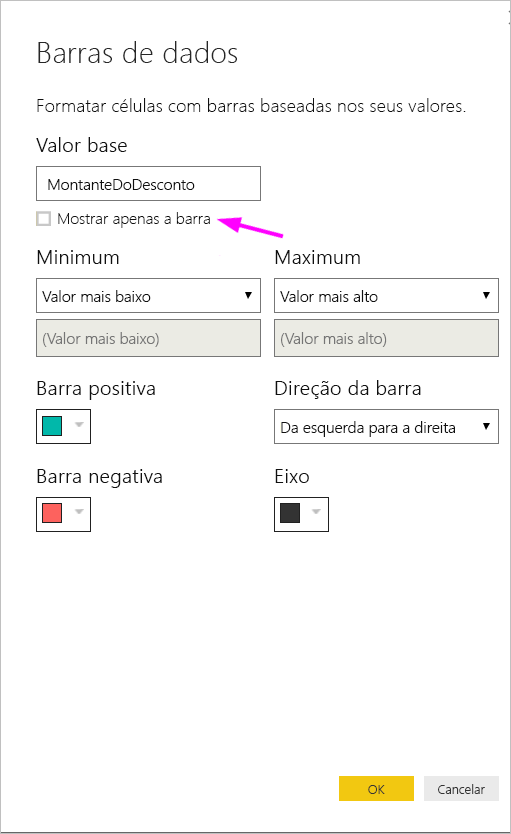

Com as barras de dados aplicadas à coluna **Acessibilidade**, uma tabela de exemplo tem o seguinte aspeto:

## Adicionar ícones

Para apresentar ícones baseados em valores de célula, selecione **Formatação condicional** para o campo e **Ícones** no menu pendente. 

Na caixa de diálogo **Ícones**, em **Formatar por**, selecione **Regras** ou **Valor de campo**. 

Para formatar por regras, selecione **Com base no campo**, um método de **Resumo**, um **Esquema do ícone**, um **Alinhamento do ícone**, um **Estilo** do ícone e uma ou mais **Regras**. Em **Regras**, introduza uma ou mais regras com uma condição de *valor Se* e uma condição de valor *e*, selecionando, em seguida, um ícone a aplicar a cada regra. 

Para formatar por valores de campo, selecione **Com base no campo**, um método de **Resumo**, um **Esquema do ícone** e um **Alinhamento do ícone**.

O seguinte exemplo adiciona ícones com base em três regras:

Selecione **OK**. Com os ícones aplicados à coluna **Acessibilidade** por regras, uma tabela de exemplo tem o seguinte aspeto:

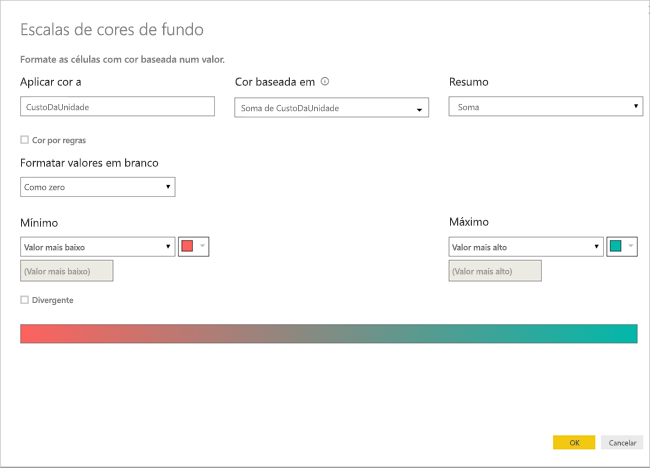

## Formatar como URLs da Web

Se tiver uma coluna ou uma medida que contenha URLs de sites, poderá utilizar a formatação condicional para aplicar esses URLs a campos como ligações ativas. Por exemplo, a seguinte tabela tem uma coluna **Website** com URLs de sites para cada estado:

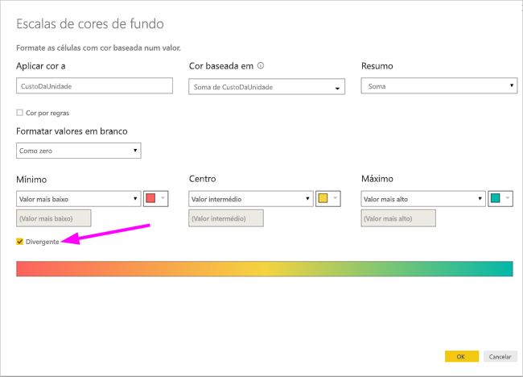

Para apresentar o nome de cada estado como uma ligação ativa para o respetivo site, selecione **Formatação condicional** para o campo **Estado** e, em seguida, selecione **URL da Web**. Na caixa de diálogo **URL da Web**, em **Com base no campo**, selecione **Site** e **OK**. 

Com a formatação do **URL da Web** aplicada ao campo **Estado**, o nome de cada estado é uma ligação ativa para o respetivo site. A seguinte tabela de exemplo tem a formatação do **URL da Web** aplicada à coluna **Estado** e **Barras de dados** e a **Formatação do fundo** condicional aplicada à coluna **Acessibilidade**. 

## Considerações e limitações
Existem algumas considerações a ter em mente ao trabalhar com formatação condicional de tabelas:

- A formatação condicional aplica-se apenas aos valores dos elementos visuais Tabela ou Matriz e não se aplica a subtotais, totais gerais ou à linha **Total**. 
- As tabelas que não tenham um agrupamento são apresentadas como uma única linha que não suporta a formatação condicional.
- Pode aplicar a formatação de gradação com valores máximos/mínimos automáticos ou a formatação baseada em regras se os seus dados tiverem valores *NaN*. NaN significa "Não é um número" e, geralmente, é causado por um erro de divisão por zero. Pode utilizar a [função DIVIDE() DAX ](https://docs.microsoft.com/dax/divide-function-dax) para evitar estes erros.
- A formatação condicional precisa de uma agregação ou de uma medida para ser aplicada ao valor. É por isso que é apresentado "Primeiro" ou "Último" no exemplo de **Cor por valor**. Se estiver a criar o seu relatório num cubo multidimensional do Analysis Service, não poderá utilizar um atributo para a formatação condicional, a menos que o proprietário do cubo tenha criado uma medida que fornece o valor.

## Próximas etapas

Para obter mais informações sobre a formatação de cores, veja [Dicas e truques para formatação com cores no Power BI](visuals/service-tips-and-tricks-for-color-formatting.md).  

