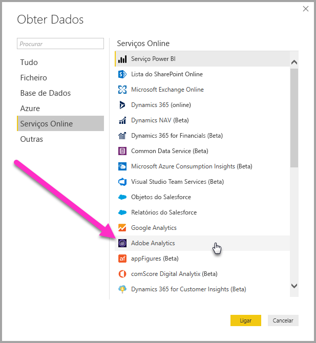
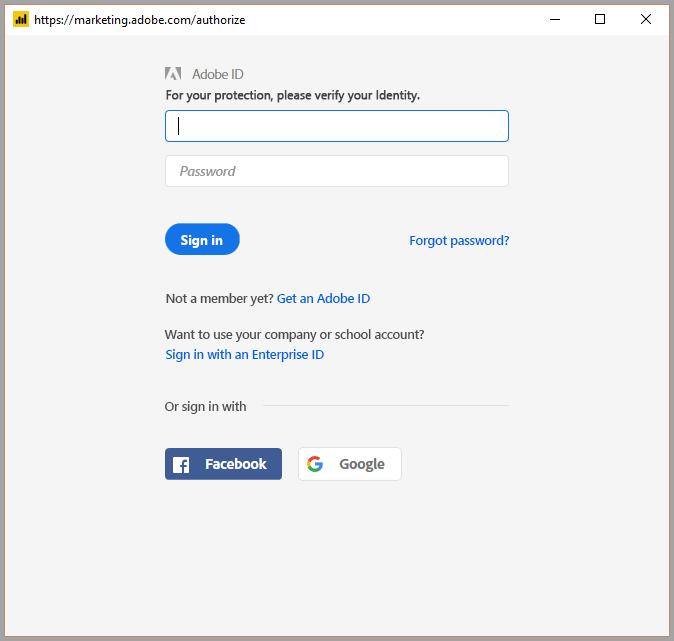
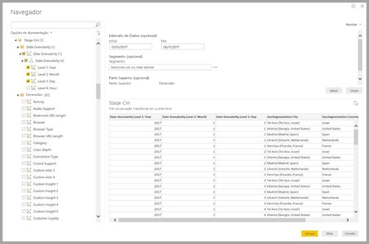
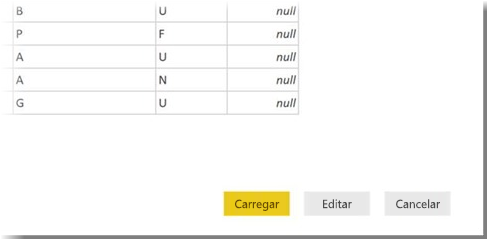

# Ligar ao Adobe Analytics no Power BI Desktop 
No **Power BI Desktop**, pode ligar-se ao **Adobe Analytics** e utilizar os dados subjacentes, tal como faria com outra origem de dados no Power BI Desktop. 

## Ligar a dados do Adobe Analytics
Para ligar a dados do **Adobe Analytics**, selecione **Obter Dados** a partir do friso **Base** no Power BI Desktop. Selecione **Serviços Online** na lista de categorias no lado esquerdo para encontrar **Conector do Adobe Analytics**.

Na janela **Adobe Analytics** que é apresentada, selecione o botão **Iniciar sessão** e forneça as suas credenciais para iniciar sessão na sua conta do Adobe Analytics. É apresentada a janela de início de sessão do Adobe, conforme ilustrado na seguinte imagem.

Quando lhe for pedido, introduza o seu nome de utilizador e a palavra-passe. Assim que a ligação for estabelecida, pode pré-visualizar e selecionar múltiplas dimensões e medidas na caixa de diálogo **Navegador** do para criar um único resultado em tabela. Também pode fornecer qualquer parâmetro de entrada necessário para os itens selecionados. 

Pode **Carregar** a tabela selecionada, que traz toda a tabela para o **Power BI Desktop**, ou pode **Editar** a consulta, que abre o **Editor de Consultas**, para poder filtrar e refinar o conjunto de dados que pretende utilizar, e carregar o conjunto de dados refinados para o **Power BI Desktop**.

## Próximos passos
Existem diversos tipos de dados aos quais se pode ligar através do Power BI Desktop. Para obter mais informações sobre origens de dados, consulte os seguintes recursos:

* [Introdução ao Power BI Desktop](desktop-getting-started.md)
* [Origens de Dados no Power BI Desktop](desktop-data-sources.md)
* [Formatar e Combinar Dados com o Power BI Desktop](desktop-shape-and-combine-data.md)
* [Ligar a livros do Excel no Power BI Desktop](desktop-connect-excel.md)   
* [Introduzir dados diretamente no Power BI Desktop](desktop-enter-data-directly-into-desktop.md)   

