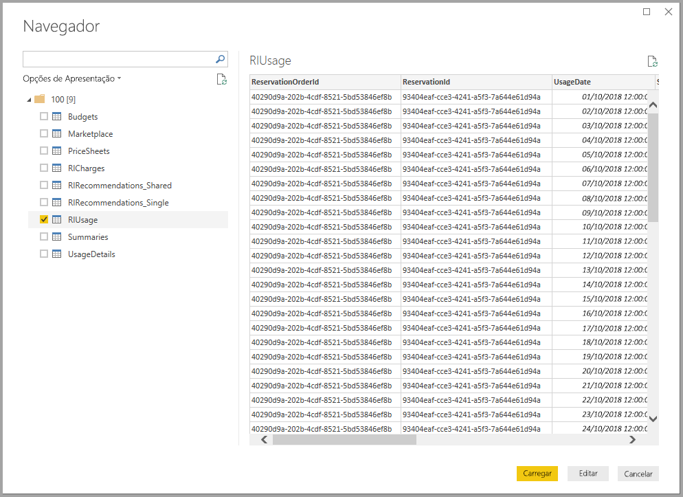
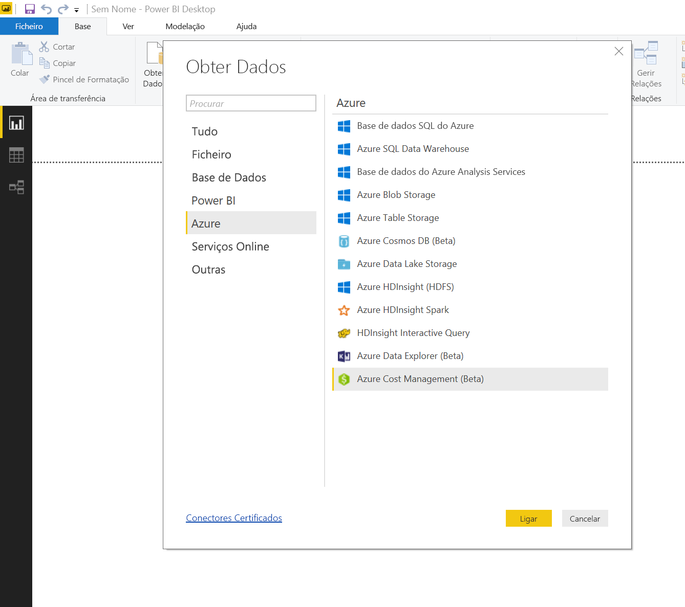
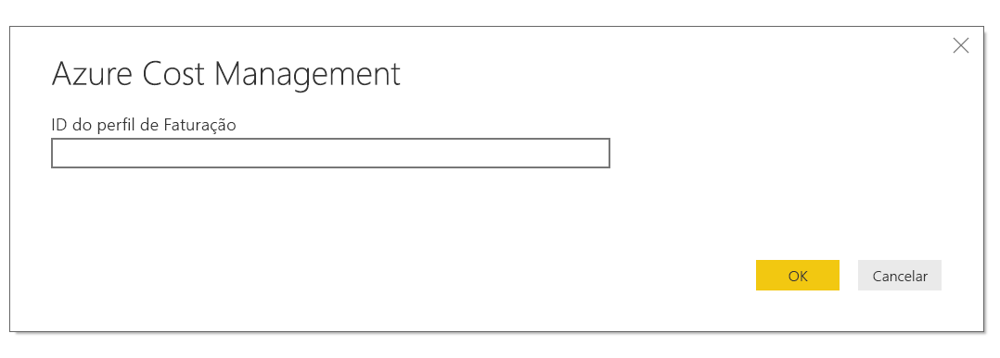
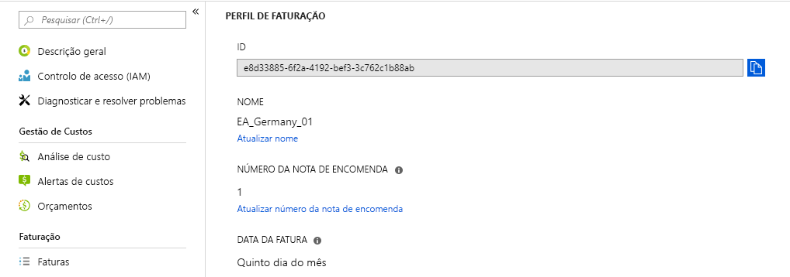
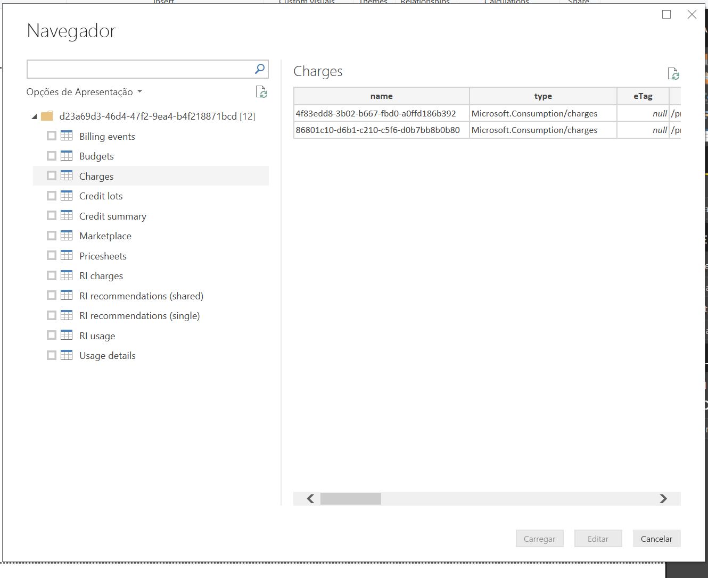

# <a name="analyze-azure-cost-and-usage-data-in-power-bi-desktop"></a>Analisar os custos e dados de utilização do Azure no Power BI Desktop

Pode utilizar o Power BI Desktop para ligar ao Azure e obter dados detalhados sobre a utilização do serviço do Azure na sua organização. Com estes dados, pode criar medidas e relatórios personalizados para compreender melhor e analisar as despesas do Azure.

Atualmente, o Power BI suporta a ligação a contas de faturação de Contrato Enterprise e Contrato de Cliente.

* Os utilizadores com **Contrato Enterprise** devem ligar com o **conector do Azure Consumption Insights** (abaixo).

* Os utilizadores com **Contrato de Cliente** devem ligar com o [**conector do Azure Cost Management**](#connect-with-azure-cost-management).

> [!NOTE]
> Se for um cliente com um Contrato Enterprise que utiliza o Conector do Azure Cost Management e não conseguir ver o *ID do Perfil de Faturação* no painel Gestão de Custos, significa que não está na Modern Commerce Platform. Nesses casos, utilize o conector do Azure Consumption Insights, que, em vez de pedir o *ID do Perfil de Faturação*, irá pedir o número de inscrição EA.


## <a name="connect-with-azure-consumption-insights"></a>Ligar com o Azure Consumption Insights

O Azure Consumption Insights permite-lhe ligar a contas de faturação de Contrato Enterprise do Azure.

Nesta secção, irá aprender a obter os dados que precisa de migrar através do Conector do Azure Enterprise. Também irá encontrar um mapeamento das *colunas de detalhes de utilização* disponível na API do **ACI** (Azure Consumption Insights).

Para utilizar o conector do **Azure Consumption Insights** com êxito, tem de ter acesso às funcionalidades empresariais no portal do Azure.

Para utilizar o conector do **Azure Consumption Insights** no **Power BI Desktop**: 

1. No friso **Home Page**, selecione **Obter Dados**.

1. Nas categorias à esquerda, selecione **Serviços Online**.  

1. Selecione **Microsoft Azure Consumption Insights (Beta)** . 

1. Selecione **Ligar**.

   

   Na caixa de diálogo apresentada, introduza o seu **Número de Inscrição do Azure**.

   

   * Pode obter o seu número de inscrição no [Azure Enterprise Portal](https://ea.azure.com), na localização indicada na seguinte imagem:

  

   Esta versão do conector só suporta inscrições de empresas provenientes de https://ea.azure.com. Não são atualmente suportadas inscrições oriundas da China.

   Em seguida, forneça a sua *Chave de acesso* para ligar.

   

   * Pode encontrar a sua Chave de acesso para a inscrição no [Azure Enterprise Portal](https://ea.azure.com).

  

Depois de indicar a *Chave de acesso* e selecionar **Ligar**, é apresentada a janela **Navegador**, que mostra nove tabelas disponíveis:

| Tabela        | Descrição |
|------------- | -------------------------------------------------------------|
| **Orçamentos** | Detalhes dos orçamentos para ver os custos reais ou a utilização em comparação com os objetivos orçamentais existentes. |
| **MarketPlace** | Cobranças do Azure Marketplace com base na utilização. |
| **PriceSheets** (Folhas de preços) | Taxas aplicáveis pelo medidor para uma inscrição. |
| **RICharges** | Cobranças associadas às Instâncias Reservadas nos últimos 24 meses. |
| **RIRecommendations_Single** | Recomendações de compra de Instâncias Reservadas com base nas suas tendências de utilização de subscrição individual nos últimos 7, 30 ou 60 dias. |
| **RIRecommendations_Shared** | Recomendações de compra de Instâncias Reservadas com base nas suas tendências de utilização em todas as suas subscrições nos últimos 7, 30 ou 60 dias. |
| **RIUsage** | Detalhes de consumo das Instâncias Reservadas existentes no mês anterior. |
| **Resumos** | Um resumo mensal de saldos, novas compras, cobranças de serviços do Azure Marketplace, ajustes e cobranças excedidas. |
| **UsageDetails** | Uma análise das quantidades consumidas e uma estimativa das cobranças de inscrição. |

Pode selecionar a caixa de verificação ao lado de qualquer uma das tabelas para ver uma pré-visualização. Pode selecionar uma ou mais tabelas ao marcar a caixa junto do respetivo nome; em seguida, selecione **Carregar**.



> [!NOTE]
> As tabelas *Resumo* e *Folha de Preços* só estão disponíveis para a Chave de API do nível de inscrição. Além disso, os dados nestas tabelas contêm, por predefinição, os dados do mês atual em termos de *Utilização* e *Folha de Preços*. As tabelas *Resumo* e *Mercado* não estão limitadas ao mês atual.
>
>

Quando selecionar **Carregar**, os dados serão carregados no **Power BI Desktop**.


Após o carregamento dos dados selecionados, as tabelas e os campos que selecionou podem ser vistos no painel **Campos**.


## <a name="using-azure-consumption-insights"></a>Utilizar o conector Informações sobre Consumo do Azure
Para utilizar o conector do **Azure Consumption Insights**, tem de aceder às funcionalidades empresariais no portal do Azure.

Depois de carregar os dados com êxito através do conector **Azure Consumption Insights**, pode criar as suas próprias medidas e colunas personalizadas com o **Editor de Consultas**. Também pode criar elementos visuais, relatórios e dashboards para partilhar no **serviço Power BI**.

Com uma consulta em branco, pode obter uma coleção personalizada de exemplo de consultas do Azure. Há duas formas de obter esta coleção: 

No **Power BI Desktop**: 

1. Selecione o friso **Home Page** 
2. Selecione **Obter Dados** > **Consulta em Branco** 

Em alternativa, no **Editor de Consultas**: 

1. Clique com o botão direito do rato no painel **Consultas** à esquerda 
2. Selecione **Nova Consulta > Consulta em Branco** no menu apresentado

Na **Barra de fórmulas**, escreva:

    = MicrosoftAzureConsumptionInsights.Contents

A seguinte imagem mostra uma coleção de exemplos que aparece.


Quando estiver a trabalhar com relatórios e a criar consultas, pode:

* Para definir o número de meses a contar da data atual, utilize *numberOfMonth*
  * Utilize um valor entre 1 e 36. Represente o número de meses, a contar da data atual, que pretende importar. Recomendamos que não ultrapasse 12 meses de dados. Este limite evita as restrições de importação de consultas do Power BI e os limiares de volume de dados.
* Para definir um período de meses numa janela de tempo do histórico, utilize *startBillingDataWindow* e *endBillingDataWindow*
* Não utilize *numberOfMonth* em conjunto com *startBillingDataWindow* ou *endBillingDataWindow*

## <a name="migrate-from-the-azure-enterprise-connector"></a>Migrar a partir do Conector do Azure Enterprise

Alguns clientes criaram elementos visuais através do *Conector do Azure Enterprise (Beta)* . No futuro, este será substituído pelo conector do **Azure Consumption Insights**. O novo conector tem funcionalidades e melhorias que incluem:

* Origens de dados adicionais disponíveis para *Resumo do Saldo* e *Compras no Mercado*
* Novos parâmetros avançados, como *startBillingDataWindow* e *endBillingDataWindow*
* Melhor desempenho e maior capacidade de resposta

Os seguintes passos mostram como pode transitar para o conector do **Azure Consumption Insights**. Estes passos conservam o seu progresso na criação de dashboards ou relatórios personalizados.

### <a name="step-1-connect-to-azure-using-the-new-connector"></a>Passo 1: Ligar ao Azure através do novo conector
O primeiro passo é utilizar o conector do **Azure Consumption Insights** descrito anteriormente neste artigo em detalhe. Neste passo, selecione **Obter Dados > Consulta em Branco** no friso **Página Inicial** do **Power BI Desktop**.

### <a name="step-2-create-a-query-in-advanced-editor"></a>Passo 2: Criar uma consulta no Editor Avançado
No **Editor de Consultas**, selecione **Editor Avançado** na secção **Consulta** do friso **Home Page**. Na janela **Editor Avançado** que é apresentada, introduza esta consulta:

    let    
        enrollmentNumber = "100",
        optionalParameters = [ numberOfMonth = 6, dataType="DetailCharges" ],
        data = MicrosoftAzureConsumptionInsights.Contents(enrollmentNumber, optionalParameters)   
    in     
        data


Terá de substituir o valor de *enrollmentNumber* pelo seu número de inscrição. Pode obter o seu número no [Portal do Azure Enterprise](https://ea.azure.com). O parâmetro *numberOfMonth* corresponde ao número de meses de dados que pretende andar para trás, a partir da data atual. Utilize zero (0) para o mês atual.

Depois de selecionar **Concluído** na janela **Editor Avançado**, a pré-visualização é atualizada e os dados relativos ao intervalo de meses especificado são apresentados na tabela. Selecione **Fechar e Aplicar** e regresse.

### <a name="step-3-move-measures-and-custom-columns-to-the-new-report"></a>Passo 3: Mover medidas e colunas personalizadas para o novo relatório
Em seguida, terá de mover todas as medidas ou colunas personalizadas que criou para a nova tabela de detalhes. Seguem-se os passos necessários.

1. Abra o Bloco de Notas (ou outro editor de texto).
2. Selecione a medida que quer mover, copie o texto do campo *Fórmula* e coloque-o no Bloco de Notas.

   
3. Mude o nome *Query1* para o nome da tabela de detalhes original.
4. Para criar novas medidas de tabela e colunas personalizadas, clique com o botão direito do rato na sua tabela e selecione **Nova Medida**. Em seguida, corte e cole as suas medidas e colunas armazenadas até concluir todas.

### <a name="step-4-relink-tables-that-had-relationships"></a>Passo 4: Voltar a ligar as tabelas que tinham relações
Muitos dashboards têm tabelas adicionais que são utilizadas para pesquisa ou filtragem, tais como tabelas de datas ou tabelas utilizadas para projetos personalizados. O restabelecimento dessas relações resolve a maioria dos problemas restantes. Saiba como o fazer a seguir.

- No separador **Modelação** do **Power BI Desktop**, selecione **Gerir Relações** para abrir uma janela que permite gerir as relações no modelo. Volte a ligar as suas tabelas, conforme for necessário.

    

### <a name="step-5-verify-your-visuals-and-adjust-field-formatting-as-needed"></a>Passo 5: Verificar os elementos visuais e ajustar a formatação dos campos, conforme necessário
Agora, a maioria dos seus elementos visuais, tabelas e desagregações originais deverá estar a funcionar conforme esperado. No entanto, poderão ser necessárias algumas pequenas alterações para formatar o aspeto em maior detalhe. Dedique algum tempo a ver cada um dos dashboards e elementos visuais para garantir que o aspeto é aquele que pretende.

## <a name="using-the-azure-consumption-and-insights-aci-api-to-get-consumption-data"></a>Utilizar a API Informações sobre Consumo do Azure (ACI) para obter dados de consumo
O Azure também disponibiliza a [**API Informações sobre Consumo do Azure (ACI)** ](https://azure.microsoft.com/blog/announcing-general-availability-of-consumption-and-charge-apis-for-enterprise-azure-customers/). Pode criar as suas próprias soluções personalizadas para recolher, comunicar e visualizar informações sobre consumo do Azure através da API ACI.

### <a name="mapping-names-and-usage-details-between-the-portal-the-connector-and-the-api"></a>Mapear nomes e detalhes de utilização entre o portal, o conector e a API
As colunas e os nomes dos detalhes no portal do Azure são semelhantes na API e no conector, mas nem sempre são idênticos. Para esclarecer esta questão, a seguinte tabela apresenta um mapeamento. Também é indicado se a coluna está obsoleta. Para obter mais informações e definições de termos, veja o [dicionário de dados de faturação do Azure](https://docs.microsoft.com/azure/billing/billing-enterprise-api-usage-detail).

| Nome da Coluna do Conector ACI/Pacote de Conteúdos | Nome da Coluna da API ACI | Nome da Coluna de EA | Obsoleto/Presente para retrocompatibilidade |
| --- | --- | --- | --- |
| AccountName |accountName |Nome da Conta |Não |
| AccountId |accountId | |Sim |
| AccountOwnerId |accountOwnerEmail |AccountOwnerId |Não |
| AdditionalInfo |additionalInfo |AdditionalInfo |Não |
| AdditionalInfold | | |Sim |
| Quantidade Consumida |consumedQuantity |Quantidade Consumida |Não |
| Serviço Consumido |consumedService |Serviço Consumido |Não |
| ConsumedServiceId |consumedServiceId | |Sim |
| Custo |custo |ExtendedCost |Não |
| Centro de Custos |costCenter |Centro de Custos |Não |
| Data |data |Data |Não |
| Dia | |Dia |Não |
| DepartmentName |departmentName |Nome do Departamento |Não |
| DepartmentID |departmentId | |Sim |
| ID da Instância | | |Sim |
| InstanceId |instanceId |ID da Instância |Não |
| Localização | | |Sim |
| Categoria de Medidor |meterCategory |Categoria de Medidor |Não |
| ID do Medidor | | |Sim |
| Nome do Medidor |meterName |Nome do Medidor |Não |
| Região do Medidor |meterRegion |Região do Medidor |Não |
| Subcategoria do Medidor |meterSubCategory |Subcategoria do Medidor |Não |
| MeterId |meterId |ID do Medidor |Não |
| Mês | |Mês |Não |
| Produto |produto |Produto |Não |
| ProductId |productId | |Sim |
| Grupo de Recursos |resourceGroup |Grupo de Recursos |Não |
| Localização do Recurso |resourceLocation |Localização do Recurso |Não |
| ResourceGroupId | | |Sim |
| ResourceLocationId |resourceLocationId | |Sim |
| ResourceRate |resourceRate |ResourceRate |Não |
| ServiceAdministratorId |serviceAdministratorId |ServiceAdministratorId |Não |
| ServiceInfo1 |serviceInfo1 |ServiceInfo1 |Não |
| ServiceInfo1Id | | |Sim |
| ServiceInfo2 |serviceInfo2 |ServiceInfo2 |Não |
| ServiceInfo2Id | | |Sim |
| Identificador do Serviço de Arquivo |storeServiceIdentifier |Identificador do Serviço de Arquivo |Não |
| StoreServiceIdentifierId | | |Sim |
| Nome da Subscrição |subscriptionName |Nome da Subscrição |Não |
| Etiquetas |etiquetas |Etiquetas |Não |
| TagsId | | |Sim |
| Unidade de Medida |unitOfMeasure |Unidade de Medida |Não |
| Ano | |Ano |Não |
| SubscriptionId |subscriptionId |SubscriptionId |Sim |
| SubscriptionGuid |subscriptionGuid |SubscriptionGuid |Não |

## <a name="connect-with-azure-cost-management"></a>Ligar com o Azure Cost Management

Nesta secção, irá aprender a ligar-se à conta de faturação de Contrato de Cliente.

> [!NOTE]
> O conector do Azure Cost Management suporta atualmente clientes com o **Contrato de Cliente**.  Os clientes com **Contrato Enterprise** devem ligar com o conector Microsoft Azure Consumption Insights.
>
>

Para utilizar o conector do **Azure Cost Management** no **Power BI Desktop**:

1. No friso **Home Page**, selecione **Obter Dados**.

1. Nas categorias no lado esquerdo, selecione **Azure**.

1. Selecione **Azure Cost Management (Beta)** à direita.

1. Selecione **Ligar**.


   

   Na caixa de diálogo que é apresentada, introduza o **ID de perfil de faturação**.

   

Pode obter o seu ID no [portal do Azure](https://portal.azure.com):

1. Navegue para **Cost Management + Faturação**.

1. Selecione a sua conta de faturação.

1. Selecione **Perfis de faturação** na barra lateral.

1. Selecione o seu perfil de faturação.

1. Selecione **Propriedades** na barra lateral.

1. Copie o seu ID de perfil de faturação.

   

   Ser-lhe-á pedido para iniciar sessão com o seu e-mail e palavra-passe do Azure.  Após efetuar a autenticação, será apresentada a janela **Navegador** com 12 tabelas disponíveis:

| Tabela        | Descrição |
|-------------------- | -------------------------------------------------------------|
| **Billing events** (Eventos de faturação) | Registo de eventos de novas faturas, compras de crédito e mais. |
| **Orçamentos** | Detalhes dos orçamentos para ver os custos reais ou a utilização em comparação com os objetivos orçamentais existentes. |
| **Cobranças** | Um resumo mensal da utilização do Azure, cobranças do Marketplace e cobranças faturadas separadamente. |
| **Credit lots** (Lotes de crédito) | Os detalhes de compra de lotes de crédito do Azure para o perfil de faturação fornecido. |
| **Credit summary** (Resumo de crédito) | O resumo de crédito do perfil de faturação fornecido. |
| **Marketplace** | Cobranças do Azure Marketplace com base na utilização. |
| **Pricesheets** (Folhas de preços) | Taxas aplicáveis pelo medidor do perfil de faturação fornecido. |
| **RI charges** (Cobranças de RI) | Cobranças associadas às Instâncias Reservadas nos últimos 24 meses. |
| **RI recommendations (single)** (Recomendações de RI [individual]) | Recomendações de compra de Instâncias Reservadas com base nas suas tendências de utilização de subscrição individual nos últimos 7, 30 ou 60 dias. |
| **RI recommendations (shared)** (Recomendações de RI [partilhado]) | Recomendações de compra de Instâncias Reservadas com base em todas as suas tendências de utilização de subscrição nos últimos 7, 30 ou 60 dias. |
| **RI usage** (Utilização de RI) | Detalhes de consumo das Instâncias Reservadas existentes no mês anterior. |
| **Usage details** (Detalhes de utilização) | Uma análise das quantidades consumidas e da estimativa das cobranças do ID de perfil de faturação fornecido. |

Pode selecionar a caixa de verificação de uma tabela para ver uma pré-visualização.  Pode selecionar uma ou mais tabelas ao selecionar a caixa junto ao respetivo nome e selecionar **Carregar**.



Quando selecionar **Carregar**, os dados serão carregados no **Power BI Desktop**.


Após o carregamento dos dados selecionados, as tabelas e os campos que selecionou podem ser vistos no painel **Campos**.


Veja o vídeo [How to analyze spending in Power BI with Azure Consumption Insights](https://www.youtube.com/watch?v=QKBMXXrlpEk) (Como analisar as despesas no Power BI com o Azure Consumption Insights). Este vídeo explica como pode analisar os seus dados de custos no Power BI Desktop com o conector do Azure Consumption Insights.

## <a name="writing-custom-queries"></a>Escrever consultas personalizadas

Pode criar uma [consulta M](/powerquery-m/power-query-m-reference) personalizada para personalizar o número de meses, alterar a versão da API ou aplicar uma lógica mais avançada aos dados devolvidos.

No **Power BI Desktop**:

1. Selecione o friso **Home Page**
2. Selecione **Obter Dados** > **Consulta em Branco**

Em alternativa, no **Editor de Consultas**:

1. Clique com o botão direito do rato no painel **Consultas** à esquerda
2. Selecione **Nova Consulta > Menu em Branco** no menu apresentado

Na **Barra de fórmulas**, escreva o seguinte, substituindo o valor `billingProfileId` pelo seu ID atual e "charges" por qualquer nome de tabela válido (lista acima).

```
let
    Source = AzureCostManagement.Tables(billingProfileId, [ numberOfMonths = 3 ]),
    charges = Source{[Key="charges"]}[Data]
in
    charges
```

Além de modificar `numberOfMonths` para qualquer valor entre 1 e 36, também pode fornecer:

* `apiVersion` para escolher que versão de API é chamada pela consulta.
* O valor `lookbackWindow`, para recomendações de RI (única ou partilhada), para modificar o período de tempo para o qual pretende gerar as recomendações (opções válidas: 7, 30 ou 60 dias).

## <a name="next-steps"></a>Próximos passos

Pode ligar a muitas origens de dados diferentes através do Power BI Desktop. Para obter mais informações, veja os seguintes artigos:

* [O que é o Power BI Desktop?](desktop-what-is-desktop.md)
* [Origens de Dados no Power BI Desktop](desktop-data-sources.md)
* [Formatar e Combinar Dados com o Power BI Desktop](desktop-shape-and-combine-data.md)
* [Ligar a livros do Excel no Power BI Desktop](desktop-connect-excel.md)   
* [Introduzir dados diretamente no Power BI Desktop](desktop-enter-data-directly-into-desktop.md)   
